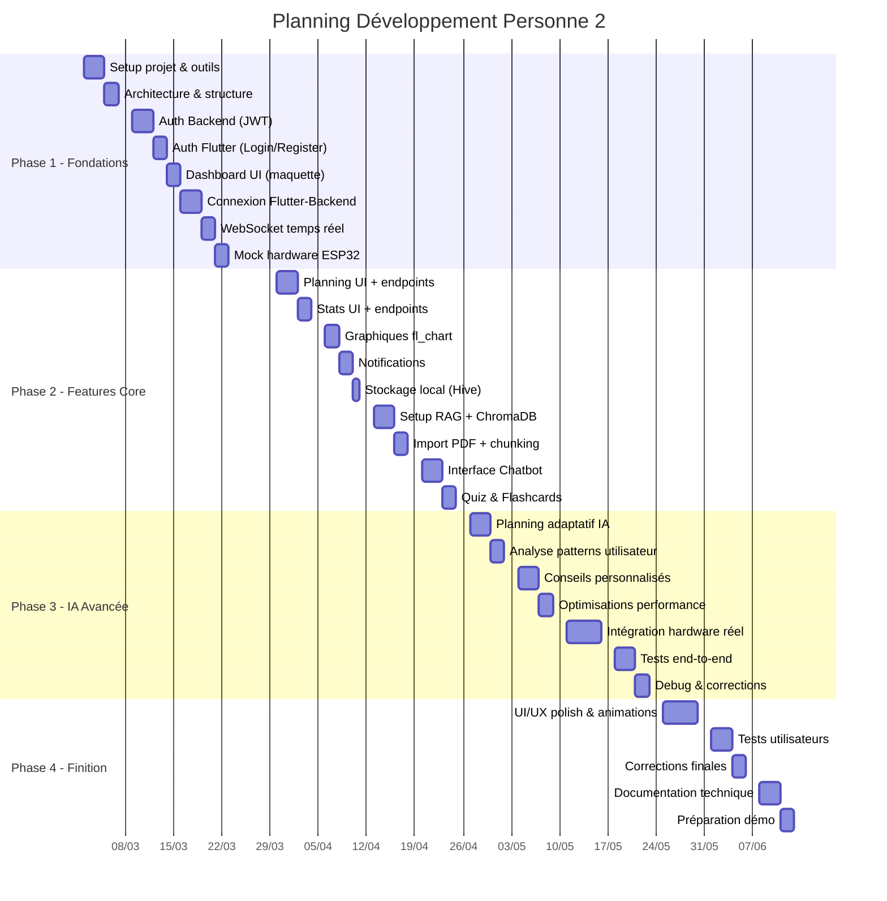

# 📅 Calendrier de Développement – Personne 2

**Projet** : Smart Focus & Life Assistant  
**Responsable** : Personne 2 (Application Flutter, Backend API, IA/RAG)  
**Durée totale** : 14 semaines  
**Date de début estimée** : _________________________  

---

## 🗺️ Vue d'ensemble

---

## 📋 Phase 1 : Fondations (Semaines 1–3)

> **Objectif** : Avoir un squelette complet Frontend + Backend connecté avec auth fonctionnelle

### Semaine 1 – Setup & Architecture

| Jour | Tâche | Détail | Livrable |
|------|-------|--------|----------|
| **L** | Setup Flutter | Créer le projet, installer packages (Riverpod, Dio, fl_chart, Hive) | Projet Flutter initialisé |
| **M** | Setup Backend | Créer projet FastAPI, configurer PostgreSQL, Docker Compose | Serveur qui démarre |
| **Me** | Architecture Flutter | Structure dossiers (features/, core/, shared/), routing GoRouter | Architecture clean |
| **J** | Architecture Backend | Structure dossiers, modèles SQLAlchemy, schémas Pydantic | Models de base créés |
| **V** | Design System | Couleurs, typographie, composants UI réutilisables (boutons, cards) | `theme.dart` + widgets |

### Semaine 2 – Authentification & Dashboard

| Jour | Tâche | Détail | Livrable |
|------|-------|--------|----------|
| **L** | Auth Backend | Endpoints register/login, hash bcrypt, JWT tokens | `/auth/register`, `/auth/login` |
| **M** | Auth Backend suite | Refresh token, middleware auth, modèle User en BDD | Auth backend complète |
| **Me** | Auth Flutter | Écrans Login + Register, formulaires, validation | UI Login/Register |
| **J** | Auth Flutter suite | Connexion aux endpoints, stockage token (Hive), auto-login | Auth flow complet |
| **V** | Dashboard UI | Layout principal, bottom navigation, écran Dashboard (maquette) | Navigation + Dashboard basique |

### Semaine 3 – Connexion & Temps Réel

| Jour | Tâche | Détail | Livrable |
|------|-------|--------|----------|
| **L** | API Service Flutter | Classe ApiService avec Dio, intercepteurs auth, gestion erreurs | Service HTTP prêt |
| **M** | WebSocket Backend | Endpoint `/ws/realtime`, broadcast scores, gestion connexions | WebSocket serveur |
| **Me** | WebSocket Flutter | Client WebSocket, écoute updates, mise à jour UI temps réel | Dashboard temps réel |
| **J** | Mock Hardware | Service qui simule données ESP32 (score focus, posture) toutes les 5s | Mock fonctionnel |
| **V** | Tests & Debug | Tester auth flow + websocket + mock, corriger les bugs | Phase 1 validée ✅ |

---

## 📋 Phase 2 : Features Core (Semaines 4–7)

> **Objectif** : Toutes les fonctionnalités principales (Planning, Stats, Chatbot RAG)

### Semaine 4 – Planning & Statistiques

| Jour | Tâche | Détail | Livrable |
|------|-------|--------|----------|
| **L** | Planning Backend | Modèles Planning + PlannedSession, CRUD endpoints | Endpoints planning |
| **M** | Planning Backend suite | Endpoint generate, logique de base, filtres par date | `/planning/generate` |
| **Me** | Planning Flutter | Écran calendrier, vue jour/semaine, liste des sessions | UI Planning |
| **J** | Stats Backend | Endpoints stats daily/weekly, aggrégation données focus + posture | Endpoints stats |
| **V** | Stats Flutter | Écran statistiques basique, affichage scores récents | UI Stats basique |

### Semaine 5 – Graphiques & Notifications

| Jour | Tâche | Détail | Livrable |
|------|-------|--------|----------|
| **L** | Graphiques Focus | Graphique ligne (score focus sur la journée) avec fl_chart | Graphique focus |
| **M** | Graphiques Posture/Sommeil | Graphique barres (posture %), graphique sommeil | 3 types de graphiques |
| **Me** | Notifications Backend | Logique de déclenchement (score bas, mauvaise posture) | Service notifications |
| **J** | Notifications Flutter | flutter_local_notifications, alertes push, préférences | Notifications fonctionnelles |
| **V** | Stockage local (Hive) | Cache données offline, préférences utilisateur | Mode semi-offline |

### Semaine 6 – Setup RAG & Import Documents

| Jour | Tâche | Détail | Livrable |
|------|-------|--------|----------|
| **L** | Setup LangChain + ChromaDB | Installer, configurer, tester connexion OpenAI | Environnement RAG |
| **M** | Import PDF Backend | Upload fichier, parsing PyPDF, extraction texte | Endpoint upload PDF |
| **Me** | Chunking & Embeddings | Découpage texte (500 tokens, overlap 50), embeddings OpenAI | Pipeline indexation |
| **J** | Recherche sémantique | Query ChromaDB, top-k chunks, scoring pertinence | Recherche fonctionnelle |
| **V** | Génération réponses | Prompt template, LLM avec contexte, citations sources | Q&A fonctionnel |

### Semaine 7 – Interface Chatbot & Quiz

| Jour | Tâche | Détail | Livrable |
|------|-------|--------|----------|
| **L** | Chatbot Flutter UI | Interface conversation (bulles, input, scroll), historique | UI Chatbot |
| **M** | Chatbot connexion | Connexion endpoint `/chatbot/ask`, affichage sources | Chatbot fonctionnel |
| **Me** | Upload PDF Flutter | Sélecteur fichier, upload, liste documents, suppression | Upload dans l'app |
| **J** | Quiz Backend | Prompt génération QCM, endpoint `/chatbot/quiz/generate` | Générateur quiz |
| **V** | Quiz & Flashcards Flutter | UI quiz interactif, flashcards avec flip animation | Quiz + Flashcards ✅ |

---

## 📋 Phase 3 : IA Avancée & Intégration (Semaines 8–11)

> **Objectif** : IA intelligente + intégration réelle avec hardware ESP32

### Semaine 8 – Planning Adaptatif

| Jour | Tâche | Détail | Livrable |
|------|-------|--------|----------|
| **L** | Analyse données utilisateur | Collecter patterns (heures productives, durées sessions) | Service analyse |
| **M** | Algorithme planning IA | Optimisation créneaux selon énergie, priorités, deadlines | Planning intelligent |
| **Me** | Adaptation sommeil | Si mauvais score sommeil → sessions plus courtes, pauses fréquentes | Adaptation dynamique |
| **J** | Planning Flutter avancé | Suggestions IA affichées, validation utilisateur, drag & drop | UI planning avancée |
| **V** | Tests planning IA | Scénarios variés, validation pertinence suggestions | Planning IA testé |

### Semaine 9 – Conseils Personnalisés

| Jour | Tâche | Détail | Livrable |
|------|-------|--------|----------|
| **L** | Détection heures productives | Analyse historique focus pour trouver créneaux optimaux | Service insights |
| **M** | Génération conseils | Prompt LLM pour conseils personnalisés basés sur les données | Conseils IA |
| **Me** | UI Conseils | Section conseils dans Dashboard, cards avec recommandations | Conseils affichés |
| **J** | Optimisation Backend | Mise en cache Redis, optimisation requêtes SQL, pagination | Performance améliorée |
| **V** | Optimisation Flutter | Lazy loading, cache images, réduction rebuilds | App plus fluide |

### Semaine 10 – Intégration Hardware Réelle

| Jour | Tâche | Détail | Livrable |
|------|-------|--------|----------|
| **L** | Contrat API avec Personne 1 | Valider format JSON, fréquence envoi, protocole | Document API partagé |
| **M** | Endpoints réception ESP32 | Remplacer mock par vraies données, validation format | Réception données réelles |
| **Me** | Traitement temps réel | Pipeline : réception → analyse ML → score → broadcast WebSocket | Pipeline temps réel |
| **J** | Commandes vers boîtier | Envoyer commandes LED/son/écran TFT depuis le backend | Communication bidirectionnelle |
| **V** | Test intégration complète | Boîtier → Serveur → App mobile, vérifier flux complet | Intégration validée |

### Semaine 11 – Tests End-to-End

| Jour | Tâche | Détail | Livrable |
|------|-------|--------|----------|
| **L** | Tests Backend | Tests unitaires (pytest) pour tous les endpoints critiques | Couverture tests > 70% |
| **M** | Tests Flutter | Widget tests, tests d'intégration pour les flux principaux | Tests Flutter |
| **Me** | Test scénario complet | Inscription → Session focus → Stats → Planning → Chatbot | Scénario validé |
| **J** | Debug & corrections | Corriger tous les bugs identifiés pendant les tests | Bugs corrigés |
| **V** | Revue de code | Nettoyage code, refactoring, commentaires documentation | Code propre |

---

## 📋 Phase 4 : Finition (Semaines 12–14)

> **Objectif** : Application polie, testée par des utilisateurs, prête pour la démo

### Semaine 12 – UI/UX Polish

| Jour | Tâche | Détail | Livrable |
|------|-------|--------|----------|
| **L** | Animations | Transitions pages, animations score (compteur animé), shimmer loading | Animations fluides |
| **M** | Thème sombre | Mode dark complet, toggle dans paramètres | Dark mode |
| **Me** | Micro-interactions | Feedback tactile, animations boutons, pull-to-refresh | UX améliorée |
| **J** | Responsive | Adapter UI pour différentes tailles d'écran, tablette | UI responsive |
| **V** | Onboarding | Écrans de bienvenue, configuration initiale, tutoriel | Première expérience |

### Semaine 13 – Tests Utilisateurs

| Jour | Tâche | Détail | Livrable |
|------|-------|--------|----------|
| **L** | Préparer version test | Build APK debug, installer sur 2-3 téléphones test | APK prête |
| **M** | Tests utilisateurs | Faire tester par 3-5 personnes, observer, noter retours | Feedback collecté |
| **Me** | Analyse retours | Prioriser les corrections (bugs critiques vs améliorations) | Liste corrections |
| **J** | Corrections prioritaires | Appliquer les fixes critiques identifiés | Bugs critiques corrigés |
| **V** | Corrections mineures | Améliorations UX basées sur le feedback | App améliorée |

### Semaine 14 – Documentation & Démo

| Jour | Tâche | Détail | Livrable |
|------|-------|--------|----------|
| **L** | Documentation API | Swagger/OpenAPI complète, README backend | Doc API |
| **M** | Documentation Flutter | README, guide d'installation, architecture doc | Doc Flutter |
| **J** | Préparer démo | Script de démonstration, scénario pas à pas | Script démo |
| **J** | Répétition démo | Tester le scénario complet, timer, préparer backup | Démo rodée |
| **V** | 🎉 Build finale | APK release, vérification finale, backup complet | **PRODUIT FINAL** ✅ |

---

## 📊 Résumé par Phase

| Phase | Semaines | Livrables Clés | Charge |
|-------|:--------:|----------------|:------:|
| **Fondations** | S1–S3 | Auth + Dashboard + WebSocket + Mock | 30% |
| **Features Core** | S4–S7 | Planning + Stats + Chatbot RAG + Quiz | 35% |
| **IA Avancée** | S8–S11 | Planning IA + Intégration hardware + Tests | 25% |
| **Finition** | S12–S14 | Polish + Tests utilisateurs + Démo | 10% |

---

## ⚠️ Points Critiques & Dépendances

| Dépendance | Impact | Solution |
|------------|--------|----------|
| API OpenAI (tokens) | Coût si beaucoup de tests | Utiliser GPT-3.5-turbo, mettre en cache |
| Hardware Personne 1 | Intégration S10 nécessite le boîtier | Mock jusqu'à S10 |
| Sync avec Personne 1 | Format de données doit être validé | Réunion hebdomadaire |
| WiFi stable | WebSocket nécessite connexion stable | Gestion reconnexion automatique |

---

## 🔄 Réunions avec Personne 1

| Fréquence | Objet |
|-----------|-------|
| **Chaque lundi** | Point d'avancement rapide (15 min) |
| **S1** | Valider le contrat API (format JSON) |
| **S3** | Valider le mock et le format temps réel |
| **S10** | Intégration hardware – session de travail ensemble |
| **S13** | Tests end-to-end complet ensemble |

---

**Validé par** : _________________________  
**Date de validation** : _________________________
