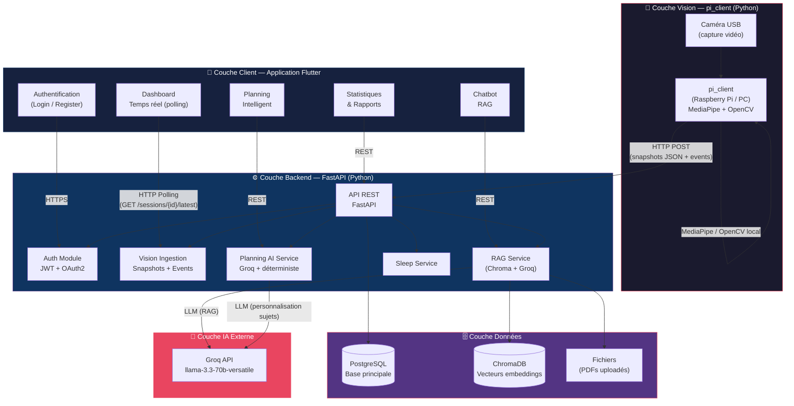
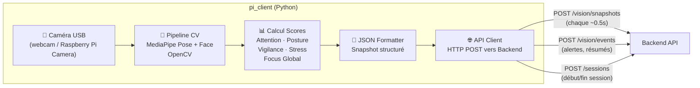
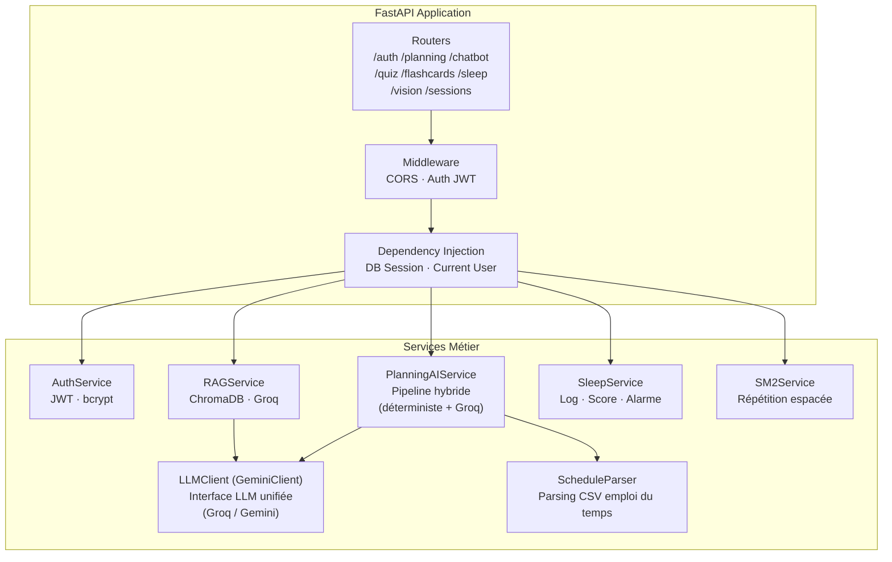
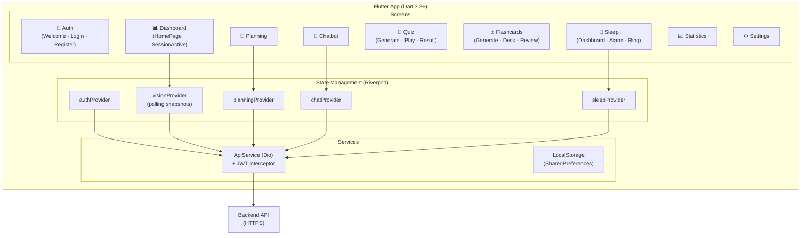
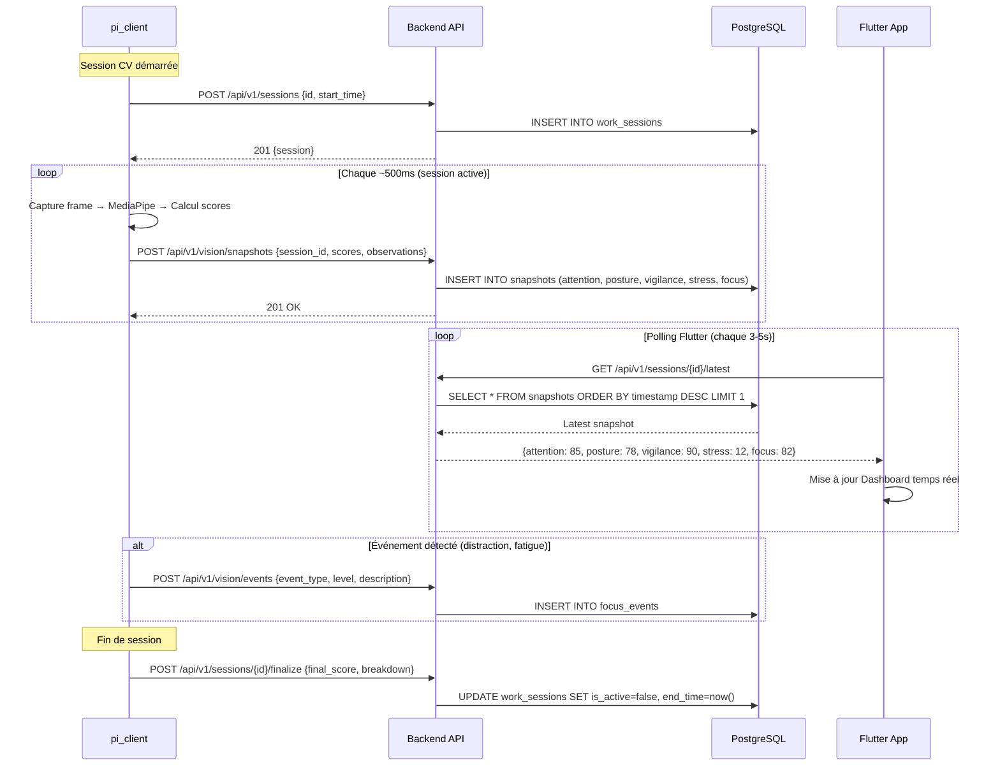
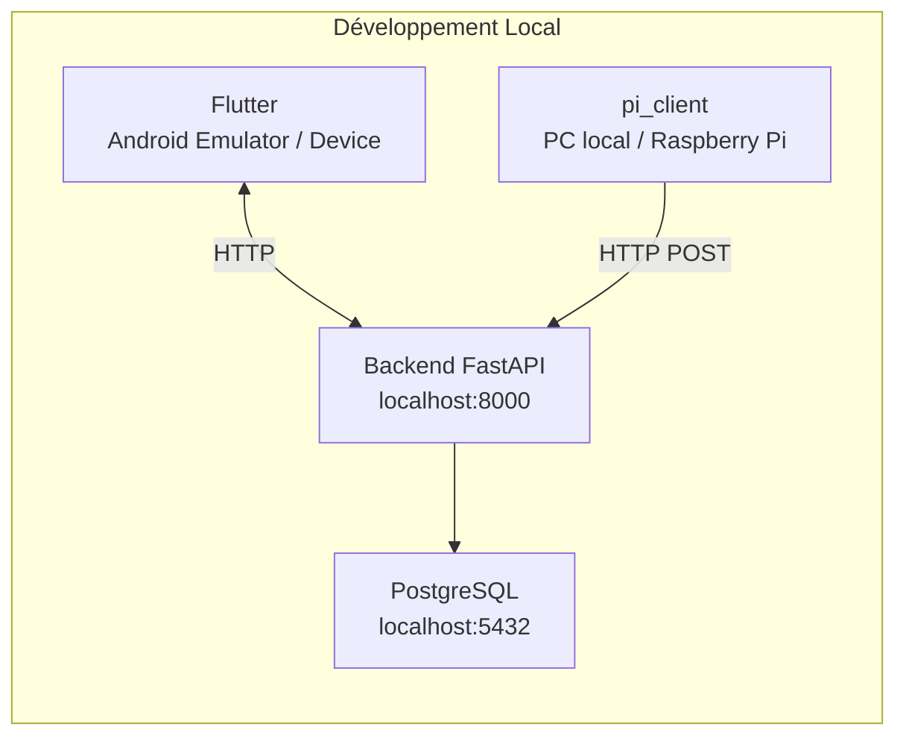

# 🏗️ Diagramme d'Architecture Système – Smart Focus & Life Assistant

**Version** : 2.0  
**Date** : 02 Mai 2026  
**Phase** : Conception (mise à jour post-implémentation)  

---

## 1. Architecture Globale (Vue d'ensemble)

---

## 2. Architecture par Couche (Détail)

### 2.1 🔧 Couche Vision (pi_client)

### 2.2 ⚙️ Couche Backend (FastAPI)

### 2.3 📱 Couche Application Flutter

---

## 3. Flux de Communication Principal

---

## 4. Déploiement

---

## 5. Récapitulatif Technologique

| Couche | Technologie | Rôle |
|--------|-------------|------|
| **Vision CV** | pi_client (Python) + MediaPipe + OpenCV | Analyse comportementale en temps réel |
| **Backend** | FastAPI (Python 3.11) | API REST |
| **Base de données** | PostgreSQL 15 | Données persistantes |
| **Vecteurs** | ChromaDB | Embeddings RAG |
| **IA NLP (LLM)** | Groq llama-3.3-70b-versatile | Chatbot RAG & Planning |
| **Embeddings** | HuggingFace all-MiniLM-L6-v2 (local) | Vectorisation documents RAG |
| **Mobile** | Flutter 3.16 (Dart 3.2) | Interface utilisateur |
| **État** | Riverpod 2.4 | State management Flutter |
| **Navigation** | GoRouter | Routing déclaratif |
| **HTTP** | Dio 5.3 + JWT Interceptor | Appels API |
| **Alarmes** | Flutter alarm package | Réveil intelligent local |

---

## 6. Changements par rapport à la v1.0

| Élément | Conception v1.0 | Réalité v2.0 |
|---------|----------------|--------------|
| Hardware | ESP32-CAM → Backend ML | pi_client Python fait le ML localement |
| Communication temps réel | WebSocket `/ws/realtime` | HTTP polling (GET latest snapshot) |
| ML Backend | MLService interne (MediaPipe/TF) | ML externe (pi_client), backend = ingesteur |
| Cache | Redis pour sessions/pub-sub | Non utilisé (supprimé de l'architecture) |
| Scores CV | `posture_score`, `fatigue_score`, `attention_score` | `attention`, `posture`, `vigilance`, `stress_risk`, `global_focus` |
| Sessions focus | `focus_sessions` table | `work_sessions` + `snapshots` + `focus_events` |

---

*Mis à jour le 02 Mai 2026 — Smart Focus & Life Assistant*
