# 📐 Diagrammes de Cas d'Utilisation – Smart Focus & Life Assistant

**Version** : 2.0  
**Date** : 9 Avril 2026  
**Phase** : Conception  

---

## 1. Identification des Acteurs

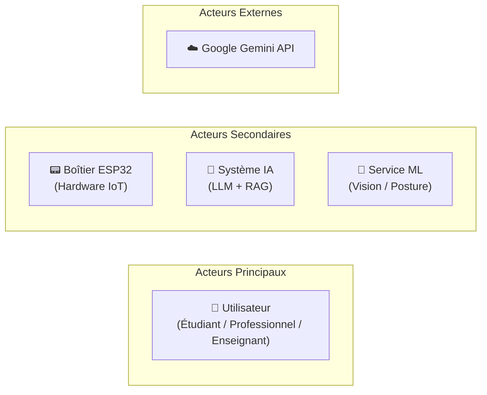

| Acteur | Type | Description |
|--------|------|-------------|
| **Utilisateur** | Principal | Étudiant, professionnel ou enseignant qui interagit avec l'application mobile |
| **Boîtier ESP32** | Secondaire | Dispositif IoT qui capture les données physiques (caméra, capteurs) |
| **Service ML** | Secondaire | Module serveur d'analyse d'images (posture, fatigue, visage) |
| **Système IA** | Secondaire | Module RAG/LLM pour le chatbot, le planning intelligent, la génération de quiz et flashcards |
| **Google Gemini API** | Externe | Service cloud pour la génération de texte (Gemini 2.5 Flash) et les embeddings (text-embedding-004) |

---

## 2. Diagramme de Cas d'Utilisation Général

```mermaid
graph TB
    %% Acteurs
    User(("👤 Utilisateur"))
    ESP32(("📟 ESP32"))
    IA(("🤖 IA / LLM"))
    ML(("🧠 ML Vision"))

    %% CU Authentification
    subgraph AUTH ["🔐 Authentification"]
        UC1["S'inscrire"]
        UC2["Se connecter"]
        UC3["Gérer le profil"]
        UC3r["Rafraîchir le token"]
    end

    %% CU Focus
    subgraph FOCUS ["🎯 Focus & Concentration"]
        UC4["Démarrer une session de travail"]
        UC5["Consulter le score de focus en temps réel"]
        UC6["Recevoir des alertes de concentration"]
        UC7["Consulter l'historique des sessions"]
    end

    %% CU Planning
    subgraph PLANNING ["📅 Planning Intelligent"]
        UC8["Consulter le planning du jour"]
        UC9["Générer un planning IA (jour)"]
        UC9w["Générer un planning IA (semaine)"]
        UC10["Modifier une session planifiée"]
        UC11["Supprimer une session planifiée"]
        UC10c["Marquer une session terminée"]
        UC10r["Replanifier une session manquée"]
        UC30["Consulter les insights planning"]
        UC31["Créer un examen"]
        UC32["Supprimer un examen"]
    end

    %% CU Chatbot
    subgraph CHATBOT ["💬 Chatbot RAG"]
        UC12["Uploader un document (PDF ou CSV)"]
        UC13["Poser une question sur les cours"]
        UC13g["Poser une question générale"]
        UC12l["Lister mes documents"]
        UC12d["Supprimer un document"]
    end

    %% CU Quiz
    subgraph QUIZ ["🧠 Quiz"]
        UC14["Générer un quiz depuis un document"]
        UC14s["Générer un quiz depuis une session"]
        UC14sub["Soumettre les réponses d'un quiz"]
        UC14l["Lister mes quiz"]
    end

    %% CU Flashcards
    subgraph FLASHCARDS ["🃏 Flashcards SM-2"]
        UC15["Générer des flashcards"]
        UC15s["Générer des flashcards depuis une session"]
        UC15r["Réviser une flashcard (SM-2)"]
        UC15d["Consulter les cartes dues"]
        UC15del["Supprimer une flashcard"]
    end

    %% CU Posture
    subgraph POSTURE ["🧍 Posture & Ergonomie"]
        UC17["Détecter la posture en temps réel"]
        UC18["Recevoir des alertes posture"]
        UC19["Consulter les statistiques posture"]
        UC20["Recevoir des conseils ergonomiques"]
    end

    %% CU Sommeil
    subgraph SOMMEIL ["🌙 Sommeil & Réveil"]
        UC21["Enregistrer les données de sommeil"]
        UC22["Consulter le score de sommeil"]
        UC22h["Consulter l'historique sommeil"]
        UC23["Configurer le réveil intelligent"]
        UC24["Adapter le planning selon le sommeil"]
    end

    %% CU Statistiques
    subgraph STATS ["📊 Statistiques & Conseils"]
        UC27["Consulter le dashboard global"]
        UC28["Voir les statistiques hebdomadaires"]
        UC29["Recevoir des conseils personnalisés"]
    end

    %% Relations Utilisateur
    User --> UC1
    User --> UC2
    User --> UC3
    User --> UC3r
    User --> UC4
    User --> UC5
    User --> UC7
    User --> UC8
    User --> UC9
    User --> UC9w
    User --> UC10
    User --> UC11
    User --> UC10c
    User --> UC10r
    User --> UC30
    User --> UC31
    User --> UC32
    User --> UC12
    User --> UC13
    User --> UC13g
    User --> UC12l
    User --> UC12d
    User --> UC14
    User --> UC14s
    User --> UC14sub
    User --> UC14l
    User --> UC15
    User --> UC15s
    User --> UC15r
    User --> UC15d
    User --> UC15del
    User --> UC17
    User --> UC19
    User --> UC21
    User --> UC22
    User --> UC22h
    User --> UC23
    User --> UC27
    User --> UC28

    %% Relations ESP32
    ESP32 --> UC6
    ESP32 --> UC17
    ESP32 --> UC18
    ESP32 --> UC21

    %% Relations IA
    IA --> UC9
    IA --> UC9w
    IA --> UC13
    IA --> UC13g
    IA --> UC14
    IA --> UC14s
    IA --> UC15
    IA --> UC15s
    IA --> UC20
    IA --> UC24
    IA --> UC29
    IA --> UC30

    %% Relations ML
    ML --> UC5
    ML --> UC6
    ML --> UC17
    ML --> UC18
```

---

## 3. Cas d'Utilisation Détaillés par Module

### 3.1 🔐 Module Authentification

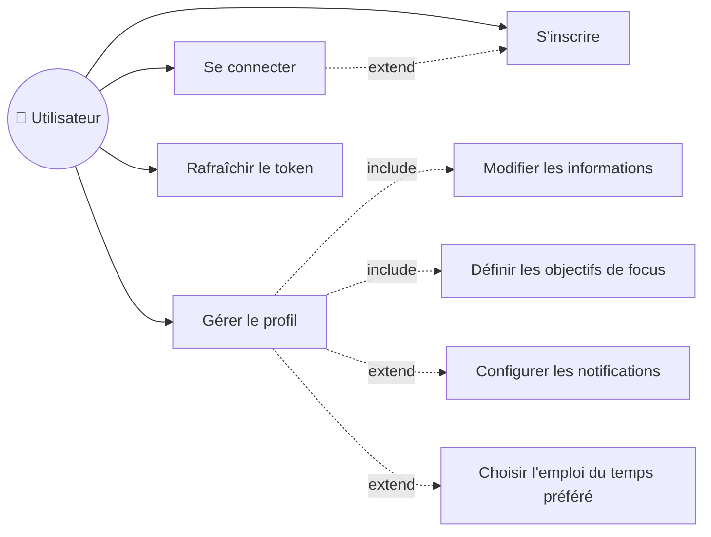

| # | Cas d'Utilisation | Acteur(s) | Pré-condition | Scénario Principal | Post-condition |
|---|-------------------|-----------|---------------|---------------------|----------------|
| UC1 | S'inscrire | Utilisateur | Aucun compte existant | 1. Saisir email, mot de passe, nom, rôle 2. Valider 3. Compte + profil créés | Compte actif, JWT access + refresh |
| UC2 | Se connecter | Utilisateur | Compte existant et actif | 1. Saisir email/mot de passe (OAuth2 form) 2. Authentification 3. Token JWT retourné | Session active |
| UC3 | Gérer le profil | Utilisateur | Connecté | 1. Accéder à `/auth/me` 2. Modifier `daily_focus_goal`, `preferred_schedule`, `notif_enabled` 3. Sauvegarder via `PUT /auth/me/profile` | Profil mis à jour |
| UC3r | Rafraîchir le token | Utilisateur | Refresh token valide | 1. Envoyer `POST /auth/refresh` avec refresh_token 2. Nouveau couple access + refresh retourné | Nouvelle session |

**Endpoints réels :**
- `POST /auth/register` — Inscription
- `POST /auth/login` — Connexion (OAuth2PasswordRequestForm)
- `POST /auth/refresh` — Rafraîchissement du token
- `GET /auth/me` — Profil courant
- `PUT /auth/me/profile` — Mise à jour préférences

---

### 3.2 🎯 Module Focus & Concentration

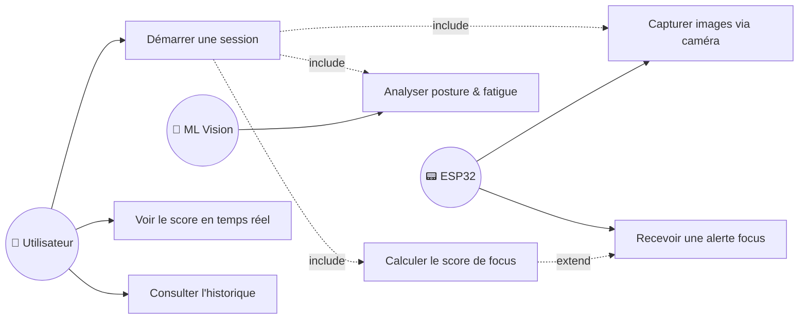

| # | Cas d'Utilisation | Acteur(s) | Pré-condition | Scénario Principal | Post-condition |
|---|-------------------|-----------|---------------|---------------------|----------------|
| UC4 | Démarrer une session | Utilisateur, ESP32, ML | Connecté, boîtier allumé | 1. Cliquer "Démarrer" 2. ESP32 commence capture 3. ML analyse en continu 4. Score affiché temps réel | Session en cours |
| UC5 | Voir score temps réel | Utilisateur | Session active | 1. Dashboard affiche score 2. WebSocket met à jour 3. Graphique en direct | Score visible |
| UC6 | Recevoir alerte focus | ESP32, ML | Score < seuil | 1. Score bas détecté 2. LED rouge sur boîtier 3. Notification mobile | Utilisateur alerté |
| UC7 | Consulter historique | Utilisateur | Sessions passées | 1. Aller dans Statistiques 2. Filtrer par période 3. Voir graphiques | Historique affiché |

> ⚠️ Ce module dépend de l'intégration hardware ESP32 (Personne 1). Le backend est architecturé pour le recevoir mais les endpoints `/focus/*` ne sont pas encore implémentés.

---

### 3.3 📅 Module Planning Intelligent

Ce module est le plus sophistiqué du système. Il gère la génération automatique de sessions d'étude adaptées au profil de l'utilisateur, à son sommeil, à ses examens et à ses résultats de quiz/flashcards.

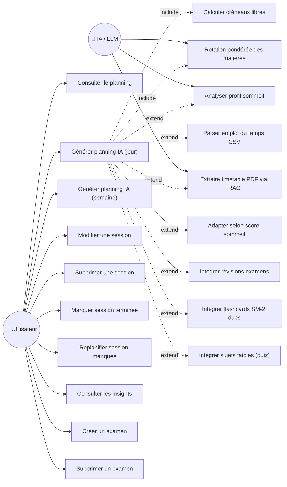

| # | Cas d'Utilisation | Acteur(s) | Pré-condition | Scénario Principal | Post-condition |
|---|-------------------|-----------|---------------|---------------------|----------------|
| UC8 | Consulter le planning | Utilisateur | Connecté | 1. `GET /planning/today` ou `GET /planning/{date}` 2. Voir sessions du jour | Planning affiché |
| UC9 | Générer planning IA (jour) | Utilisateur, IA | Connecté, document CSV/PDF uploadé (optionnel) | 1. `POST /planning/generate` avec date, document_id, exam_ids, week_type 2. Parsing CSV ou extraction PDF Gemini 3. Profil sommeil évalué → durée/nb sessions adaptés 4. Créneaux libres calculés (8h–22h, 15min buffer) 5. Rotation pondérée : cours, examens, flashcards dues, quiz faibles 6. Sessions créées en DB | Planning journée créé |
| UC9w | Générer planning IA (semaine) | Utilisateur, IA | Idem UC9 | 1. `POST /planning/generate/week` 2. Génère pour 7 jours (lundi→dimanche) 3. Week-end : sweep hebdomadaire des cours non vus | Planning semaine créé |
| UC10 | Modifier une session | Utilisateur | Session existante | 1. `PATCH /planning/sessions/{id}` 2. Modifier statut, notes, documents liés | Session modifiée |
| UC10c | Marquer session terminée | Utilisateur | Session en cours | 1. `PATCH /planning/sessions/{id}/complete` 2. `completed_at` enregistré | Session terminée |
| UC10r | Replanifier session manquée | Utilisateur | Session expirée ou annulée | 1. `POST /planning/reschedule/{id}` 2. Système cherche créneau libre sur J ou J+1 3. Nouvelle session créée, ancienne annulée | Session replanifiée |
| UC11 | Supprimer une session | Utilisateur | Session existante | 1. `DELETE /planning/sessions/{id}` | Session supprimée |
| UC30 | Consulter les insights | Utilisateur | Données historiques | 1. `GET /planning/insights?period=week\|month` 2. Calcul : minutes étudiées, taux complétion, corrélation sommeil↔productivité, sujet le plus faible, recommandation | Insights affichés |
| UC31 | Créer un examen | Utilisateur | Connecté | 1. `POST /planning/exams` 2. Titre, date, document optionnel | Examen créé |
| UC32 | Supprimer un examen | Utilisateur | Examen existant | 1. `DELETE /planning/exams/{id}` | Examen supprimé |

**Endpoints réels :**
- `GET /api/v1/planning/today`
- `GET /api/v1/planning/{date}`
- `POST /api/v1/planning/generate`
- `POST /api/v1/planning/generate/week`
- `GET /api/v1/planning/insights`
- `POST /api/v1/planning/sessions`
- `PATCH /api/v1/planning/sessions/{id}`
- `PATCH /api/v1/planning/sessions/{id}/complete`
- `DELETE /api/v1/planning/sessions/{id}`
- `POST /api/v1/planning/reschedule/{id}`
- `GET /api/v1/planning/exams`
- `POST /api/v1/planning/exams`
- `DELETE /api/v1/planning/exams/{id}`

**Logique d'adaptation au sommeil :**

| Score sommeil | Durée max session | Pause entre sessions | Nb max sessions | Priorité |
|:---:|:---:|:---:|:---:|:---:|
| ≥ 80 (bien reposé) | 50 min | 10 min | 6 | high |
| 50–79 (moyen) | 35 min | 15 min | 4 | medium |
| < 50 (insuffisant) | 25 min | 20 min | 2 | low |

---

### 3.4 💬 Module Chatbot RAG

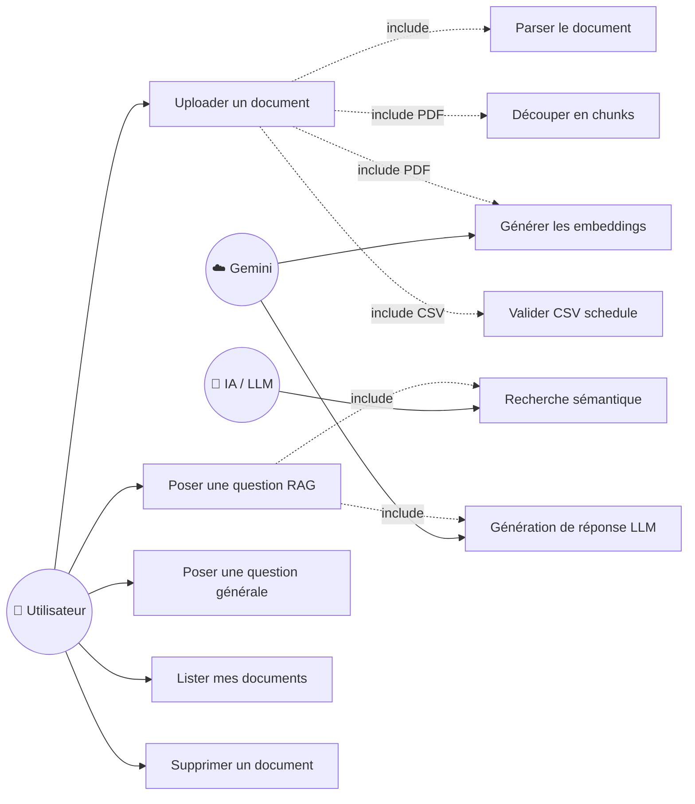

| # | Cas d'Utilisation | Acteur(s) | Pré-condition | Scénario Principal | Post-condition |
|---|-------------------|-----------|---------------|---------------------|----------------|
| UC12 | Uploader un document | Utilisateur, IA | Connecté | **PDF :** 1. Sélectionner fichier PDF 2. Upload multipart 3. PyMuPDF extrait le texte 4. Chunking + embeddings Gemini 5. Stockage dans ChromaDB  **CSV :** 1. Sélectionner fichier CSV 2. Validation colonnes (week, day, start, end, subject) 3. Sauvegarde comme template emploi du temps | Document indexé (PDF) ou template validé (CSV) |
| UC13 | Poser une question RAG | Utilisateur, IA, Gemini | Document(s) uploadé(s) | 1. `POST /chatbot/chat` avec `question` + `document_ids[]` 2. Recherche sémantique ChromaDB 3. Chunks pertinents récupérés 4. Gemini génère réponse contextualisée 5. Réponse + sources affichées 6. Échange sauvé en historique | Réponse affichée avec citations |
| UC13g | Question générale (sans doc) | Utilisateur, Gemini | Connecté | 1. `POST /chatbot/chat` avec `document_ids` vide 2. Gemini répond directement sans RAG | Réponse IA directe |
| UC12l | Lister mes documents | Utilisateur | Documents existants | 1. `GET /chatbot/documents` 2. Liste triée par date (desc) | Documents listés |
| UC12d | Supprimer un document | Utilisateur | Document existant | 1. `DELETE /chatbot/documents/{id}` 2. Suppression : fichier disque + ChromaDB + DB (cascade messages, quiz, flashcards) | Document entièrement supprimé |

**Endpoints réels :**
- `POST /chatbot/upload` — Upload PDF ou CSV (multipart/form-data)
- `POST /chatbot/chat` — Question RAG ou générale
- `GET /chatbot/documents` — Lister les documents
- `DELETE /chatbot/documents/{id}` — Supprimer un document
- `GET /chatbot/history?limit=N` — Historique des échanges

---

### 3.5 🧠 Module Quiz

Le module quiz est désormais un routeur indépendant avec support multi-documents et génération depuis une session d'étude.

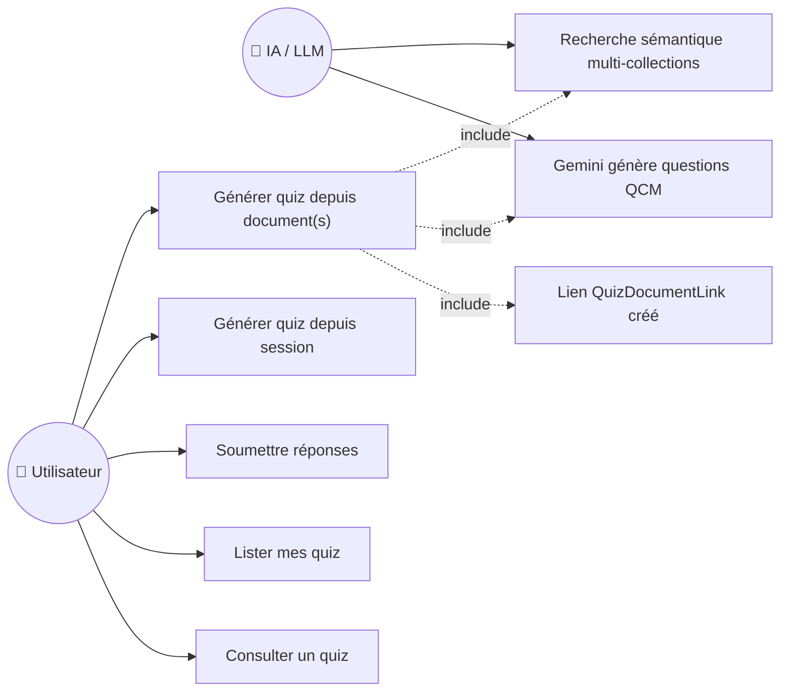

| # | Cas d'Utilisation | Acteur(s) | Pré-condition | Scénario Principal | Post-condition |
|---|-------------------|-----------|---------------|---------------------|----------------|
| UC14 | Générer quiz depuis document(s) | Utilisateur, IA | Document(s) PDF uploadé(s) | 1. `POST /quiz/generate` avec `document_id` ou `document_ids[]`, `num_questions` (3–30) 2. Recherche sémantique dans ChromaDB 3. Gemini génère les questions QCM avec options + réponse correcte + explication 4. Quiz + QuizDocumentLink sauvés en DB | Quiz créé, réponses masquées |
| UC14s | Générer quiz depuis session | Utilisateur, IA | Session terminée avec documents liés | 1. `POST /quiz/generate-from-session/{session_id}` 2. Récupère les documents de la session 3. Génère le quiz (ou retourne l'existant) | Quiz de session créé |
| UC14sub | Soumettre réponses | Utilisateur | Quiz non soumis | 1. `POST /quiz/{id}/submit` avec `answers[]` 2. Scoring : comparaison avec `correct_index` 3. Score, pourcentage et corrections retournés | Quiz complété avec score |
| UC14l | Lister mes quiz | Utilisateur | Quiz existants | 1. `GET /quiz/list` | Liste de quiz |
| UC14g | Consulter un quiz | Utilisateur | Quiz existant | 1. `GET /quiz/{id}` 2. Si non soumis : réponses masquées 3. Si soumis : corrections visibles | Quiz affiché |

**Endpoints réels :**
- `POST /quiz/generate`
- `POST /quiz/generate-from-session/{session_id}`
- `GET /quiz/list`
- `GET /quiz/{quiz_id}`
- `POST /quiz/{quiz_id}/submit`

---

### 3.6 🃏 Module Flashcards SM-2

Le module flashcards utilise l'algorithme de répétition espacée SM-2. Il supporte la génération depuis des documents ou depuis des sessions d'étude terminées.

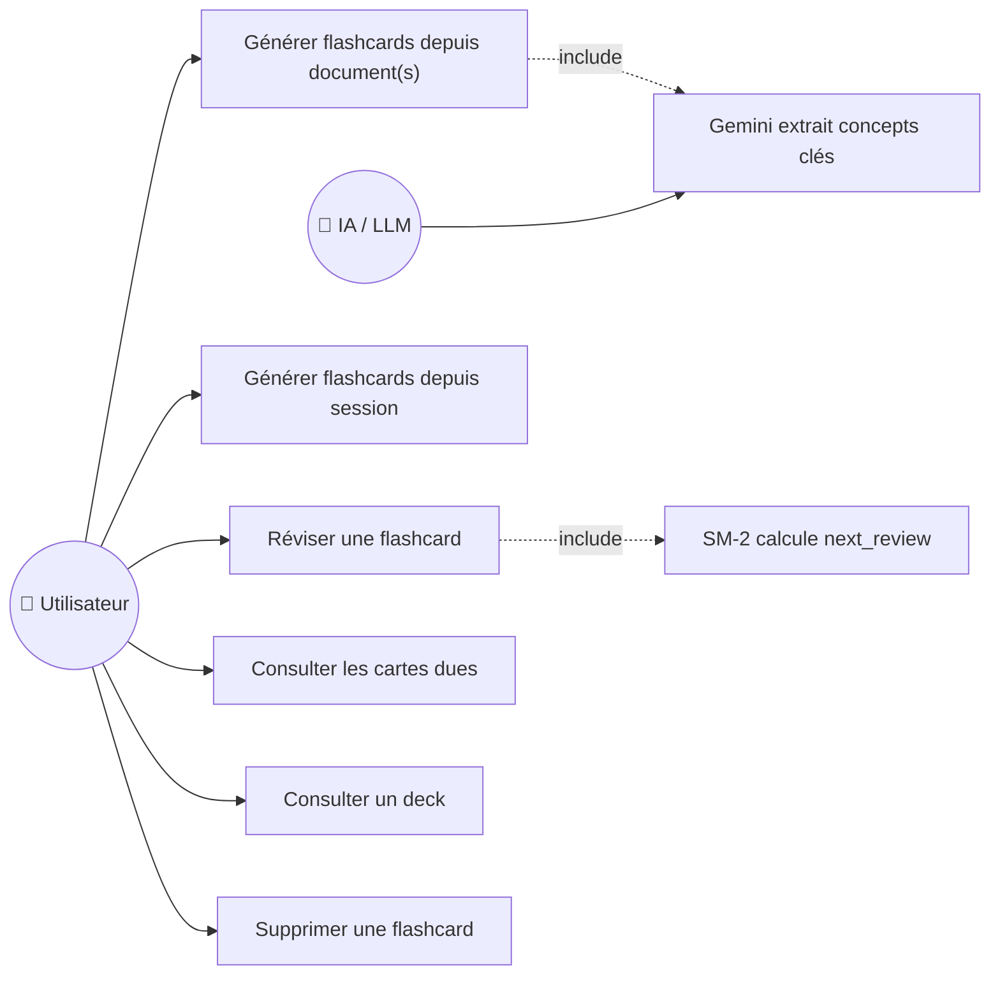

| # | Cas d'Utilisation | Acteur(s) | Pré-condition | Scénario Principal | Post-condition |
|---|-------------------|-----------|---------------|---------------------|----------------|
| UC15 | Générer flashcards depuis document(s) | Utilisateur, IA | Document(s) PDF uploadé(s) | 1. `POST /flashcards/generate` avec `document_id`/`document_ids[]`, `num_cards` (5–50) 2. Gemini extrait concepts clés 3. Flashcards créées avec `ease_factor=2.5`, `interval=1`, `next_review=now` | Deck de flashcards créé |
| UC15s | Générer flashcards depuis session | Utilisateur, IA | Session terminée avec documents | 1. `POST /flashcards/generate-from-session/{session_id}` 2. Récupère documents liés à la session 3. Génère (ou retourne existantes) | Deck de session créé |
| UC15r | Réviser une flashcard | Utilisateur | Carte due | 1. `POST /flashcards/{id}/review` avec `quality` (0–5) 2. SM-2 calcule : `repetitions`, `ease_factor`, `interval`, `next_review` 3. Carte mise à jour | Prochaine révision planifiée |
| UC15d | Consulter cartes dues | Utilisateur | Flashcards existantes | 1. `GET /flashcards/due` 2. Retourne cartes avec `next_review ≤ now` | Cartes dues listées |
| UC15dk | Consulter un deck | Utilisateur | Document existant | 1. `GET /flashcards/deck/{document_id}` ou `GET /flashcards/deck/session/{session_id}` | Deck affiché |
| UC15del | Supprimer une flashcard | Utilisateur | Carte existante | 1. `DELETE /flashcards/{id}` | Carte supprimée |

**Endpoints réels :**
- `POST /flashcards/generate`
- `POST /flashcards/generate-from-session/{session_id}`
- `GET /flashcards/deck/{document_id}`
- `GET /flashcards/deck/session/{session_id}`
- `GET /flashcards/due`
- `POST /flashcards/{card_id}/review`
- `DELETE /flashcards/{card_id}`

**Algorithme SM-2 :**

| Quality (0–5) | Signification | Effet |
|:---:|---|---|
| 0 | Blackout total | Reset repetitions, interval=1 |
| 1 | Incorrect, mais reconnu après | Reset repetitions, interval=1 |
| 2 | Incorrect, mais facile après | Reset repetitions, interval=1 |
| 3 | Correct, difficulté sérieuse | interval = interval × ease_factor |
| 4 | Correct, quelque hésitation | interval = interval × ease_factor |
| 5 | Rappel parfait | interval = interval × ease_factor |

---

### 3.7 🧍 Module Posture & Ergonomie

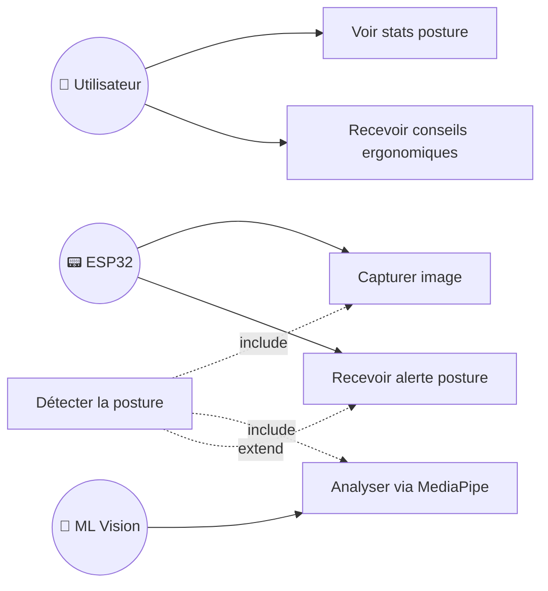

| # | Cas d'Utilisation | Acteur(s) | Pré-condition | Scénario Principal | Post-condition |
|---|-------------------|-----------|---------------|---------------------|----------------|
| UC17 | Détecter la posture | ESP32, ML | Session active | 1. Caméra capture image 2. MediaPipe analyse la posture 3. Résultat envoyé à l'app | Posture évaluée |
| UC18 | Recevoir alerte posture | ESP32, Utilisateur | Mauvaise posture détectée | 1. ML détecte dos courbé 2. LED orange sur boîtier 3. Vibration douce 4. Notification mobile | Utilisateur alerté |
| UC19 | Voir stats posture | Utilisateur | Données collectées | 1. Ouvrir Statistiques 2. Voir % bonne posture 3. Évolution par jour/semaine | Stats affichées |
| UC20 | Recevoir conseils | Utilisateur, IA | Historique posture | 1. Analyse patterns 2. IA génère conseils 3. Recommandations affichées | Conseils reçus |

> ⚠️ Ce module dépend de l'intégration hardware ESP32 (Personne 1).

---

### 3.8 🌙 Module Sommeil & Réveil

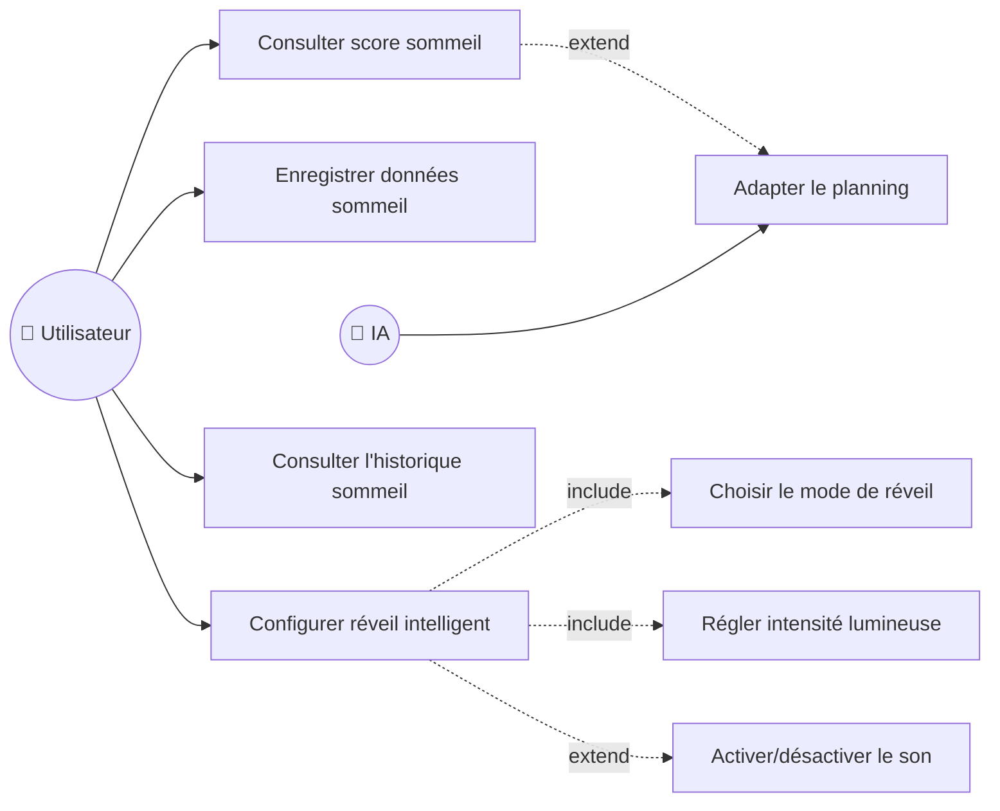

| # | Cas d'Utilisation | Acteur(s) | Pré-condition | Scénario Principal | Post-condition |
|---|-------------------|-----------|---------------|---------------------|----------------|
| UC21 | Enregistrer sommeil | Utilisateur | Connecté | 1. `POST /api/v1/sleep/log` avec `sleep_start`, `sleep_end` 2. Calcul automatique `total_hours` et `sleep_score` (0–100) | Nuit enregistrée |
| UC22 | Score sommeil | Utilisateur | Données de nuit | 1. `GET /api/v1/sleep/stats?period=week\|month` 2. Moyenne heures, score moyen, tendance | Stats consultées |
| UC22h | Historique sommeil | Utilisateur | Nuits enregistrées | 1. `GET /api/v1/sleep/history?limit=30` 2. Liste des enregistrements | Historique affiché |
| UC23 | Réveil intelligent | Utilisateur | Connecté | 1. `PUT /api/v1/sleep/alarm` avec `alarm_time` (HH:MM), `wake_mode` (gradual\|normal\|silent), `light_intensity` (0–100), `sound_enabled` 2. Alarme locale Flutter (`alarm: ^5.2.1`) | Alarme configurée |
| UC24 | Adapter planning | IA | Score sommeil disponible | 1. Score < 50 détecté 2. Planning réduit : 25min/session, max 2 3. Pauses de 20min | Planning adapté |

**Endpoints réels :**
- `POST /api/v1/sleep/log`
- `GET /api/v1/sleep/stats`
- `GET /api/v1/sleep/history`
- `PUT /api/v1/sleep/alarm`
- `GET /api/v1/sleep/alarm`

---

### 3.9 📊 Module Dashboard & Statistiques

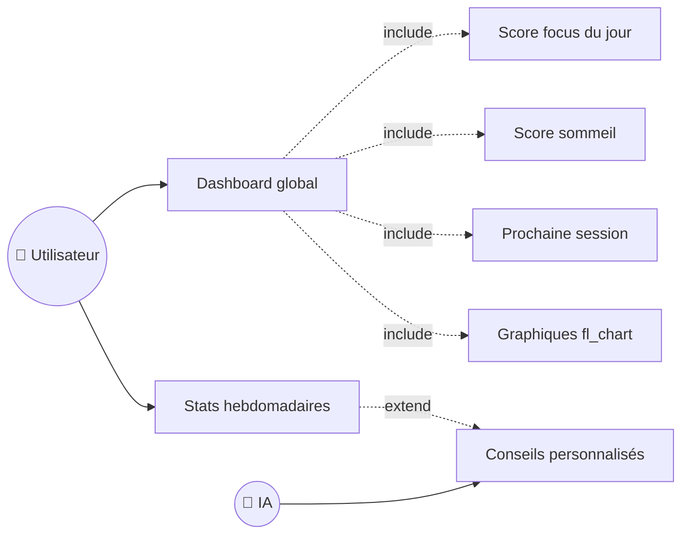

| # | Cas d'Utilisation | Acteur(s) | Pré-condition | Scénario Principal | Post-condition |
|---|-------------------|-----------|---------------|---------------------|----------------|
| UC27 | Dashboard global | Utilisateur | Connecté | 1. Ouvrir l'app 2. Voir scores du jour 3. Alertes récentes 4. Prochaine session | Vue d'ensemble |
| UC28 | Stats hebdomadaires | Utilisateur | Données collectées | 1. Ouvrir Statistiques 2. Graphiques par semaine (fl_chart) 3. Tendances et progrès | Progrès visualisés |
| UC29 | Conseils personnalisés | Utilisateur, IA | Historique suffisant | 1. IA analyse les patterns (via `/planning/insights`) 2. Détecte heures productives 3. Identifie corrélation sommeil/productivité 4. Génère recommandation personnalisée | Conseils affichés |

---

## 4. Matrice Acteurs / Cas d'Utilisation

| Cas d'Utilisation | 👤 Utilisateur | 📟 ESP32 | 🧠 ML Vision | 🤖 IA/LLM | ☁️ Gemini |
|-------------------|:-:|:-:|:-:|:-:|:-:|
| S'inscrire | ✅ | | | | |
| Se connecter | ✅ | | | | |
| Gérer profil | ✅ | | | | |
| Rafraîchir token | ✅ | | | | |
| Démarrer session focus | ✅ | ✅ | ✅ | | |
| Voir score temps réel | ✅ | | ✅ | | |
| Alerte concentration | ✅ | ✅ | ✅ | | |
| Historique sessions | ✅ | | | | |
| Consulter planning | ✅ | | | | |
| Générer planning IA (jour) | ✅ | | | ✅ | ✅ |
| Générer planning IA (semaine) | ✅ | | | ✅ | ✅ |
| Modifier session | ✅ | | | | |
| Marquer session terminée | ✅ | | | | |
| Replanifier session manquée | ✅ | | | | |
| Supprimer session | ✅ | | | | |
| Consulter insights planning | ✅ | | | ✅ | |
| Créer un examen | ✅ | | | | |
| Supprimer un examen | ✅ | | | | |
| Uploader document (PDF/CSV) | ✅ | | | | ✅ |
| Question RAG (sur document) | ✅ | | | ✅ | ✅ |
| Question générale (sans doc) | ✅ | | | | ✅ |
| Lister documents | ✅ | | | | |
| Supprimer document | ✅ | | | | |
| Générer quiz (document) | ✅ | | | ✅ | ✅ |
| Générer quiz (session) | ✅ | | | ✅ | ✅ |
| Soumettre réponses quiz | ✅ | | | | |
| Lister quiz | ✅ | | | | |
| Générer flashcards (document) | ✅ | | | ✅ | ✅ |
| Générer flashcards (session) | ✅ | | | ✅ | ✅ |
| Réviser flashcard (SM-2) | ✅ | | | | |
| Consulter cartes dues | ✅ | | | | |
| Supprimer flashcard | ✅ | | | | |
| Détecter posture | | ✅ | ✅ | | |
| Alerte posture | ✅ | ✅ | ✅ | | |
| Stats posture | ✅ | | | | |
| Conseils ergonomiques | ✅ | | | ✅ | |
| Enregistrer sommeil | ✅ | | | | |
| Score sommeil / stats | ✅ | | | | |
| Historique sommeil | ✅ | | | | |
| Configurer réveil | ✅ | | | | |
| Adapter planning/sommeil | | | | ✅ | |
| Dashboard global | ✅ | | | | |
| Stats hebdomadaires | ✅ | | | | |
| Conseils personnalisés | ✅ | | | ✅ | ✅ |

---

## 5. Résumé des Cas d'Utilisation

| Module | Nombre de CU | Priorité | Statut |
|--------|:---:|:---:|:---:|
| 🔐 Authentification | 4 | Haute | ✅ Implémenté |
| 🎯 Focus & Concentration | 4 | Haute | ⚠️ En attente hardware |
| 📅 Planning Intelligent | 10 | Haute | ✅ Implémenté |
| 💬 Chatbot RAG | 5 | Haute | ✅ Implémenté |
| 🧠 Quiz | 5 | Haute | ✅ Implémenté |
| 🃏 Flashcards SM-2 | 6 | Haute | ✅ Implémenté |
| 🧍 Posture & Ergonomie | 4 | Moyenne | ⚠️ En attente hardware |
| 🌙 Sommeil & Réveil | 5 | Moyenne | ✅ Implémenté |
| 📊 Dashboard & Stats | 3 | Haute | ✅ Implémenté |
| **Total** | **46** | | |

---

## 6. Changements depuis la version 1.0

| Élément | Avant (v1.0) | Après (v2.0) |
|---------|-------------|-------------|
| LLM Provider | OpenAI API (GPT-3.5/4) | Google Gemini 2.5 Flash |
| Embeddings | text-embedding-3 (OpenAI) | text-embedding-004 (Gemini) |
| Planning | 4 CU simples | 10 CU (semaine, reschedule, exams, insights, adaptation sommeil) |
| Quiz | Sous-module chatbot (1 CU) | Module indépendant (5 CU, multi-docs, depuis session) |
| Flashcards | Sous-module chatbot (2 CU) | Module indépendant (6 CU, SM-2, depuis session, decks) |
| Chatbot upload | PDF uniquement | PDF + CSV (emploi du temps) |
| Sommeil | 4 CU | 5 CU (ajout historique) |
| Auth | 3 CU | 4 CU (ajout refresh token) |
| Total CU | 29 | 46 |

---

*Mis à jour le 9 Avril 2026 — Smart Focus & Life Assistant*
