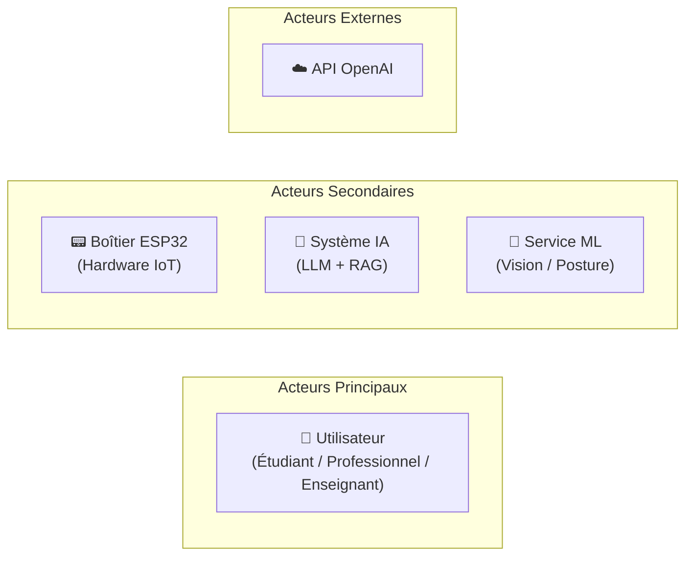
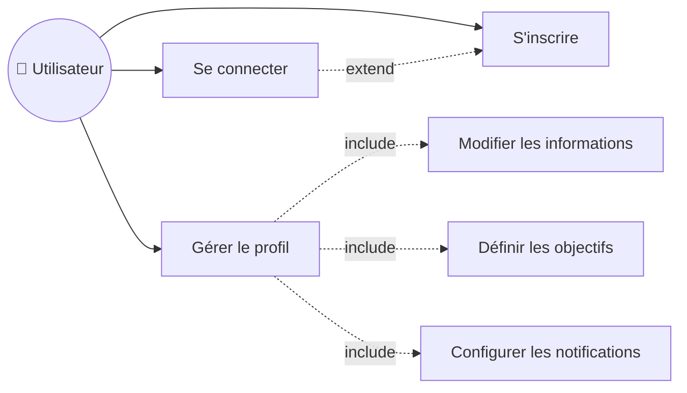
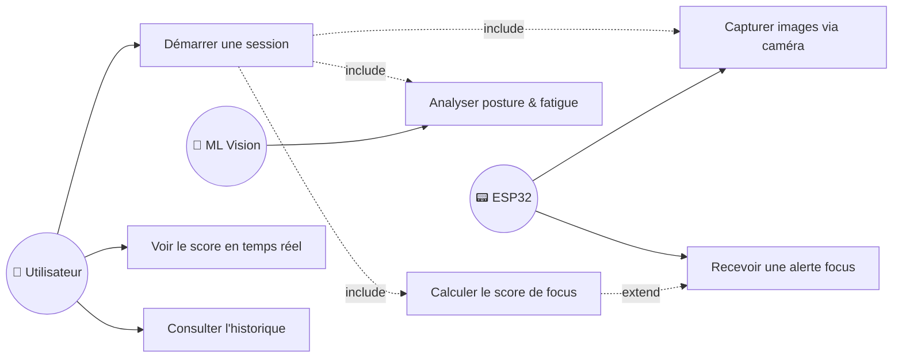
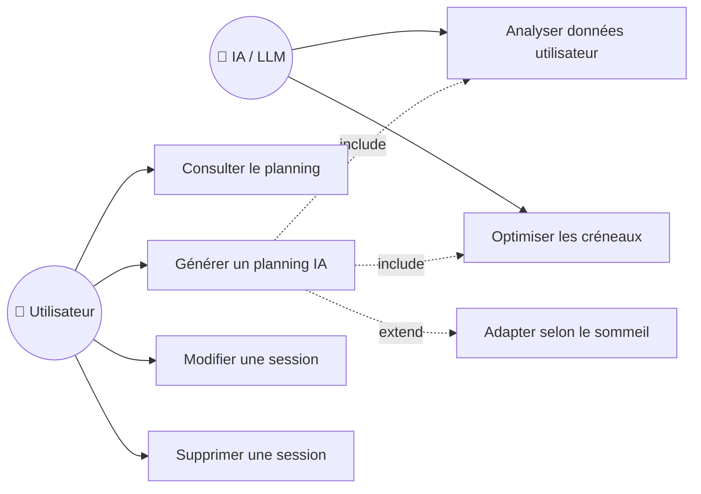
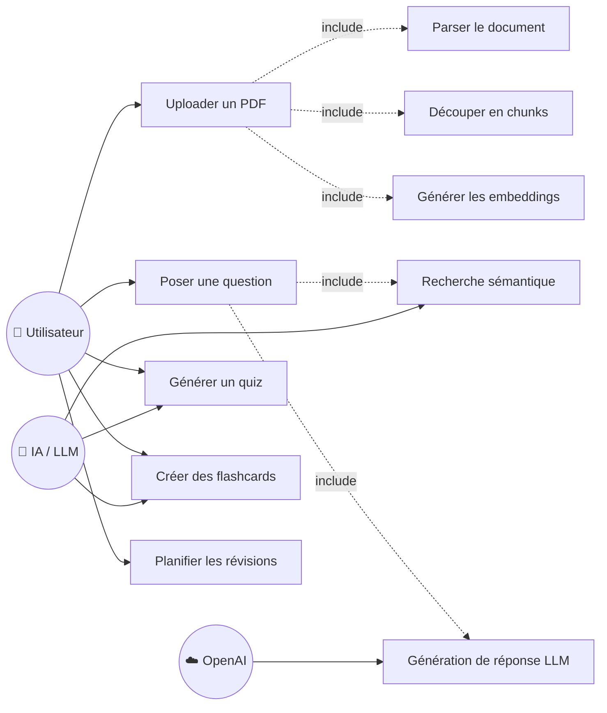
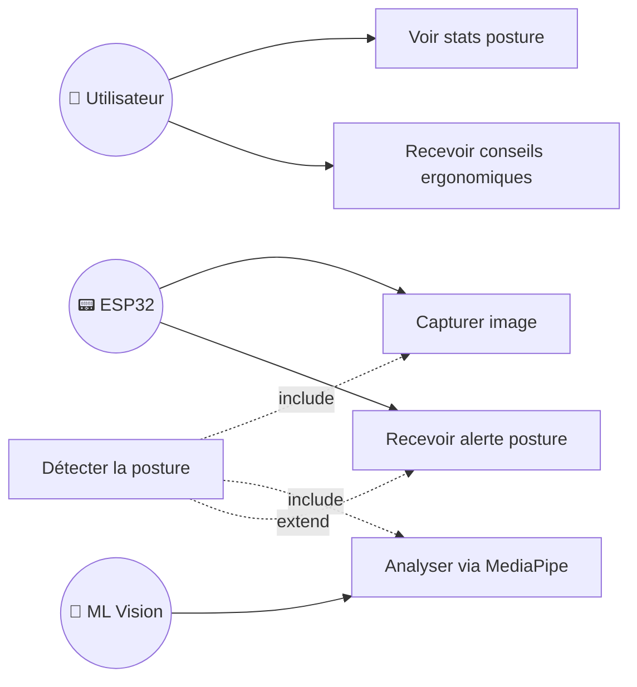
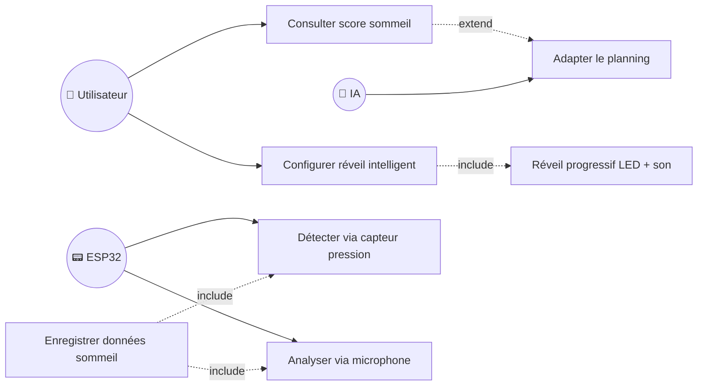
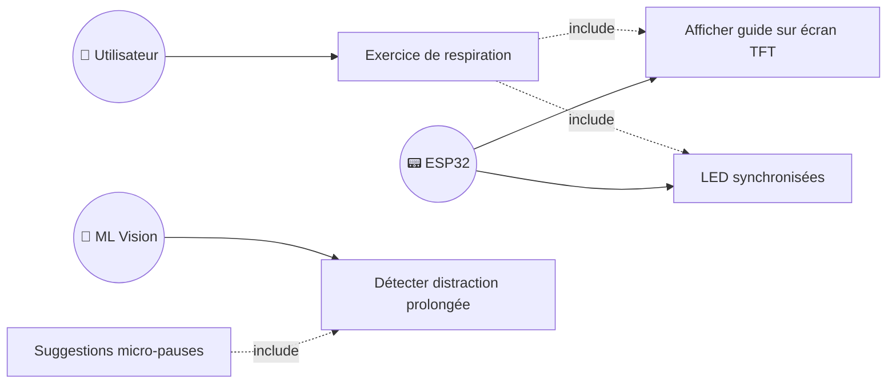
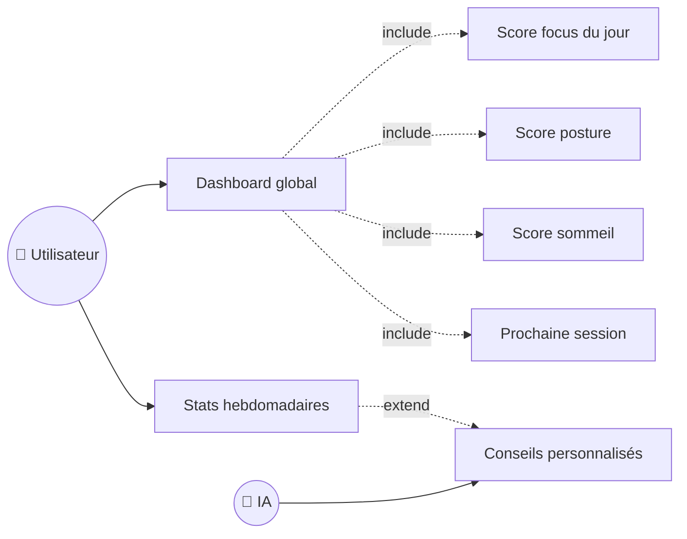

# 📐 Diagrammes de Cas d'Utilisation – Smart Focus & Life Assistant

**Version** : 1.0  
**Date** : 17 Février 2026  
**Phase** : Conception  

---

## 1. Identification des Acteurs

| Acteur | Type | Description |
|--------|------|-------------|
| **Utilisateur** | Principal | Étudiant, professionnel ou enseignant qui interagit avec l'application mobile |
| **Boîtier ESP32** | Secondaire | Dispositif IoT qui capture les données physiques (caméra, capteurs) |
| **Service ML** | Secondaire | Module serveur d'analyse d'images (posture, fatigue, visage) |
| **Système IA** | Secondaire | Module RAG/LLM pour le chatbot et le planning intelligent |
| **API OpenAI** | Externe | Service cloud pour la génération de texte (GPT-3.5/4) |

---

## 2. Diagramme de Cas d'Utilisation Général

```mermaid
graph TB
    %% Acteurs
    User(("👤 Utilisateur"))
    ESP32(("📟 ESP32"))
    IA(("🤖 IA / LLM"))
    ML(("🧠 ML Vision"))

    %% CU Authentification
    subgraph AUTH ["🔐 Authentification"]
        UC1["S'inscrire"]
        UC2["Se connecter"]
        UC3["Gérer le profil"]
    end

    %% CU Focus
    subgraph FOCUS ["🎯 Focus & Concentration"]
        UC4["Démarrer une session de travail"]
        UC5["Consulter le score de focus en temps réel"]
        UC6["Recevoir des alertes de concentration"]
        UC7["Consulter l'historique des sessions"]
    end

    %% CU Planning
    subgraph PLANNING ["📅 Planning Intelligent"]
        UC8["Consulter le planning du jour"]
        UC9["Générer un planning intelligent"]
        UC10["Modifier une session planifiée"]
        UC11["Supprimer une session planifiée"]
    end

    %% CU Chatbot
    subgraph CHATBOT ["💬 Chatbot RAG"]
        UC12["Uploader un document PDF"]
        UC13["Poser une question sur les cours"]
        UC14["Générer un quiz"]
        UC15["Créer des flashcards"]
        UC16["Planifier les révisions"]
    end

    %% CU Posture
    subgraph POSTURE ["🧍 Posture & Ergonomie"]
        UC17["Détecter la posture en temps réel"]
        UC18["Recevoir des alertes posture"]
        UC19["Consulter les statistiques posture"]
        UC20["Recevoir des conseils ergonomiques"]
    end

    %% CU Sommeil
    subgraph SOMMEIL ["🌙 Sommeil & Réveil"]
        UC21["Enregistrer les données de sommeil"]
        UC22["Consulter le score de sommeil"]
        UC23["Configurer le réveil intelligent"]
        UC24["Adapter le planning selon le sommeil"]
    end

    %% CU Stress
    subgraph STRESS ["🧘 Gestion du Stress"]
        UC25["Lancer un exercice de respiration"]
        UC26["Recevoir des suggestions de micro-pauses"]
    end

    %% CU Statistiques
    subgraph STATS ["📊 Statistiques & Conseils"]
        UC27["Consulter le dashboard global"]
        UC28["Voir les statistiques hebdomadaires"]
        UC29["Recevoir des conseils personnalisés"]
    end

    %% Relations Utilisateur
    User --> UC1
    User --> UC2
    User --> UC3
    User --> UC4
    User --> UC5
    User --> UC7
    User --> UC8
    User --> UC9
    User --> UC10
    User --> UC11
    User --> UC12
    User --> UC13
    User --> UC14
    User --> UC15
    User --> UC16
    User --> UC17
    User --> UC19
    User --> UC21
    User --> UC22
    User --> UC23
    User --> UC25
    User --> UC27
    User --> UC28

    %% Relations ESP32
    ESP32 --> UC6
    ESP32 --> UC17
    ESP32 --> UC18
    ESP32 --> UC21

    %% Relations IA
    IA --> UC9
    IA --> UC13
    IA --> UC14
    IA --> UC15
    IA --> UC16
    IA --> UC20
    IA --> UC24
    IA --> UC29

    %% Relations ML
    ML --> UC5
    ML --> UC6
    ML --> UC17
    ML --> UC18
    ML --> UC26
```

---

## 3. Cas d'Utilisation Détaillés par Module

### 3.1 🔐 Module Authentification

| # | Cas d'Utilisation | Acteur(s) | Pré-condition | Scénario Principal | Post-condition |
|---|-------------------|-----------|---------------|---------------------|----------------|
| UC1 | S'inscrire | Utilisateur | Aucun compte existant | 1. Saisir email, mot de passe, nom 2. Valider 3. Compte créé | Compte actif, JWT généré |
| UC2 | Se connecter | Utilisateur | Compte existant | 1. Saisir email/mot de passe 2. Authentification 3. Token JWT retourné | Session active |
| UC3 | Gérer le profil | Utilisateur | Connecté | 1. Accéder aux paramètres 2. Modifier infos/objectifs 3. Sauvegarder | Profil mis à jour |

---

### 3.2 🎯 Module Focus & Concentration

| # | Cas d'Utilisation | Acteur(s) | Pré-condition | Scénario Principal | Post-condition |
|---|-------------------|-----------|---------------|---------------------|----------------|
| UC4 | Démarrer une session | Utilisateur, ESP32, ML | Connecté, boîtier allumé | 1. Cliquer "Démarrer" 2. ESP32 commence capture 3. ML analyse en continu 4. Score affiché temps réel | Session en cours |
| UC5 | Voir score temps réel | Utilisateur | Session active | 1. Dashboard affiche score 2. WebSocket met à jour 3. Graphique en direct | Score visible |
| UC6 | Recevoir alerte focus | ESP32, ML | Score < seuil | 1. Score bas détecté 2. LED rouge sur boîtier 3. Notification mobile | Utilisateur alerté |
| UC7 | Consulter historique | Utilisateur | Sessions passées | 1. Aller dans Statistiques 2. Filtrer par période 3. Voir graphiques | Historique affiché |

---

### 3.3 📅 Module Planning Intelligent

| # | Cas d'Utilisation | Acteur(s) | Pré-condition | Scénario Principal | Post-condition |
|---|-------------------|-----------|---------------|---------------------|----------------|
| UC8 | Consulter le planning | Utilisateur | Connecté | 1. Ouvrir l'écran Planning 2. Voir sessions du jour 3. Naviguer par date | Planning affiché |
| UC9 | Générer planning IA | Utilisateur, IA | Connecté, données disponibles | 1. Cliquer "Générer" 2. IA analyse patterns 3. Créneaux optimisés proposés 4. Utilisateur valide | Planning créé |
| UC10 | Modifier une session | Utilisateur | Session existante | 1. Sélectionner session 2. Modifier horaire/sujet 3. Sauvegarder | Session modifiée |
| UC11 | Supprimer une session | Utilisateur | Session existante | 1. Sélectionner session 2. Confirmer suppression | Session supprimée |

---

### 3.4 💬 Module Chatbot RAG

| # | Cas d'Utilisation | Acteur(s) | Pré-condition | Scénario Principal | Post-condition |
|---|-------------------|-----------|---------------|---------------------|----------------|
| UC12 | Uploader un PDF | Utilisateur, IA | Connecté | 1. Sélectionner fichier PDF 2. Upload vers serveur 3. Parsing + chunking 4. Embeddings générés 5. Stockage dans ChromaDB | Document indexé |
| UC13 | Poser une question | Utilisateur, IA, OpenAI | Document(s) uploadé(s) | 1. Taper la question 2. Recherche sémantique 3. Chunks pertinents trouvés 4. LLM génère la réponse 5. Réponse affichée avec sources | Réponse affichée |
| UC14 | Générer un quiz | Utilisateur, IA | Document(s) uploadé(s) | 1. Sélectionner sujet/document 2. IA génère questions QCM 3. Quiz interactif affiché | Quiz généré |
| UC15 | Créer des flashcards | Utilisateur, IA | Document(s) uploadé(s) | 1. Sélectionner contenu 2. IA extrait concepts clés 3. Flashcards générées | Flashcards créées |
| UC16 | Planifier révisions | Utilisateur, IA | Documents + deadlines | 1. Définir dates d'examens 2. IA planifie les révisions 3. Sessions espacées créées | Révisions planifiées |

---

### 3.5 🧍 Module Posture & Ergonomie

| # | Cas d'Utilisation | Acteur(s) | Pré-condition | Scénario Principal | Post-condition |
|---|-------------------|-----------|---------------|---------------------|----------------|
| UC17 | Détecter la posture | ESP32, ML | Session active | 1. Caméra capture image 2. MediaPipe analyse la posture 3. Résultat envoyé à l'app | Posture évaluée |
| UC18 | Recevoir alerte posture | ESP32, Utilisateur | Mauvaise posture détectée | 1. ML détecte dos courbé 2. LED orange sur boîtier 3. Vibration douce 4. Notification mobile | Utilisateur alerté |
| UC19 | Voir stats posture | Utilisateur | Données collectées | 1. Ouvrir Statistiques 2. Voir % bonne posture 3. Évolution par jour/semaine | Stats affichées |
| UC20 | Recevoir conseils | Utilisateur, IA | Historique posture | 1. Analyse patterns 2. IA génère conseils 3. Recommandations affichées | Conseils reçus |

---

### 3.6 🌙 Module Sommeil & Réveil

| # | Cas d'Utilisation | Acteur(s) | Pré-condition | Scénario Principal | Post-condition |
|---|-------------------|-----------|---------------|---------------------|----------------|
| UC21 | Enregistrer sommeil | ESP32 | Boîtier actif la nuit | 1. Capteur pression détecte 2. Micro analyse sons 3. Données envoyées au serveur | Données enregistrées |
| UC22 | Score sommeil | Utilisateur | Données de nuit | 1. Ouvrir dashboard matin 2. Score sommeil affiché 3. Détails (léger/profond) | Score consulté |
| UC23 | Réveil intelligent | Utilisateur, ESP32 | Réveil configuré | 1. Phase de sommeil léger détectée 2. LED progressives 3. Son doux croissant 4. Vibration légère | Utilisateur réveillé |
| UC24 | Adapter planning | IA | Score sommeil disponible | 1. Mauvais score détecté 2. IA ajuste planning 3. Pauses plus fréquentes 4. Sessions plus courtes | Planning adapté |

---

### 3.7 🧘 Module Gestion du Stress

| # | Cas d'Utilisation | Acteur(s) | Pré-condition | Scénario Principal | Post-condition |
|---|-------------------|-----------|---------------|---------------------|----------------|
| UC25 | Exercice respiration | Utilisateur, ESP32 | Session active | 1. Cliquer "Respiration" ou auto-déclenché 2. Guide affiché sur TFT 3. LEDs synchronisées 4. 3-5 min d'exercice | Stress réduit |
| UC26 | Micro-pauses | ML, Utilisateur | Distraction détectée | 1. ML détecte distraction > 5min 2. Suggestion de pause 3. Activité courte proposée | Utilisateur reposé |

---

### 3.8 📊 Module Dashboard & Statistiques

| # | Cas d'Utilisation | Acteur(s) | Pré-condition | Scénario Principal | Post-condition |
|---|-------------------|-----------|---------------|---------------------|----------------|
| UC27 | Dashboard global | Utilisateur | Connecté | 1. Ouvrir l'app 2. Voir scores du jour 3. Alertes récentes 4. Prochaine session | Vue d'ensemble |
| UC28 | Stats hebdomadaires | Utilisateur | Données collectées | 1. Ouvrir Statistiques 2. Graphiques par semaine 3. Tendances et progrès | Progrès visualisés |
| UC29 | Conseils personnalisés | Utilisateur, IA | Historique suffisant | 1. IA analyse les patterns 2. Détecte heures productives 3. Génère recommandations | Conseils affichés |

---

## 4. Matrice Acteurs / Cas d'Utilisation

| Cas d'Utilisation | 👤 Utilisateur | 📟 ESP32 | 🧠 ML Vision | 🤖 IA/LLM | ☁️ OpenAI |
|-------------------|:-:|:-:|:-:|:-:|:-:|
| S'inscrire | ✅ | | | | |
| Se connecter | ✅ | | | | |
| Gérer profil | ✅ | | | | |
| Démarrer session focus | ✅ | ✅ | ✅ | | |
| Voir score temps réel | ✅ | | ✅ | | |
| Alerte concentration | ✅ | ✅ | ✅ | | |
| Historique sessions | ✅ | | | | |
| Consulter planning | ✅ | | | | |
| Générer planning IA | ✅ | | | ✅ | |
| Modifier session | ✅ | | | | |
| Supprimer session | ✅ | | | | |
| Uploader PDF | ✅ | | | ✅ | |
| Poser question | ✅ | | | ✅ | ✅ |
| Générer quiz | ✅ | | | ✅ | ✅ |
| Créer flashcards | ✅ | | | ✅ | ✅ |
| Planifier révisions | ✅ | | | ✅ | |
| Détecter posture | | ✅ | ✅ | | |
| Alerte posture | ✅ | ✅ | ✅ | | |
| Stats posture | ✅ | | | | |
| Conseils ergonomiques | ✅ | | | ✅ | |
| Enregistrer sommeil | | ✅ | | | |
| Score sommeil | ✅ | | | | |
| Réveil intelligent | ✅ | ✅ | | | |
| Adapter planning/sommeil | | | | ✅ | |
| Exercice respiration | ✅ | ✅ | | | |
| Micro-pauses | ✅ | | ✅ | | |
| Dashboard global | ✅ | | | | |
| Stats hebdomadaires | ✅ | | | | |
| Conseils personnalisés | ✅ | | | ✅ | ✅ |

---

## 5. Résumé des Cas d'Utilisation

| Module | Nombre de CU | Priorité |
|--------|:---:|:---:|
| 🔐 Authentification | 3 | Haute |
| 🎯 Focus & Concentration | 4 | Haute |
| 📅 Planning Intelligent | 4 | Haute |
| 💬 Chatbot RAG | 5 | Haute |
| 🧍 Posture & Ergonomie | 4 | Moyenne |
| 🌙 Sommeil & Réveil | 4 | Moyenne |
| 🧘 Gestion du Stress | 2 | Basse |
| 📊 Dashboard & Stats | 3 | Haute |
| **Total** | **29** | |

---

**Validé par** : _________________________  
**Date de validation** : _________________________
