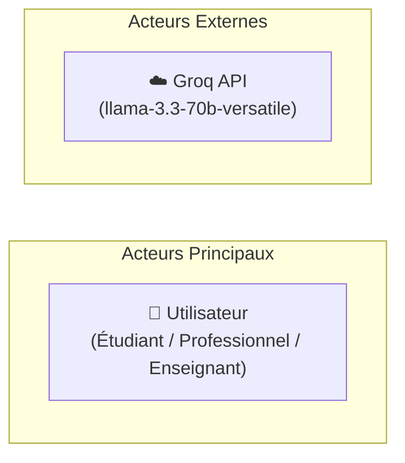
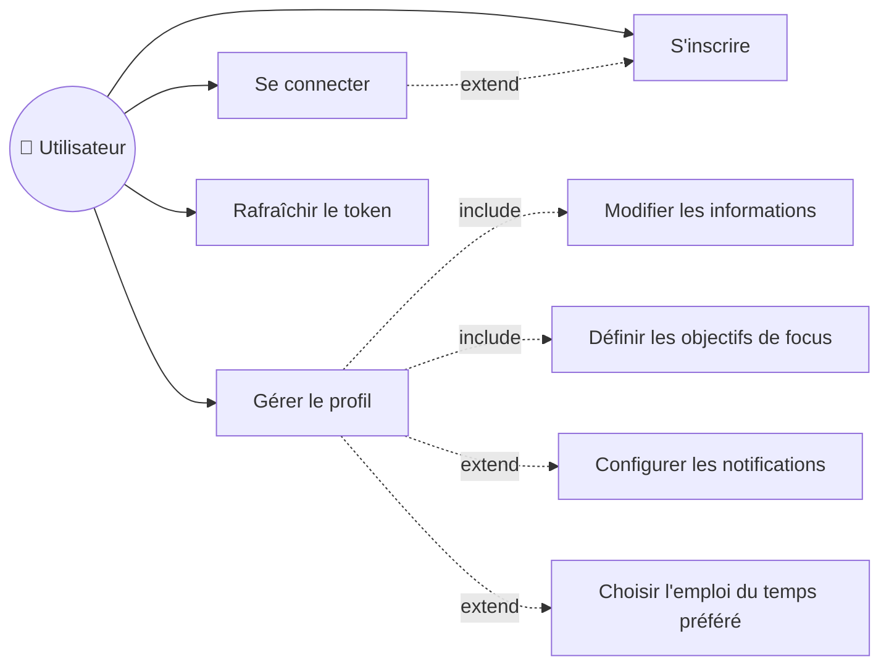
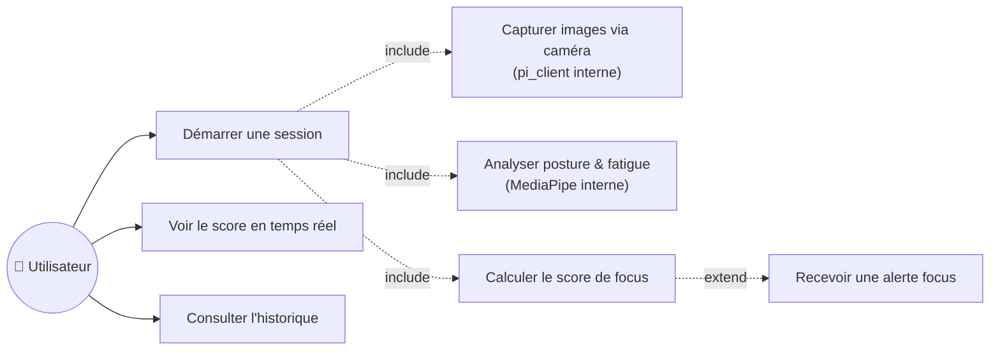
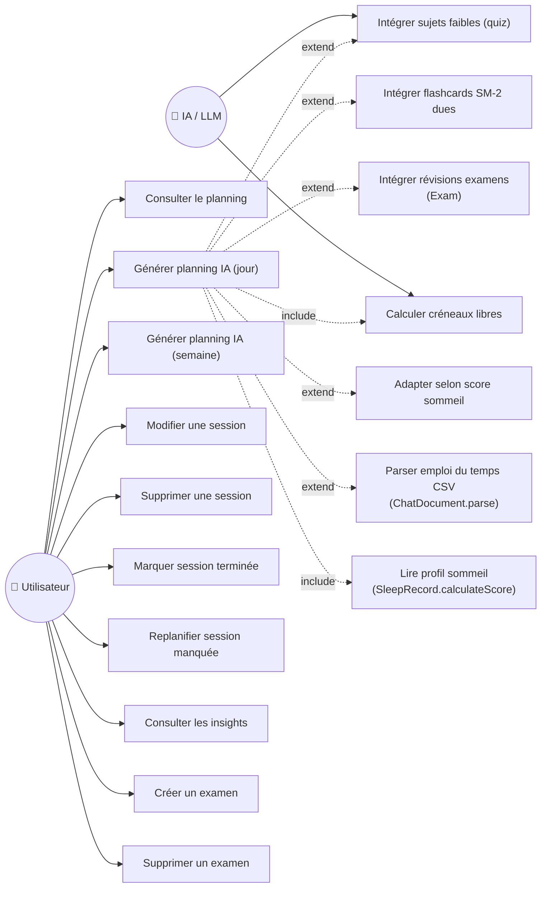
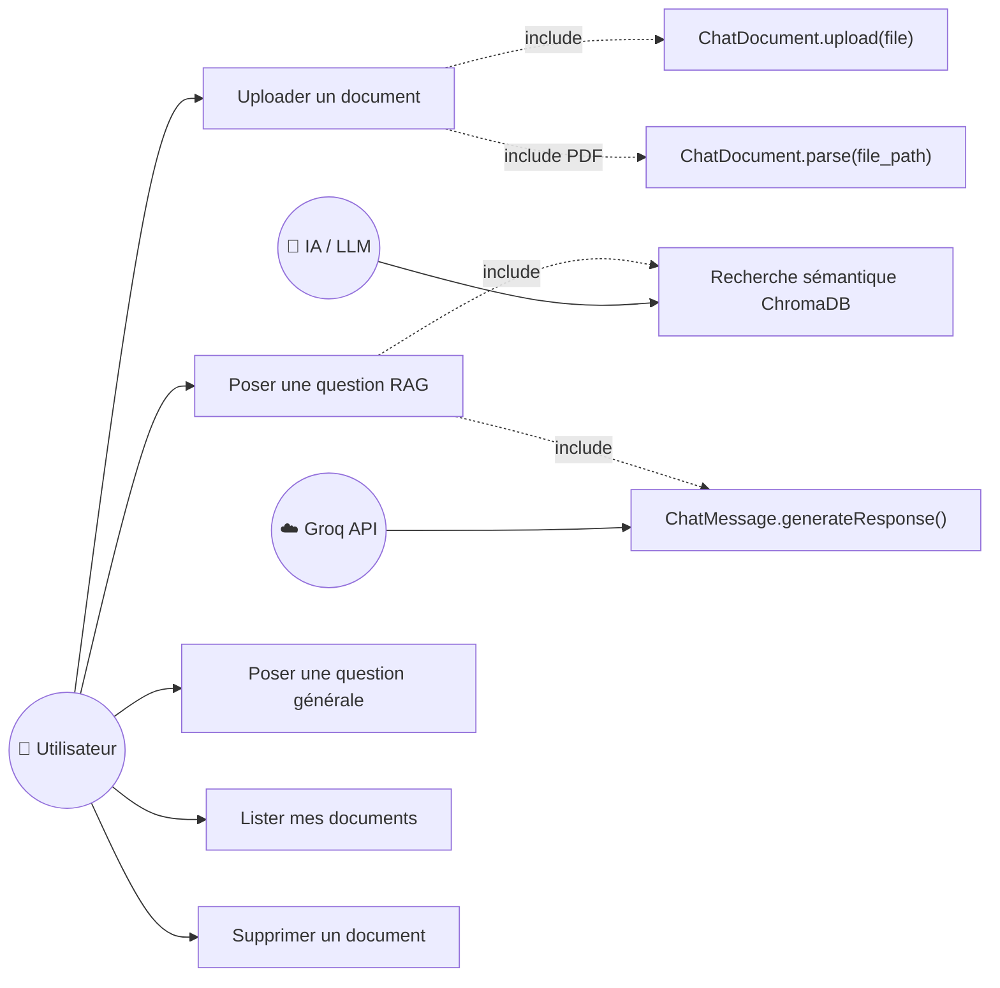
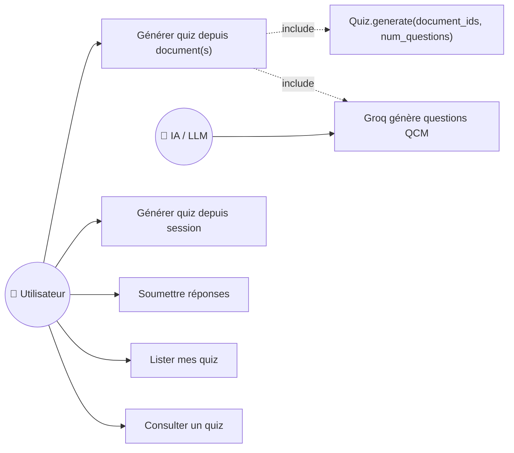
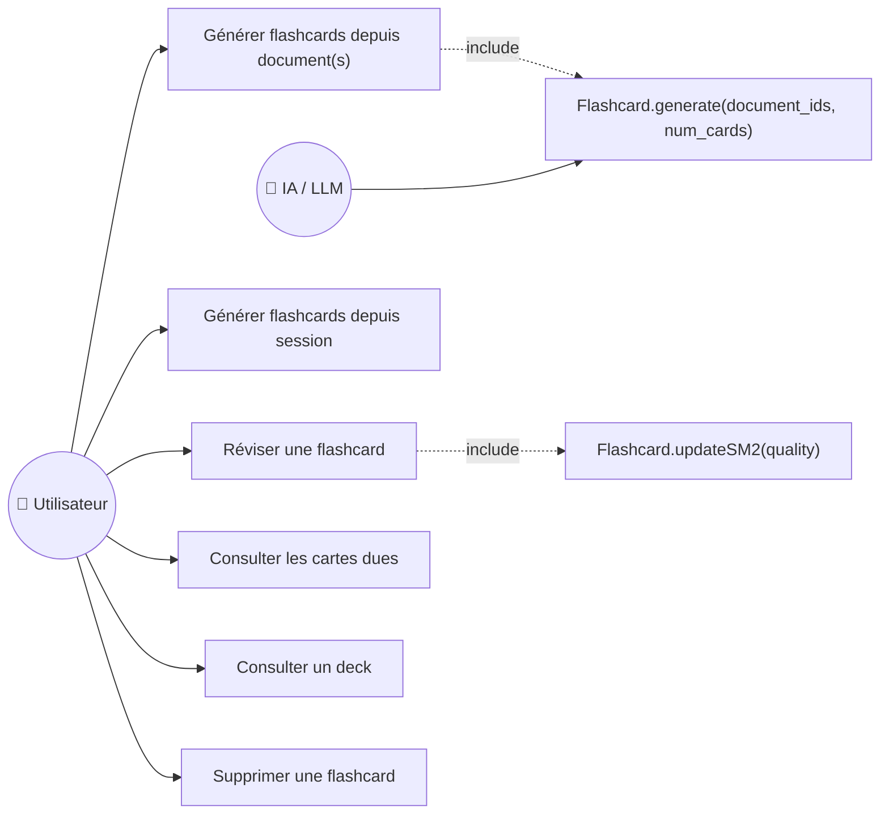
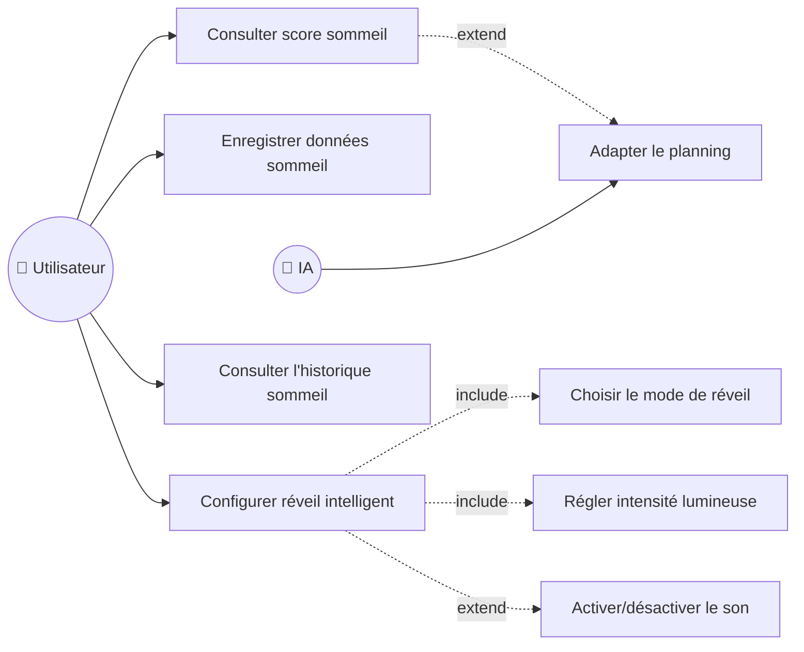
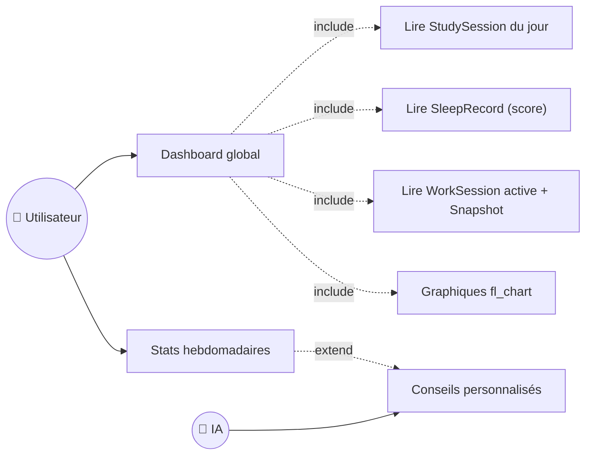

# 📐 Diagrammes de Cas d'Utilisation – Smart Focus & Life Assistant

**Version** : 3.0  
**Date** : 12 Mai 2026  
**Phase** : Conception  
**Approche** : BCE (Boundary – Control – Entity)

---

## 1. Identification des Acteurs

```mermaid
graph LR
    subgraph Acteurs Principaux
        U["👤 Utilisateur<br/>(Étudiant / Professionnel / Enseignant)"]
    end

    subgraph Acteurs Externes
        API_EXT["☁️ Groq API<br/>(llama-3.3-70b-versatile)"]
    end
```

| Acteur | Type | Description |
|--------|------|-------------|
| **Utilisateur** | Principal | Étudiant, professionnel ou enseignant qui interagit avec l'application mobile |
| **Groq API** | Externe | Service cloud d'inférence LLM utilisé pour le chatbot RAG, la génération de quiz/flashcards et la planification intelligente |

> **Note :** Le pi_client (Raspberry Pi + MediaPipe + OpenCV), le pipeline ML et les services internes sont des **composants du système**, non des acteurs.

---

## 2. Convention BCE – Mapping des Classes

L'architecture BCE (Boundary – Control – Entity) organise les responsabilités en trois couches. Les classes `<<Control>>` sont celles définies dans le diagramme de classes (`class_sprint3.puml`).

| Stéréotype | Rôle | Classes du diagramme de classes |
|:---:|--------|---------|
| `<<Boundary>>` | Interface utilisateur / point d'entrée | Interfaces Flutter (écrans), pi_client |
| `<<Control>>` | Logique métier — classes avec méthodes | `User`, `UserProfile`, `WorkSession`, `Snapshot`, `FocusEvent`, `StudySession`, `Exam`, `ChatDocument`, `ChatMessage`, `Quiz`, `QuizQuestion`, `Flashcard`, `SleepRecord`, `SmartAlarm` |
| `<<Entity>>` | Données persistantes | Base de Données PostgreSQL, ChromaDB |

### Mapping par module

| Module | `<<Boundary>>` | `<<Control>>` | `<<Entity>>` |
|--------|---------------|--------------|-------------|
| 🔐 Authentification | Interface inscription / connexion / paramètres | `User`, `UserProfile` | PostgreSQL |
| 👁️ Vision & Monitoring | pi_client, Interface mobile Dashboard | `WorkSession`, `Snapshot`, `FocusEvent` | PostgreSQL |
| 📅 Planning | Interface de planning | `StudySession`, `Exam`, `SleepRecord` | PostgreSQL |
| 💬 Chatbot RAG | Interface chatbot | `ChatDocument`, `ChatMessage` | PostgreSQL, ChromaDB |
| 🧠 Quiz | Interface quiz | `Quiz`, `QuizQuestion` | PostgreSQL |
| 🃏 Flashcards | Interface flashcards | `Flashcard` | PostgreSQL |
| 🌙 Sommeil & Réveil | Interface sommeil | `SleepRecord`, `SmartAlarm` | PostgreSQL |
| 📊 Dashboard & Stats | Interface dashboard | `StudySession`, `SleepRecord`, `WorkSession`, `Snapshot` | PostgreSQL |

---

## 3. Diagramme de Cas d'Utilisation Général

```mermaid
graph TB
    %% Acteurs
    User(("👤 Utilisateur"))
    GroqAPI(("🤖 Groq API"))

    %% CU Authentification
    subgraph AUTH ["🔐 Authentification"]
        UC1["S'inscrire"]
        UC2["Se connecter"]
        UC3["Gérer le profil"]
        UC3r["Rafraîchir le token"]
    end

    %% CU Focus
    subgraph FOCUS ["🎯 Focus & Concentration"]
        UC4["Démarrer une session de travail"]
        UC5["Consulter le score de focus en temps réel"]
        UC6["Recevoir des alertes de concentration"]
        UC7["Consulter l'historique des sessions"]
    end

    %% CU Planning
    subgraph PLANNING ["📅 Planning Intelligent"]
        UC8["Consulter le planning du jour"]
        UC9["Générer un planning IA (jour)"]
        UC9w["Générer un planning IA (semaine)"]
        UC10["Modifier une session planifiée"]
        UC11["Supprimer une session planifiée"]
        UC10c["Marquer une session terminée"]
        UC10r["Replanifier une session manquée"]
        UC30["Consulter les insights planning"]
        UC31["Créer un examen"]
        UC32["Supprimer un examen"]
    end

    %% CU Chatbot
    subgraph CHATBOT ["💬 Chatbot RAG"]
        UC12["Uploader un document (PDF ou CSV)"]
        UC13["Poser une question sur les cours"]
        UC13g["Poser une question générale"]
        UC12l["Lister mes documents"]
        UC12d["Supprimer un document"]
    end

    %% CU Quiz
    subgraph QUIZ ["🧠 Quiz"]
        UC14["Générer un quiz depuis un document"]
        UC14s["Générer un quiz depuis une session"]
        UC14sub["Soumettre les réponses d'un quiz"]
        UC14l["Lister mes quiz"]
    end

    %% CU Flashcards
    subgraph FLASHCARDS ["🃏 Flashcards SM-2"]
        UC15["Générer des flashcards"]
        UC15s["Générer des flashcards depuis une session"]
        UC15r["Réviser une flashcard (SM-2)"]
        UC15d["Consulter les cartes dues"]
        UC15del["Supprimer une flashcard"]
    end

    %% CU Sommeil
    subgraph SOMMEIL ["🌙 Sommeil & Réveil"]
        UC21["Enregistrer les données de sommeil"]
        UC22["Consulter le score de sommeil"]
        UC22h["Consulter l'historique sommeil"]
        UC23["Configurer le réveil intelligent"]
        UC24["Adapter le planning selon le sommeil"]
    end

    %% CU Statistiques
    subgraph STATS ["📊 Statistiques & Conseils"]
        UC27["Consulter le dashboard global"]
        UC28["Voir les statistiques hebdomadaires"]
        UC29["Recevoir des conseils personnalisés"]
    end

    %% Relations Utilisateur
    User --> UC1
    User --> UC2
    User --> UC3
    User --> UC3r
    User --> UC4
    User --> UC5
    User --> UC7
    User --> UC8
    User --> UC9
    User --> UC9w
    User --> UC10
    User --> UC11
    User --> UC10c
    User --> UC10r
    User --> UC30
    User --> UC31
    User --> UC32
    User --> UC12
    User --> UC13
    User --> UC13g
    User --> UC12l
    User --> UC12d
    User --> UC14
    User --> UC14s
    User --> UC14sub
    User --> UC14l
    User --> UC15
    User --> UC15s
    User --> UC15r
    User --> UC15d
    User --> UC15del
    User --> UC21
    User --> UC22
    User --> UC22h
    User --> UC23
    User --> UC27
    User --> UC28

    %% Relations Groq API (acteur externe)
    GroqAPI --> UC9
    GroqAPI --> UC9w
    GroqAPI --> UC13
    GroqAPI --> UC13g
    GroqAPI --> UC14
    GroqAPI --> UC14s
    GroqAPI --> UC15
    GroqAPI --> UC15s
    GroqAPI --> UC24
    GroqAPI --> UC29
    GroqAPI --> UC30
```

---

## 4. Cas d'Utilisation Détaillés par Module

### 4.1 🔐 Module Authentification

```mermaid
graph LR
    User(("👤 Utilisateur"))

    UC1["S'inscrire"]
    UC2["Se connecter"]
    UC3["Gérer le profil"]
    UC3r["Rafraîchir le token"]
    UC3a["Modifier les informations"]
    UC3b["Définir les objectifs de focus"]
    UC3c["Configurer les notifications"]
    UC3d["Choisir l'emploi du temps préféré"]

    User --> UC1
    User --> UC2
    User --> UC3
    User --> UC3r

    UC3 -.->|include| UC3a
    UC3 -.->|include| UC3b
    UC3 -.->|extend| UC3c
    UC3 -.->|extend| UC3d

    UC2 -.->|extend| UC1
```

**Classes BCE impliquées :**

| Stéréotype | Classe | Méthodes utilisées |
|:---:|---|---|
| `<<Boundary>>` | Interface d'inscription / connexion / paramètres | — |
| `<<Control>>` | `User` | `register()`, `login()`, `updateProfile()`, `getToken()` |
| `<<Control>>` | `UserProfile` | `getPreferences()`, `updateGoals()` |
| `<<Entity>>` | Base de Données (PostgreSQL) | — |

| # | Cas d'Utilisation | Acteur(s) | Pré-condition | Scénario Principal | Post-condition |
|---|-------------------|-----------|---------------|---------------------|----------------|
| UC1 | S'inscrire | Utilisateur | Aucun compte existant | 1. Saisir email, mot de passe, nom, rôle 2. `User.register(email, password, nom, rôle)` 3. `User.getToken()` → JWT retourné | Compte actif, JWT access + refresh |
| UC2 | Se connecter | Utilisateur | Compte existant et actif | 1. Saisir email/mot de passe 2. `User.login(email, password)` 3. `User.getToken()` → Token JWT retourné | Session active |
| UC3 | Gérer le profil | Utilisateur | Connecté | 1. `UserProfile.getPreferences(userId)` 2. Modifier `daily_focus_goal`, `preferred_schedule`, `notif_enabled` 3. `User.updateProfile()` + `UserProfile.updateGoals()` | Profil mis à jour |
| UC3r | Rafraîchir le token | Utilisateur | Refresh token valide | 1. Envoyer refresh_token 2. `User.getToken()` → Nouveau couple access + refresh | Nouvelle session |

---

### 4.2 🎯 Module Focus & Concentration

```mermaid
graph LR
    User(("👤 Utilisateur"))

    UC4["Démarrer une session"]
    UC5["Voir le score en temps réel"]
    UC6["Recevoir une alerte focus"]
    UC7["Consulter l'historique"]

    UC4a["Capturer images via caméra\n(pi_client interne)"]
    UC4b["Analyser posture & fatigue\n(MediaPipe interne)"]
    UC4c["Calculer le score de focus"]

    User --> UC4
    User --> UC5
    User --> UC7

    UC4 -.->|include| UC4a
    UC4 -.->|include| UC4b
    UC4 -.->|include| UC4c

    UC4c -.->|extend| UC6
```

**Classes BCE impliquées :**

| Stéréotype | Classe | Méthodes utilisées |
|:---:|---|---|
| `<<Boundary>>` | pi_client, Interface mobile Dashboard | — |
| `<<Control>>` | `WorkSession` | `create()`, `finalize()`, `claimUser()` |
| `<<Control>>` | `Snapshot` | `ingest()` |
| `<<Control>>` | `FocusEvent` | `ingest()` |
| `<<Entity>>` | Base de Données (PostgreSQL) | — |

| # | Cas d'Utilisation | Acteur(s) | Pré-condition | Scénario Principal | Post-condition |
|---|-------------------|-----------|---------------|---------------------|----------------|
| UC4 | Démarrer une session | Utilisateur | Connecté, pi_client actif | 1. pi_client appelle `WorkSession.create(session_id, metadata)` 2. `WorkSession.claimUser(user_id)` 3. pi_client envoie `Snapshot.ingest(session_id, scores)` en boucle (~500ms) | Session en cours |
| UC5 | Voir score temps réel | Utilisateur | Session active | 1. Mobile interroge le dernier `Snapshot` (polling 3-5s) 2. Affiche `global_focus_score`, `attention_score`, `posture_score` | Score visible |
| UC6 | Recevoir alerte focus | Utilisateur | Score < seuil | 1. pi_client appelle `FocusEvent.ingest(session_id, event_type, level, description)` 2. Notification mobile | Utilisateur alerté |
| UC7 | Consulter historique | Utilisateur | Sessions passées | 1. Lister `WorkSession` passées 2. Voir graphiques scores | Historique affiché |

---

### 4.3 📅 Module Planning Intelligent

```mermaid
graph LR
    User(("👤 Utilisateur"))
    IA(("🤖 IA / LLM"))

    UC8["Consulter le planning"]
    UC9["Générer planning IA (jour)"]
    UC9w["Générer planning IA (semaine)"]
    UC10["Modifier une session"]
    UC11["Supprimer une session"]
    UC10c["Marquer session terminée"]
    UC10r["Replanifier session manquée"]
    UC30["Consulter les insights"]
    UC31["Créer un examen"]
    UC32["Supprimer un examen"]

    UC9a["Lire profil sommeil\n(SleepRecord.calculateScore)"]
    UC9b["Parser emploi du temps CSV\n(ChatDocument.parse)"]
    UC9c["Calculer créneaux libres"]
    UC9d["Adapter selon score sommeil"]
    UC9e["Intégrer révisions examens\n(Exam)"]
    UC9f["Intégrer flashcards SM-2 dues"]
    UC9g["Intégrer sujets faibles (quiz)"]

    User --> UC8
    User --> UC9
    User --> UC9w
    User --> UC10
    User --> UC11
    User --> UC10c
    User --> UC10r
    User --> UC30
    User --> UC31
    User --> UC32

    IA --> UC9c
    IA --> UC9g

    UC9 -.->|include| UC9a
    UC9 -.->|include| UC9c
    UC9 -.->|extend| UC9b
    UC9 -.->|extend| UC9d
    UC9 -.->|extend| UC9e
    UC9 -.->|extend| UC9f
    UC9 -.->|extend| UC9g
```

**Classes BCE impliquées :**

| Stéréotype | Classe | Méthodes utilisées |
|:---:|---|---|
| `<<Boundary>>` | Interface de planning | — |
| `<<Control>>` | `StudySession` | `create()`, `update()`, `complete()` |
| `<<Control>>` | `Exam` | `create()`, `delete()` |
| `<<Control>>` | `SleepRecord` | `calculateScore()` |
| `<<Control>>` | `ChatDocument` | `parse()` |
| `<<Entity>>` | Base de Données (PostgreSQL) | — |

| # | Cas d'Utilisation | Acteur(s) | Pré-condition | Scénario Principal | Post-condition |
|---|-------------------|-----------|---------------|---------------------|----------------|
| UC8 | Consulter le planning | Utilisateur | Connecté | 1. Lire `StudySession` (date) 2. Afficher sessions du jour | Planning affiché |
| UC9 | Générer planning IA (jour) | Utilisateur, IA | Connecté | 1. `SleepRecord.calculateScore()` → profil sommeil 2. Si CSV : `ChatDocument.parse()` → créneaux cours 3. Calcul créneaux libres + budgets adaptatifs 4. `StudySession.create()` pour chaque session générée | Planning journée créé |
| UC9w | Générer planning IA (semaine) | Utilisateur, IA | Idem UC9 | 1. Boucle lundi→dimanche : appliquer UC9 3. Week-end : sweep hebdomadaire des matières | Planning semaine créé |
| UC10 | Modifier une session | Utilisateur | Session existante | 1. `StudySession.update(id, modifications)` | Session modifiée |
| UC10c | Marquer session terminée | Utilisateur | Session en cours | 1. `StudySession.complete(id)` → status="completed", completed_at | Session terminée |
| UC10r | Replanifier session manquée | Utilisateur | Session expirée/annulée | 1. Chercher créneau libre (J ou J+1) 2. `StudySession.create()` nouvelle session 3. Ancienne session annulée | Session replanifiée |
| UC11 | Supprimer une session | Utilisateur | Session existante | 1. Supprimer `StudySession` (id) | Session supprimée |
| UC30 | Consulter les insights | Utilisateur | Données historiques | 1. Lire `StudySession` + `SleepRecord` + `Quiz` (période) 2. Calcul taux complétion, corrélation sommeil/productivité, recommandation | Insights affichés |
| UC31 | Créer un examen | Utilisateur | Connecté | 1. `Exam.create(titre, exam_date, document_id?)` | Examen créé |
| UC32 | Supprimer un examen | Utilisateur | Examen existant | 1. `Exam.delete(id)` | Examen supprimé |

**Logique d'adaptation au sommeil (`SleepRecord.calculateScore()`) :**

| Score sommeil | Durée max session | Pause | Nb max sessions | Priorité |
|:---:|:---:|:---:|:---:|:---:|
| ≥ 80 (bien reposé) | 50 min | 10 min | 6 | high |
| 50–79 (moyen) | 35 min | 15 min | 4 | medium |
| < 50 (insuffisant) | 25 min | 20 min | 2 | low |

---

### 4.4 💬 Module Chatbot RAG

```mermaid
graph LR
    User(("👤 Utilisateur"))
    IA(("🤖 IA / LLM"))
    API(("☁️ Groq API"))

    UC12["Uploader un document"]
    UC13["Poser une question RAG"]
    UC13g["Poser une question générale"]
    UC12l["Lister mes documents"]
    UC12d["Supprimer un document"]

    UC12a["ChatDocument.upload(file)"]
    UC12b["ChatDocument.parse(file_path)"]
    UC13a["ChatMessage.generateResponse()"]
    UC13b["Recherche sémantique ChromaDB"]

    User --> UC12
    User --> UC13
    User --> UC13g
    User --> UC12l
    User --> UC12d

    UC12 -.->|include| UC12a
    UC12 -.->|include PDF| UC12b

    UC13 -.->|include| UC13b
    UC13 -.->|include| UC13a

    IA --> UC13b
    API --> UC13a
```

**Classes BCE impliquées :**

| Stéréotype | Classe | Méthodes utilisées |
|:---:|---|---|
| `<<Boundary>>` | Interface chatbot | — |
| `<<Control>>` | `ChatDocument` | `upload()`, `parse()`, `delete()` |
| `<<Control>>` | `ChatMessage` | `send()`, `generateResponse()` |
| `<<Entity>>` | Base de Données (PostgreSQL), ChromaDB | — |

| # | Cas d'Utilisation | Acteur(s) | Pré-condition | Scénario Principal | Post-condition |
|---|-------------------|-----------|---------------|---------------------|----------------|
| UC12 | Uploader un document | Utilisateur | Connecté | **PDF :** 1. `ChatDocument.upload(file)` → sauvegarder fichier 2. `ChatDocument.parse(file_path)` → chunks + embeddings → ChromaDB  **CSV :** 1. `ChatDocument.upload(file)` → valider colonnes (week, day, start, end, subject) | Document indexé (PDF) ou template validé (CSV) |
| UC13 | Poser une question RAG | Utilisateur, Groq API | Document(s) uploadé(s) | 1. `ChatMessage.send(question, document_ids)` 2. `ChatMessage.generateResponse()` → recherche ChromaDB → Groq → réponse + sources | Réponse affichée avec citations |
| UC13g | Question générale | Utilisateur, Groq API | Connecté | 1. `ChatMessage.send(question)` (sans document_ids) 2. `ChatMessage.generateResponse()` → Groq directement | Réponse IA directe |
| UC12l | Lister mes documents | Utilisateur | Documents existants | 1. Lire liste `ChatDocument` (user_id) | Documents listés |
| UC12d | Supprimer un document | Utilisateur | Document existant | 1. `ChatDocument.delete(id)` → disque + ChromaDB + PostgreSQL | Document entièrement supprimé |

---

### 4.5 🧠 Module Quiz

```mermaid
graph LR
    User(("👤 Utilisateur"))
    IA(("🤖 IA / LLM"))

    UC14["Générer quiz depuis document(s)"]
    UC14s["Générer quiz depuis session"]
    UC14sub["Soumettre réponses"]
    UC14l["Lister mes quiz"]
    UC14g["Consulter un quiz"]

    UC14a["Quiz.generate(document_ids, num_questions)"]
    UC14b["Groq génère questions QCM"]

    User --> UC14
    User --> UC14s
    User --> UC14sub
    User --> UC14l
    User --> UC14g

    UC14 -.->|include| UC14a
    UC14 -.->|include| UC14b

    IA --> UC14b
```

**Classes BCE impliquées :**

| Stéréotype | Classe | Méthodes utilisées |
|:---:|---|---|
| `<<Boundary>>` | Interface quiz | — |
| `<<Control>>` | `Quiz` | `generate()`, `submit()`, `evaluate()` |
| `<<Control>>` | `QuizQuestion` | (créée lors de `Quiz.generate()`) |
| `<<Control>>` | `ChatDocument` | `parse()` (accès ChromaDB) |
| `<<Entity>>` | Base de Données (PostgreSQL) | — |

| # | Cas d'Utilisation | Acteur(s) | Pré-condition | Scénario Principal | Post-condition |
|---|-------------------|-----------|---------------|---------------------|----------------|
| UC14 | Générer quiz depuis document(s) | Utilisateur, Groq API | Document(s) PDF uploadé(s) | 1. `Quiz.generate(document_ids, num_questions)` 2. Groq génère questions QCM (options, correct_index, explanation) 3. `Quiz` + `QuizQuestion` sauvés en DB | Quiz créé, réponses masquées |
| UC14s | Générer quiz depuis session | Utilisateur, IA | Session terminée avec documents liés | 1. Récupérer documents liés à la `StudySession` 2. `Quiz.generate(document_ids, num_questions)` | Quiz de session créé |
| UC14sub | Soumettre réponses | Utilisateur | Quiz non soumis | 1. `Quiz.submit(answers[])` 2. `Quiz.evaluate()` → score, pourcentage, corrections | Quiz complété avec score |
| UC14l | Lister mes quiz | Utilisateur | Quiz existants | 1. Lire liste `Quiz` (user_id) | Liste de quiz |
| UC14g | Consulter un quiz | Utilisateur | Quiz existant | 1. Lire `Quiz` avec ses `QuizQuestion` 2. Si non soumis : correct_index masqué | Quiz affiché |

---

### 4.6 🃏 Module Flashcards SM-2

```mermaid
graph LR
    User(("👤 Utilisateur"))
    IA(("🤖 IA / LLM"))

    UC15["Générer flashcards depuis document(s)"]
    UC15s["Générer flashcards depuis session"]
    UC15r["Réviser une flashcard"]
    UC15d["Consulter les cartes dues"]
    UC15dk["Consulter un deck"]
    UC15del["Supprimer une flashcard"]

    UC15a["Flashcard.generate(document_ids, num_cards)"]
    UC15b["Flashcard.updateSM2(quality)"]

    User --> UC15
    User --> UC15s
    User --> UC15r
    User --> UC15d
    User --> UC15dk
    User --> UC15del

    UC15 -.->|include| UC15a
    UC15r -.->|include| UC15b

    IA --> UC15a
```

**Classes BCE impliquées :**

| Stéréotype | Classe | Méthodes utilisées |
|:---:|---|---|
| `<<Boundary>>` | Interface flashcards | — |
| `<<Control>>` | `Flashcard` | `generate()`, `review()`, `updateSM2()` |
| `<<Control>>` | `ChatDocument` | `parse()` (accès ChromaDB) |
| `<<Entity>>` | Base de Données (PostgreSQL) | — |

| # | Cas d'Utilisation | Acteur(s) | Pré-condition | Scénario Principal | Post-condition |
|---|-------------------|-----------|---------------|---------------------|----------------|
| UC15 | Générer flashcards depuis document(s) | Utilisateur, Groq API | Document(s) PDF uploadé(s) | 1. `Flashcard.generate(document_ids, num_cards)` 2. Groq extrait concepts clés (front, back) 3. Flashcards créées : `ease_factor=2.5`, `interval=1`, `next_review=maintenant` | Deck de flashcards créé |
| UC15s | Générer flashcards depuis session | Utilisateur, IA | Session terminée avec documents | 1. Récupérer documents liés à la `StudySession` 2. `Flashcard.generate(document_ids, num_cards)` | Deck de session créé |
| UC15r | Réviser une flashcard | Utilisateur | Carte due | 1. `Flashcard.review(card_id, quality)` (quality: 0–5) 2. `Flashcard.updateSM2(quality)` → `repetitions`, `ease_factor`, `interval`, `next_review` | Prochaine révision planifiée |
| UC15d | Consulter cartes dues | Utilisateur | Flashcards existantes | 1. Lire `Flashcard` avec `next_review ≤ maintenant` | Cartes dues listées |
| UC15dk | Consulter un deck | Utilisateur | Document existant | 1. Lire `Flashcard` par document ou par session | Deck affiché |
| UC15del | Supprimer une flashcard | Utilisateur | Carte existante | 1. Supprimer `Flashcard` (id) | Carte supprimée |

**Algorithme SM-2 (`Flashcard.updateSM2()`) :**

| Quality (0–5) | Signification | Effet |
|:---:|---|---|
| 0–2 | Échec (blackout / incorrect) | Reset : `repetitions=0`, `interval=1` |
| 3–5 | Correct (difficile → parfait) | `interval = interval × ease_factor` ; `ease_factor` ajusté |

---

### 4.7 🌙 Module Sommeil & Réveil

```mermaid
graph LR
    User(("👤 Utilisateur"))
    IA(("🤖 IA"))

    UC21["Enregistrer données sommeil"]
    UC22["Consulter score sommeil"]
    UC22h["Consulter l'historique sommeil"]
    UC23["Configurer réveil intelligent"]
    UC24["Adapter le planning"]

    UC23a["Choisir le mode de réveil"]
    UC23b["Régler intensité lumineuse"]
    UC23c["Activer/désactiver le son"]

    User --> UC21
    User --> UC22
    User --> UC22h
    User --> UC23

    UC23 -.->|include| UC23a
    UC23 -.->|include| UC23b
    UC23 -.->|extend| UC23c

    UC22 -.->|extend| UC24
    IA --> UC24
```

**Classes BCE impliquées :**

| Stéréotype | Classe | Méthodes utilisées |
|:---:|---|---|
| `<<Boundary>>` | Interface sommeil / réveil | — |
| `<<Control>>` | `SleepRecord` | `record()`, `calculateScore()` |
| `<<Control>>` | `SmartAlarm` | `configure()`, `trigger()`, `snooze()` |
| `<<Entity>>` | Base de Données (PostgreSQL) | — |

| # | Cas d'Utilisation | Acteur(s) | Pré-condition | Scénario Principal | Post-condition |
|---|-------------------|-----------|---------------|---------------------|----------------|
| UC21 | Enregistrer sommeil | Utilisateur | Connecté | 1. `SleepRecord.record(user_id, sleep_start, sleep_end)` 2. `SleepRecord.calculateScore()` → sleep_score (0–100) | Nuit enregistrée avec score |
| UC22 | Score sommeil | Utilisateur | Données de nuit | 1. Agréger `SleepRecord` (avg_hours, score_avg, trend) | Stats consultées |
| UC22h | Historique sommeil | Utilisateur | Nuits enregistrées | 1. Lire liste `SleepRecord` (user_id, limit=30) | Historique affiché |
| UC23 | Réveil intelligent | Utilisateur | Connecté | 1. `SmartAlarm.configure(alarm_time, wake_mode, light_intensity, sound_enabled)` 2. À l'heure : `SmartAlarm.trigger()` → lumière + son progressif 3. Si besoin : `SmartAlarm.snooze()` | Alarme configurée et active |
| UC24 | Adapter planning | IA | Score sommeil disponible | 1. `SleepRecord.calculateScore()` → profil sommeil 2. `StudySession.create()` avec durées/pauses adaptées | Planning adapté |

---

### 4.8 📊 Module Dashboard & Statistiques

```mermaid
graph LR
    User(("👤 Utilisateur"))
    IA(("🤖 IA"))

    UC27["Dashboard global"]
    UC28["Stats hebdomadaires"]
    UC29["Conseils personnalisés"]

    UC27a["Lire StudySession du jour"]
    UC27b["Lire SleepRecord (score)"]
    UC27c["Lire WorkSession active + Snapshot"]
    UC27d["Graphiques fl_chart"]

    User --> UC27
    User --> UC28

    UC27 -.->|include| UC27a
    UC27 -.->|include| UC27b
    UC27 -.->|include| UC27c
    UC27 -.->|include| UC27d

    UC28 -.->|extend| UC29
    IA --> UC29
```

**Classes BCE impliquées :**

| Stéréotype | Classe | Méthodes utilisées |
|:---:|---|---|
| `<<Boundary>>` | Interface Dashboard Flutter | — |
| `<<Control>>` | `StudySession` | `getDocumentIds()`, `getQuizStatus()`, `getFlashcardsStatus()` |
| `<<Control>>` | `SleepRecord` | `calculateScore()` |
| `<<Control>>` | `WorkSession` | `create()`, `finalize()` |
| `<<Control>>` | `Snapshot` | `ingest()` |
| `<<Control>>` | `Quiz` | `evaluate()` |
| `<<Entity>>` | Base de Données (PostgreSQL) | — |

| # | Cas d'Utilisation | Acteur(s) | Pré-condition | Scénario Principal | Post-condition |
|---|-------------------|-----------|---------------|---------------------|----------------|
| UC27 | Dashboard global | Utilisateur | Connecté | 1. Lire `StudySession` du jour (sessions, prochaine) 2. `SleepRecord.calculateScore()` → score sommeil 3. Lire `WorkSession` active + dernier `Snapshot` (focus score) 4. Assembler vue d'ensemble | Vue d'ensemble affichée |
| UC28 | Stats hebdomadaires | Utilisateur | Données collectées | 1. Lire `StudySession` + `SleepRecord` + `Quiz` (semaine) 2. Calculer taux complétion, corrélation sommeil/productivité 3. `Quiz.evaluate()` → sujet le plus faible 4. Générer recommandation | Progrès visualisés |
| UC29 | Conseils personnalisés | Utilisateur, IA | Historique suffisant | 1. Analyser patterns via `StudySession` et `SleepRecord` 2. IA génère recommandation ciblée | Conseils affichés |

---

## 5. Matrice Acteurs / Cas d'Utilisation / Classes BCE

| Cas d'Utilisation | 👤 Utilisateur | ☁️ Groq API | Classe `<<Control>>` |
|-------------------|:-:|:-:|---|
| S'inscrire | ✅ | | `User.register()` |
| Se connecter | ✅ | | `User.login()` |
| Gérer profil | ✅ | | `User.updateProfile()`, `UserProfile.updateGoals()` |
| Rafraîchir token | ✅ | | `User.getToken()` |
| Démarrer session focus | ✅ | | `WorkSession.create()`, `WorkSession.claimUser()` |
| Voir score temps réel | ✅ | | `Snapshot.ingest()` |
| Alerte concentration | ✅ | | `FocusEvent.ingest()` |
| Historique sessions | ✅ | | `WorkSession` |
| Consulter planning | ✅ | | `StudySession` |
| Générer planning IA (jour) | ✅ | ✅ | `StudySession.create()`, `SleepRecord.calculateScore()` |
| Générer planning IA (semaine) | ✅ | ✅ | `StudySession.create()`, `SleepRecord.calculateScore()` |
| Modifier session | ✅ | | `StudySession.update()` |
| Marquer session terminée | ✅ | | `StudySession.complete()` |
| Replanifier session manquée | ✅ | | `StudySession.create()` |
| Supprimer session | ✅ | | `StudySession` |
| Consulter insights planning | ✅ | | `StudySession`, `SleepRecord`, `Quiz.evaluate()` |
| Créer un examen | ✅ | | `Exam.create()` |
| Supprimer un examen | ✅ | | `Exam.delete()` |
| Uploader document (PDF/CSV) | ✅ | | `ChatDocument.upload()`, `ChatDocument.parse()` |
| Question RAG (sur document) | ✅ | ✅ | `ChatMessage.send()`, `ChatMessage.generateResponse()` |
| Question générale (sans doc) | ✅ | ✅ | `ChatMessage.send()`, `ChatMessage.generateResponse()` |
| Lister documents | ✅ | | `ChatDocument` |
| Supprimer document | ✅ | | `ChatDocument.delete()` |
| Générer quiz (document) | ✅ | ✅ | `Quiz.generate()` |
| Générer quiz (session) | ✅ | ✅ | `Quiz.generate()` |
| Soumettre réponses quiz | ✅ | | `Quiz.submit()`, `Quiz.evaluate()` |
| Lister quiz | ✅ | | `Quiz` |
| Générer flashcards (document) | ✅ | ✅ | `Flashcard.generate()` |
| Générer flashcards (session) | ✅ | ✅ | `Flashcard.generate()` |
| Réviser flashcard (SM-2) | ✅ | | `Flashcard.review()`, `Flashcard.updateSM2()` |
| Consulter cartes dues | ✅ | | `Flashcard` |
| Supprimer flashcard | ✅ | | `Flashcard` |
| Enregistrer sommeil | ✅ | | `SleepRecord.record()`, `SleepRecord.calculateScore()` |
| Score sommeil / stats | ✅ | | `SleepRecord.calculateScore()` |
| Historique sommeil | ✅ | | `SleepRecord` |
| Configurer réveil | ✅ | | `SmartAlarm.configure()` |
| Adapter planning/sommeil | ✅ | | `SleepRecord.calculateScore()`, `StudySession.create()` |
| Dashboard global | ✅ | | `StudySession`, `SleepRecord`, `WorkSession`, `Snapshot` |
| Stats hebdomadaires | ✅ | | `StudySession`, `SleepRecord`, `Quiz.evaluate()` |
| Conseils personnalisés | ✅ | ✅ | `StudySession`, `SleepRecord` |

---

## 6. Résumé des Cas d'Utilisation

| Module | Nombre de CU | Priorité | Statut | Classes `<<Control>>` |
|--------|:---:|:---:|:---:|---|
| 🔐 Authentification | 4 | Haute | ✅ Implémenté | `User`, `UserProfile` |
| 🎯 Focus & Concentration | 4 | Haute | ⚠️ En attente hardware | `WorkSession`, `Snapshot`, `FocusEvent` |
| 📅 Planning Intelligent | 10 | Haute | ✅ Implémenté | `StudySession`, `Exam`, `SleepRecord` |
| 💬 Chatbot RAG | 5 | Haute | ✅ Implémenté | `ChatDocument`, `ChatMessage` |
| 🧠 Quiz | 5 | Haute | ✅ Implémenté | `Quiz`, `QuizQuestion` |
| 🃏 Flashcards SM-2 | 6 | Haute | ✅ Implémenté | `Flashcard` |
| 🌙 Sommeil & Réveil | 5 | Moyenne | ✅ Implémenté | `SleepRecord`, `SmartAlarm` |
| 📊 Dashboard & Stats | 3 | Haute | ✅ Implémenté | `StudySession`, `SleepRecord`, `WorkSession`, `Snapshot`, `Quiz` |
| **Total** | **42** | | | |

---

*Mis à jour le 12 Mai 2026 — Smart Focus & Life Assistant*
