# 📐 Diagramme de Classes – Smart Focus & Life Assistant

**Version** : 2.0  
**Date** : 15 Avril 2026  
**Phase** : Conception  

---

## 1. Vue d'Ensemble Simplifiée

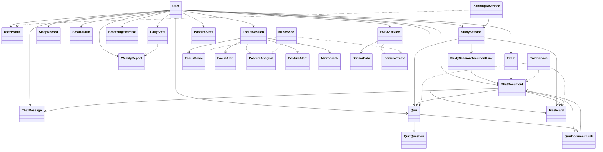

---

## 2. Diagramme de Classes Global (Détaillé)

```mermaid
classDiagram
    direction TB

    %% ── Authentification ──
    class User {
        +int id
        +String email
        +String hashed_password
        +String full_name
        +String role
        +boolean is_active
        +DateTime created_at
        +DateTime last_login
        +register()
        +login()
        +updateProfile()
        +getToken()
    }

    class UserProfile {
        +int id
        +int user_id
        +int daily_focus_goal
        +String preferred_schedule
        +String avatar_data_url
        +boolean notif_enabled
        +JSON notif_preferences
        +DateTime updated_at
        +updateGoals()
        +getPreferences()
    }

    %% ── Focus & Concentration ──
    class FocusSession {
        +int id
        +int user_id
        +DateTime start_time
        +DateTime end_time
        +float average_score
        +String status
        +start()
        +stop()
        +pause()
        +resume()
        +getScore()
    }

    class FocusScore {
        +int id
        +int session_id
        +float score
        +float posture_score
        +float fatigue_score
        +float attention_score
        +DateTime timestamp
        +calculate()
        +evaluate()
    }

    class FocusAlert {
        +int id
        +int session_id
        +String alert_type
        +String message
        +DateTime triggered_at
        +boolean acknowledged
        +trigger()
        +acknowledge()
    }

    %% ── Planning Intelligent ──
    class StudySession {
        +int id
        +int user_id
        +Date date
        +DateTime start
        +DateTime end
        +String subject
        +String priority
        +String status
        +String notes
        +boolean is_ai_generated
        +DateTime completed_at
        +int document_id
        +DateTime created_at
        +DateTime updated_at
        +create()
        +update()
        +complete()
        +getDocumentNames()
        +getQuizStatus()
        +getFlashcardsStatus()
    }

    class Exam {
        +int id
        +int user_id
        +int document_id
        +String title
        +Date exam_date
        +DateTime created_at
        +DateTime updated_at
        +create()
        +update()
        +delete()
    }

    class StudySessionDocumentLink {
        +int id
        +int session_id
        +int document_id
        +DateTime created_at
    }

    %% ── Chatbot RAG ──
    class ChatDocument {
        +int id
        +int user_id
        +String filename
        +String file_path
        +String chroma_collection
        +int page_count
        +DateTime created_at
        +upload()
        +parse()
        +delete()
    }

    class ChatMessage {
        +int id
        +int user_id
        +int document_id
        +String question
        +String answer
        +JSON sources
        +DateTime created_at
        +send()
        +generateResponse()
    }

    class Quiz {
        +int id
        +int user_id
        +int document_id
        +int session_id
        +String title
        +int num_questions
        +int score
        +DateTime completed_at
        +DateTime created_at
        +generate()
        +submit()
        +evaluate()
    }

    class QuizQuestion {
        +int id
        +int quiz_id
        +String question_text
        +JSON options
        +int correct_index
        +String explanation
        +int user_answer_index
    }

    class QuizDocumentLink {
        +int id
        +int quiz_id
        +int document_id
        +DateTime created_at
    }

    class Flashcard {
        +int id
        +int user_id
        +int document_id
        +int source_session_id
        +String front
        +String back
        +float ease_factor
        +int interval
        +int repetitions
        +DateTime next_review
        +DateTime created_at
        +generate()
        +review()
        +updateSM2()
    }

    %% ── Posture & Ergonomie ──
    class PostureAnalysis {
        +int id
        +int session_id
        +String posture_status
        +float confidence
        +float head_angle
        +float shoulder_angle
        +float spine_angle
        +DateTime timestamp
        +analyze()
        +evaluate()
    }

    class PostureAlert {
        +int id
        +int session_id
        +String alert_type
        +String body_part
        +String recommendation
        +DateTime triggered_at
        +trigger()
        +sendNotification()
    }

    class PostureStats {
        +int id
        +int user_id
        +Date date
        +float good_posture_percentage
        +int total_alerts
        +int correction_count
        +calculate()
        +getWeeklyTrend()
    }

    %% ── Sommeil & Réveil ──
    class SleepRecord {
        +int id
        +int user_id
        +DateTime sleep_start
        +DateTime sleep_end
        +float total_hours
        +float deep_sleep_hours
        +float light_sleep_hours
        +int sleep_score
        +JSON raw_sensor_data
        +DateTime created_at
        +record()
        +calculateScore()
    }

    class SmartAlarm {
        +int id
        +int user_id
        +String alarm_time
        +boolean is_active
        +String wake_mode
        +int light_intensity
        +boolean sound_enabled
        +configure()
        +trigger()
        +snooze()
    }

    %% ── Gestion du Stress ──
    class BreathingExercise {
        +int id
        +int user_id
        +String exercise_type
        +int duration_seconds
        +DateTime performed_at
        +boolean completed
        +start()
        +complete()
        +getGuide()
    }

    class MicroBreak {
        +int id
        +int session_id
        +String reason
        +String suggested_activity
        +int duration_seconds
        +DateTime suggested_at
        +boolean taken
        +suggest()
        +accept()
        +dismiss()
    }

    %% ── Dashboard & Statistiques ──
    class DailyStats {
        +int id
        +int user_id
        +Date date
        +float focus_score_avg
        +float posture_score_avg
        +int sleep_score
        +int total_focus_minutes
        +int sessions_completed
        +calculate()
        +getDashboard()
    }

    class WeeklyReport {
        +int id
        +int user_id
        +Date week_start
        +float focus_trend
        +float posture_trend
        +float sleep_trend
        +String[] recommendations
        +generate()
        +getInsights()
    }

    %% ── Hardware IoT ──
    class ESP32Device {
        +int id
        +int user_id
        +String device_id
        +String firmware_version
        +String status
        +DateTime last_seen
        +connect()
        +sendData()
        +receiveCommand()
        +updateFirmware()
    }

    class SensorData {
        +int id
        +int device_id
        +String sensor_type
        +float value
        +String unit
        +DateTime timestamp
        +read()
        +send()
    }

    class CameraFrame {
        +int id
        +int device_id
        +byte[] image_data
        +int width
        +int height
        +DateTime captured_at
        +capture()
        +send()
        +process()
    }

    %% ── Services IA ──
    class MLService {
        +analyzePose(CameraFrame) PostureAnalysis
        +detectFatigue(CameraFrame) float
        +detectFace(CameraFrame) FaceAnalysis
        +calculateFocusScore(PostureAnalysis, float) FocusScore
    }

    class RAGService {
        +ingestPDF(file_path, collection_name) int
        +queryRAG(question, collection_names) ChatResponse
        +queryGeneral(question) ChatResponse
        +generateQuiz(collection_name, num_questions) QuizQuestion[]
        +generateQuizFromCollections(collection_names) QuizQuestion[]
        +generateFlashcards(collection_name, num_cards) Flashcard[]
        +generateFlashcardsFromCollections(collection_names) Flashcard[]
        +deleteCollection(collection_name) void
    }

    class PlanningAIService {
        +generateDailySchedule(date, sessions, profile, preferences, collection) StudySession[]
        +computeFreeSlots(date, blocks) TimeSlot[]
        +fitSessionsIntoSlots(slots, focus_goal) TimeSlot[]
        +assignSubjectsViaAI(slots, day, profile, classes) Assignment[]
        +extractTimetableFromCollection(collection, day) Block[]
    }

    %% ════════════════════════════════════
    %% Relations
    %% ════════════════════════════════════

    User "1" --> "1" UserProfile : possède
    User "1" --> "*" FocusSession : démarre
    User "1" --> "*" StudySession : planifie
    User "1" --> "*" Exam : définit
    User "1" --> "*" ChatDocument : uploade
    User "1" --> "*" ChatMessage : envoie
    User "1" --> "*" Quiz : génère
    User "1" --> "*" Flashcard : révise
    User "1" --> "*" SleepRecord : enregistre
    User "1" --> "0..1" SmartAlarm : configure
    User "1" --> "*" BreathingExercise : effectue
    User "1" --> "*" DailyStats : a
    User "1" --> "*" WeeklyReport : reçoit
    User "1" --> "0..1" ESP32Device : associe

    FocusSession "1" --> "*" FocusScore : contient
    FocusSession "1" --> "*" FocusAlert : génère
    FocusSession "1" --> "*" PostureAnalysis : inclut
    FocusSession "1" --> "*" PostureAlert : déclenche
    FocusSession "1" --> "*" MicroBreak : propose

    StudySession "1" --> "0..1" ChatDocument : étudie
    StudySession "1" --> "*" StudySessionDocumentLink : lié à
    StudySession "1" --> "0..1" Quiz : génère quiz
    StudySession "1" --> "*" Flashcard : génère flashcards
    StudySessionDocumentLink "*" --> "1" ChatDocument : référence

    Exam "*" --> "0..1" ChatDocument : concerne

    ChatDocument "1" --> "*" ChatMessage : contexte pour
    ChatDocument "1" --> "*" Quiz : source de
    ChatDocument "1" --> "*" Flashcard : produit
    ChatDocument "1" --> "*" QuizDocumentLink : lié via

    Quiz "1" --> "*" QuizQuestion : contient
    Quiz "1" --> "*" QuizDocumentLink : sources
    QuizDocumentLink "*" --> "1" ChatDocument : référence

    User "1" --> "*" PostureStats : a

    ESP32Device "1" --> "*" SensorData : produit
    ESP32Device "1" --> "*" CameraFrame : capture

    %% Relations Services
    MLService ..> CameraFrame : utilise
    MLService ..> PostureAnalysis : produit
    MLService ..> FocusScore : calcule

    RAGService ..> ChatDocument : indexe
    RAGService ..> ChatMessage : produit
    RAGService ..> Quiz : génère
    RAGService ..> Flashcard : génère

    PlanningAIService ..> StudySession : génère
    PlanningAIService ..> UserProfile : consulte
    PlanningAIService ..> ChatDocument : extrait emploi du temps
```

---

## 3. Diagramme de Classes par Module

### 3.1 🔐 Module Authentification

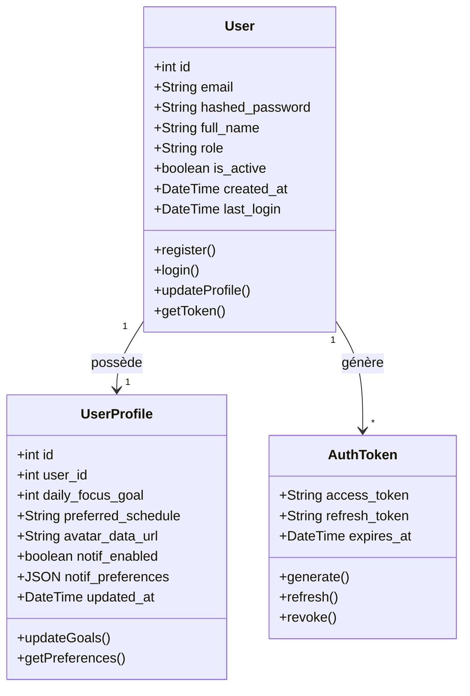

| Classe | Responsabilité |
|--------|---------------|
| **User** | Gestion des comptes utilisateurs, authentification JWT. Champs `is_active` pour soft-delete, `role` parmi student/teacher/professional |
| **UserProfile** | Préférences utilisateur : objectif quotidien, horaire préféré, avatar (data URL), configuration notifications (JSON) |
| **AuthToken** | Gestion des tokens JWT (access + refresh) |

---

### 3.2 🎯 Module Focus & Concentration

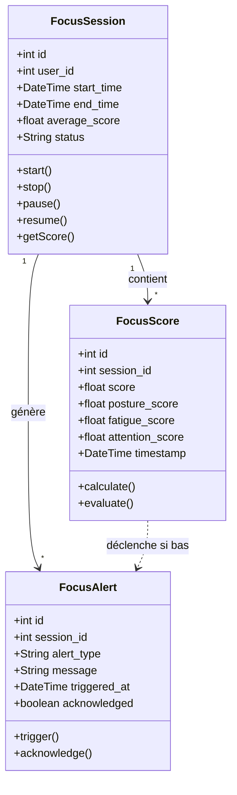

| Classe | Responsabilité |
|--------|---------------|
| **FocusSession** | Cycle de vie d'une session de travail (start/stop/pause) |
| **FocusScore** | Score composite calculé en temps réel (posture + fatigue + attention) |
| **FocusAlert** | Alertes déclenchées quand le score descend sous un seuil |

---

### 3.3 📅 Module Planning Intelligent

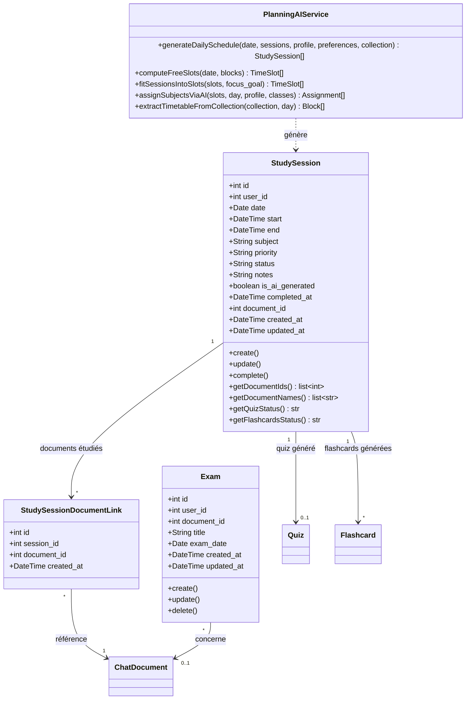

| Classe | Responsabilité |
|--------|---------------|
| **StudySession** | Session d'étude planifiée avec sujet, horaires, priorité (low/medium/high), statut (pending/in_progress/completed/cancelled). Peut être générée par l'IA ou créée manuellement. Liée optionnellement à un document et peut générer quiz/flashcards. |
| **Exam** | Examen défini par l'utilisateur avec date cible, utilisé pour intensifier la planification de révision |
| **StudySessionDocumentLink** | Table de liaison Many-to-Many entre sessions et documents étudiés |
| **PlanningAIService** | Pipeline : extraction emploi du temps PDF (ChromaDB + Gemini) → calcul créneaux libres (déterministe) → ajustement sessions (déterministe) → assignation sujets (Gemini avec fallback déterministe) |

---

### 3.4 💬 Module Chatbot RAG

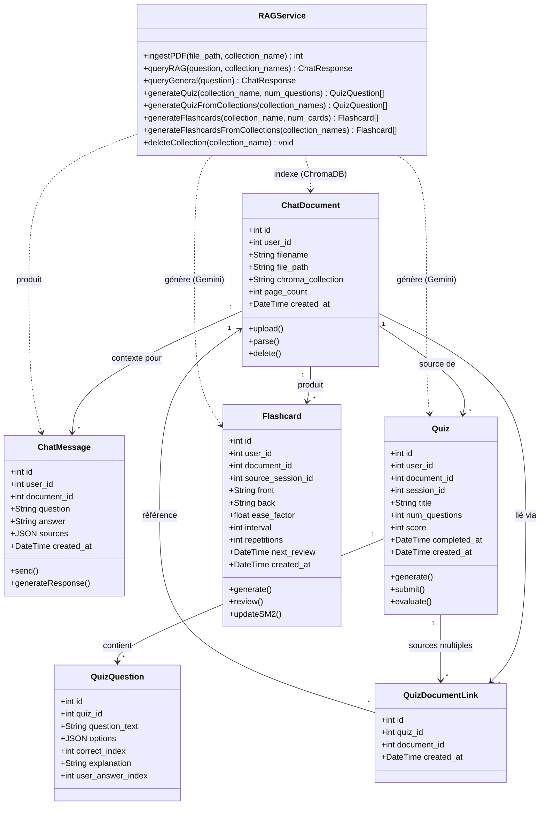

| Classe | Responsabilité |
|--------|---------------|
| **ChatDocument** | Document PDF uploadé, indexé dans ChromaDB via une collection dédiée (`chroma_collection`). Stocke `page_count` au lieu du nombre de chunks |
| **ChatMessage** | Échange Q&A : stocke la `question` et la `answer` (pas de rôle séparé), avec des `sources` JSON citant les chunks utilisés |
| **Quiz** | Quiz QCM auto-généré, lié à un document et optionnellement à une session d'étude. Supporte la soumission (`score`, `completed_at`) |
| **QuizQuestion** | Question QCM : `question_text`, `options` (JSON array), `correct_index` (0-based), `user_answer_index` pour la réponse de l'utilisateur |
| **QuizDocumentLink** | Table de liaison Many-to-Many permettant de générer un quiz à partir de plusieurs documents |
| **Flashcard** | Carte de révision avec algorithme SM-2 : `ease_factor`, `interval` (jours), `repetitions`, `next_review`. Peut être liée à une session d'étude via `source_session_id` |
| **RAGService** | Pipeline RAG complet : ingestion PDF (PyMuPDF → chunks → HuggingFace embeddings → ChromaDB), recherche sémantique, génération réponse/quiz/flashcards via Gemini, support multi-documents |

---

### 3.5 🧍 Module Posture & Ergonomie

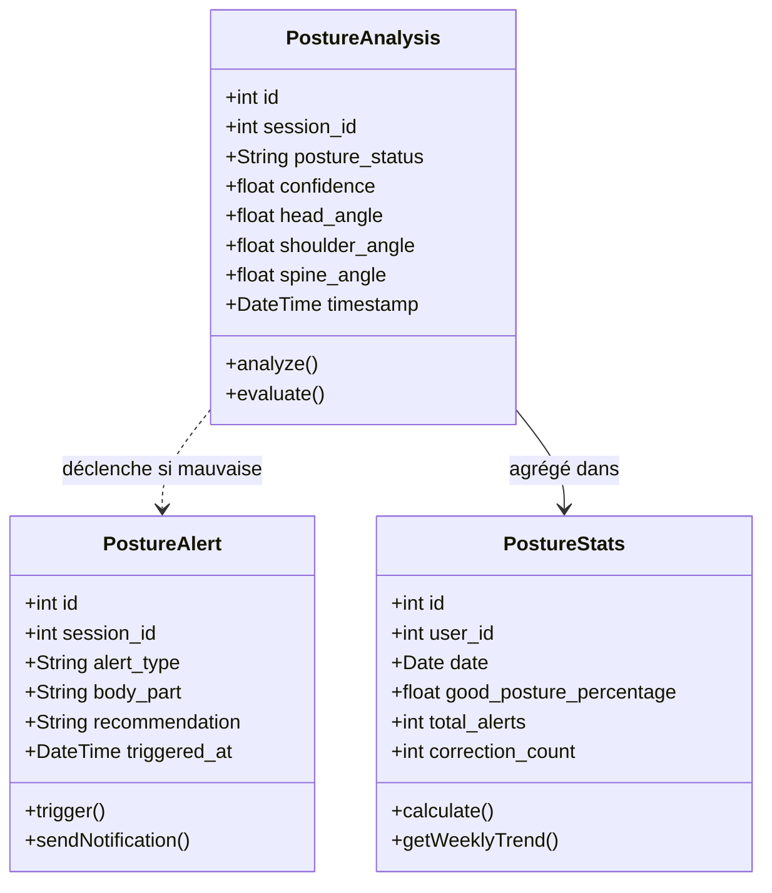

| Classe | Responsabilité |
|--------|---------------|
| **PostureAnalysis** | Résultat d'analyse posture (angles tête, épaules, dos) via MediaPipe |
| **PostureAlert** | Alerte de mauvaise posture avec recommandation |
| **PostureStats** | Statistiques agrégées par jour (% bonne posture, corrections) |

---

### 3.6 🌙 Module Sommeil & Réveil

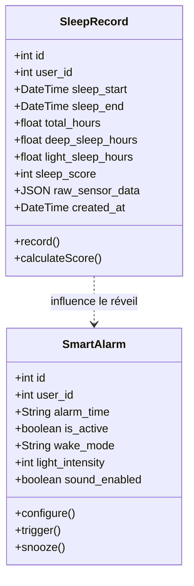

| Classe | Responsabilité |
|--------|---------------|
| **SleepRecord** | Données de sommeil (durée, phases, score 0-100), avec données capteur brutes (`raw_sensor_data` JSON) collectées par l'ESP32 |
| **SmartAlarm** | Réveil intelligent : horaire (HH:MM), mode (gradual/normal/silent), intensité LED (0-100), activation son |

---

### 3.7 🧘 Module Gestion du Stress

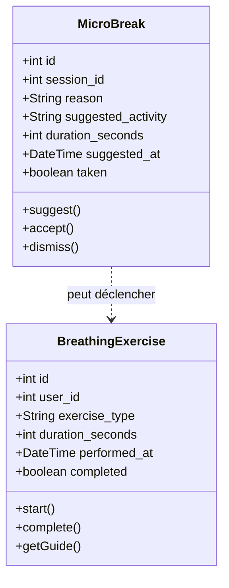

| Classe | Responsabilité |
|--------|---------------|
| **BreathingExercise** | Exercice de respiration guidé (affiché sur TFT + LEDs) |
| **MicroBreak** | Suggestion de pause courte déclenchée par détection de distraction |

---

### 3.8 📊 Module Dashboard & Statistiques

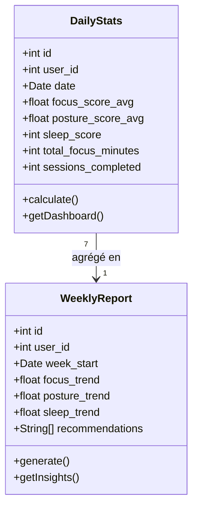

| Classe | Responsabilité |
|--------|---------------|
| **DailyStats** | Résumé quotidien de tous les scores (focus, posture, sommeil) |
| **WeeklyReport** | Rapport hebdomadaire avec tendances et recommandations IA |

---

### 3.9 📟 Module Hardware IoT

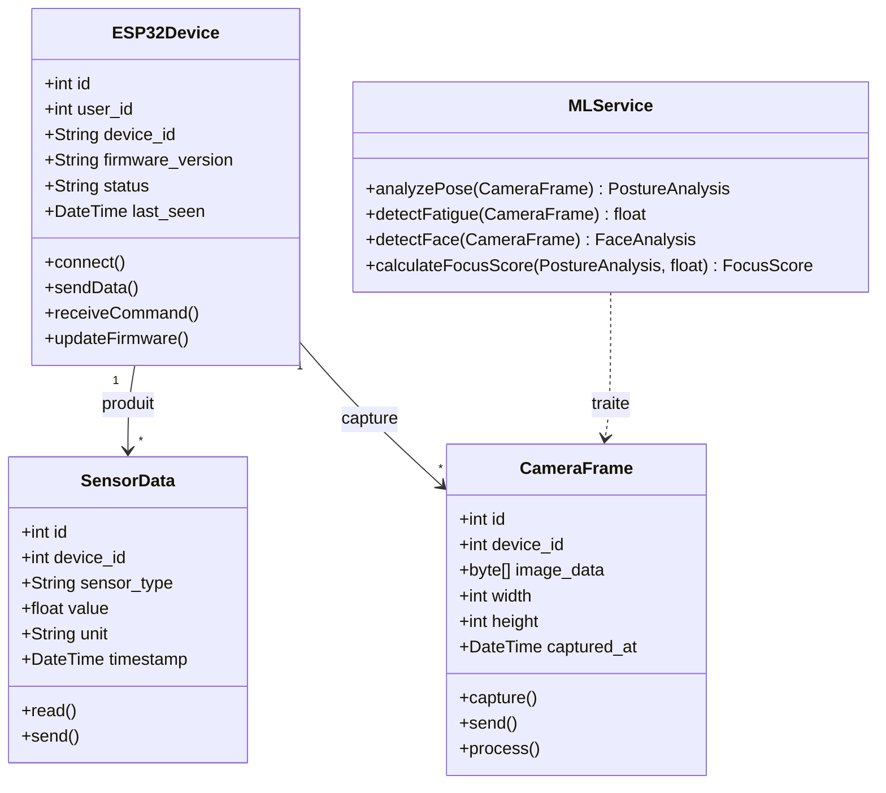

| Classe | Responsabilité |
|--------|---------------|
| **ESP32Device** | Représente le boîtier physique et sa connexion au backend |
| **SensorData** | Donnée brute d'un capteur (MAX30102, micro, pression) |
| **CameraFrame** | Image capturée par l'ESP32-CAM envoyée au serveur ML |
| **MLService** | Service serveur d'analyse d'images (posture, fatigue, visage) |

---

## 4. Résumé des Classes

| Module | Classes | Total Attributs | Total Méthodes |
|--------|:-------:|:---------------:|:--------------:|
| 🔐 Authentification | 3 | 17 | 10 |
| 🎯 Focus & Concentration | 3 | 18 | 10 |
| 📅 Planning Intelligent | 4 | 25 | 16 |
| 💬 Chatbot RAG | 7 | 40 | 22 |
| 🧍 Posture & Ergonomie | 3 | 18 | 8 |
| 🌙 Sommeil & Réveil | 2 | 16 | 6 |
| 🧘 Gestion du Stress | 2 | 14 | 8 |
| 📊 Dashboard & Stats | 2 | 14 | 4 |
| 📟 Hardware IoT | 4 | 18 | 11 |
| **Total** | **30** | **180** | **95** |

---

## 5. Types de Relations Utilisées

| Relation | Notation UML | Exemple |
|----------|:------------:|---------|
| **Association** | `-->` | User → StudySession |
| **Composition** | `*-->` | Quiz *→ QuizQuestion |
| **Dépendance** | `..>` | RAGService ..> ChatDocument |
| **Agrégation** | `o-->` | DailyStats o→ WeeklyReport |
| **Liaison M-N** | `-->` via Link | StudySession → StudySessionDocumentLink → ChatDocument |

---

## 6. Changements Majeurs (v1.0 → v2.0)

| Changement | Détails |
|-----------|---------|
| `Document` → `ChatDocument` | Renommé pour clarifier le rôle dans le chatbot RAG |
| `ChatConversation` supprimé | Les messages sont maintenant liés directement à l'utilisateur et au document |
| `ChatMessage` restructuré | Stocke `question`/`answer` au lieu de `role`/`content` |
| `Planning` + `PlannedSession` → `StudySession` | Fusionnés en un modèle unique avec plus de métadonnées |
| `Exam` ajouté | Nouveau modèle pour les examens cibles (intensification révision) |
| Tables de liaison ajoutées | `StudySessionDocumentLink` et `QuizDocumentLink` pour les relations M-N |
| `Flashcard` avec SM-2 | Algorithme de répétition espacée : `ease_factor`, `interval`, `repetitions` |
| `Quiz` enrichi | Ajout `session_id`, `num_questions`, `score`, `completed_at` |
| `PlanningAIService` redesigné | Architecture hybride : calcul déterministe des créneaux + IA pour l'assignation des sujets |

---

**Validé par** : _________________________  
**Date de validation** : _________________________
