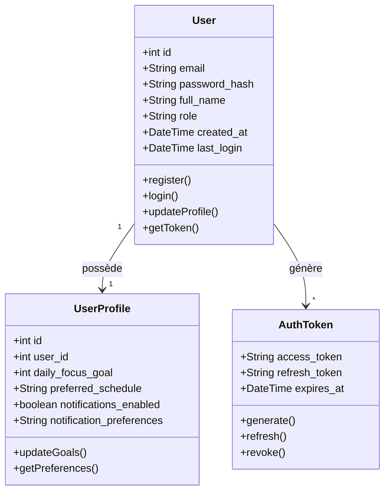
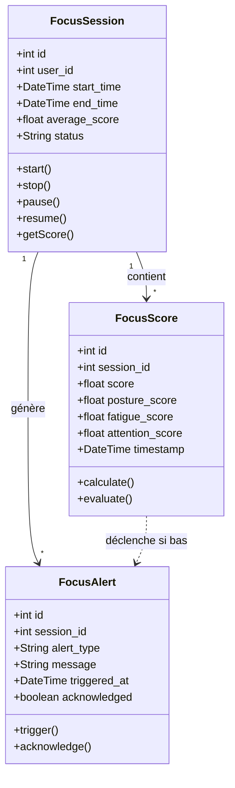
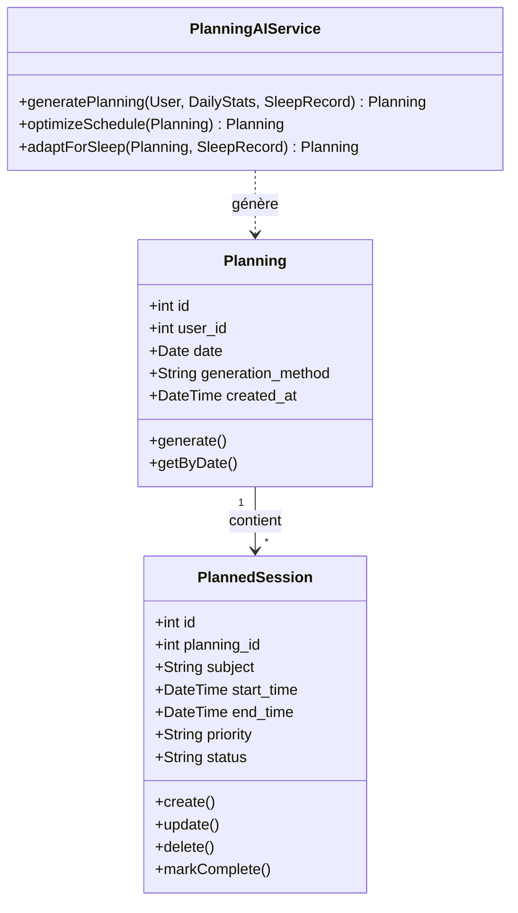
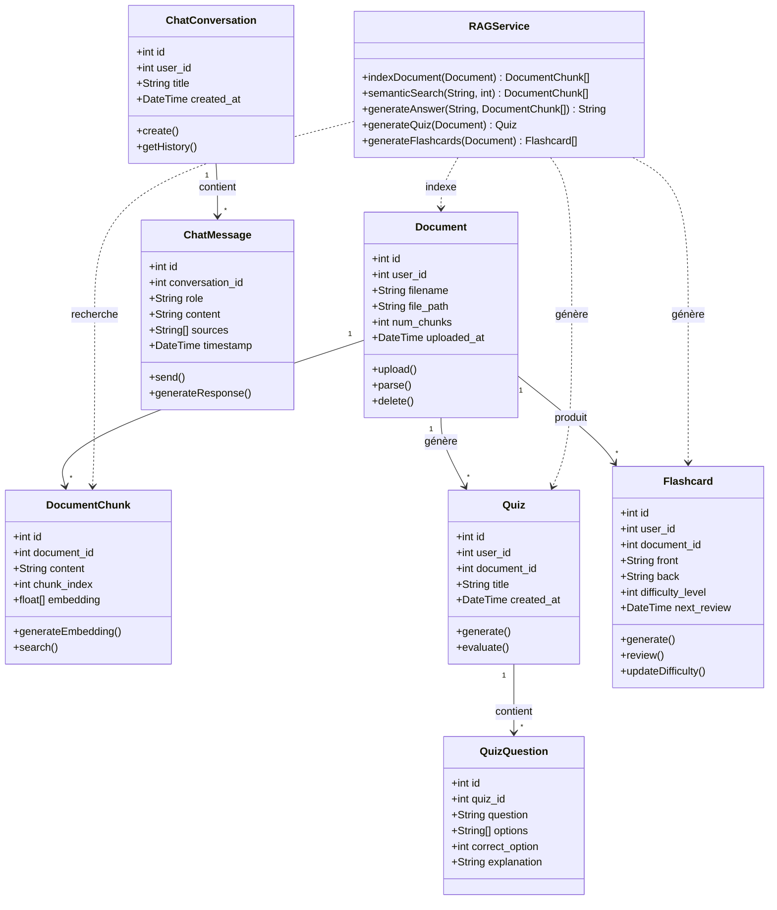
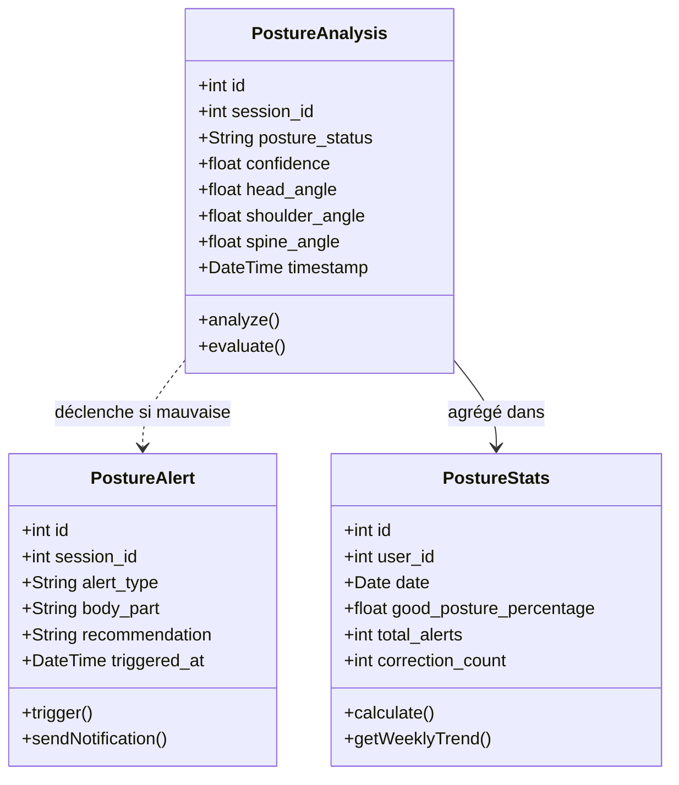
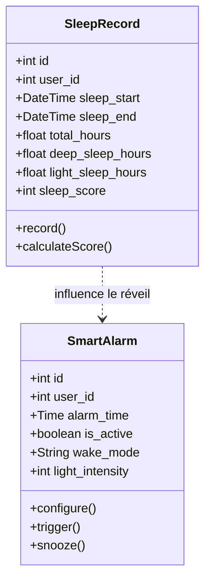
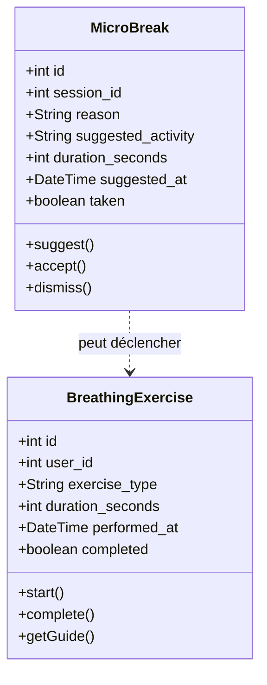
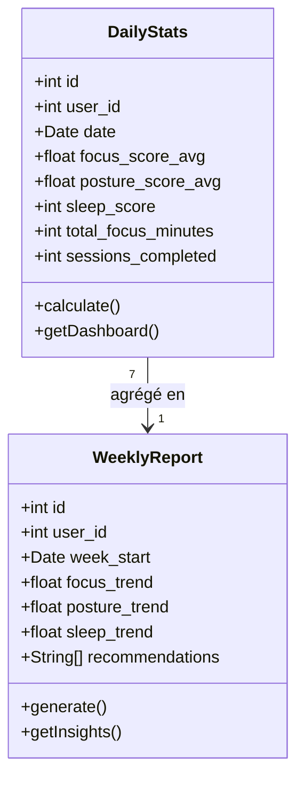
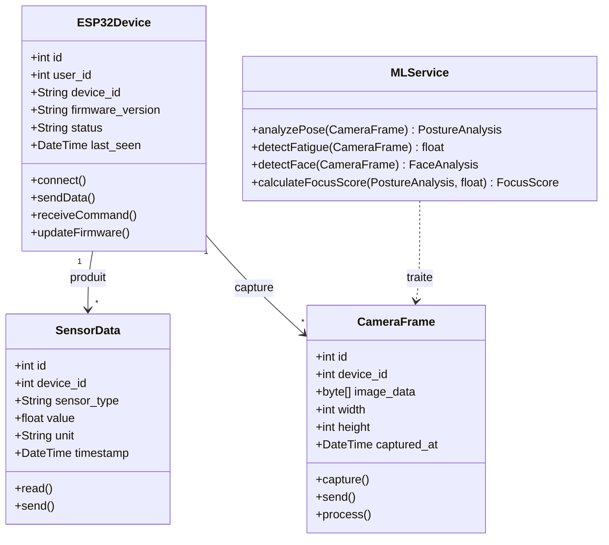

# 📐 Diagramme de Classes – Smart Focus & Life Assistant

**Version** : 1.0  
**Date** : 17 Février 2026  
**Phase** : Conception  

---

## 1. Diagramme de Classes Global

```mermaid
classDiagram
    direction TB

    %% ── Authentification ──
    class User {
        +int id
        +String email
        +String password_hash
        +String full_name
        +String role
        +DateTime created_at
        +DateTime last_login
        +register()
        +login()
        +updateProfile()
        +getToken()
    }

    class UserProfile {
        +int id
        +int user_id
        +int daily_focus_goal
        +String preferred_schedule
        +boolean notifications_enabled
        +String notification_preferences
        +updateGoals()
        +getPreferences()
    }

    %% ── Focus & Concentration ──
    class FocusSession {
        +int id
        +int user_id
        +DateTime start_time
        +DateTime end_time
        +float average_score
        +String status
        +start()
        +stop()
        +pause()
        +resume()
        +getScore()
    }

    class FocusScore {
        +int id
        +int session_id
        +float score
        +float posture_score
        +float fatigue_score
        +float attention_score
        +DateTime timestamp
        +calculate()
        +evaluate()
    }

    class FocusAlert {
        +int id
        +int session_id
        +String alert_type
        +String message
        +DateTime triggered_at
        +boolean acknowledged
        +trigger()
        +acknowledge()
    }

    %% ── Planning Intelligent ──
    class Planning {
        +int id
        +int user_id
        +Date date
        +String generation_method
        +DateTime created_at
        +generate()
        +getByDate()
    }

    class PlannedSession {
        +int id
        +int planning_id
        +String subject
        +DateTime start_time
        +DateTime end_time
        +String priority
        +String status
        +create()
        +update()
        +delete()
        +markComplete()
    }

    %% ── Chatbot RAG ──
    class Document {
        +int id
        +int user_id
        +String filename
        +String file_path
        +int num_chunks
        +DateTime uploaded_at
        +upload()
        +parse()
        +delete()
    }

    class DocumentChunk {
        +int id
        +int document_id
        +String content
        +int chunk_index
        +float[] embedding
        +generateEmbedding()
        +search()
    }

    class ChatConversation {
        +int id
        +int user_id
        +String title
        +DateTime created_at
        +create()
        +getHistory()
    }

    class ChatMessage {
        +int id
        +int conversation_id
        +String role
        +String content
        +String[] sources
        +DateTime timestamp
        +send()
        +generateResponse()
    }

    class Quiz {
        +int id
        +int user_id
        +int document_id
        +String title
        +DateTime created_at
        +generate()
        +evaluate()
    }

    class QuizQuestion {
        +int id
        +int quiz_id
        +String question
        +String[] options
        +int correct_option
        +String explanation
    }

    class Flashcard {
        +int id
        +int user_id
        +int document_id
        +String front
        +String back
        +int difficulty_level
        +DateTime next_review
        +generate()
        +review()
        +updateDifficulty()
    }

    %% ── Posture & Ergonomie ──
    class PostureAnalysis {
        +int id
        +int session_id
        +String posture_status
        +float confidence
        +float head_angle
        +float shoulder_angle
        +float spine_angle
        +DateTime timestamp
        +analyze()
        +evaluate()
    }

    class PostureAlert {
        +int id
        +int session_id
        +String alert_type
        +String body_part
        +String recommendation
        +DateTime triggered_at
        +trigger()
        +sendNotification()
    }

    class PostureStats {
        +int id
        +int user_id
        +Date date
        +float good_posture_percentage
        +int total_alerts
        +int correction_count
        +calculate()
        +getWeeklyTrend()
    }

    %% ── Sommeil & Réveil ──
    class SleepRecord {
        +int id
        +int user_id
        +DateTime sleep_start
        +DateTime sleep_end
        +float total_hours
        +float deep_sleep_hours
        +float light_sleep_hours
        +int sleep_score
        +record()
        +calculateScore()
    }

    class SmartAlarm {
        +int id
        +int user_id
        +Time alarm_time
        +boolean is_active
        +String wake_mode
        +int light_intensity
        +configure()
        +trigger()
        +snooze()
    }

    %% ── Gestion du Stress ──
    class BreathingExercise {
        +int id
        +int user_id
        +String exercise_type
        +int duration_seconds
        +DateTime performed_at
        +boolean completed
        +start()
        +complete()
        +getGuide()
    }

    class MicroBreak {
        +int id
        +int session_id
        +String reason
        +String suggested_activity
        +int duration_seconds
        +DateTime suggested_at
        +boolean taken
        +suggest()
        +accept()
        +dismiss()
    }

    %% ── Dashboard & Statistiques ──
    class DailyStats {
        +int id
        +int user_id
        +Date date
        +float focus_score_avg
        +float posture_score_avg
        +int sleep_score
        +int total_focus_minutes
        +int sessions_completed
        +calculate()
        +getDashboard()
    }

    class WeeklyReport {
        +int id
        +int user_id
        +Date week_start
        +float focus_trend
        +float posture_trend
        +float sleep_trend
        +String[] recommendations
        +generate()
        +getInsights()
    }

    %% ── Hardware IoT ──
    class ESP32Device {
        +int id
        +int user_id
        +String device_id
        +String firmware_version
        +String status
        +DateTime last_seen
        +connect()
        +sendData()
        +receiveCommand()
        +updateFirmware()
    }

    class SensorData {
        +int id
        +int device_id
        +String sensor_type
        +float value
        +String unit
        +DateTime timestamp
        +read()
        +send()
    }

    class CameraFrame {
        +int id
        +int device_id
        +byte[] image_data
        +int width
        +int height
        +DateTime captured_at
        +capture()
        +send()
        +process()
    }

    %% ── Services IA ──
    class MLService {
        +analyzePose(CameraFrame) PostureAnalysis
        +detectFatigue(CameraFrame) float
        +detectFace(CameraFrame) FaceAnalysis
        +calculateFocusScore(PostureAnalysis, float) FocusScore
    }

    class RAGService {
        +indexDocument(Document) DocumentChunk[]
        +semanticSearch(String, int) DocumentChunk[]
        +generateAnswer(String, DocumentChunk[]) String
        +generateQuiz(Document) Quiz
        +generateFlashcards(Document) Flashcard[]
    }

    class PlanningAIService {
        +generatePlanning(User, DailyStats, SleepRecord) Planning
        +optimizeSchedule(Planning) Planning
        +adaptForSleep(Planning, SleepRecord) Planning
    }

    %% ════════════════════════════════════
    %% Relations
    %% ════════════════════════════════════

    User "1" --> "1" UserProfile : possède
    User "1" --> "*" FocusSession : démarre
    User "1" --> "*" Planning : possède
    User "1" --> "*" Document : uploade
    User "1" --> "*" ChatConversation : crée
    User "1" --> "*" SleepRecord : enregistre
    User "1" --> "0..1" SmartAlarm : configure
    User "1" --> "*" BreathingExercise : effectue
    User "1" --> "*" DailyStats : a
    User "1" --> "*" WeeklyReport : reçoit
    User "1" --> "0..1" ESP32Device : associe

    FocusSession "1" --> "*" FocusScore : contient
    FocusSession "1" --> "*" FocusAlert : génère
    FocusSession "1" --> "*" PostureAnalysis : inclut
    FocusSession "1" --> "*" PostureAlert : déclenche
    FocusSession "1" --> "*" MicroBreak : propose

    Planning "1" --> "*" PlannedSession : contient

    Document "1" --> "*" DocumentChunk : découpé en
    Document "1" --> "*" Quiz : génère
    Document "1" --> "*" Flashcard : produit

    ChatConversation "1" --> "*" ChatMessage : contient

    Quiz "1" --> "*" QuizQuestion : contient

    User "1" --> "*" PostureStats : a
    User "1" --> "*" Flashcard : révise

    ESP32Device "1" --> "*" SensorData : produit
    ESP32Device "1" --> "*" CameraFrame : capture

    %% Relations Services
    MLService ..> CameraFrame : utilise
    MLService ..> PostureAnalysis : produit
    MLService ..> FocusScore : calcule

    RAGService ..> Document : indexe
    RAGService ..> DocumentChunk : recherche
    RAGService ..> Quiz : génère
    RAGService ..> Flashcard : génère

    PlanningAIService ..> Planning : génère
    PlanningAIService ..> DailyStats : analyse
    PlanningAIService ..> SleepRecord : consulte
```

---

## 2. Diagramme de Classes par Module

### 2.1 🔐 Module Authentification

| Classe | Responsabilité |
|--------|---------------|
| **User** | Gestion des comptes utilisateurs, authentification JWT |
| **UserProfile** | Préférences, objectifs personnalisés, configuration notifications |
| **AuthToken** | Gestion des tokens JWT (access + refresh) |

---

### 2.2 🎯 Module Focus & Concentration

| Classe | Responsabilité |
|--------|---------------|
| **FocusSession** | Cycle de vie d'une session de travail (start/stop/pause) |
| **FocusScore** | Score composite calculé en temps réel (posture + fatigue + attention) |
| **FocusAlert** | Alertes déclenchées quand le score descend sous un seuil |

---

### 2.3 📅 Module Planning Intelligent

| Classe | Responsabilité |
|--------|---------------|
| **Planning** | Planning quotidien contenant les sessions planifiées |
| **PlannedSession** | Une session individuelle planifiée (sujet, horaire, priorité) |
| **PlanningAIService** | Service IA qui génère et optimise le planning |

---

### 2.4 💬 Module Chatbot RAG

| Classe | Responsabilité |
|--------|---------------|
| **Document** | Fichier PDF uploadé par l'utilisateur |
| **DocumentChunk** | Fragment de document avec son embedding vectoriel (ChromaDB) |
| **ChatConversation** | Conversation utilisateur avec le chatbot |
| **ChatMessage** | Message individuel (question ou réponse avec sources) |
| **Quiz** | Quiz auto-généré à partir d'un document |
| **QuizQuestion** | Question QCM avec options et explication |
| **Flashcard** | Carte de révision avec système de répétition espacée |
| **RAGService** | Pipeline RAG : indexation, recherche sémantique, génération |

---

### 2.5 🧍 Module Posture & Ergonomie

| Classe | Responsabilité |
|--------|---------------|
| **PostureAnalysis** | Résultat d'analyse posture (angles tête, épaules, dos) via MediaPipe |
| **PostureAlert** | Alerte de mauvaise posture avec recommandation |
| **PostureStats** | Statistiques agrégées par jour (% bonne posture, corrections) |

---

### 2.6 🌙 Module Sommeil & Réveil

| Classe | Responsabilité |
|--------|---------------|
| **SleepRecord** | Données de sommeil (durée, phases, score) collectées par l'ESP32 |
| **SmartAlarm** | Réveil intelligent avec LED progressives et son doux |

---

### 2.7 🧘 Module Gestion du Stress

| Classe | Responsabilité |
|--------|---------------|
| **BreathingExercise** | Exercice de respiration guidé (affiché sur TFT + LEDs) |
| **MicroBreak** | Suggestion de pause courte déclenchée par détection de distraction |

---

### 2.8 📊 Module Dashboard & Statistiques

| Classe | Responsabilité |
|--------|---------------|
| **DailyStats** | Résumé quotidien de tous les scores (focus, posture, sommeil) |
| **WeeklyReport** | Rapport hebdomadaire avec tendances et recommandations IA |

---

### 2.9 📟 Module Hardware IoT

| Classe | Responsabilité |
|--------|---------------|
| **ESP32Device** | Représente le boîtier physique et sa connexion au backend |
| **SensorData** | Donnée brute d'un capteur (MAX30102, micro, pression) |
| **CameraFrame** | Image capturée par l'ESP32-CAM envoyée au serveur ML |
| **MLService** | Service serveur d'analyse d'images (posture, fatigue, visage) |

---

## 3. Résumé des Classes

| Module | Classes | Total Attributs | Total Méthodes |
|--------|:-------:|:---------------:|:--------------:|
| 🔐 Authentification | 3 | 15 | 10 |
| 🎯 Focus & Concentration | 3 | 18 | 10 |
| 📅 Planning Intelligent | 3 | 15 | 11 |
| 💬 Chatbot RAG | 7 | 36 | 18 |
| 🧍 Posture & Ergonomie | 3 | 18 | 8 |
| 🌙 Sommeil & Réveil | 2 | 14 | 6 |
| 🧘 Gestion du Stress | 2 | 14 | 8 |
| 📊 Dashboard & Stats | 2 | 14 | 4 |
| 📟 Hardware IoT | 4 | 18 | 11 |
| **Total** | **29** | **162** | **86** |

---

## 4. Types de Relations Utilisées

| Relation | Notation UML | Exemple |
|----------|:------------:|---------|
| **Association** | `-->` | User → FocusSession |
| **Composition** | `*-->` | Planning *→ PlannedSession |
| **Dépendance** | `..>` | MLService ..> CameraFrame |
| **Agrégation** | `o-->` | DailyStats o→ WeeklyReport |

---

**Validé par** : _________________________  
**Date de validation** : _________________________
