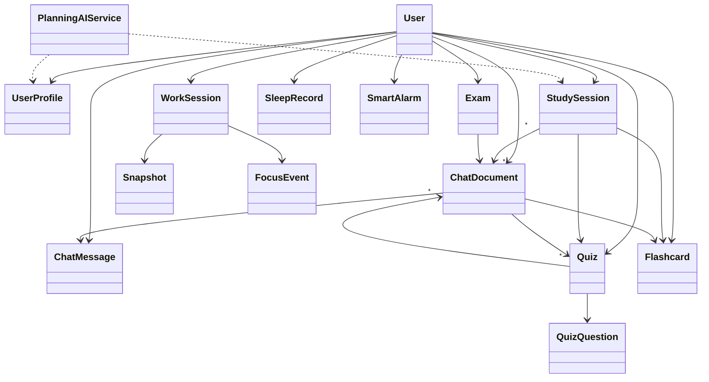
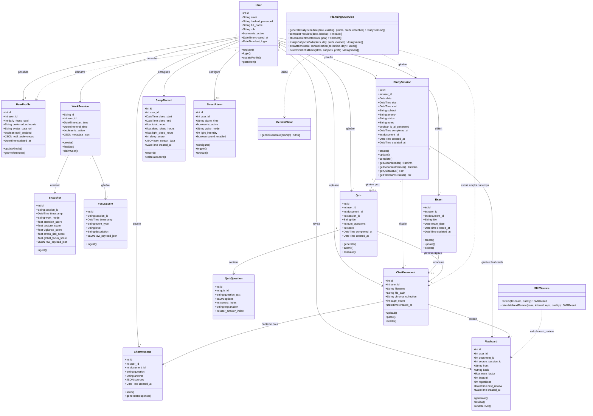
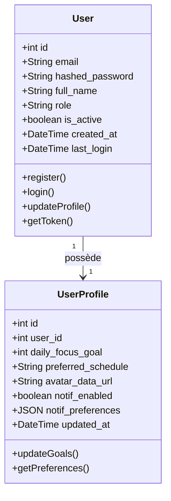
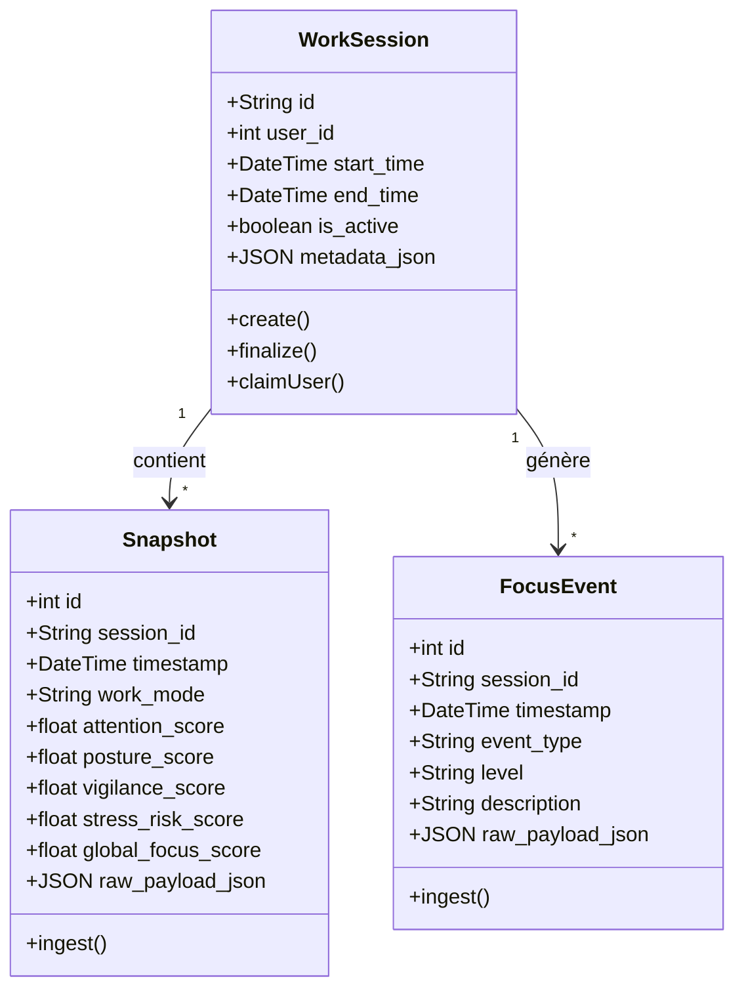
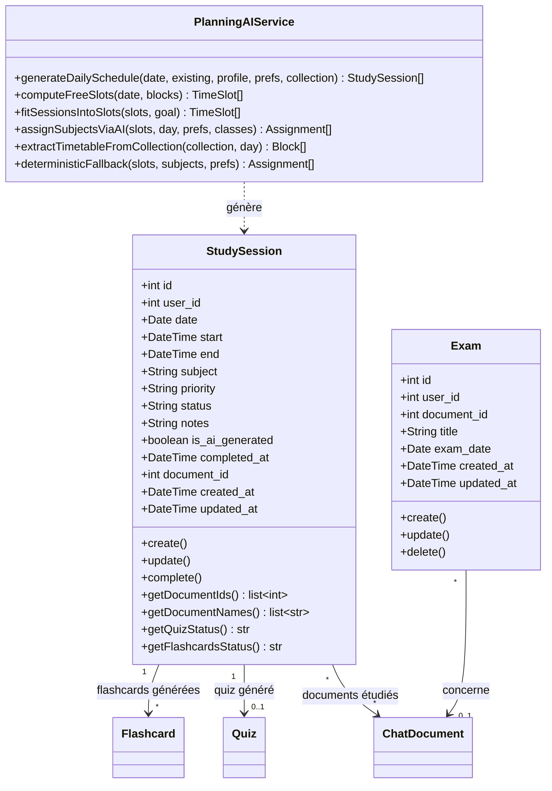
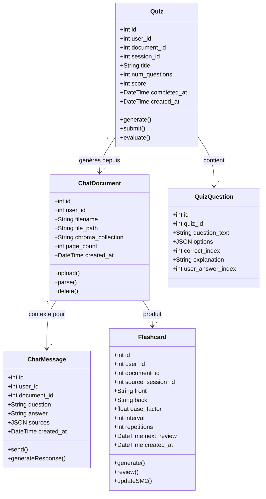
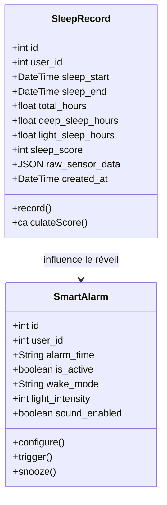

# 📐 Diagramme de Classes – Smart Focus & Life Assistant

**Version** : 4.0  
**Date** : 06 Mai 2026  
**Phase** : Conception (mise à jour post-implémentation)  

---

## 1. Vue d'Ensemble Simplifiée

```mermaid
classDiagram
    direction TB

    User --> UserProfile
    User --> StudySession
    User --> Exam
    User --> ChatDocument
    User --> ChatMessage
    User --> Quiz
    User --> Flashcard
    User --> SleepRecord
    User --> SmartAlarm
    User --> WorkSession

    StudySession "*" --> "*" ChatDocument
    StudySession --> Quiz
    StudySession --> Flashcard

    Exam --> ChatDocument

    ChatDocument --> ChatMessage
    ChatDocument --> Quiz
    ChatDocument --> Flashcard

    Quiz --> QuizQuestion
    Quiz "*" --> "*" ChatDocument

    WorkSession --> Snapshot
    WorkSession --> FocusEvent

    PlanningAIService ..> StudySession
    PlanningAIService ..> UserProfile
```

---

## 2. Diagramme de Classes Global (Détaillé)

```mermaid
classDiagram
    direction TB

    %% ── Authentification ──
    class User {
        +int id
        +String email
        +String hashed_password
        +String full_name
        +String role
        +boolean is_active
        +DateTime created_at
        +DateTime last_login
        +register()
        +login()
        +updateProfile()
        +getToken()
    }

    class UserProfile {
        +int id
        +int user_id
        +int daily_focus_goal
        +String preferred_schedule
        +String avatar_data_url
        +boolean notif_enabled
        +JSON notif_preferences
        +DateTime updated_at
        +updateGoals()
        +getPreferences()
    }

    %% ── Vision / Monitoring CV ──
    class WorkSession {
        +String id
        +int user_id
        +DateTime start_time
        +DateTime end_time
        +boolean is_active
        +JSON metadata_json
        +create()
        +finalize()
        +claimUser()
    }

    class Snapshot {
        +int id
        +String session_id
        +DateTime timestamp
        +String work_mode
        +float attention_score
        +float posture_score
        +float vigilance_score
        +float stress_risk_score
        +float global_focus_score
        +JSON raw_payload_json
        +ingest()
    }

    class FocusEvent {
        +int id
        +String session_id
        +DateTime timestamp
        +String event_type
        +String level
        +String description
        +JSON raw_payload_json
        +ingest()
    }

    %% ── Planning Intelligent ──
    class StudySession {
        +int id
        +int user_id
        +Date date
        +DateTime start
        +DateTime end
        +String subject
        +String priority
        +String status
        +String notes
        +boolean is_ai_generated
        +DateTime completed_at
        +int document_id
        +DateTime created_at
        +DateTime updated_at
        +create()
        +update()
        +complete()
        +getDocumentIds() list~int~
        +getDocumentNames() list~str~
        +getQuizStatus() str
        +getFlashcardsStatus() str
    }

    class Exam {
        +int id
        +int user_id
        +int document_id
        +String title
        +Date exam_date
        +DateTime created_at
        +DateTime updated_at
        +create()
        +update()
        +delete()
    }

    %% ── Chatbot RAG ──
    class ChatDocument {
        +int id
        +int user_id
        +String filename
        +String file_path
        +String chroma_collection
        +int page_count
        +DateTime created_at
        +upload()
        +parse()
        +delete()
    }

    class ChatMessage {
        +int id
        +int user_id
        +int document_id
        +String question
        +String answer
        +JSON sources
        +DateTime created_at
        +send()
        +generateResponse()
    }

    class Quiz {
        +int id
        +int user_id
        +int document_id
        +int session_id
        +String title
        +int num_questions
        +int score
        +DateTime completed_at
        +DateTime created_at
        +generate()
        +submit()
        +evaluate()
    }

    class QuizQuestion {
        +int id
        +int quiz_id
        +String question_text
        +JSON options
        +int correct_index
        +String explanation
        +int user_answer_index
    }

    class Flashcard {
        +int id
        +int user_id
        +int document_id
        +int source_session_id
        +String front
        +String back
        +float ease_factor
        +int interval
        +int repetitions
        +DateTime next_review
        +DateTime created_at
        +generate()
        +review()
        +updateSM2()
    }

    %% ── Sommeil & Réveil ──
    class SleepRecord {
        +int id
        +int user_id
        +DateTime sleep_start
        +DateTime sleep_end
        +float total_hours
        +float deep_sleep_hours
        +float light_sleep_hours
        +int sleep_score
        +JSON raw_sensor_data
        +DateTime created_at
        +record()
        +calculateScore()
    }

    class SmartAlarm {
        +int id
        +int user_id
        +String alarm_time
        +boolean is_active
        +String wake_mode
        +int light_intensity
        +boolean sound_enabled
        +configure()
        +trigger()
        +snooze()
    }

    %% ── Services IA ──
    class PlanningAIService {
        +generateDailySchedule(date, existing, profile, prefs, collection) StudySession[]
        +computeFreeSlots(date, blocks) TimeSlot[]
        +fitSessionsIntoSlots(slots, goal) TimeSlot[]
        +assignSubjectsViaAI(slots, day, prefs, classes) Assignment[]
        +extractTimetableFromCollection(collection, day) Block[]
        +deterministicFallback(slots, subjects, prefs) Assignment[]
    }

    class SM2Service {
        +review(flashcard, quality) SM2Result
        +calculateNextReview(ease, interval, reps, quality) SM2Result
    }

    class GeminiClient {
        +geminiGenerate(prompt) String
    }

    %% ════════════════════════════════════
    %% Relations
    %% ════════════════════════════════════

    User "1" --> "1" UserProfile : possède
    User "1" --> "*" WorkSession : démarre
    User "1" --> "*" StudySession : planifie
    User "1" --> "*" Exam : définit
    User "1" --> "*" ChatDocument : uploade
    User "1" --> "*" ChatMessage : envoie
    User "1" --> "*" Quiz : génère
    User "1" --> "*" Flashcard : révise
    User "1" --> "*" SleepRecord : enregistre
    User "1" --> "0..1" SmartAlarm : configure

    WorkSession "1" --> "*" Snapshot : contient
    WorkSession "1" --> "*" FocusEvent : génère

    StudySession "*" --> "*" ChatDocument : étudie
    StudySession "1" --> "0..1" Quiz : génère quiz
    StudySession "1" --> "*" Flashcard : génère flashcards

    Exam "*" --> "0..1" ChatDocument : concerne

    ChatDocument "1" --> "*" ChatMessage : contexte pour
    ChatDocument "1" --> "*" Flashcard : produit

    Quiz "1" --> "*" QuizQuestion : contient
    Quiz "*" --> "*" ChatDocument : générés depuis

    %% Relations Services
    PlanningAIService ..> StudySession : génère
    PlanningAIService ..> UserProfile : consulte
    PlanningAIService ..> ChatDocument : extrait emploi du temps
    PlanningAIService ..> GeminiClient : utilise
    SM2Service ..> Flashcard : calcule next_review
```

---

## 3. Diagramme de Classes par Module

### 3.1 🔐 Module Authentification

```mermaid
classDiagram
    class User {
        +int id
        +String email
        +String hashed_password
        +String full_name
        +String role
        +boolean is_active
        +DateTime created_at
        +DateTime last_login
        +register()
        +login()
        +updateProfile()
        +getToken()
    }

    class UserProfile {
        +int id
        +int user_id
        +int daily_focus_goal
        +String preferred_schedule
        +String avatar_data_url
        +boolean notif_enabled
        +JSON notif_preferences
        +DateTime updated_at
        +updateGoals()
        +getPreferences()
    }

    User "1" --> "1" UserProfile : possède
```

| Classe | Responsabilité |
|--------|---------------|
| **User** | Gestion des comptes utilisateurs, authentification JWT. Champs `is_active` pour soft-delete, `role` parmi student/teacher/professional |
| **UserProfile** | Préférences utilisateur : objectif quotidien, horaire préféré, avatar (data URL), configuration notifications (JSON) |

---

### 3.2 👁️ Module Vision / Monitoring CV

```mermaid
classDiagram
    class WorkSession {
        +String id
        +int user_id
        +DateTime start_time
        +DateTime end_time
        +boolean is_active
        +JSON metadata_json
        +create()
        +finalize()
        +claimUser()
    }

    class Snapshot {
        +int id
        +String session_id
        +DateTime timestamp
        +String work_mode
        +float attention_score
        +float posture_score
        +float vigilance_score
        +float stress_risk_score
        +float global_focus_score
        +JSON raw_payload_json
        +ingest()
    }

    class FocusEvent {
        +int id
        +String session_id
        +DateTime timestamp
        +String event_type
        +String level
        +String description
        +JSON raw_payload_json
        +ingest()
    }

    WorkSession "1" --> "*" Snapshot : contient
    WorkSession "1" --> "*" FocusEvent : génère
```

| Classe | Responsabilité |
|--------|---------------|
| **WorkSession** | Session de monitoring CV créée par le pi_client. L'ID est un UUID string (non auto-incrémenté). Le `user_id` est nullable pour permettre la création par le pi_client non authentifié, puis la réclamation par un user mobile. Le `metadata_json` stocke la configuration et le résumé final de session. |
| **Snapshot** | Point de mesure comportemental envoyé toutes les ~500ms par le pi_client. Contient 5 scores composites (attention, posture, vigilance, stress, focus global) et le payload brut complet. |
| **FocusEvent** | Événement discret (alerte, changement de mode, résumé de session) avec un niveau de sévérité (info/warning/critical). |

---

### 3.3 📅 Module Planning Intelligent

```mermaid
classDiagram
    class StudySession {
        +int id
        +int user_id
        +Date date
        +DateTime start
        +DateTime end
        +String subject
        +String priority
        +String status
        +String notes
        +boolean is_ai_generated
        +DateTime completed_at
        +int document_id
        +DateTime created_at
        +DateTime updated_at
        +create()
        +update()
        +complete()
        +getDocumentIds() list~int~
        +getDocumentNames() list~str~
        +getQuizStatus() str
        +getFlashcardsStatus() str
    }

    class Exam {
        +int id
        +int user_id
        +int document_id
        +String title
        +Date exam_date
        +DateTime created_at
        +DateTime updated_at
        +create()
        +update()
        +delete()
    }

    class PlanningAIService {
        +generateDailySchedule(date, existing, profile, prefs, collection) StudySession[]
        +computeFreeSlots(date, blocks) TimeSlot[]
        +fitSessionsIntoSlots(slots, goal) TimeSlot[]
        +assignSubjectsViaAI(slots, day, prefs, classes) Assignment[]
        +extractTimetableFromCollection(collection, day) Block[]
        +deterministicFallback(slots, subjects, prefs) Assignment[]
    }

    StudySession "*" --> "*" ChatDocument : documents étudiés
    StudySession "1" --> "0..1" Quiz : quiz généré
    StudySession "1" --> "*" Flashcard : flashcards générées
    Exam "*" --> "0..1" ChatDocument : concerne
    PlanningAIService ..> StudySession : génère
```

| Classe | Responsabilité |
|--------|---------------|
| **StudySession** | Session d'étude planifiée avec sujet, horaires, priorité (low/medium/high), statut (pending/in_progress/completed/cancelled). Peut être générée par l'IA ou créée manuellement. Liée à plusieurs documents (relation *-*) et peut générer quiz/flashcards. |
| **Exam** | Examen défini par l'utilisateur avec date cible, utilisé pour intensifier la planification de révision |
| **PlanningAIService** | Pipeline hybride : (1) Calcul déterministe des créneaux libres (8h-22h, buffer 15min), (2) Fit des sessions selon le focus_goal du profil, (3) Groq assigne les sujets/priorités aux créneaux pré-calculés, (4) Fallback déterministe en cas d'échec IA. Supporte extraction timetable PDF via RAG+Groq et parsing CSV. |

---

### 3.4 💬 Module Chatbot RAG

```mermaid
classDiagram
    class ChatDocument {
        +int id
        +int user_id
        +String filename
        +String file_path
        +String chroma_collection
        +int page_count
        +DateTime created_at
        +upload()
        +parse()
        +delete()
    }

    class ChatMessage {
        +int id
        +int user_id
        +int document_id
        +String question
        +String answer
        +JSON sources
        +DateTime created_at
        +send()
        +generateResponse()
    }

    class Quiz {
        +int id
        +int user_id
        +int document_id
        +int session_id
        +String title
        +int num_questions
        +int score
        +DateTime completed_at
        +DateTime created_at
        +generate()
        +submit()
        +evaluate()
    }

    class QuizQuestion {
        +int id
        +int quiz_id
        +String question_text
        +JSON options
        +int correct_index
        +String explanation
        +int user_answer_index
    }

    class Flashcard {
        +int id
        +int user_id
        +int document_id
        +int source_session_id
        +String front
        +String back
        +float ease_factor
        +int interval
        +int repetitions
        +DateTime next_review
        +DateTime created_at
        +generate()
        +review()
        +updateSM2()
    }

    ChatDocument "1" --> "*" ChatMessage : contexte pour
    ChatDocument "1" --> "*" Flashcard : produit
    Quiz "1" --> "*" QuizQuestion : contient
    Quiz "*" --> "*" ChatDocument : générés depuis
```

| Classe | Responsabilité |
|--------|---------------|
| **ChatDocument** | Document PDF uploadé, indexé dans ChromaDB via une collection dédiée (`chroma_collection`). Stocke `page_count` au lieu du nombre de chunks |
| **ChatMessage** | Échange Q&A : stocke la `question` et la `answer` (pas de rôle séparé), avec des `sources` JSON citant les chunks utilisés |
| **Quiz** | Quiz QCM auto-généré depuis un ou plusieurs documents (relation *-*). Supporte la soumission (`score`, `completed_at`) |
| **QuizQuestion** | Question QCM : `question_text`, `options` (JSON array), `correct_index` (0-based), `user_answer_index` pour la réponse de l'utilisateur |
| **Flashcard** | Carte de révision avec algorithme SM-2 : `ease_factor`, `interval` (jours), `repetitions`, `next_review`. Peut être liée à une session d'étude via `source_session_id` |

---

### 3.5 🌙 Module Sommeil & Réveil

```mermaid
classDiagram
    class SleepRecord {
        +int id
        +int user_id
        +DateTime sleep_start
        +DateTime sleep_end
        +float total_hours
        +float deep_sleep_hours
        +float light_sleep_hours
        +int sleep_score
        +JSON raw_sensor_data
        +DateTime created_at
        +record()
        +calculateScore()
    }

    class SmartAlarm {
        +int id
        +int user_id
        +String alarm_time
        +boolean is_active
        +String wake_mode
        +int light_intensity
        +boolean sound_enabled
        +configure()
        +trigger()
        +snooze()
    }

    SleepRecord ..> SmartAlarm : influence le réveil
```

| Classe | Responsabilité |
|--------|---------------|
| **SleepRecord** | Données de sommeil (durée, phases, score 0-100). `created_at` ajouté pour le suivi. Score calculé automatiquement. |
| **SmartAlarm** | Réveil intelligent : horaire (HH:MM), mode (gradual/normal/silent), intensité LED (0-100), activation son. Implémenté via le package Flutter `alarm`. |

---

## 4. Résumé des Classes

| Module | Classes | Total Attributs | Total Méthodes |
|--------|:-------:|:---------------:|:--------------:|
| 🔐 Authentification | 2 | 16 | 6 |
| 👁️ Vision / CV | 3 | 22 | 5 |
| 📅 Planning Intelligent | 2 | 18 | 14 |
| 💬 Chatbot RAG | 4 | 27 | 14 |
| 🌙 Sommeil & Réveil | 2 | 16 | 6 |
| 🔧 Services IA | 3 | 0 | 11 |
| **Total** | **16** | **99** | **56** |

---

## 5. Types de Relations Utilisées

| Relation | Notation UML | Exemple |
|----------|:------------:|---------| 
| **Association 1→N** | `"1" --> "*"` | User → StudySession |
| **Association N→N** | `"*" --> "*"` | Quiz ↔ ChatDocument |
| **Composition** | `"1" --> "*"` | Quiz → QuizQuestion |
| **Dépendance** | `..>` | PlanningAIService ..> StudySession |

---

## 6. Changements Majeurs (v2.0 → v3.0)

| Changement | Détails |
|-----------|---------|
| Module Focus supprimé | `FocusSession`, `FocusScore`, `FocusAlert` remplacés par `WorkSession`, `Snapshot`, `FocusEvent` |
| Module Posture supprimé | `PostureAnalysis`, `PostureAlert`, `PostureStats` intégrés dans `Snapshot.posture_score` |
| Module Stress supprimé | `BreathingExercise`, `MicroBreak` non implémentés |
| Module Stats supprimé | `DailyStats`, `WeeklyReport` non implémentés |
| Module IoT supprimé | `ESP32Device`, `SensorData`, `CameraFrame` remplacés par le pi_client externe |
| `MLService` supprimé | Le ML est externe (pi_client), le backend est un simple ingesteur |
| `RAGService` supprimé | Service applicatif, non représenté en UML de conception |
| `StudySessionDocumentLink` supprimé | Remplacé par relation Many-to-Many directe : StudySession `"*" --> "*"` ChatDocument |
| `QuizDocumentLink` supprimé | Remplacé par relation Many-to-Many directe : Quiz `"*" --> "*"` ChatDocument |
| `SM2Service` ajouté | Service dédié pour l'algorithme de répétition espacée |
| `GeminiClient` ajouté | Interface unifiée pour les appels LLM (Groq llama-3.3-70b-versatile / Gemini selon AI_PROVIDER) |
| `WorkSession.id` = String | UUID string au lieu d'auto-increment (généré par le pi_client) |
| Total classes | 30 → 22 → 16 (nettoyage classes non implémentées + suppression link tables) |

---

**Validé par** : _________________________  
**Date de validation** : _________________________
