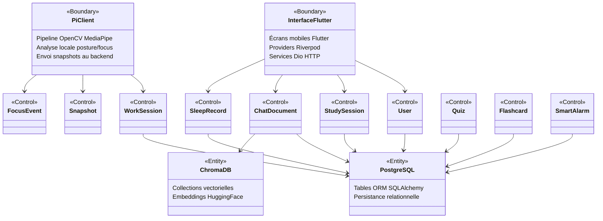
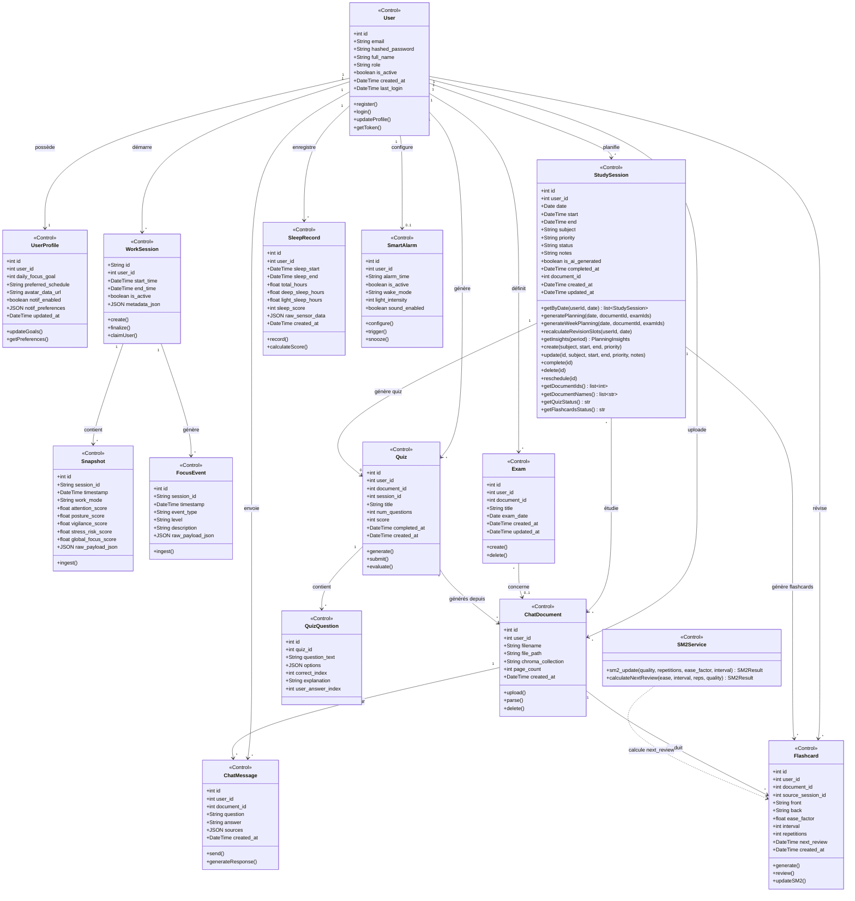
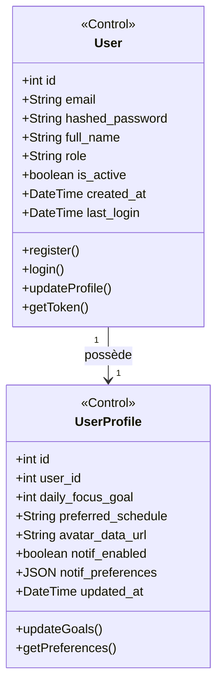
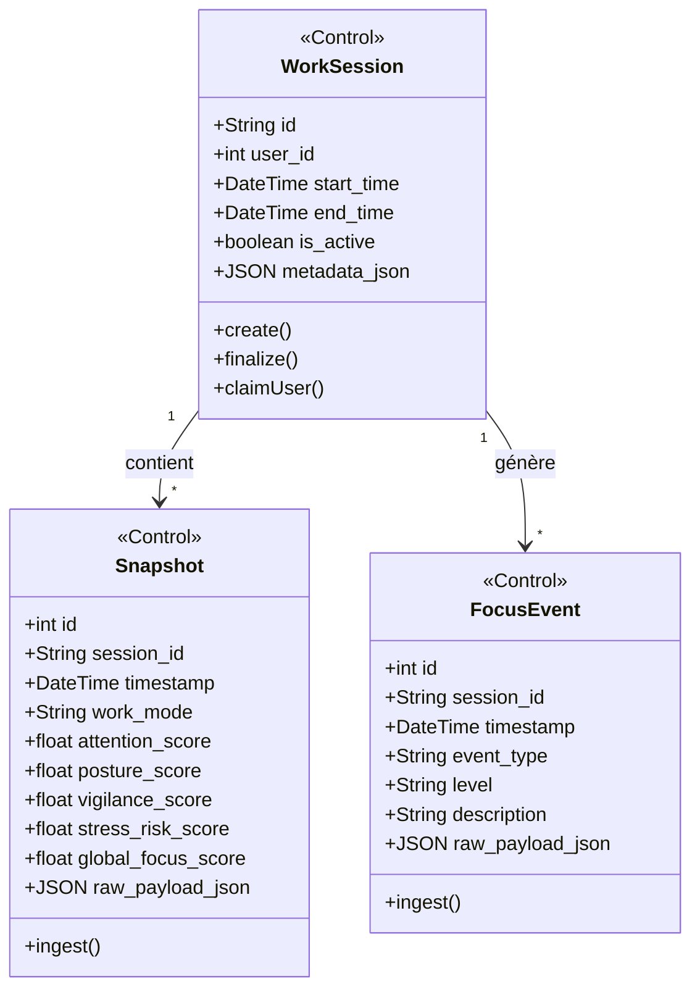
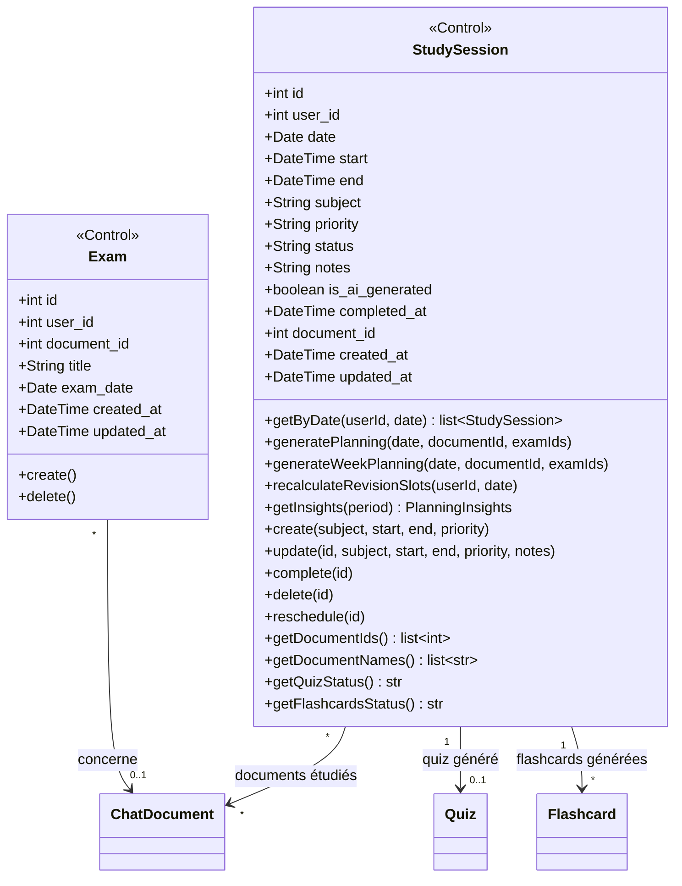
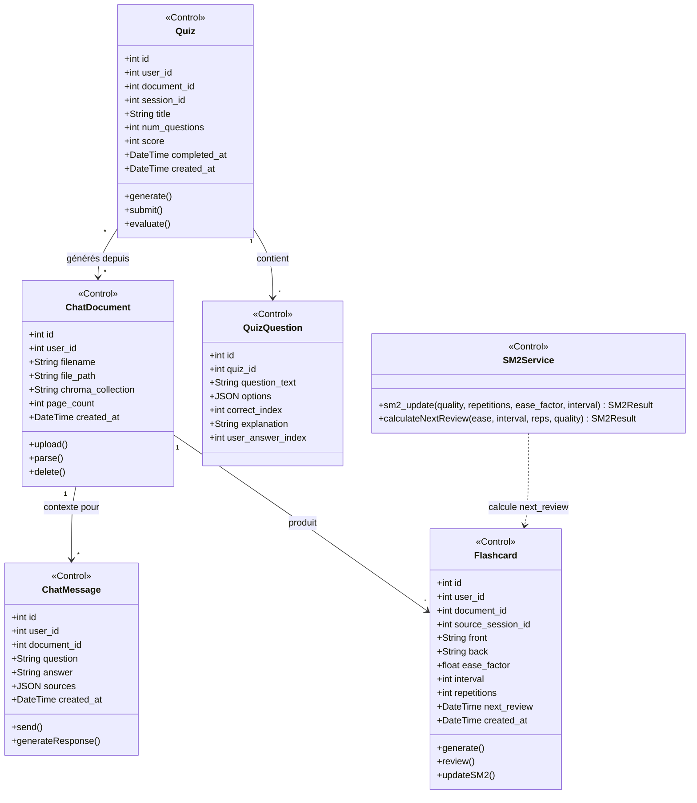
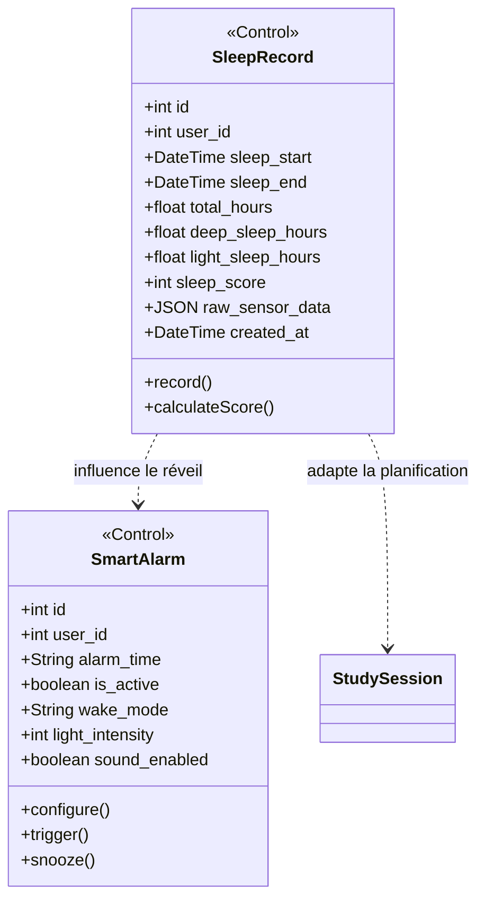

# 📐 Diagramme de Classes – Smart Focus & Life Assistant

**Version** : 5.1  
**Date** : 13 Mai 2026  
**Phase** : Conception  
**Approche** : BCE (Boundary – Control – Entity)

---

## 1. Convention BCE

| Stéréotype | Rôle | Classes concernées |
|:---:|--------|---|
| `<<Boundary>>` | Point d'entrée / Interface utilisateur | Interfaces Flutter (écrans mobiles), pi_client |
| `<<Control>>` | Classes métier avec méthodes (logique applicative) | `User`, `UserProfile`, `WorkSession`, `Snapshot`, `FocusEvent`, `StudySession`, `Exam`, `ChatDocument`, `ChatMessage`, `Quiz`, `QuizQuestion`, `Flashcard`, `SleepRecord`, `SmartAlarm`, `SM2Service` |
| `<<Entity>>` | Données persistantes (stockage) | Base de Données PostgreSQL, ChromaDB |

---

## 2. Vue d'Ensemble BCE en Couches

```mermaid
classDiagram
    direction TB

    class InterfaceFlutter {
        <<Boundary>>
        Écrans mobiles Flutter
        Providers Riverpod
        Services Dio HTTP
    }

    class PiClient {
        <<Boundary>>
        Pipeline OpenCV MediaPipe
        Analyse locale posture/focus
        Envoi snapshots au backend
    }

    class PostgreSQL {
        <<Entity>>
        Tables ORM SQLAlchemy
        Persistance relationnelle
    }

    class ChromaDB {
        <<Entity>>
        Collections vectorielles
        Embeddings HuggingFace
    }

    InterfaceFlutter --> User
    InterfaceFlutter --> StudySession
    InterfaceFlutter --> ChatDocument
    InterfaceFlutter --> SleepRecord
    PiClient --> WorkSession
    PiClient --> Snapshot
    PiClient --> FocusEvent

    User --> PostgreSQL
    WorkSession --> PostgreSQL
    StudySession --> PostgreSQL
    ChatDocument --> PostgreSQL
    ChatDocument --> ChromaDB
    Quiz --> PostgreSQL
    Flashcard --> PostgreSQL
    SleepRecord --> PostgreSQL
    SmartAlarm --> PostgreSQL

    class User {
        <<Control>>
    }
    class WorkSession {
        <<Control>>
    }
    class StudySession {
        <<Control>>
    }
    class ChatDocument {
        <<Control>>
    }
    class Quiz {
        <<Control>>
    }
    class Flashcard {
        <<Control>>
    }
    class SleepRecord {
        <<Control>>
    }
    class SmartAlarm {
        <<Control>>
    }
    class Snapshot {
        <<Control>>
    }
    class FocusEvent {
        <<Control>>
    }
```

---

## 3. Diagramme de Classes Global (Détaillé)

```mermaid
classDiagram
    direction TB

    %% ── Authentification ──
    class User {
        <<Control>>
        +int id
        +String email
        +String hashed_password
        +String full_name
        +String role
        +boolean is_active
        +DateTime created_at
        +DateTime last_login
        +register()
        +login()
        +updateProfile()
        +getToken()
    }

    class UserProfile {
        <<Control>>
        +int id
        +int user_id
        +int daily_focus_goal
        +String preferred_schedule
        +String avatar_data_url
        +boolean notif_enabled
        +JSON notif_preferences
        +DateTime updated_at
        +updateGoals()
        +getPreferences()
    }

    %% ── Vision / Monitoring CV ──
    class WorkSession {
        <<Control>>
        +String id
        +int user_id
        +DateTime start_time
        +DateTime end_time
        +boolean is_active
        +JSON metadata_json
        +create()
        +finalize()
        +claimUser()
    }

    class Snapshot {
        <<Control>>
        +int id
        +String session_id
        +DateTime timestamp
        +String work_mode
        +float attention_score
        +float posture_score
        +float vigilance_score
        +float stress_risk_score
        +float global_focus_score
        +JSON raw_payload_json
        +ingest()
    }

    class FocusEvent {
        <<Control>>
        +int id
        +String session_id
        +DateTime timestamp
        +String event_type
        +String level
        +String description
        +JSON raw_payload_json
        +ingest()
    }

    %% ── Planning Intelligent ──
    class StudySession {
        <<Control>>
        +int id
        +int user_id
        +Date date
        +DateTime start
        +DateTime end
        +String subject
        +String priority
        +String status
        +String notes
        +boolean is_ai_generated
        +DateTime completed_at
        +int document_id
        +DateTime created_at
        +DateTime updated_at
        +getByDate(userId, date) list~StudySession~
        +generatePlanning(date, documentId, examIds)
        +generateWeekPlanning(date, documentId, examIds)
        +recalculateRevisionSlots(userId, date)
        +getInsights(period) PlanningInsights
        +create(subject, start, end, priority)
        +update(id, subject, start, end, priority, notes)
        +complete(id)
        +delete(id)
        +reschedule(id)
        +getDocumentIds() list~int~
        +getDocumentNames() list~str~
        +getQuizStatus() str
        +getFlashcardsStatus() str
    }

    class Exam {
        <<Control>>
        +int id
        +int user_id
        +int document_id
        +String title
        +Date exam_date
        +DateTime created_at
        +DateTime updated_at
        +create()
        +delete()
    }

    %% ── Chatbot RAG ──
    class ChatDocument {
        <<Control>>
        +int id
        +int user_id
        +String filename
        +String file_path
        +String chroma_collection
        +int page_count
        +DateTime created_at
        +upload()
        +parse()
        +delete()
    }

    class ChatMessage {
        <<Control>>
        +int id
        +int user_id
        +int document_id
        +String question
        +String answer
        +JSON sources
        +DateTime created_at
        +send()
        +generateResponse()
    }

    class Quiz {
        <<Control>>
        +int id
        +int user_id
        +int document_id
        +int session_id
        +String title
        +int num_questions
        +int score
        +DateTime completed_at
        +DateTime created_at
        +generate()
        +submit()
        +evaluate()
    }

    class QuizQuestion {
        <<Control>>
        +int id
        +int quiz_id
        +String question_text
        +JSON options
        +int correct_index
        +String explanation
        +int user_answer_index
    }

    class Flashcard {
        <<Control>>
        +int id
        +int user_id
        +int document_id
        +int source_session_id
        +String front
        +String back
        +float ease_factor
        +int interval
        +int repetitions
        +DateTime next_review
        +DateTime created_at
        +generate()
        +review()
        +updateSM2()
    }

    %% ── Sommeil & Réveil ──
    class SleepRecord {
        <<Control>>
        +int id
        +int user_id
        +DateTime sleep_start
        +DateTime sleep_end
        +float total_hours
        +float deep_sleep_hours
        +float light_sleep_hours
        +int sleep_score
        +JSON raw_sensor_data
        +DateTime created_at
        +record()
        +calculateScore()
    }

    class SmartAlarm {
        <<Control>>
        +int id
        +int user_id
        +String alarm_time
        +boolean is_active
        +String wake_mode
        +int light_intensity
        +boolean sound_enabled
        +configure()
        +trigger()
        +snooze()
    }

    %% ── Services IA ──
    class SM2Service {
        <<Control>>
        +sm2_update(quality, repetitions, ease_factor, interval) SM2Result
        +calculateNextReview(ease, interval, reps, quality) SM2Result
    }

    %% ════════════════════════════════════
    %% Relations
    %% ════════════════════════════════════

    User "1" --> "1" UserProfile       : possède
    User "1" --> "*" WorkSession       : démarre
    User "1" --> "*" StudySession      : planifie
    User "1" --> "*" Exam              : définit
    User "1" --> "*" ChatDocument      : uploade
    User "1" --> "*" ChatMessage       : envoie
    User "1" --> "*" Quiz              : génère
    User "1" --> "*" Flashcard         : révise
    User "1" --> "*" SleepRecord       : enregistre
    User "1" --> "0..1" SmartAlarm     : configure

    WorkSession "1" --> "*" Snapshot   : contient
    WorkSession "1" --> "*" FocusEvent : génère

    StudySession "*" --> "*" ChatDocument   : étudie
    StudySession "1" --> "0..1" Quiz        : génère quiz
    StudySession "1" --> "*" Flashcard      : génère flashcards

    Exam "*" --> "0..1" ChatDocument        : concerne

    ChatDocument "1" --> "*" ChatMessage    : contexte pour
    ChatDocument "1" --> "*" Flashcard      : produit

    Quiz "1" --> "*" QuizQuestion           : contient
    Quiz "*" --> "*" ChatDocument           : générés depuis

    SM2Service ..> Flashcard                : calcule next_review
```

---

## 4. Diagramme de Classes par Module

### 4.1 🔐 Module Authentification

```mermaid
classDiagram
    class User {
        <<Control>>
        +int id
        +String email
        +String hashed_password
        +String full_name
        +String role
        +boolean is_active
        +DateTime created_at
        +DateTime last_login
        +register()
        +login()
        +updateProfile()
        +getToken()
    }

    class UserProfile {
        <<Control>>
        +int id
        +int user_id
        +int daily_focus_goal
        +String preferred_schedule
        +String avatar_data_url
        +boolean notif_enabled
        +JSON notif_preferences
        +DateTime updated_at
        +updateGoals()
        +getPreferences()
    }

    User "1" --> "1" UserProfile : possède
```

**Rôles BCE :**

| Classe | Stéréotype | Responsabilité |
|--------|:---:|---|
| `User` | `<<Control>>` | Gestion des comptes, authentification JWT. `role` parmi student/teacher/professional. `is_active` pour soft-delete. |
| `UserProfile` | `<<Control>>` | Préférences utilisateur : `daily_focus_goal`, `preferred_schedule`, avatar (data URL), notifications (JSON). |

---

### 4.2 👁️ Module Vision / Monitoring CV

```mermaid
classDiagram
    class WorkSession {
        <<Control>>
        +String id
        +int user_id
        +DateTime start_time
        +DateTime end_time
        +boolean is_active
        +JSON metadata_json
        +create()
        +finalize()
        +claimUser()
    }

    class Snapshot {
        <<Control>>
        +int id
        +String session_id
        +DateTime timestamp
        +String work_mode
        +float attention_score
        +float posture_score
        +float vigilance_score
        +float stress_risk_score
        +float global_focus_score
        +JSON raw_payload_json
        +ingest()
    }

    class FocusEvent {
        <<Control>>
        +int id
        +String session_id
        +DateTime timestamp
        +String event_type
        +String level
        +String description
        +JSON raw_payload_json
        +ingest()
    }

    WorkSession "1" --> "*" Snapshot   : contient
    WorkSession "1" --> "*" FocusEvent : génère
```

**Rôles BCE :**

| Classe | Stéréotype | Responsabilité |
|--------|:---:|---|
| `WorkSession` | `<<Control>>` | Session de monitoring créée par le pi_client. ID = UUID string. `user_id` nullable (réclamé via `claimUser()`). `metadata_json` stocke la config et le résumé final. |
| `Snapshot` | `<<Control>>` | Point de mesure ~500ms par le pi_client. 5 scores composites + payload brut. Méthode `ingest()` persiste en base. |
| `FocusEvent` | `<<Control>>` | Événement discret (alerte, changement de mode) avec niveau info/warning/critical. Méthode `ingest()` persiste en base. |

---

### 4.3 📅 Module Planning Intelligent

```mermaid
classDiagram
    class StudySession {
        <<Control>>
        +int id
        +int user_id
        +Date date
        +DateTime start
        +DateTime end
        +String subject
        +String priority
        +String status
        +String notes
        +boolean is_ai_generated
        +DateTime completed_at
        +int document_id
        +DateTime created_at
        +DateTime updated_at
        +getByDate(userId, date) list~StudySession~
        +generatePlanning(date, documentId, examIds)
        +generateWeekPlanning(date, documentId, examIds)
        +recalculateRevisionSlots(userId, date)
        +getInsights(period) PlanningInsights
        +create(subject, start, end, priority)
        +update(id, subject, start, end, priority, notes)
        +complete(id)
        +delete(id)
        +reschedule(id)
        +getDocumentIds() list~int~
        +getDocumentNames() list~str~
        +getQuizStatus() str
        +getFlashcardsStatus() str
    }

    class Exam {
        <<Control>>
        +int id
        +int user_id
        +int document_id
        +String title
        +Date exam_date
        +DateTime created_at
        +DateTime updated_at
        +create()
        +delete()
    }

    StudySession "*" --> "*" ChatDocument   : documents étudiés
    StudySession "1" --> "0..1" Quiz        : quiz généré
    StudySession "1" --> "*" Flashcard      : flashcards générées
    Exam "*" --> "0..1" ChatDocument        : concerne
```

**Rôles BCE :**

| Classe | Stéréotype | Responsabilité |
|--------|:---:|---|
| `StudySession` | `<<Control>>` | Session d'étude planifiée. Gère le cycle de vie complet : `create()`, `update()`, `complete()`, `delete()`, `reschedule()`. Pilote aussi la génération IA via `generatePlanning()` (CSV / PDF / sans document + fallback déterministe) et l'adaptation en temps réel via `recalculateRevisionSlots()`. |
| `Exam` | `<<Control>>` | Examen défini par l'utilisateur avec date cible. Utilisé par `StudySession.generatePlanning()` pour intensifier les révisions à l'approche de la date d'examen. |

---

### 4.4 💬 Module Chatbot RAG

```mermaid
classDiagram
    class ChatDocument {
        <<Control>>
        +int id
        +int user_id
        +String filename
        +String file_path
        +String chroma_collection
        +int page_count
        +DateTime created_at
        +upload()
        +parse()
        +delete()
    }

    class ChatMessage {
        <<Control>>
        +int id
        +int user_id
        +int document_id
        +String question
        +String answer
        +JSON sources
        +DateTime created_at
        +send()
        +generateResponse()
    }

    class Quiz {
        <<Control>>
        +int id
        +int user_id
        +int document_id
        +int session_id
        +String title
        +int num_questions
        +int score
        +DateTime completed_at
        +DateTime created_at
        +generate()
        +submit()
        +evaluate()
    }

    class QuizQuestion {
        <<Control>>
        +int id
        +int quiz_id
        +String question_text
        +JSON options
        +int correct_index
        +String explanation
        +int user_answer_index
    }

    class Flashcard {
        <<Control>>
        +int id
        +int user_id
        +int document_id
        +int source_session_id
        +String front
        +String back
        +float ease_factor
        +int interval
        +int repetitions
        +DateTime next_review
        +DateTime created_at
        +generate()
        +review()
        +updateSM2()
    }

    class SM2Service {
        <<Control>>
        +sm2_update(quality, repetitions, ease_factor, interval) SM2Result
        +calculateNextReview(ease, interval, reps, quality) SM2Result
    }

    ChatDocument "1" --> "*" ChatMessage : contexte pour
    ChatDocument "1" --> "*" Flashcard   : produit
    Quiz "1" --> "*" QuizQuestion        : contient
    Quiz "*" --> "*" ChatDocument        : générés depuis
    SM2Service ..> Flashcard             : calcule next_review
```

**Rôles BCE :**

| Classe | Stéréotype | Responsabilité |
|--------|:---:|---|
| `ChatDocument` | `<<Control>>` | Document PDF/CSV indexé. `upload()` sauvegarde le fichier. `parse()` découpe en chunks + embeddings HuggingFace → ChromaDB. `delete()` purge disque + ChromaDB + PostgreSQL. |
| `ChatMessage` | `<<Control>>` | Échange Q&A. `send()` envoie la question. `generateResponse()` orchestre la recherche sémantique ChromaDB + appel LLM. |
| `Quiz` | `<<Control>>` | Quiz QCM multi-documents. `generate()` appelle le LLM. `submit()` enregistre les réponses. `evaluate()` calcule le score et le `weakness_score`. |
| `QuizQuestion` | `<<Control>>` | Question QCM : `options` (JSON array), `correct_index` (0-based), `user_answer_index` pour la réponse utilisateur. |
| `Flashcard` | `<<Control>>` | Carte SM-2. `generate()` crée les cartes via LLM. `review()` reçoit la qualité (0–5). `updateSM2()` recalcule `ease_factor`, `interval`, `next_review`. |
| `SM2Service` | `<<Control>>` | Algorithme SM-2 de répétition espacée. `sm2_update()` renvoie les nouveaux paramètres (repetitions, ease_factor, interval, next_review). |

---

### 4.5 🌙 Module Sommeil & Réveil

```mermaid
classDiagram
    class SleepRecord {
        <<Control>>
        +int id
        +int user_id
        +DateTime sleep_start
        +DateTime sleep_end
        +float total_hours
        +float deep_sleep_hours
        +float light_sleep_hours
        +int sleep_score
        +JSON raw_sensor_data
        +DateTime created_at
        +record()
        +calculateScore()
    }

    class SmartAlarm {
        <<Control>>
        +int id
        +int user_id
        +String alarm_time
        +boolean is_active
        +String wake_mode
        +int light_intensity
        +boolean sound_enabled
        +configure()
        +trigger()
        +snooze()
    }

    SleepRecord ..> SmartAlarm : influence le réveil
    SleepRecord ..> StudySession : adapte la planification
```

**Rôles BCE :**

| Classe | Stéréotype | Responsabilité |
|--------|:---:|---|
| `SleepRecord` | `<<Control>>` | Données de sommeil nuit. `record()` persiste l'enregistrement. `calculateScore()` calcule un score 0–100 selon durée et qualité. Ce score influence `PlanningAIService` (durée/pause/volume des sessions). |
| `SmartAlarm` | `<<Control>>` | Réveil intelligent. `configure()` enregistre les paramètres. `trigger()` déclenche lumière + son progressif. `snooze()` reporte l'alarme. |

---

## 5. Résumé des Classes

| Module | Classes `<<Control>>` | Attributs | Méthodes |
|--------|:---:|:---:|:---:|
| 🔐 Authentification | `User`, `UserProfile` | 16 | 6 |
| 👁️ Vision / CV | `WorkSession`, `Snapshot`, `FocusEvent` | 22 | 5 |
| 📅 Planning | `StudySession`, `Exam` | 18 | 15 |
| 💬 Chatbot RAG | `ChatDocument`, `ChatMessage`, `Quiz`, `QuizQuestion`, `Flashcard`, `SM2Service` | 27 | 16 |
| 🌙 Sommeil & Réveil | `SleepRecord`, `SmartAlarm` | 16 | 6 |
| **Total** | **15 classes `<<Control>>`** | **99** | **50** |

---

## 6. Types de Relations Utilisées

| Relation | Notation UML | Exemple |
|----------|:------------:|---------|
| **Association 1→1** | `"1" --> "1"` | `User` → `UserProfile` |
| **Association 1→N** | `"1" --> "*"` | `User` → `StudySession` |
| **Association N→N** | `"*" --> "*"` | `Quiz` ↔ `ChatDocument` |
| **Composition** | `"1" --> "*"` | `Quiz` → `QuizQuestion` |
| **Dépendance** | `..>` | `PlanningAIService` ..> `StudySession` |

---

## 7. Correspondance BCE ↔ Couches Techniques

| Stéréotype BCE | Couche technique | Exemples concrets |
|:---:|---|---|
| `<<Boundary>>` | Flutter (Riverpod + Dio) / pi_client (OpenCV + MediaPipe) | Écrans Flutter, providers, services Dio |
| `<<Control>>` | Classes du diagramme de classes | `User.register()`, `Snapshot.ingest()`, `Flashcard.updateSM2()` |
| `<<Entity>>` | PostgreSQL (SQLAlchemy ORM) + ChromaDB | Tables SQL, collections vectorielles |

---

## 8. Historique des Versions

| Changement | Détails |
|-----------|---------|
| v5.0 : Stéréotypes BCE ajoutés | Toutes les classes annotées `<<Control>>`. Vue d'ensemble BCE en couches ajoutée. |
| v4.0 : Nettoyage classes non implémentées | `FocusSession`, `PostureAnalysis`, `DailyStats`, `ESP32Device`, `MLService`, `RAGService` supprimés |
| v3.0 : Suppression tables de liaison | `StudySessionDocumentLink`, `QuizDocumentLink` remplacés par relations Many-to-Many directes |
| v2.0 : Remplacement module Focus | `FocusSession/Score/Alert` → `WorkSession`, `Snapshot`, `FocusEvent` |
| v1.0 | Version initiale (30 classes) |

---

**Validé par** : _________________________  
**Date de validation** : _________________________
