# 📐 Diagrammes de Séquence – Smart Focus & Life Assistant

**Version** : 1.0  
**Date** : 18 Février 2026  
**Phase** : Conception  

---

## 1. 🔐 Module Authentification

### 1.1 Inscription (UC1)

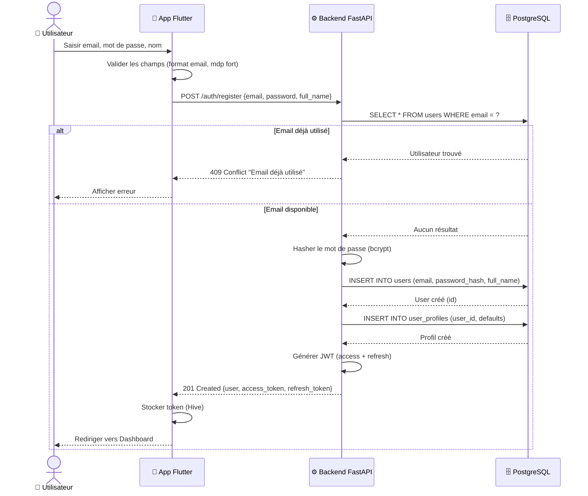
```mermaid
sequenceDiagram
    actor User as 👤 Utilisateur
    participant App as 📱 App Flutter
    participant API as ⚙️ Backend FastAPI
    participant DB as 🗄️ PostgreSQL

    User->>App: Saisir email, mot de passe, nom
    App->>App: Valider les champs (format email, mdp fort)
    App->>API: POST /auth/register {email, password, full_name}
    API->>DB: SELECT * FROM users WHERE email = ?
    
    alt Email déjà utilisé
        DB-->>API: Utilisateur trouvé
        API-->>App: 409 Conflict "Email déjà utilisé"
        App-->>User: Afficher erreur
    else Email disponible
        DB-->>API: Aucun résultat
        API->>API: Hasher le mot de passe (bcrypt)
        API->>DB: INSERT INTO users (email, password_hash, full_name)
        DB-->>API: User créé (id)
        API->>DB: INSERT INTO user_profiles (user_id, defaults)
        DB-->>API: Profil créé
        API->>API: Générer JWT (access + refresh)
        API-->>App: 201 Created {user, access_token, refresh_token}
        App->>App: Stocker token (Hive)
        App-->>User: Rediriger vers Dashboard
    end
```

### 1.2 Connexion (UC2)

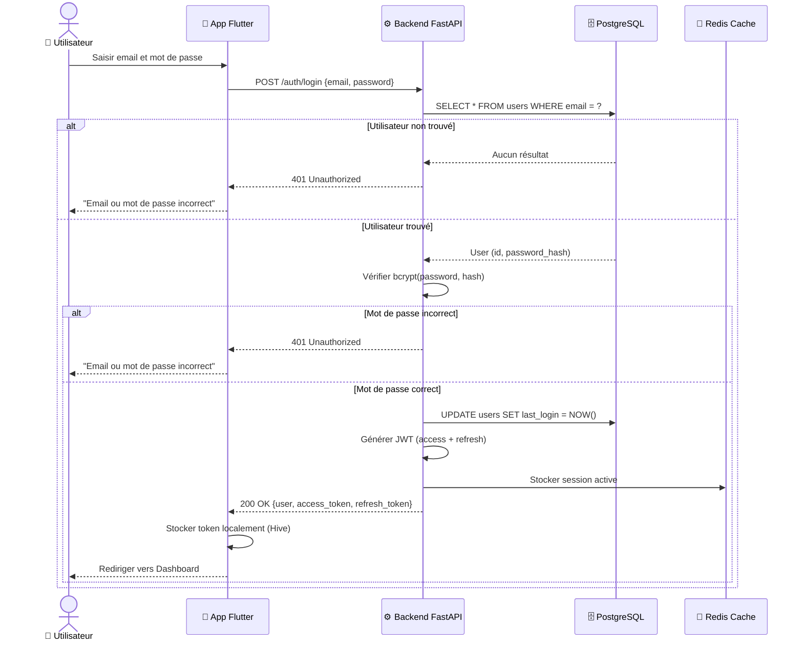
```mermaid
sequenceDiagram
    actor User as 👤 Utilisateur
    participant App as 📱 App Flutter
    participant API as ⚙️ Backend FastAPI
    participant DB as 🗄️ PostgreSQL
    participant Redis as 🔴 Redis Cache

    User->>App: Saisir email et mot de passe
    App->>API: POST /auth/login {email, password}
    API->>DB: SELECT * FROM users WHERE email = ?
    
    alt Utilisateur non trouvé
        DB-->>API: Aucun résultat
        API-->>App: 401 Unauthorized
        App-->>User: "Email ou mot de passe incorrect"
    else Utilisateur trouvé
        DB-->>API: User (id, password_hash)
        API->>API: Vérifier bcrypt(password, hash)
        
        alt Mot de passe incorrect
            API-->>App: 401 Unauthorized
            App-->>User: "Email ou mot de passe incorrect"
        else Mot de passe correct
            API->>DB: UPDATE users SET last_login = NOW()
            API->>API: Générer JWT (access + refresh)
            API->>Redis: Stocker session active
            API-->>App: 200 OK {user, access_token, refresh_token}
            App->>App: Stocker token localement (Hive)
            App-->>User: Rediriger vers Dashboard
        end
    end
```

### 1.3 Gestion du Profil (UC3)

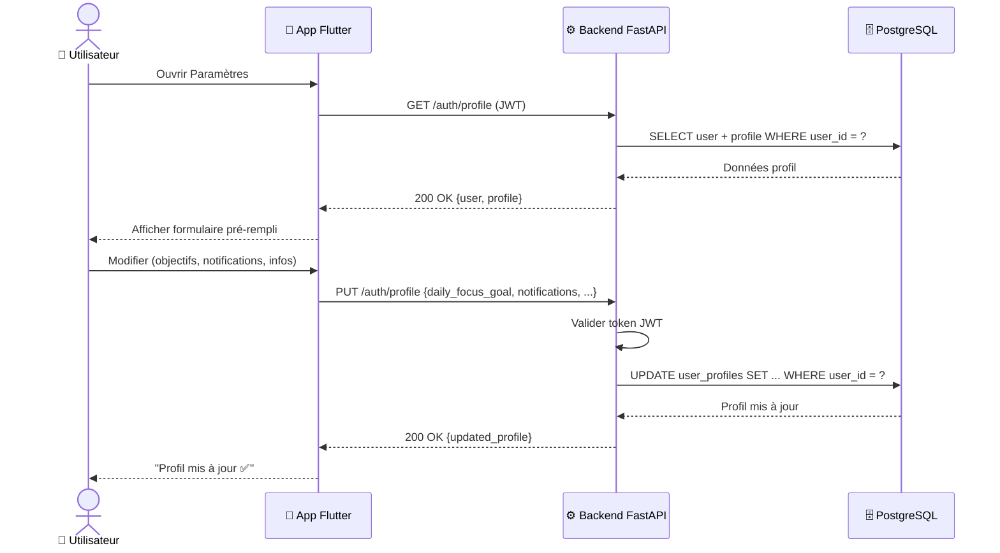
```mermaid
sequenceDiagram
    actor User as 👤 Utilisateur
    participant App as 📱 App Flutter
    participant API as ⚙️ Backend FastAPI
    participant DB as 🗄️ PostgreSQL

    User->>App: Ouvrir Paramètres
    App->>API: GET /auth/profile (JWT)
    API->>DB: SELECT user + profile WHERE user_id = ?
    DB-->>API: Données profil
    API-->>App: 200 OK {user, profile}
    App-->>User: Afficher formulaire pré-rempli
    
    User->>App: Modifier (objectifs, notifications, infos)
    App->>API: PUT /auth/profile {daily_focus_goal, notifications, ...}
    API->>API: Valider token JWT
    API->>DB: UPDATE user_profiles SET ... WHERE user_id = ?
    DB-->>API: Profil mis à jour
    API-->>App: 200 OK {updated_profile}
    App-->>User: "Profil mis à jour ✅"
```

---

## 2. 🎯 Module Focus & Concentration

### 2.1 Démarrer une Session de Focus (UC4)

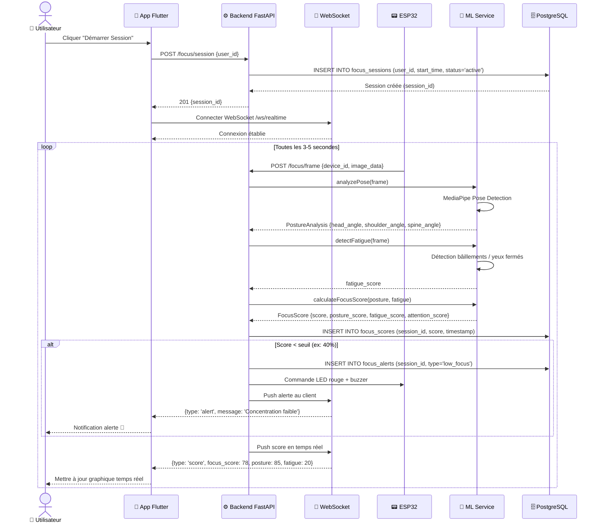
```mermaid
sequenceDiagram
    actor User as 👤 Utilisateur
    participant App as 📱 App Flutter
    participant API as ⚙️ Backend FastAPI
    participant WS as 🔌 WebSocket
    participant ESP as 📟 ESP32
    participant ML as 🧠 ML Service
    participant DB as 🗄️ PostgreSQL

    User->>App: Cliquer "Démarrer Session"
    App->>API: POST /focus/session {user_id}
    API->>DB: INSERT INTO focus_sessions (user_id, start_time, status='active')
    DB-->>API: Session créée (session_id)
    API-->>App: 201 {session_id}
    
    App->>WS: Connecter WebSocket /ws/realtime
    WS-->>App: Connexion établie
    
    loop Toutes les 3-5 secondes
        ESP->>API: POST /focus/frame {device_id, image_data}
        API->>ML: analyzePose(frame)
        ML->>ML: MediaPipe Pose Detection
        ML-->>API: PostureAnalysis {head_angle, shoulder_angle, spine_angle}
        
        API->>ML: detectFatigue(frame)
        ML->>ML: Détection bâillements / yeux fermés
        ML-->>API: fatigue_score
        
        API->>ML: calculateFocusScore(posture, fatigue)
        ML-->>API: FocusScore {score, posture_score, fatigue_score, attention_score}
        
        API->>DB: INSERT INTO focus_scores (session_id, score, timestamp)
        
        alt Score < seuil (ex: 40%)
            API->>DB: INSERT INTO focus_alerts (session_id, type='low_focus')
            API->>ESP: Commande LED rouge + buzzer
            API->>WS: Push alerte au client
            WS-->>App: {type: 'alert', message: 'Concentration faible'}
            App-->>User: Notification alerte 🔴
        end
        
        API->>WS: Push score en temps réel
        WS-->>App: {type: 'score', focus_score: 78, posture: 85, fatigue: 20}
        App-->>User: Mettre à jour graphique temps réel
    end
```

### 2.2 Arrêter la Session & Consulter le Score (UC5, UC7)

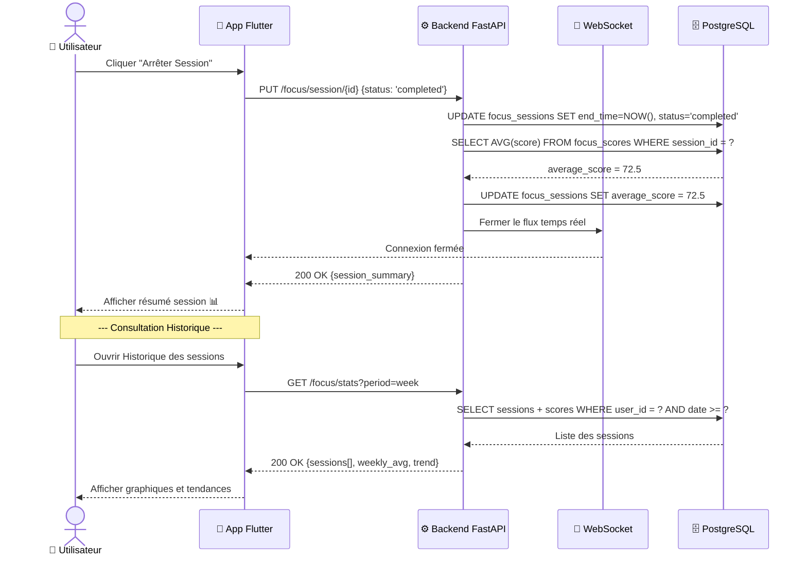
```mermaid
sequenceDiagram
    actor User as 👤 Utilisateur
    participant App as 📱 App Flutter
    participant API as ⚙️ Backend FastAPI
    participant WS as 🔌 WebSocket
    participant DB as 🗄️ PostgreSQL

    User->>App: Cliquer "Arrêter Session"
    App->>API: PUT /focus/session/{id} {status: 'completed'}
    API->>DB: UPDATE focus_sessions SET end_time=NOW(), status='completed'
    API->>DB: SELECT AVG(score) FROM focus_scores WHERE session_id = ?
    DB-->>API: average_score = 72.5
    API->>DB: UPDATE focus_sessions SET average_score = 72.5
    API->>WS: Fermer le flux temps réel
    WS-->>App: Connexion fermée
    API-->>App: 200 OK {session_summary}
    App-->>User: Afficher résumé session 📊

    Note over User, App: --- Consultation Historique ---
    
    User->>App: Ouvrir Historique des sessions
    App->>API: GET /focus/stats?period=week
    API->>DB: SELECT sessions + scores WHERE user_id = ? AND date >= ?
    DB-->>API: Liste des sessions
    API-->>App: 200 OK {sessions[], weekly_avg, trend}
    App-->>User: Afficher graphiques et tendances
```

---

## 3. 📅 Module Planning Intelligent

### 3.1 Générer un Planning IA (UC9)

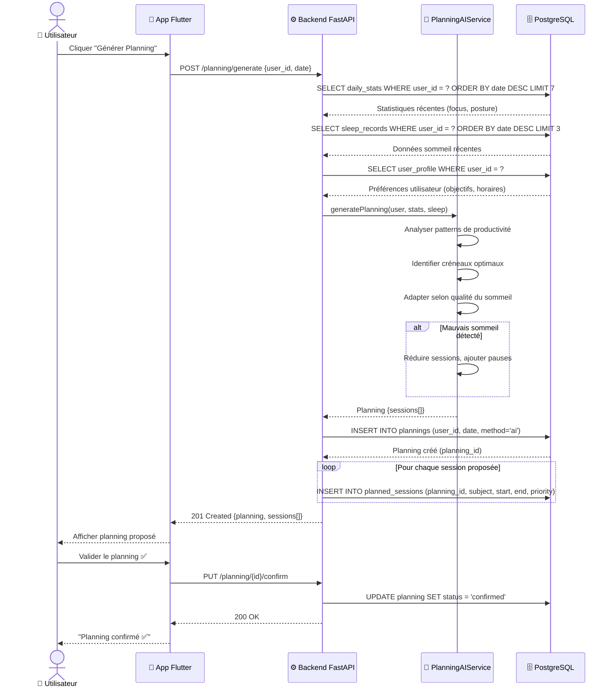
```mermaid
sequenceDiagram
    actor User as 👤 Utilisateur
    participant App as 📱 App Flutter
    participant API as ⚙️ Backend FastAPI
    participant PlanAI as 🤖 PlanningAIService
    participant DB as 🗄️ PostgreSQL

    User->>App: Cliquer "Générer Planning"
    App->>API: POST /planning/generate {user_id, date}
    
    API->>DB: SELECT daily_stats WHERE user_id = ? ORDER BY date DESC LIMIT 7
    DB-->>API: Statistiques récentes (focus, posture)
    
    API->>DB: SELECT sleep_records WHERE user_id = ? ORDER BY date DESC LIMIT 3
    DB-->>API: Données sommeil récentes
    
    API->>DB: SELECT user_profile WHERE user_id = ?
    DB-->>API: Préférences utilisateur (objectifs, horaires)
    
    API->>PlanAI: generatePlanning(user, stats, sleep)
    PlanAI->>PlanAI: Analyser patterns de productivité
    PlanAI->>PlanAI: Identifier créneaux optimaux
    PlanAI->>PlanAI: Adapter selon qualité du sommeil
    
    alt Mauvais sommeil détecté
        PlanAI->>PlanAI: Réduire sessions, ajouter pauses
    end
    
    PlanAI-->>API: Planning {sessions[]}
    
    API->>DB: INSERT INTO plannings (user_id, date, method='ai')
    DB-->>API: Planning créé (planning_id)
    
    loop Pour chaque session proposée
        API->>DB: INSERT INTO planned_sessions (planning_id, subject, start, end, priority)
    end
    
    API-->>App: 201 Created {planning, sessions[]}
    App-->>User: Afficher planning proposé
    
    User->>App: Valider le planning ✅
    App->>API: PUT /planning/{id}/confirm
    API->>DB: UPDATE planning SET status = 'confirmed'
    API-->>App: 200 OK
    App-->>User: "Planning confirmé ✅"
```

### 3.2 Modifier / Supprimer une Session (UC10, UC11)

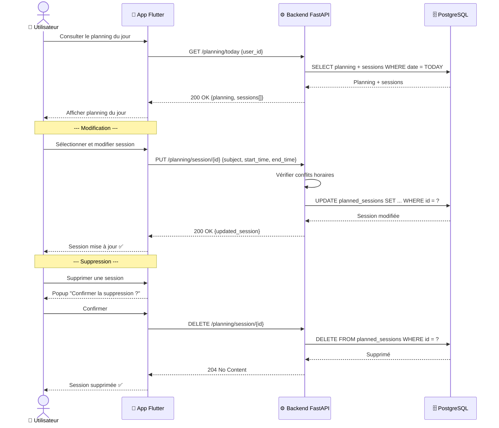
```mermaid
sequenceDiagram
    actor User as 👤 Utilisateur
    participant App as 📱 App Flutter
    participant API as ⚙️ Backend FastAPI
    participant DB as 🗄️ PostgreSQL

    User->>App: Consulter le planning du jour
    App->>API: GET /planning/today {user_id}
    API->>DB: SELECT planning + sessions WHERE date = TODAY
    DB-->>API: Planning + sessions
    API-->>App: 200 OK {planning, sessions[]}
    App-->>User: Afficher planning du jour

    Note over User, App: --- Modification ---
    
    User->>App: Sélectionner et modifier session
    App->>API: PUT /planning/session/{id} {subject, start_time, end_time}
    API->>API: Vérifier conflits horaires
    API->>DB: UPDATE planned_sessions SET ... WHERE id = ?
    DB-->>API: Session modifiée
    API-->>App: 200 OK {updated_session}
    App-->>User: Session mise à jour ✅

    Note over User, App: --- Suppression ---

    User->>App: Supprimer une session
    App-->>User: Popup "Confirmer la suppression ?"
    User->>App: Confirmer
    App->>API: DELETE /planning/session/{id}
    API->>DB: DELETE FROM planned_sessions WHERE id = ?
    DB-->>API: Supprimé
    API-->>App: 204 No Content
    App-->>User: Session supprimée ✅
```

---

## 4. 💬 Module Chatbot RAG

### 4.1 Uploader un Document PDF (UC12)

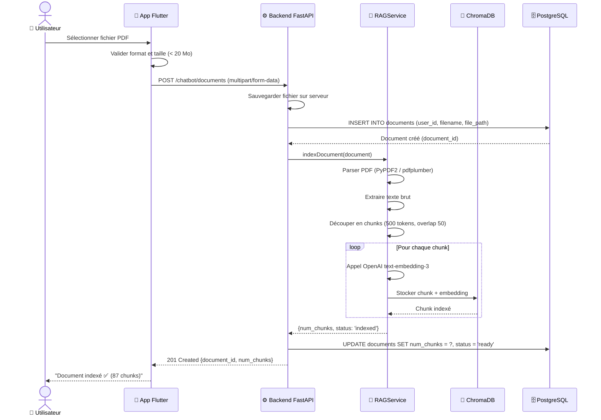
```mermaid
sequenceDiagram
    actor User as 👤 Utilisateur
    participant App as 📱 App Flutter
    participant API as ⚙️ Backend FastAPI
    participant RAG as 🤖 RAGService
    participant Chroma as 🔮 ChromaDB
    participant DB as 🗄️ PostgreSQL

    User->>App: Sélectionner fichier PDF
    App->>App: Valider format et taille (< 20 Mo)
    App->>API: POST /chatbot/documents (multipart/form-data)
    API->>API: Sauvegarder fichier sur serveur
    API->>DB: INSERT INTO documents (user_id, filename, file_path)
    DB-->>API: Document créé (document_id)
    
    API->>RAG: indexDocument(document)
    RAG->>RAG: Parser PDF (PyPDF2 / pdfplumber)
    RAG->>RAG: Extraire texte brut
    RAG->>RAG: Découper en chunks (500 tokens, overlap 50)
    
    loop Pour chaque chunk
        RAG->>RAG: Appel OpenAI text-embedding-3
        RAG->>Chroma: Stocker chunk + embedding
        Chroma-->>RAG: Chunk indexé
    end
    
    RAG-->>API: {num_chunks, status: 'indexed'}
    API->>DB: UPDATE documents SET num_chunks = ?, status = 'ready'
    API-->>App: 201 Created {document_id, num_chunks}
    App-->>User: "Document indexé ✅ (87 chunks)"
```

### 4.2 Poser une Question RAG (UC13)

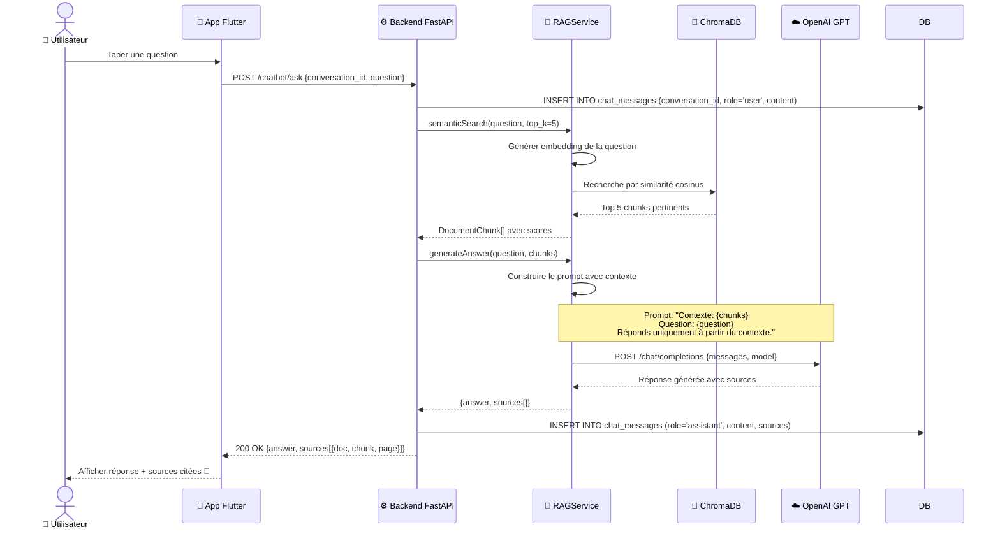
```mermaid
sequenceDiagram
    actor User as 👤 Utilisateur
    participant App as 📱 App Flutter
    participant API as ⚙️ Backend FastAPI
    participant RAG as 🤖 RAGService
    participant Chroma as 🔮 ChromaDB
    participant LLM as ☁️ OpenAI GPT

    User->>App: Taper une question
    App->>API: POST /chatbot/ask {conversation_id, question}
    
    API->>DB: INSERT INTO chat_messages (conversation_id, role='user', content)
    
    API->>RAG: semanticSearch(question, top_k=5)
    RAG->>RAG: Générer embedding de la question
    RAG->>Chroma: Recherche par similarité cosinus
    Chroma-->>RAG: Top 5 chunks pertinents
    RAG-->>API: DocumentChunk[] avec scores
    
    API->>RAG: generateAnswer(question, chunks)
    RAG->>RAG: Construire le prompt avec contexte
    
    Note over RAG, LLM: Prompt: "Contexte: {chunks}<br/>Question: {question}<br/>Réponds uniquement à partir du contexte."
    
    RAG->>LLM: POST /chat/completions {messages, model}
    LLM-->>RAG: Réponse générée avec sources
    RAG-->>API: {answer, sources[]}
    
    API->>DB: INSERT INTO chat_messages (role='assistant', content, sources)
    API-->>App: 200 OK {answer, sources[{doc, chunk, page}]}
    App-->>User: Afficher réponse + sources citées 📄
```

### 4.3 Générer un Quiz (UC14)

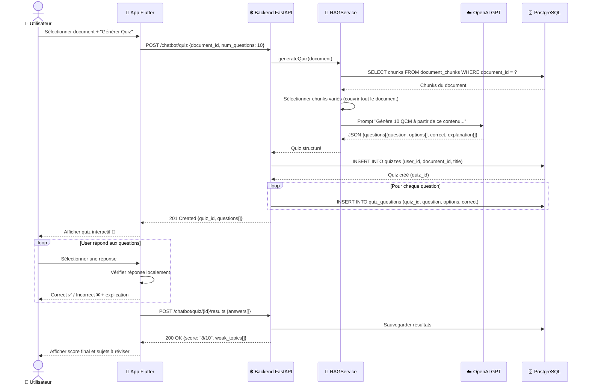
```mermaid
sequenceDiagram
    actor User as 👤 Utilisateur
    participant App as 📱 App Flutter
    participant API as ⚙️ Backend FastAPI
    participant RAG as 🤖 RAGService
    participant LLM as ☁️ OpenAI GPT
    participant DB as 🗄️ PostgreSQL

    User->>App: Sélectionner document + "Générer Quiz"
    App->>API: POST /chatbot/quiz {document_id, num_questions: 10}
    
    API->>RAG: generateQuiz(document)
    RAG->>DB: SELECT chunks FROM document_chunks WHERE document_id = ?
    DB-->>RAG: Chunks du document
    
    RAG->>RAG: Sélectionner chunks variés (couvrir tout le document)
    RAG->>LLM: Prompt "Génère 10 QCM à partir de ce contenu..."
    LLM-->>RAG: JSON {questions[{question, options[], correct, explanation}]}
    RAG-->>API: Quiz structuré
    
    API->>DB: INSERT INTO quizzes (user_id, document_id, title)
    DB-->>API: Quiz créé (quiz_id)
    
    loop Pour chaque question
        API->>DB: INSERT INTO quiz_questions (quiz_id, question, options, correct)
    end
    
    API-->>App: 201 Created {quiz_id, questions[]}
    App-->>User: Afficher quiz interactif 📝
    
    loop User répond aux questions
        User->>App: Sélectionner une réponse
        App->>App: Vérifier réponse localement
        App-->>User: Correct ✅ / Incorrect ❌ + explication
    end
    
    App->>API: POST /chatbot/quiz/{id}/results {answers[]}
    API->>DB: Sauvegarder résultats
    API-->>App: 200 OK {score: "8/10", weak_topics[]}
    App-->>User: Afficher score final et sujets à réviser
```

### 4.4 Créer des Flashcards (UC15)

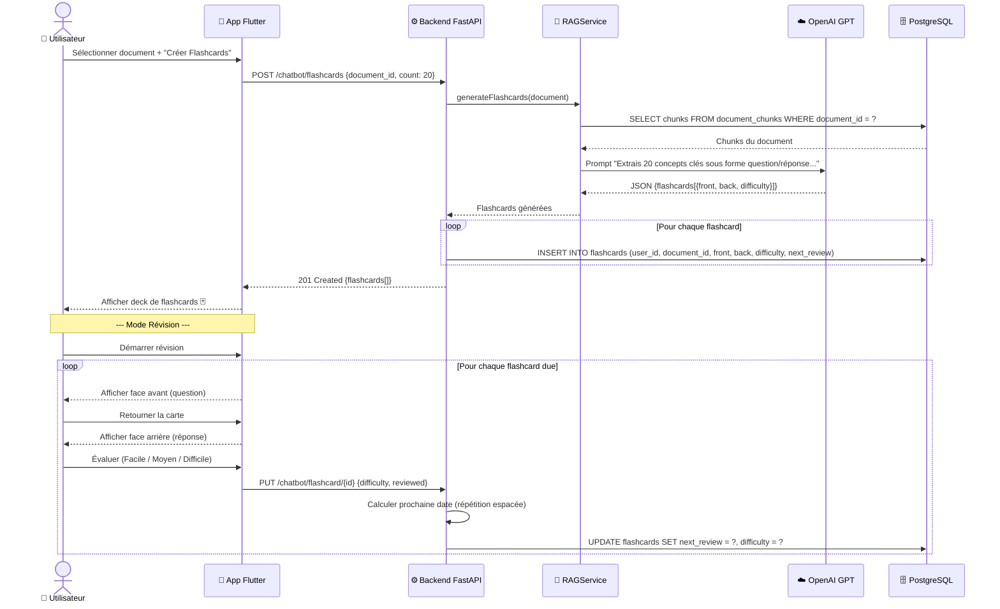
```mermaid
sequenceDiagram
    actor User as 👤 Utilisateur
    participant App as 📱 App Flutter
    participant API as ⚙️ Backend FastAPI
    participant RAG as 🤖 RAGService
    participant LLM as ☁️ OpenAI GPT
    participant DB as 🗄️ PostgreSQL

    User->>App: Sélectionner document + "Créer Flashcards"
    App->>API: POST /chatbot/flashcards {document_id, count: 20}
    
    API->>RAG: generateFlashcards(document)
    RAG->>DB: SELECT chunks FROM document_chunks WHERE document_id = ?
    DB-->>RAG: Chunks du document
    
    RAG->>LLM: Prompt "Extrais 20 concepts clés sous forme question/réponse..."
    LLM-->>RAG: JSON {flashcards[{front, back, difficulty}]}
    RAG-->>API: Flashcards générées
    
    loop Pour chaque flashcard
        API->>DB: INSERT INTO flashcards (user_id, document_id, front, back, difficulty, next_review)
    end
    
    API-->>App: 201 Created {flashcards[]}
    App-->>User: Afficher deck de flashcards 🃏
    
    Note over User, App: --- Mode Révision ---
    
    User->>App: Démarrer révision
    loop Pour chaque flashcard due
        App-->>User: Afficher face avant (question)
        User->>App: Retourner la carte
        App-->>User: Afficher face arrière (réponse)
        User->>App: Évaluer (Facile / Moyen / Difficile)
        App->>API: PUT /chatbot/flashcard/{id} {difficulty, reviewed}
        API->>API: Calculer prochaine date (répétition espacée)
        API->>DB: UPDATE flashcards SET next_review = ?, difficulty = ?
    end
```

---

## 5. 🧍 Module Posture & Ergonomie

### 5.1 Détection Posture en Temps Réel (UC17, UC18)

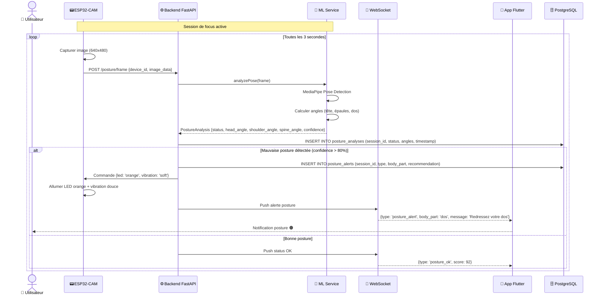
```mermaid
sequenceDiagram
    actor User as 👤 Utilisateur
    participant ESP as 📟 ESP32-CAM
    participant API as ⚙️ Backend FastAPI
    participant ML as 🧠 ML Service
    participant WS as 🔌 WebSocket
    participant App as 📱 App Flutter
    participant DB as 🗄️ PostgreSQL

    Note over ESP, ML: Session de focus active

    loop Toutes les 3 secondes
        ESP->>ESP: Capturer image (640x480)
        ESP->>API: POST /posture/frame {device_id, image_data}
        
        API->>ML: analyzePose(frame)
        ML->>ML: MediaPipe Pose Detection
        ML->>ML: Calculer angles (tête, épaules, dos)
        ML-->>API: PostureAnalysis {status, head_angle, shoulder_angle, spine_angle, confidence}
        
        API->>DB: INSERT INTO posture_analyses (session_id, status, angles, timestamp)
        
        alt Mauvaise posture détectée (confidence > 80%)
            API->>DB: INSERT INTO posture_alerts (session_id, type, body_part, recommendation)
            API->>ESP: Commande {led: 'orange', vibration: 'soft'}
            ESP->>ESP: Allumer LED orange + vibration douce
            API->>WS: Push alerte posture
            WS-->>App: {type: 'posture_alert', body_part: 'dos', message: 'Redressez votre dos'}
            App-->>User: Notification posture 🟠
        else Bonne posture
            API->>WS: Push status OK
            WS-->>App: {type: 'posture_ok', score: 92}
        end
    end
```

### 5.2 Consulter Statistiques Posture (UC19)

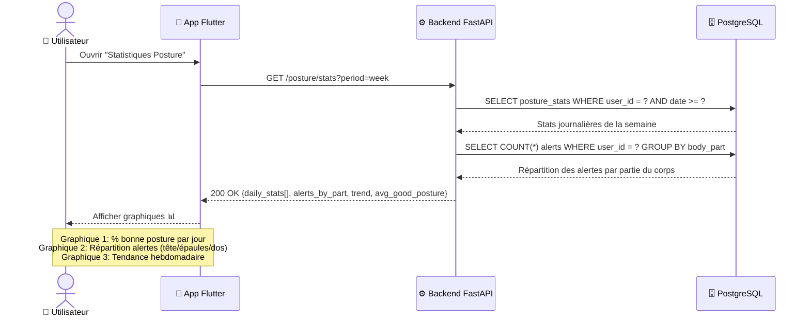
```mermaid
sequenceDiagram
    actor User as 👤 Utilisateur
    participant App as 📱 App Flutter
    participant API as ⚙️ Backend FastAPI
    participant DB as 🗄️ PostgreSQL

    User->>App: Ouvrir "Statistiques Posture"
    App->>API: GET /posture/stats?period=week
    
    API->>DB: SELECT posture_stats WHERE user_id = ? AND date >= ?
    DB-->>API: Stats journalières de la semaine
    
    API->>DB: SELECT COUNT(*) alerts WHERE user_id = ? GROUP BY body_part
    DB-->>API: Répartition des alertes par partie du corps
    
    API-->>App: 200 OK {daily_stats[], alerts_by_part, trend, avg_good_posture}
    App-->>User: Afficher graphiques 📊
    
    Note over App, User: Graphique 1: % bonne posture par jour<br/>Graphique 2: Répartition alertes (tête/épaules/dos)<br/>Graphique 3: Tendance hebdomadaire
```

---

## 6. 🌙 Module Sommeil & Réveil

### 6.1 Enregistrer les Données de Sommeil (UC21)

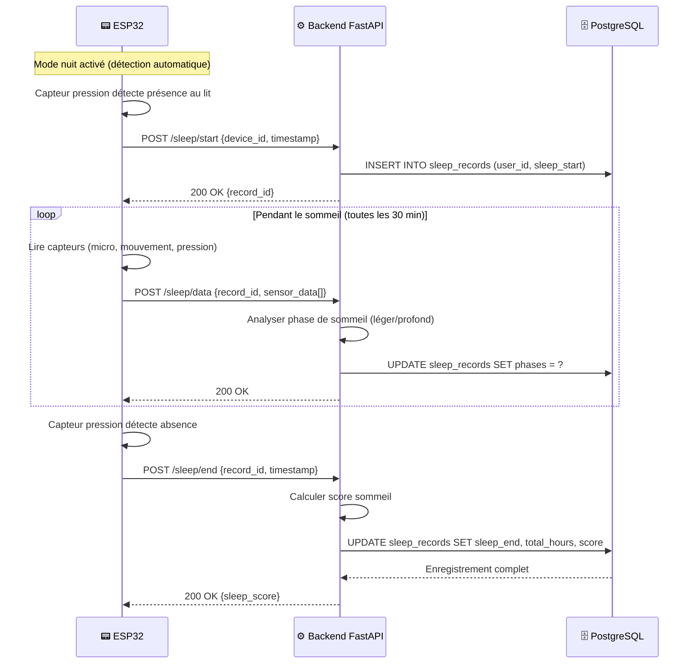
```mermaid
sequenceDiagram
    participant ESP as 📟 ESP32
    participant API as ⚙️ Backend FastAPI
    participant DB as 🗄️ PostgreSQL

    Note over ESP: Mode nuit activé (détection automatique)
    
    ESP->>ESP: Capteur pression détecte présence au lit
    ESP->>API: POST /sleep/start {device_id, timestamp}
    API->>DB: INSERT INTO sleep_records (user_id, sleep_start)
    API-->>ESP: 200 OK {record_id}
    
    loop Pendant le sommeil (toutes les 30 min)
        ESP->>ESP: Lire capteurs (micro, mouvement, pression)
        ESP->>API: POST /sleep/data {record_id, sensor_data[]}
        API->>API: Analyser phase de sommeil (léger/profond)
        API->>DB: UPDATE sleep_records SET phases = ?
        API-->>ESP: 200 OK
    end
    
    ESP->>ESP: Capteur pression détecte absence
    ESP->>API: POST /sleep/end {record_id, timestamp}
    API->>API: Calculer score sommeil
    API->>DB: UPDATE sleep_records SET sleep_end, total_hours, score
    DB-->>API: Enregistrement complet
    API-->>ESP: 200 OK {sleep_score}
```

### 6.2 Réveil Intelligent (UC23)

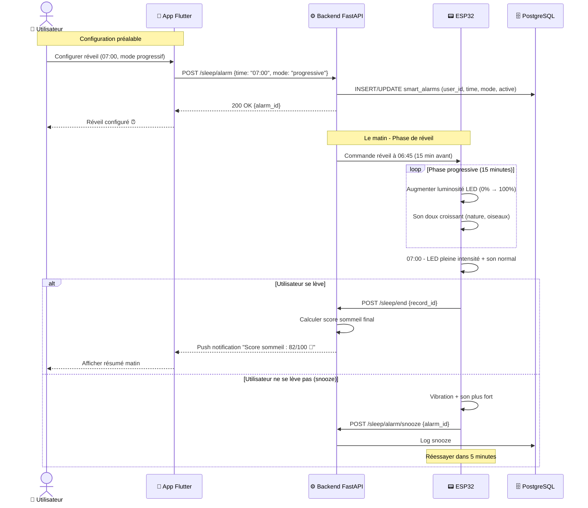
```mermaid
sequenceDiagram
    actor User as 👤 Utilisateur
    participant App as 📱 App Flutter
    participant API as ⚙️ Backend FastAPI
    participant ESP as 📟 ESP32
    participant DB as 🗄️ PostgreSQL

    Note over User, App: Configuration préalable
    
    User->>App: Configurer réveil (07:00, mode progressif)
    App->>API: POST /sleep/alarm {time: "07:00", mode: "progressive"}
    API->>DB: INSERT/UPDATE smart_alarms (user_id, time, mode, active)
    API-->>App: 200 OK {alarm_id}
    App-->>User: Réveil configuré ⏰

    Note over ESP, API: Le matin - Phase de réveil
    
    API->>ESP: Commande réveil à 06:45 (15 min avant)
    
    loop Phase progressive (15 minutes)
        ESP->>ESP: Augmenter luminosité LED (0% → 100%)
        ESP->>ESP: Son doux croissant (nature, oiseaux)
    end
    
    ESP->>ESP: 07:00 - LED pleine intensité + son normal
    
    alt Utilisateur se lève
        ESP->>API: POST /sleep/end {record_id}
        API->>API: Calculer score sommeil final
        API-->>App: Push notification "Score sommeil : 82/100 🌟"
        App-->>User: Afficher résumé matin
    else Utilisateur ne se lève pas (snooze)
        ESP->>ESP: Vibration + son plus fort
        ESP->>API: POST /sleep/alarm/snooze {alarm_id}
        API->>DB: Log snooze
        Note over ESP: Réessayer dans 5 minutes
    end
```

### 6.3 Adapter le Planning selon le Sommeil (UC24)

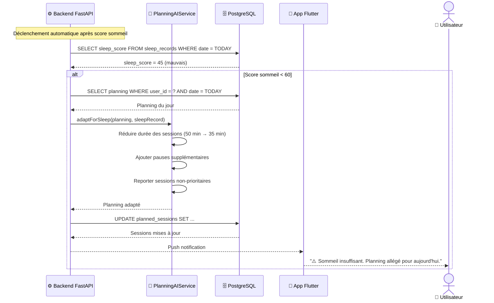
```mermaid
sequenceDiagram
    participant API as ⚙️ Backend FastAPI
    participant PlanAI as 🤖 PlanningAIService
    participant DB as 🗄️ PostgreSQL
    participant App as 📱 App Flutter
    actor User as 👤 Utilisateur

    Note over API: Déclenchement automatique après score sommeil

    API->>DB: SELECT sleep_score FROM sleep_records WHERE date = TODAY
    DB-->>API: sleep_score = 45 (mauvais)
    
    alt Score sommeil < 60
        API->>DB: SELECT planning WHERE user_id = ? AND date = TODAY
        DB-->>API: Planning du jour
        
        API->>PlanAI: adaptForSleep(planning, sleepRecord)
        PlanAI->>PlanAI: Réduire durée des sessions (50 min → 35 min)
        PlanAI->>PlanAI: Ajouter pauses supplémentaires
        PlanAI->>PlanAI: Reporter sessions non-prioritaires
        PlanAI-->>API: Planning adapté
        
        API->>DB: UPDATE planned_sessions SET ...
        DB-->>API: Sessions mises à jour
        
        API-->>App: Push notification
        App-->>User: "⚠️ Sommeil insuffisant. Planning allégé pour aujourd'hui."
    end
```

---

## 7. 🧘 Module Gestion du Stress

### 7.1 Exercice de Respiration (UC25)

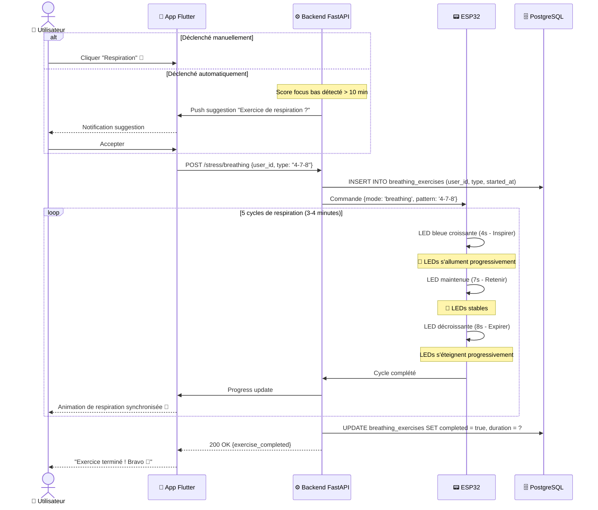
```mermaid
sequenceDiagram
    actor User as 👤 Utilisateur
    participant App as 📱 App Flutter
    participant API as ⚙️ Backend FastAPI
    participant ESP as 📟 ESP32
    participant DB as 🗄️ PostgreSQL

    alt Déclenché manuellement
        User->>App: Cliquer "Respiration" 🧘
    else Déclenché automatiquement
        Note over API: Score focus bas détecté > 10 min
        API->>App: Push suggestion "Exercice de respiration ?"
        App-->>User: Notification suggestion
        User->>App: Accepter
    end
    
    App->>API: POST /stress/breathing {user_id, type: "4-7-8"}
    API->>DB: INSERT INTO breathing_exercises (user_id, type, started_at)
    API->>ESP: Commande {mode: 'breathing', pattern: '4-7-8'}
    
    loop 5 cycles de respiration (3-4 minutes)
        ESP->>ESP: LED bleue croissante (4s - Inspirer)
        Note over ESP: 💙 LEDs s'allument progressivement
        ESP->>ESP: LED maintenue (7s - Retenir)
        Note over ESP: 💙 LEDs stables
        ESP->>ESP: LED décroissante (8s - Expirer)
        Note over ESP: LEDs s'éteignent progressivement
        
        ESP->>API: Cycle complété
        API->>App: Progress update
        App-->>User: Animation de respiration synchronisée 🌊
    end
    
    API->>DB: UPDATE breathing_exercises SET completed = true, duration = ?
    API-->>App: 200 OK {exercise_completed}
    App-->>User: "Exercice terminé ! Bravo 🎉"
```

### 7.2 Suggestion de Micro-pauses (UC26)

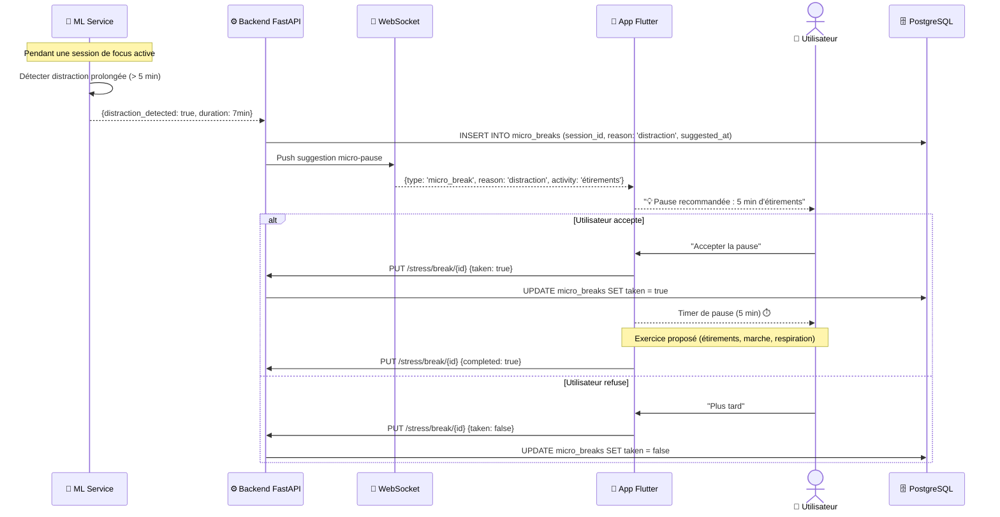
```mermaid
sequenceDiagram
    participant ML as 🧠 ML Service
    participant API as ⚙️ Backend FastAPI
    participant WS as 🔌 WebSocket
    participant App as 📱 App Flutter
    actor User as 👤 Utilisateur
    participant DB as 🗄️ PostgreSQL

    Note over ML: Pendant une session de focus active

    ML->>ML: Détecter distraction prolongée (> 5 min)
    ML-->>API: {distraction_detected: true, duration: 7min}
    
    API->>DB: INSERT INTO micro_breaks (session_id, reason: 'distraction', suggested_at)
    
    API->>WS: Push suggestion micro-pause
    WS-->>App: {type: 'micro_break', reason: 'distraction', activity: 'étirements'}
    App-->>User: "💡 Pause recommandée : 5 min d'étirements"
    
    alt Utilisateur accepte
        User->>App: "Accepter la pause"
        App->>API: PUT /stress/break/{id} {taken: true}
        API->>DB: UPDATE micro_breaks SET taken = true
        App-->>User: Timer de pause (5 min) ⏱️
        Note over User, App: Exercice proposé (étirements, marche, respiration)
        App->>API: PUT /stress/break/{id} {completed: true}
    else Utilisateur refuse
        User->>App: "Plus tard"
        App->>API: PUT /stress/break/{id} {taken: false}
        API->>DB: UPDATE micro_breaks SET taken = false
    end
```

---

## 8. 📊 Module Dashboard & Statistiques

### 8.1 Consulter le Dashboard Global (UC27)

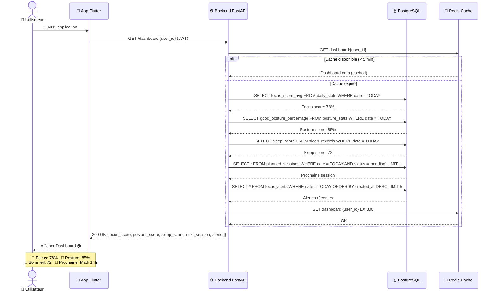
```mermaid
sequenceDiagram
    actor User as 👤 Utilisateur
    participant App as 📱 App Flutter
    participant API as ⚙️ Backend FastAPI
    participant DB as 🗄️ PostgreSQL
    participant Redis as 🔴 Redis Cache

    User->>App: Ouvrir l'application
    App->>API: GET /dashboard {user_id} (JWT)
    
    API->>Redis: GET dashboard:{user_id}
    
    alt Cache disponible (< 5 min)
        Redis-->>API: Dashboard data (cached)
    else Cache expiré
        API->>DB: SELECT focus_score_avg FROM daily_stats WHERE date = TODAY
        DB-->>API: Focus score: 78%
        
        API->>DB: SELECT good_posture_percentage FROM posture_stats WHERE date = TODAY
        DB-->>API: Posture score: 85%
        
        API->>DB: SELECT sleep_score FROM sleep_records WHERE date = TODAY
        DB-->>API: Sleep score: 72
        
        API->>DB: SELECT * FROM planned_sessions WHERE date = TODAY AND status = 'pending' LIMIT 1
        DB-->>API: Prochaine session
        
        API->>DB: SELECT * FROM focus_alerts WHERE date = TODAY ORDER BY created_at DESC LIMIT 5
        DB-->>API: Alertes récentes
        
        API->>Redis: SET dashboard:{user_id} EX 300
        Redis-->>API: OK
    end
    
    API-->>App: 200 OK {focus_score, posture_score, sleep_score, next_session, alerts[]}
    App-->>User: Afficher Dashboard 🏠
    
    Note over App, User: 🎯 Focus: 78% | 🧍 Posture: 85%<br/>🌙 Sommeil: 72 | 📅 Prochaine: Math 14h
```

### 8.2 Statistiques Hebdomadaires & Conseils (UC28, UC29)

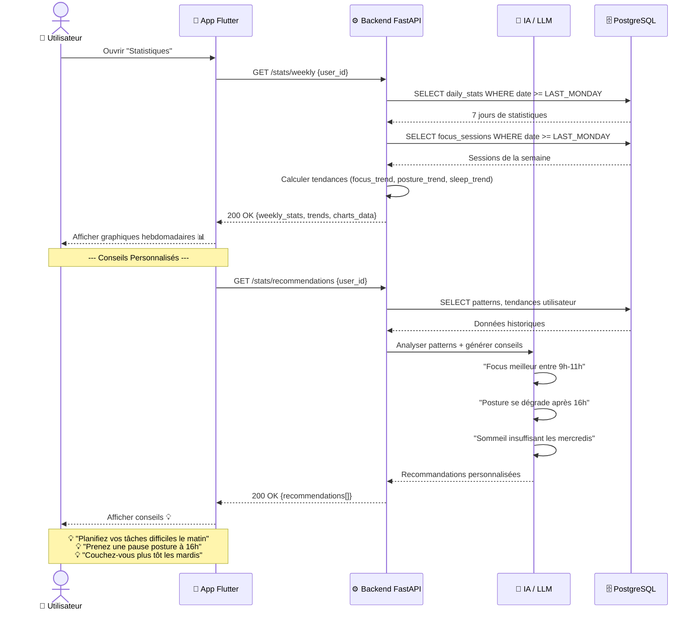
```mermaid
sequenceDiagram
    actor User as 👤 Utilisateur
    participant App as 📱 App Flutter
    participant API as ⚙️ Backend FastAPI
    participant IA as 🤖 IA / LLM
    participant DB as 🗄️ PostgreSQL

    User->>App: Ouvrir "Statistiques"
    App->>API: GET /stats/weekly {user_id}
    
    API->>DB: SELECT daily_stats WHERE date >= LAST_MONDAY
    DB-->>API: 7 jours de statistiques
    
    API->>DB: SELECT focus_sessions WHERE date >= LAST_MONDAY
    DB-->>API: Sessions de la semaine
    
    API->>API: Calculer tendances (focus_trend, posture_trend, sleep_trend)
    
    API-->>App: 200 OK {weekly_stats, trends, charts_data}
    App-->>User: Afficher graphiques hebdomadaires 📊

    Note over User, App: --- Conseils Personnalisés ---

    App->>API: GET /stats/recommendations {user_id}
    
    API->>DB: SELECT patterns, tendances utilisateur
    DB-->>API: Données historiques
    
    API->>IA: Analyser patterns + générer conseils
    IA->>IA: "Focus meilleur entre 9h-11h"
    IA->>IA: "Posture se dégrade après 16h"
    IA->>IA: "Sommeil insuffisant les mercredis"
    IA-->>API: Recommandations personnalisées
    
    API-->>App: 200 OK {recommendations[]}
    App-->>User: Afficher conseils 💡
    
    Note over App, User: 💡 "Planifiez vos tâches difficiles le matin"<br/>💡 "Prenez une pause posture à 16h"<br/>💡 "Couchez-vous plus tôt les mardis"
```

---

## 9. Résumé des Diagrammes de Séquence

| Module | Diagrammes | CU Couverts |
|--------|:----------:|:-----------:|
| 🔐 Authentification | 3 | UC1, UC2, UC3 |
| 🎯 Focus & Concentration | 2 | UC4, UC5, UC6, UC7 |
| 📅 Planning Intelligent | 2 | UC8, UC9, UC10, UC11 |
| 💬 Chatbot RAG | 4 | UC12, UC13, UC14, UC15 |
| 🧍 Posture & Ergonomie | 2 | UC17, UC18, UC19 |
| 🌙 Sommeil & Réveil | 3 | UC21, UC23, UC24 |
| 🧘 Gestion du Stress | 2 | UC25, UC26 |
| 📊 Dashboard & Stats | 2 | UC27, UC28, UC29 |
| **Total** | **20** | **29 CU** |

---

## 10. Légende

| Symbole | Signification |
|---------|---------------|
| `👤` | Utilisateur (acteur principal) |
| `📱` | Application mobile Flutter |
| `⚙️` | Backend FastAPI (API REST) |
| `🔌` | WebSocket (communication temps réel) |
| `📟` | Boîtier ESP32 (hardware IoT) |
| `🧠` | Service ML (MediaPipe, TensorFlow) |
| `🤖` | Service IA (LLM, RAG, Planning) |
| `☁️` | API externe (OpenAI) |
| `🗄️` | Base de données PostgreSQL |
| `🔮` | ChromaDB (base vectorielle) |
| `🔴` | Redis (cache) |

---

**Validé par** : _________________________  
**Date de validation** : _________________________
