# 📐 Diagrammes de Séquence – Smart Focus & Life Assistant

**Version** : 5.1  
**Date** : 12 Mai 2026  
**Phase** : Conception  
**Approche** : BCE (Boundary – Control – Entity)

---

## Convention BCE

Les participants de chaque diagramme correspondent exactement aux classes du diagramme de classes (`class_sprint3.puml`).

| Stéréotype | Symbole | Participants | Classes du diagramme de classes |
|:---:|:---:|---|---|
| `<<Boundary>>` | `🖥️` | Interfaces Flutter, pi_client | — |
| `<<Control>>` | `⚙️` | Classes métier avec méthodes | `User`, `UserProfile`, `WorkSession`, `Snapshot`, `FocusEvent`, `StudySession`, `Exam`, `ChatDocument`, `ChatMessage`, `Quiz`, `QuizQuestion`, `Flashcard`, `SleepRecord`, `SmartAlarm` |
| `<<Entity>>` | `🗄️` | Persistance | Base de Données (PostgreSQL), ChromaDB |

---

## 1. 🔐 Module Authentification

### 1.1 Inscription (UC1)

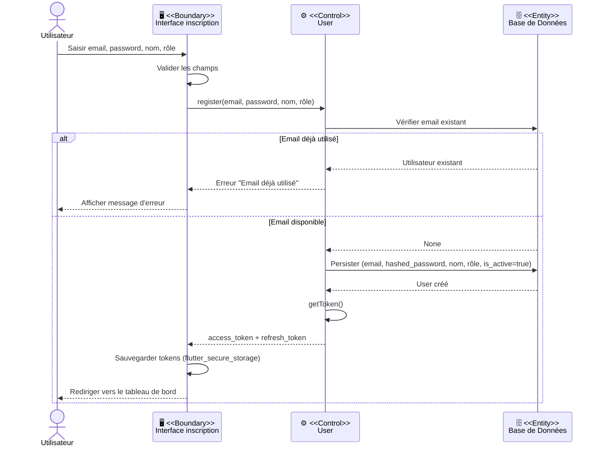
```mermaid
sequenceDiagram
    actor Utilisateur
    participant B  as 🖥️ <<Boundary>><br/>Interface inscription
    participant U  as ⚙️ <<Control>><br/>User
    participant E  as 🗄️ <<Entity>><br/>Base de Données

    Utilisateur->>B: Saisir email, password, nom, rôle
    B->>B: Valider les champs
    B->>U: register(email, password, nom, rôle)
    U->>E: Vérifier email existant

    alt Email déjà utilisé
        E-->>U: Utilisateur existant
        U-->>B: Erreur "Email déjà utilisé"
        B-->>Utilisateur: Afficher message d'erreur
    else Email disponible
        E-->>U: None
        U->>E: Persister (email, hashed_password, nom, rôle, is_active=true)
        E-->>U: User créé
        U->>U: getToken()
        U-->>B: access_token + refresh_token
        B->>B: Sauvegarder tokens (flutter_secure_storage)
        B-->>Utilisateur: Rediriger vers le tableau de bord
    end
```

### 1.2 Connexion (UC2)

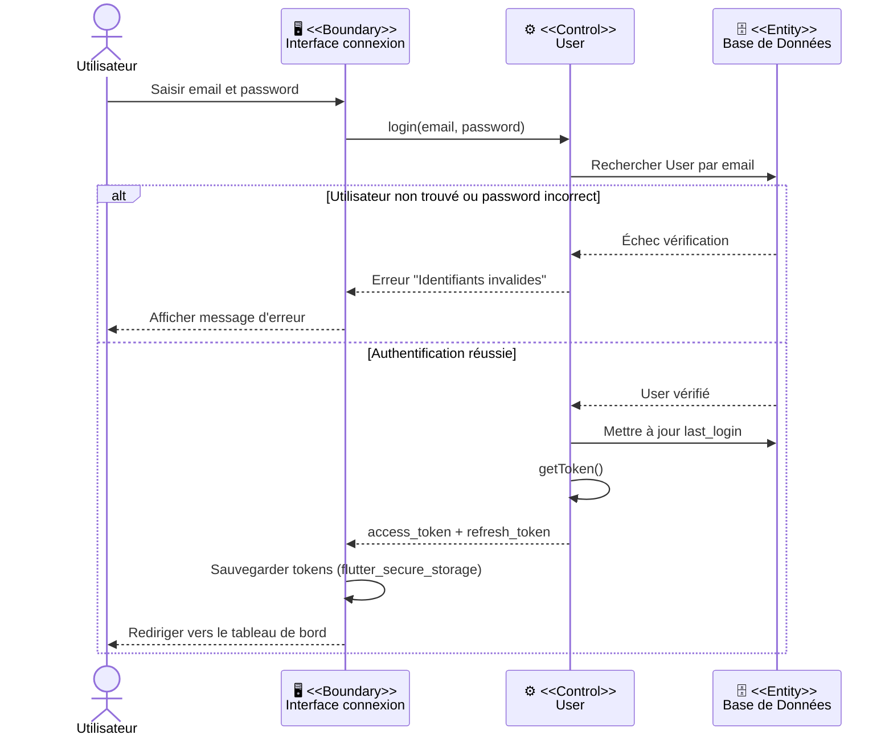
```mermaid
sequenceDiagram
    actor Utilisateur
    participant B  as 🖥️ <<Boundary>><br/>Interface connexion
    participant U  as ⚙️ <<Control>><br/>User
    participant E  as 🗄️ <<Entity>><br/>Base de Données

    Utilisateur->>B: Saisir email et password
    B->>U: login(email, password)
    U->>E: Rechercher User par email

    alt Utilisateur non trouvé ou password incorrect
        E-->>U: Échec vérification
        U-->>B: Erreur "Identifiants invalides"
        B-->>Utilisateur: Afficher message d'erreur
    else Authentification réussie
        E-->>U: User vérifié
        U->>E: Mettre à jour last_login
        U->>U: getToken()
        U-->>B: access_token + refresh_token
        B->>B: Sauvegarder tokens (flutter_secure_storage)
        B-->>Utilisateur: Rediriger vers le tableau de bord
    end
```

### 1.3 Gestion du Profil (UC3)

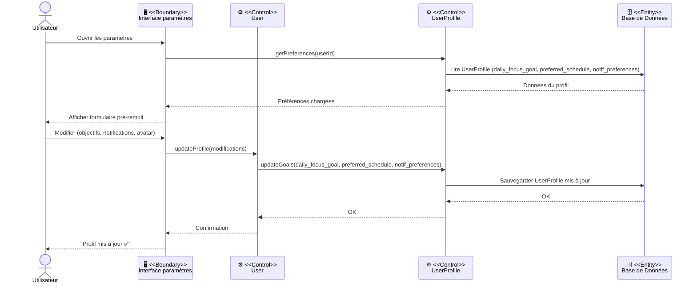
```mermaid
sequenceDiagram
    actor Utilisateur
    participant B  as 🖥️ <<Boundary>><br/>Interface paramètres
    participant U  as ⚙️ <<Control>><br/>User
    participant UP as ⚙️ <<Control>><br/>UserProfile
    participant E  as 🗄️ <<Entity>><br/>Base de Données

    Utilisateur->>B: Ouvrir les paramètres
    B->>UP: getPreferences(userId)
    UP->>E: Lire UserProfile (daily_focus_goal, preferred_schedule, notif_preferences)
    E-->>UP: Données du profil
    UP-->>B: Préférences chargées
    B-->>Utilisateur: Afficher formulaire pré-rempli

    Utilisateur->>B: Modifier (objectifs, notifications, avatar)
    B->>U: updateProfile(modifications)
    U->>UP: updateGoals(daily_focus_goal, preferred_schedule, notif_preferences)
    UP->>E: Sauvegarder UserProfile mis à jour
    E-->>UP: OK
    UP-->>U: OK
    U-->>B: Confirmation
    B-->>Utilisateur: "Profil mis à jour ✅"
```

---

## 2. 👁️ Module Vision & Monitoring CV

### 2.1 Démarrer une Session de Monitoring (UC4)

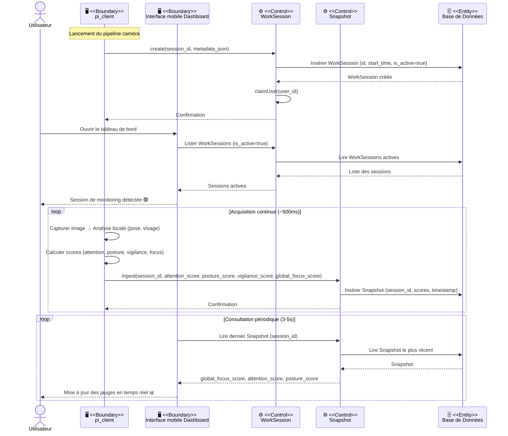
```mermaid
sequenceDiagram
    actor Utilisateur
    participant BP as 🖥️ <<Boundary>><br/>pi_client
    participant BM as 🖥️ <<Boundary>><br/>Interface mobile Dashboard
    participant WS as ⚙️ <<Control>><br/>WorkSession
    participant SN as ⚙️ <<Control>><br/>Snapshot
    participant E  as 🗄️ <<Entity>><br/>Base de Données

    Note over BP: Lancement du pipeline caméra

    BP->>WS: create(session_id, metadata_json)
    WS->>E: Insérer WorkSession (id, start_time, is_active=true)
    E-->>WS: WorkSession créée
    WS->>WS: claimUser(user_id)
    WS-->>BP: Confirmation

    Utilisateur->>BM: Ouvrir le tableau de bord
    BM->>WS: Lister WorkSessions (is_active=true)
    WS->>E: Lire WorkSessions actives
    E-->>WS: Liste des sessions
    WS-->>BM: Sessions actives
    BM-->>Utilisateur: Session de monitoring détectée 🟢

    loop Acquisition continue (~500ms)
        BP->>BP: Capturer image → Analyse locale (pose, visage)
        BP->>BP: Calculer scores (attention, posture, vigilance, focus)
        BP->>SN: ingest(session_id, attention_score, posture_score, vigilance_score, global_focus_score)
        SN->>E: Insérer Snapshot (session_id, scores, timestamp)
        SN-->>BP: Confirmation
    end

    loop Consultation périodique (3-5s)
        BM->>SN: Lire dernier Snapshot (session_id)
        SN->>E: Lire Snapshot le plus récent
        E-->>SN: Snapshot
        SN-->>BM: global_focus_score, attention_score, posture_score
        BM-->>Utilisateur: Mise à jour des jauges en temps réel 📊
    end
```

### 2.2 Événements et Finalisation (UC5, UC7)

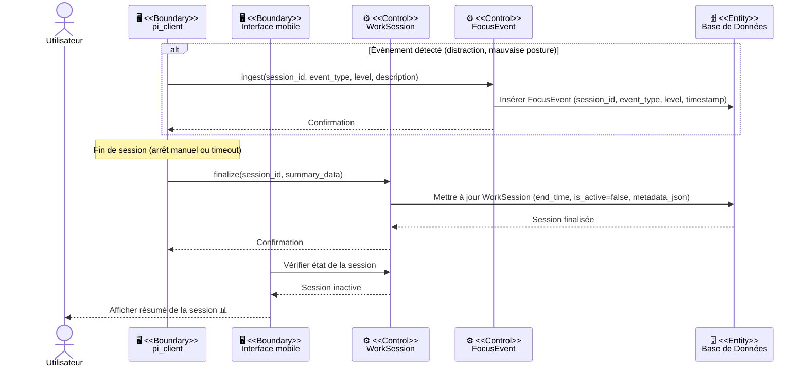
```mermaid
sequenceDiagram
    actor Utilisateur
    participant BP as 🖥️ <<Boundary>><br/>pi_client
    participant BM as 🖥️ <<Boundary>><br/>Interface mobile
    participant WS as ⚙️ <<Control>><br/>WorkSession
    participant FE as ⚙️ <<Control>><br/>FocusEvent
    participant E  as 🗄️ <<Entity>><br/>Base de Données

    alt Événement détecté (distraction, mauvaise posture)
        BP->>FE: ingest(session_id, event_type, level, description)
        FE->>E: Insérer FocusEvent (session_id, event_type, level, timestamp)
        FE-->>BP: Confirmation
    end

    Note over BP: Fin de session (arrêt manuel ou timeout)

    BP->>WS: finalize(session_id, summary_data)
    WS->>E: Mettre à jour WorkSession (end_time, is_active=false, metadata_json)
    E-->>WS: Session finalisée
    WS-->>BP: Confirmation

    BM->>WS: Vérifier état de la session
    WS-->>BM: Session inactive
    BM-->>Utilisateur: Afficher résumé de la session 📊
```

---

## 3. 📅 Module Planning Intelligent

### 3.1 Générer un Planning Journalier (UC9)

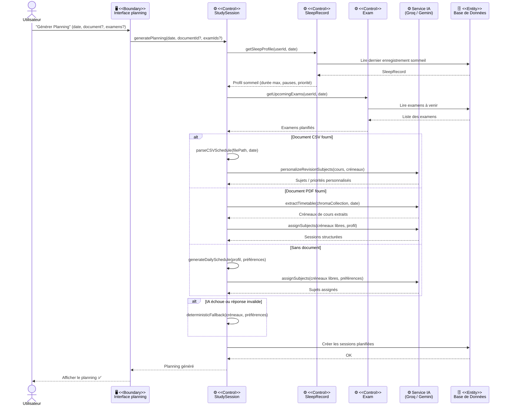
```mermaid
sequenceDiagram
    actor Utilisateur
    participant B  as 🖥️ <<Boundary>><br/>Interface planning
    participant SS as ⚙️ <<Control>><br/>StudySession
    participant SR as ⚙️ <<Control>><br/>SleepRecord
    participant EX as ⚙️ <<Control>><br/>Exam
    participant LLM as ⚙️ Service IA<br/>(Groq / Gemini)
    participant E  as 🗄️ <<Entity>><br/>Base de Données

    Utilisateur->>B: "Générer Planning" (date, document?, examens?)
    B->>SS: generatePlanning(date, documentId?, examIds?)

    SS->>SR: getSleepProfile(userId, date)
    SR->>E: Lire dernier enregistrement sommeil
    E-->>SR: SleepRecord
    SR-->>SS: Profil sommeil (durée max, pauses, priorité)

    SS->>EX: getUpcomingExams(userId, date)
    EX->>E: Lire examens à venir
    E-->>EX: Liste des examens
    EX-->>SS: Examens planifiés

    alt Document CSV fourni
        SS->>SS: parseCSVSchedule(filePath, date)
        SS->>LLM: personalizeRevisionSubjects(cours, créneaux)
        LLM-->>SS: Sujets / priorités personnalisés
    else Document PDF fourni
        SS->>LLM: extractTimetable(chromaCollection, date)
        LLM-->>SS: Créneaux de cours extraits
        SS->>LLM: assignSubjects(créneaux libres, profil)
        LLM-->>SS: Sessions structurées
    else Sans document
        SS->>SS: generateDailySchedule(profil, préférences)
        SS->>LLM: assignSubjects(créneaux libres, préférences)
        LLM-->>SS: Sujets assignés
    end

    alt IA échoue ou réponse invalide
        SS->>SS: deterministicFallback(créneaux, préférences)
    end

    SS->>E: Créer les sessions planifiées
    E-->>SS: OK
    SS-->>B: Planning généré
    B-->>Utilisateur: Afficher le planning ✅
```

### 3.2 Générer un Planning Semaine (UC9w)

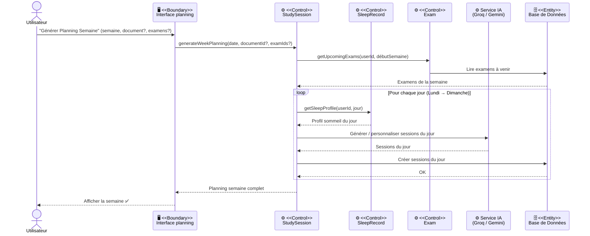
```mermaid
sequenceDiagram
    actor Utilisateur
    participant B  as 🖥️ <<Boundary>><br/>Interface planning
    participant SS as ⚙️ <<Control>><br/>StudySession
    participant SR as ⚙️ <<Control>><br/>SleepRecord
    participant EX as ⚙️ <<Control>><br/>Exam
    participant LLM as ⚙️ Service IA<br/>(Groq / Gemini)
    participant E  as 🗄️ <<Entity>><br/>Base de Données

    Utilisateur->>B: "Générer Planning Semaine" (semaine, document?, examens?)
    B->>SS: generateWeekPlanning(date, documentId?, examIds?)

    SS->>EX: getUpcomingExams(userId, débutSemaine)
    EX->>E: Lire examens à venir
    E-->>SS: Examens de la semaine

    loop Pour chaque jour (Lundi → Dimanche)
        SS->>SR: getSleepProfile(userId, jour)
        SR-->>SS: Profil sommeil du jour
        SS->>LLM: Générer / personnaliser sessions du jour
        LLM-->>SS: Sessions du jour
        SS->>E: Créer sessions du jour
        E-->>SS: OK
    end

    SS-->>B: Planning semaine complet
    B-->>Utilisateur: Afficher la semaine ✅
```

### 3.3 Recalculer le Planning du Jour (UC9r)

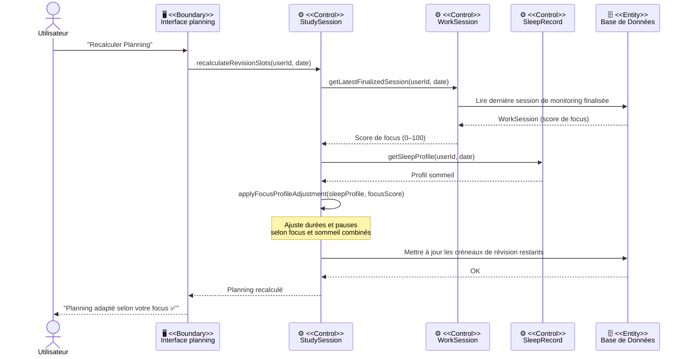
```mermaid
sequenceDiagram
    actor Utilisateur
    participant B  as 🖥️ <<Boundary>><br/>Interface planning
    participant SS as ⚙️ <<Control>><br/>StudySession
    participant WS as ⚙️ <<Control>><br/>WorkSession
    participant SR as ⚙️ <<Control>><br/>SleepRecord
    participant E  as 🗄️ <<Entity>><br/>Base de Données

    Utilisateur->>B: "Recalculer Planning"
    B->>SS: recalculateRevisionSlots(userId, date)

    SS->>WS: getLatestFinalizedSession(userId, date)
    WS->>E: Lire dernière session de monitoring finalisée
    E-->>WS: WorkSession (score de focus)
    WS-->>SS: Score de focus (0–100)

    SS->>SR: getSleepProfile(userId, date)
    SR-->>SS: Profil sommeil

    SS->>SS: applyFocusProfileAdjustment(sleepProfile, focusScore)
    Note over SS: Ajuste durées et pauses<br/>selon focus et sommeil combinés

    SS->>E: Mettre à jour les créneaux de révision restants
    E-->>SS: OK
    SS-->>B: Planning recalculé
    B-->>Utilisateur: "Planning adapté selon votre focus ✅"
```

### 3.4 Consulter et Modifier une Session (UC10, UC11)

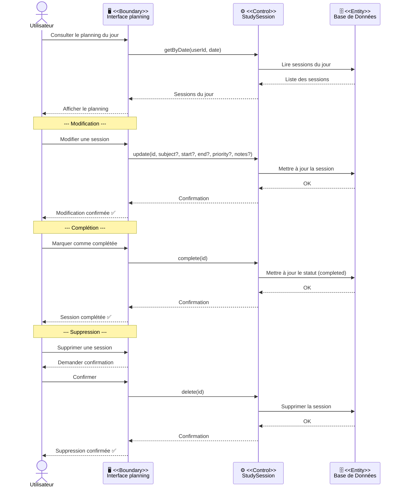
```mermaid
sequenceDiagram
    actor Utilisateur
    participant B  as 🖥️ <<Boundary>><br/>Interface planning
    participant SS as ⚙️ <<Control>><br/>StudySession
    participant E  as 🗄️ <<Entity>><br/>Base de Données

    Utilisateur->>B: Consulter le planning du jour
    B->>SS: getByDate(userId, date)
    SS->>E: Lire sessions du jour
    E-->>SS: Liste des sessions
    SS-->>B: Sessions du jour
    B-->>Utilisateur: Afficher le planning

    Note over Utilisateur, B: --- Modification ---

    Utilisateur->>B: Modifier une session
    B->>SS: update(id, subject?, start?, end?, priority?, notes?)
    SS->>E: Mettre à jour la session
    E-->>SS: OK
    SS-->>B: Confirmation
    B-->>Utilisateur: Modification confirmée ✅

    Note over Utilisateur, B: --- Complétion ---

    Utilisateur->>B: Marquer comme complétée
    B->>SS: complete(id)
    SS->>E: Mettre à jour le statut (completed)
    E-->>SS: OK
    SS-->>B: Confirmation
    B-->>Utilisateur: Session complétée ✅

    Note over Utilisateur, B: --- Suppression ---

    Utilisateur->>B: Supprimer une session
    B-->>Utilisateur: Demander confirmation
    Utilisateur->>B: Confirmer
    B->>SS: delete(id)
    SS->>E: Supprimer la session
    E-->>SS: OK
    SS-->>B: Confirmation
    B-->>Utilisateur: Suppression confirmée ✅
```

### 3.5 Reprogrammer une Session Manquée (UC11r)

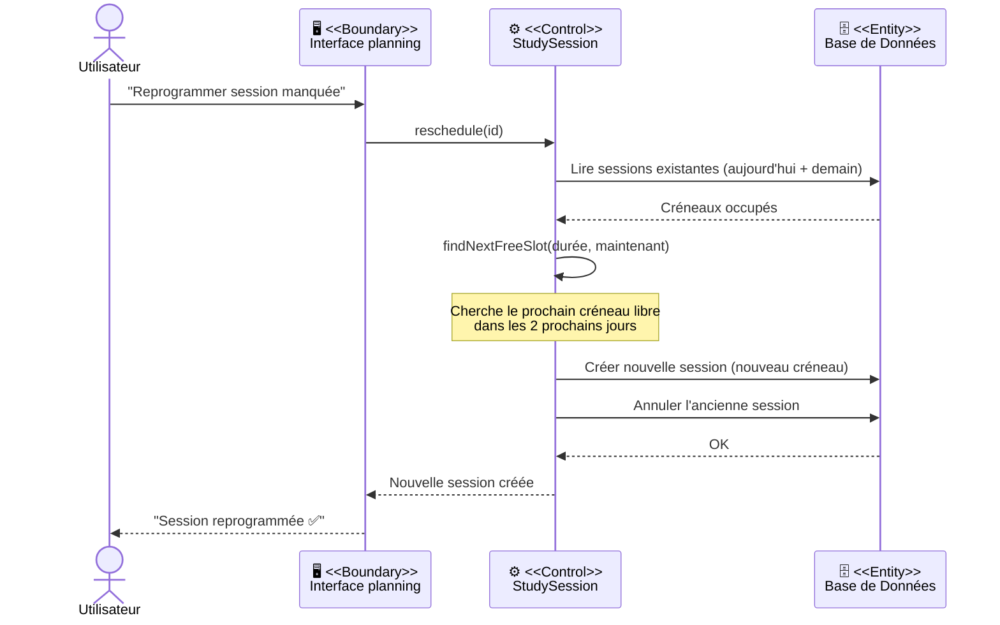
```mermaid
sequenceDiagram
    actor Utilisateur
    participant B  as 🖥️ <<Boundary>><br/>Interface planning
    participant SS as ⚙️ <<Control>><br/>StudySession
    participant E  as 🗄️ <<Entity>><br/>Base de Données

    Utilisateur->>B: "Reprogrammer session manquée"
    B->>SS: reschedule(id)

    SS->>E: Lire sessions existantes (aujourd'hui + demain)
    E-->>SS: Créneaux occupés
    SS->>SS: findNextFreeSlot(durée, maintenant)
    Note over SS: Cherche le prochain créneau libre<br/>dans les 2 prochains jours

    SS->>E: Créer nouvelle session (nouveau créneau)
    SS->>E: Annuler l'ancienne session
    E-->>SS: OK
    SS-->>B: Nouvelle session créée
    B-->>Utilisateur: "Session reprogrammée ✅"
```

---

## 4. 💬 Module Chatbot RAG

### 4.1 Uploader un Document PDF (UC12)

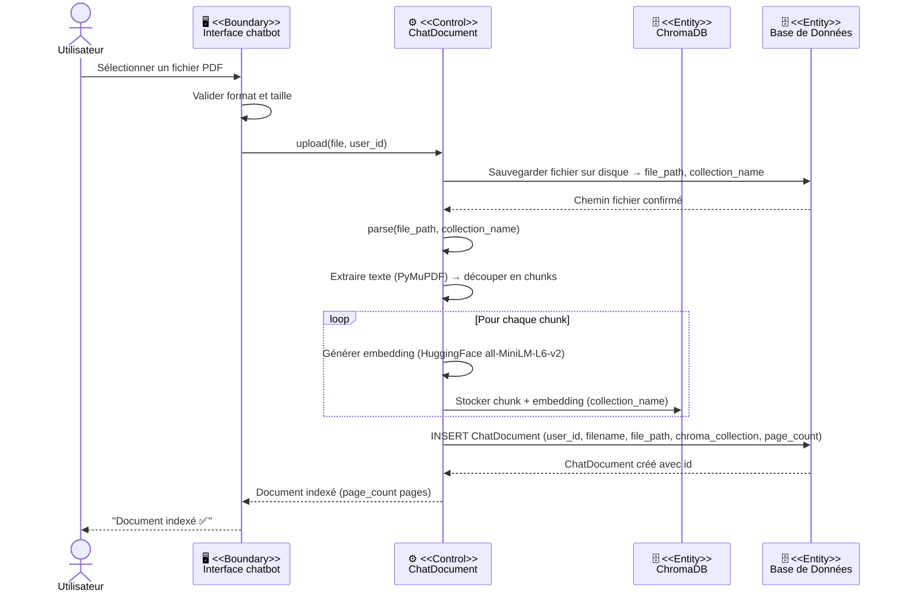
```mermaid
sequenceDiagram
    actor Utilisateur
    participant B  as 🖥️ <<Boundary>><br/>Interface chatbot
    participant CD as ⚙️ <<Control>><br/>ChatDocument
    participant EV as 🗄️ <<Entity>><br/>ChromaDB
    participant E  as 🗄️ <<Entity>><br/>Base de Données

    Utilisateur->>B: Sélectionner un fichier PDF
    B->>B: Valider format et taille
    B->>CD: upload(file, user_id)
    CD->>E: Sauvegarder fichier sur disque → file_path, collection_name
    E-->>CD: Chemin fichier confirmé

    CD->>CD: parse(file_path, collection_name)
    CD->>CD: Extraire texte (PyMuPDF) → découper en chunks
    loop Pour chaque chunk
        CD->>CD: Générer embedding (HuggingFace all-MiniLM-L6-v2)
        CD->>EV: Stocker chunk + embedding (collection_name)
    end

    CD->>E: INSERT ChatDocument (user_id, filename, file_path, chroma_collection, page_count)
    E-->>CD: ChatDocument créé avec id
    CD-->>B: Document indexé (page_count pages)
    B-->>Utilisateur: "Document indexé ✅"
```

### 4.2 Poser une Question RAG (UC13)

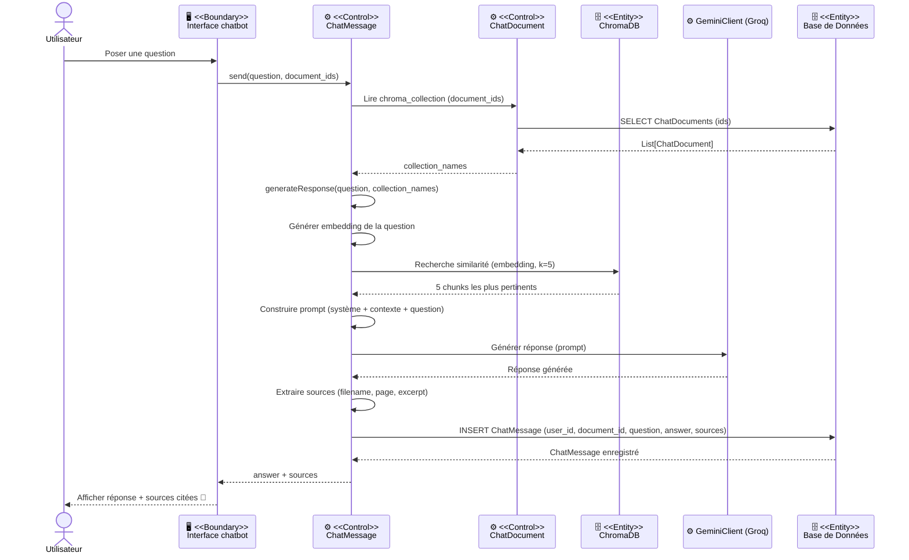
```mermaid
sequenceDiagram
    actor Utilisateur
    participant B  as 🖥️ <<Boundary>><br/>Interface chatbot
    participant CM as ⚙️ <<Control>><br/>ChatMessage
    participant CD as ⚙️ <<Control>><br/>ChatDocument
    participant EV as 🗄️ <<Entity>><br/>ChromaDB
    participant LLM as ⚙️ GeminiClient (Groq)
    participant E  as 🗄️ <<Entity>><br/>Base de Données

    Utilisateur->>B: Poser une question
    B->>CM: send(question, document_ids)
    CM->>CD: Lire chroma_collection (document_ids)
    CD->>E: SELECT ChatDocuments (ids)
    E-->>CD: List[ChatDocument]
    CD-->>CM: collection_names

    CM->>CM: generateResponse(question, collection_names)
    CM->>CM: Générer embedding de la question
    CM->>EV: Recherche similarité (embedding, k=5)
    EV-->>CM: 5 chunks les plus pertinents
    CM->>CM: Construire prompt (système + contexte + question)
    CM->>LLM: Générer réponse (prompt)
    LLM-->>CM: Réponse générée
    CM->>CM: Extraire sources (filename, page, excerpt)

    CM->>E: INSERT ChatMessage (user_id, document_id, question, answer, sources)
    E-->>CM: ChatMessage enregistré
    CM-->>B: answer + sources
    B-->>Utilisateur: Afficher réponse + sources citées 📄
```

### 4.3 Générer un Quiz (UC14)

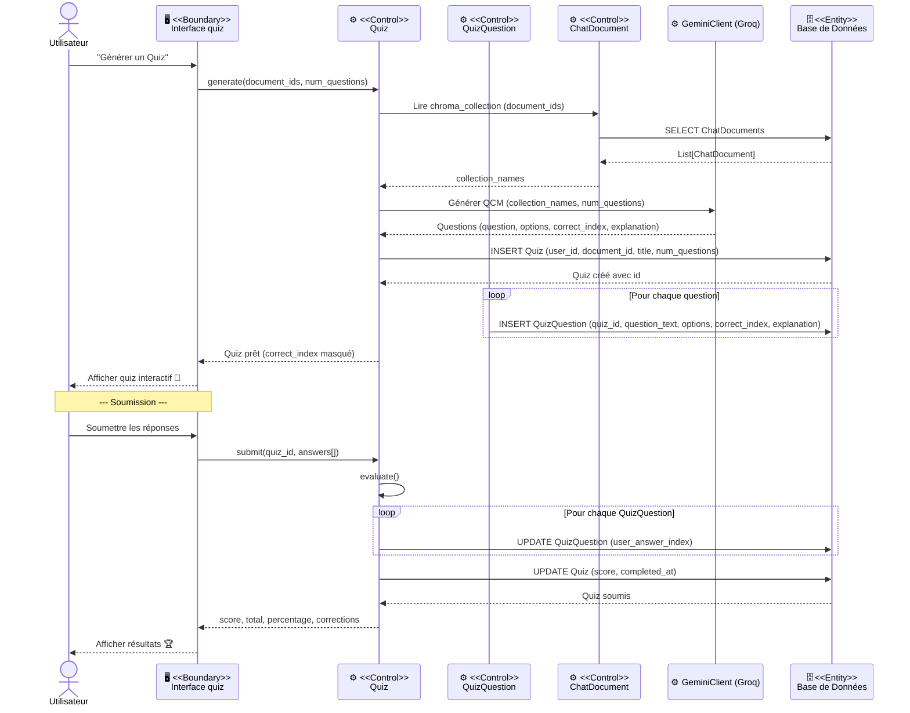
```mermaid
sequenceDiagram
    actor Utilisateur
    participant B  as 🖥️ <<Boundary>><br/>Interface quiz
    participant QZ as ⚙️ <<Control>><br/>Quiz
    participant QQ as ⚙️ <<Control>><br/>QuizQuestion
    participant CD as ⚙️ <<Control>><br/>ChatDocument
    participant LLM as ⚙️ GeminiClient (Groq)
    participant E  as 🗄️ <<Entity>><br/>Base de Données

    Utilisateur->>B: "Générer un Quiz"
    B->>QZ: generate(document_ids, num_questions)
    QZ->>CD: Lire chroma_collection (document_ids)
    CD->>E: SELECT ChatDocuments
    E-->>CD: List[ChatDocument]
    CD-->>QZ: collection_names

    QZ->>LLM: Générer QCM (collection_names, num_questions)
    LLM-->>QZ: Questions (question, options, correct_index, explanation)

    QZ->>E: INSERT Quiz (user_id, document_id, title, num_questions)
    E-->>QZ: Quiz créé avec id
    loop Pour chaque question
        QQ->>E: INSERT QuizQuestion (quiz_id, question_text, options, correct_index, explanation)
    end

    QZ-->>B: Quiz prêt (correct_index masqué)
    B-->>Utilisateur: Afficher quiz interactif 📝

    Note over Utilisateur, B: --- Soumission ---

    Utilisateur->>B: Soumettre les réponses
    B->>QZ: submit(quiz_id, answers[])
    QZ->>QZ: evaluate()
    loop Pour chaque QuizQuestion
        QZ->>E: UPDATE QuizQuestion (user_answer_index)
    end
    QZ->>E: UPDATE Quiz (score, completed_at)
    E-->>QZ: Quiz soumis
    QZ-->>B: score, total, percentage, corrections
    B-->>Utilisateur: Afficher résultats 🏆
```

### 4.4 Créer et Réviser des Flashcards (UC15)

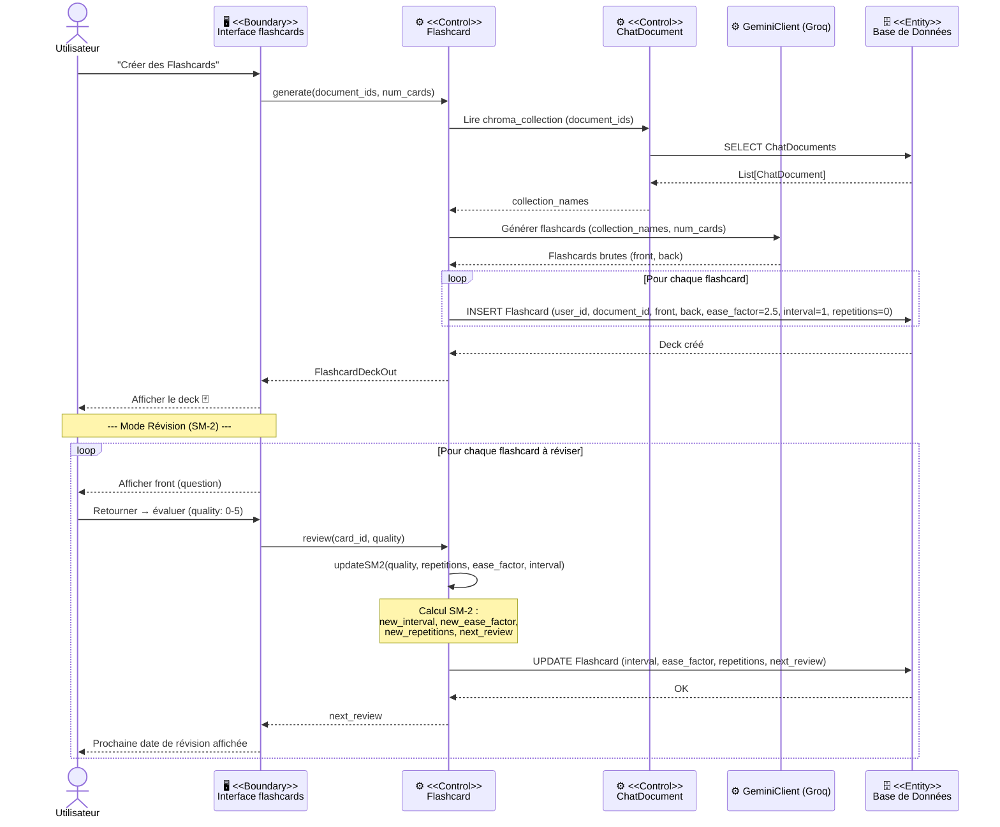
```mermaid
sequenceDiagram
    actor Utilisateur
    participant B  as 🖥️ <<Boundary>><br/>Interface flashcards
    participant FC as ⚙️ <<Control>><br/>Flashcard
    participant CD as ⚙️ <<Control>><br/>ChatDocument
    participant LLM as ⚙️ GeminiClient (Groq)
    participant E  as 🗄️ <<Entity>><br/>Base de Données

    Utilisateur->>B: "Créer des Flashcards"
    B->>FC: generate(document_ids, num_cards)
    FC->>CD: Lire chroma_collection (document_ids)
    CD->>E: SELECT ChatDocuments
    E-->>CD: List[ChatDocument]
    CD-->>FC: collection_names

    FC->>LLM: Générer flashcards (collection_names, num_cards)
    LLM-->>FC: Flashcards brutes (front, back)

    loop Pour chaque flashcard
        FC->>E: INSERT Flashcard (user_id, document_id, front, back, ease_factor=2.5, interval=1, repetitions=0)
    end
    E-->>FC: Deck créé
    FC-->>B: FlashcardDeckOut
    B-->>Utilisateur: Afficher le deck 🃏

    Note over Utilisateur, B: --- Mode Révision (SM-2) ---

    loop Pour chaque flashcard à réviser
        B-->>Utilisateur: Afficher front (question)
        Utilisateur->>B: Retourner → évaluer (quality: 0-5)
        B->>FC: review(card_id, quality)
        FC->>FC: updateSM2(quality, repetitions, ease_factor, interval)
        Note over FC: Calcul SM-2 :<br/>new_interval, new_ease_factor,<br/>new_repetitions, next_review
        FC->>E: UPDATE Flashcard (interval, ease_factor, repetitions, next_review)
        E-->>FC: OK
        FC-->>B: next_review
        B-->>Utilisateur: Prochaine date de révision affichée
    end
```

---

## 5. 🌙 Module Sommeil & Réveil

### 5.1 Enregistrer les Données de Sommeil (UC21)

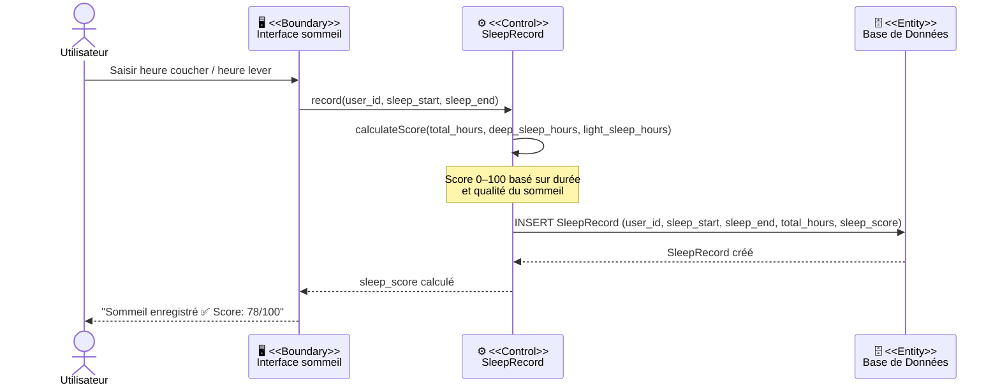
```mermaid
sequenceDiagram
    actor Utilisateur
    participant B  as 🖥️ <<Boundary>><br/>Interface sommeil
    participant SR as ⚙️ <<Control>><br/>SleepRecord
    participant E  as 🗄️ <<Entity>><br/>Base de Données

    Utilisateur->>B: Saisir heure coucher / heure lever
    B->>SR: record(user_id, sleep_start, sleep_end)
    SR->>SR: calculateScore(total_hours, deep_sleep_hours, light_sleep_hours)
    Note over SR: Score 0–100 basé sur durée<br/>et qualité du sommeil
    SR->>E: INSERT SleepRecord (user_id, sleep_start, sleep_end, total_hours, sleep_score)
    E-->>SR: SleepRecord créé
    SR-->>B: sleep_score calculé
    B-->>Utilisateur: "Sommeil enregistré ✅ Score: 78/100"
```

### 5.2 Consulter l'Historique Sommeil (UC22)

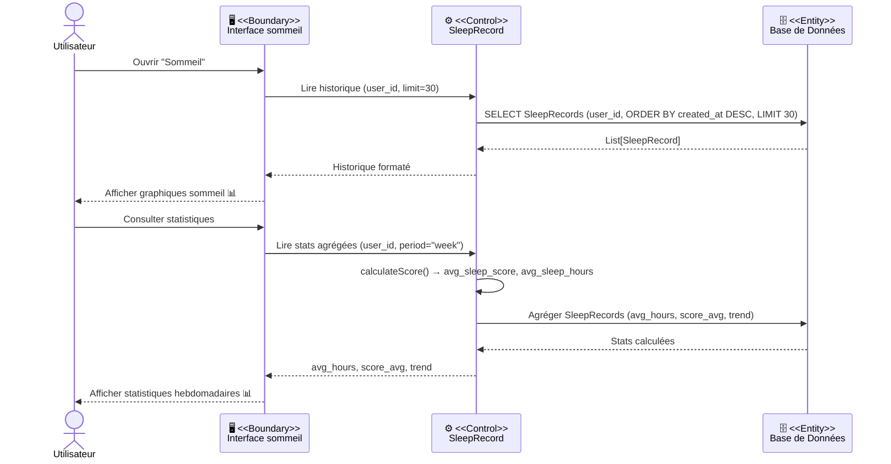
```mermaid
sequenceDiagram
    actor Utilisateur
    participant B  as 🖥️ <<Boundary>><br/>Interface sommeil
    participant SR as ⚙️ <<Control>><br/>SleepRecord
    participant E  as 🗄️ <<Entity>><br/>Base de Données

    Utilisateur->>B: Ouvrir "Sommeil"
    B->>SR: Lire historique (user_id, limit=30)
    SR->>E: SELECT SleepRecords (user_id, ORDER BY created_at DESC, LIMIT 30)
    E-->>SR: List[SleepRecord]
    SR-->>B: Historique formaté
    B-->>Utilisateur: Afficher graphiques sommeil 📊

    Utilisateur->>B: Consulter statistiques
    B->>SR: Lire stats agrégées (user_id, period="week")
    SR->>SR: calculateScore() → avg_sleep_score, avg_sleep_hours
    SR->>E: Agréger SleepRecords (avg_hours, score_avg, trend)
    E-->>SR: Stats calculées
    SR-->>B: avg_hours, score_avg, trend
    B-->>Utilisateur: Afficher statistiques hebdomadaires 📊
```

### 5.3 Adapter le Planning selon le Sommeil (UC24)

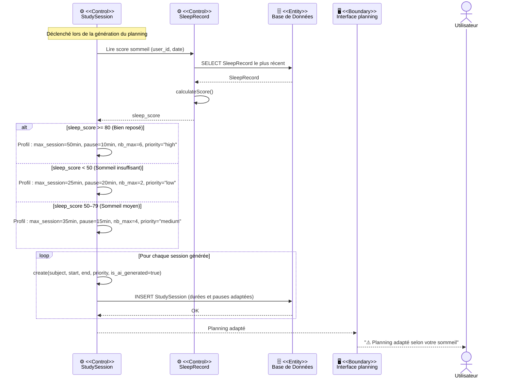
```mermaid
sequenceDiagram
    participant SS as ⚙️ <<Control>><br/>StudySession
    participant SR as ⚙️ <<Control>><br/>SleepRecord
    participant E  as 🗄️ <<Entity>><br/>Base de Données
    participant B  as 🖥️ <<Boundary>><br/>Interface planning
    actor Utilisateur

    Note over SS: Déclenché lors de la génération du planning

    SS->>SR: Lire score sommeil (user_id, date)
    SR->>E: SELECT SleepRecord le plus récent
    E-->>SR: SleepRecord
    SR->>SR: calculateScore()
    SR-->>SS: sleep_score

    alt sleep_score >= 80 (Bien reposé)
        SS->>SS: Profil : max_session=50min, pause=10min, nb_max=6, priority="high"
    else sleep_score < 50 (Sommeil insuffisant)
        SS->>SS: Profil : max_session=25min, pause=20min, nb_max=2, priority="low"
    else sleep_score 50–79 (Sommeil moyen)
        SS->>SS: Profil : max_session=35min, pause=15min, nb_max=4, priority="medium"
    end

    loop Pour chaque session générée
        SS->>SS: create(subject, start, end, priority, is_ai_generated=true)
        SS->>E: INSERT StudySession (durées et pauses adaptées)
        E-->>SS: OK
    end

    SS-->>B: Planning adapté
    B-->>Utilisateur: "⚠️ Planning adapté selon votre sommeil"
```

### 5.4 Configurer l'Alarme Intelligente (UC23)

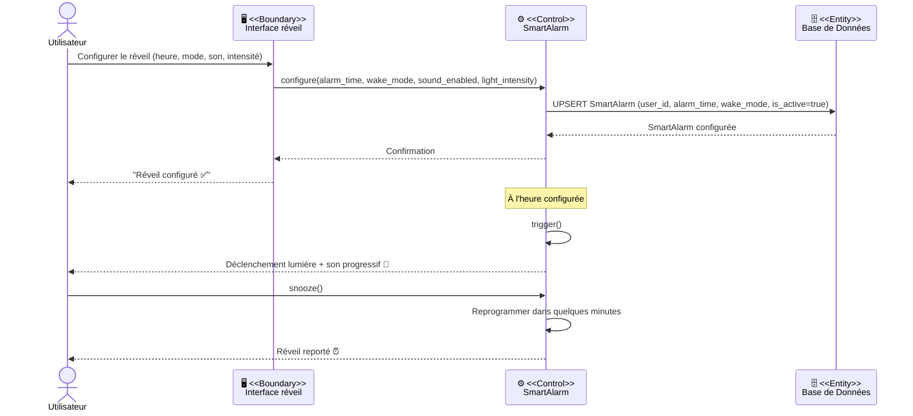
```mermaid
sequenceDiagram
    actor Utilisateur
    participant B  as 🖥️ <<Boundary>><br/>Interface réveil
    participant SA as ⚙️ <<Control>><br/>SmartAlarm
    participant E  as 🗄️ <<Entity>><br/>Base de Données

    Utilisateur->>B: Configurer le réveil (heure, mode, son, intensité)
    B->>SA: configure(alarm_time, wake_mode, sound_enabled, light_intensity)
    SA->>E: UPSERT SmartAlarm (user_id, alarm_time, wake_mode, is_active=true)
    E-->>SA: SmartAlarm configurée
    SA-->>B: Confirmation
    B-->>Utilisateur: "Réveil configuré ✅"

    Note over SA: À l'heure configurée

    SA->>SA: trigger()
    SA-->>Utilisateur: Déclenchement lumière + son progressif 🔔

    Utilisateur->>SA: snooze()
    SA->>SA: Reprogrammer dans quelques minutes
    SA-->>Utilisateur: Réveil reporté ⏰
```

---

## 6. 📊 Module Dashboard & Statistiques

### 6.1 Consulter le Dashboard Global (UC27)

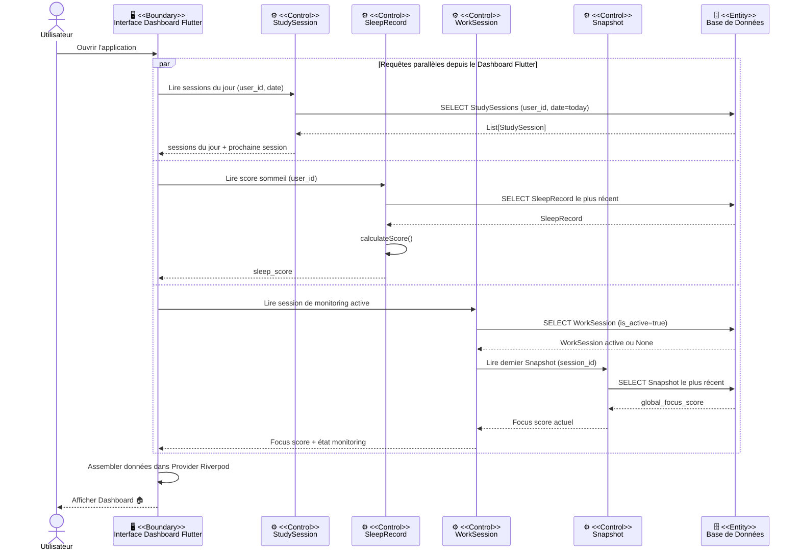
```mermaid
sequenceDiagram
    actor Utilisateur
    participant B  as 🖥️ <<Boundary>><br/>Interface Dashboard Flutter
    participant SS as ⚙️ <<Control>><br/>StudySession
    participant SR as ⚙️ <<Control>><br/>SleepRecord
    participant WS as ⚙️ <<Control>><br/>WorkSession
    participant SN as ⚙️ <<Control>><br/>Snapshot
    participant E  as 🗄️ <<Entity>><br/>Base de Données

    Utilisateur->>B: Ouvrir l'application

    par Requêtes parallèles depuis le Dashboard Flutter
        B->>SS: Lire sessions du jour (user_id, date)
        SS->>E: SELECT StudySessions (user_id, date=today)
        E-->>SS: List[StudySession]
        SS-->>B: sessions du jour + prochaine session
    and
        B->>SR: Lire score sommeil (user_id)
        SR->>E: SELECT SleepRecord le plus récent
        E-->>SR: SleepRecord
        SR->>SR: calculateScore()
        SR-->>B: sleep_score
    and
        B->>WS: Lire session de monitoring active
        WS->>E: SELECT WorkSession (is_active=true)
        E-->>WS: WorkSession active ou None
        WS->>SN: Lire dernier Snapshot (session_id)
        SN->>E: SELECT Snapshot le plus récent
        E-->>SN: global_focus_score
        SN-->>WS: Focus score actuel
        WS-->>B: Focus score + état monitoring
    end

    B->>B: Assembler données dans Provider Riverpod
    B-->>Utilisateur: Afficher Dashboard 🏠
```

### 6.2 Consulter les Insights (UC28)

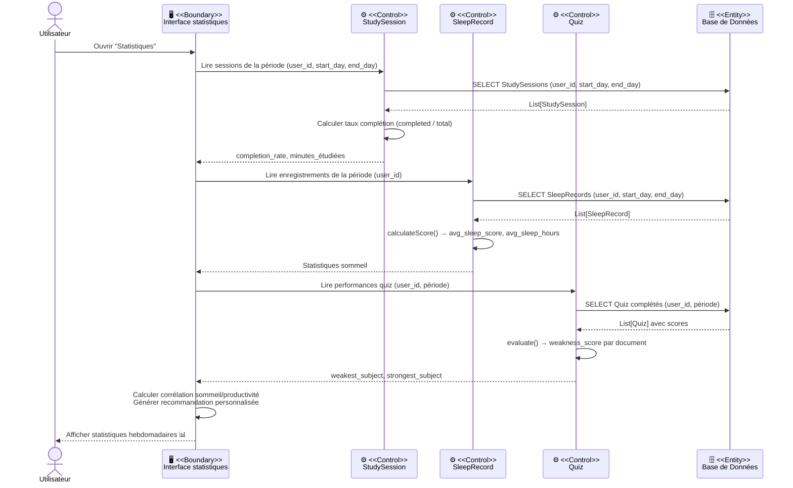
```mermaid
sequenceDiagram
    actor Utilisateur
    participant B  as 🖥️ <<Boundary>><br/>Interface statistiques
    participant SS as ⚙️ <<Control>><br/>StudySession
    participant SR as ⚙️ <<Control>><br/>SleepRecord
    participant QZ as ⚙️ <<Control>><br/>Quiz
    participant E  as 🗄️ <<Entity>><br/>Base de Données

    Utilisateur->>B: Ouvrir "Statistiques"

    B->>SS: Lire sessions de la période (user_id, start_day, end_day)
    SS->>E: SELECT StudySessions (user_id, start_day, end_day)
    E-->>SS: List[StudySession]
    SS->>SS: Calculer taux complétion (completed / total)
    SS-->>B: completion_rate, minutes_étudiées

    B->>SR: Lire enregistrements de la période (user_id)
    SR->>E: SELECT SleepRecords (user_id, start_day, end_day)
    E-->>SR: List[SleepRecord]
    SR->>SR: calculateScore() → avg_sleep_score, avg_sleep_hours
    SR-->>B: Statistiques sommeil

    B->>QZ: Lire performances quiz (user_id, période)
    QZ->>E: SELECT Quiz complétés (user_id, période)
    E-->>QZ: List[Quiz] avec scores
    QZ->>QZ: evaluate() → weakness_score par document
    QZ-->>B: weakest_subject, strongest_subject

    B->>B: Calculer corrélation sommeil/productivité<br/>Générer recommandation personnalisée
    B-->>Utilisateur: Afficher statistiques hebdomadaires 📊
```

---

## 7. Résumé

| Module | Diagrammes | CU Couverts | Classes `<<Control>>` |
|--------|:----------:|:-----------:|---|
| 🔐 Authentification | 3 | UC1, UC2, UC3 | `User`, `UserProfile` |
| 👁️ Vision & Monitoring | 2 | UC4, UC5, UC7 | `WorkSession`, `Snapshot`, `FocusEvent` |
| 📅 Planning Intelligent | 5 | UC9, UC9w, UC9r, UC10, UC11, UC11r | `StudySession`, `Exam`, `SleepRecord`, `WorkSession` |
| 💬 Chatbot RAG | 4 | UC12, UC13, UC14, UC15 | `ChatDocument`, `ChatMessage`, `Quiz`, `QuizQuestion`, `Flashcard` |
| 🌙 Sommeil & Réveil | 4 | UC21, UC22, UC23, UC24 | `SleepRecord`, `SmartAlarm` |
| 📊 Dashboard & Stats | 2 | UC27, UC28 | `StudySession`, `SleepRecord`, `WorkSession`, `Snapshot`, `Quiz` |
| **Total** | **20** | **27 CU** | **14 classes** |

---

**Validé par** : _________________________  
**Date de validation** : _________________________
