# 📐 Diagrammes de Séquence – Smart Focus & Life Assistant

**Version** : 3.0  
**Date** : 03 Mai 2026  
**Phase** : Conception  
**Approche** : BCE (Boundary – Control – Entity)  

> **Convention BCE** : Chaque diagramme utilise l'architecture d'analyse UML en 3 couches.

| Stéréotype | Rôle | Notation |
|:---:|--------|---------|
| `<<Boundary>>` | Interface utilisateur / point d'entrée externe | `🖥️` |
| `<<Control>>` | Logique métier / orchestration | `⚙️` |
| `<<Entity>>` | Données persistantes / modèle du domaine | `🗄️` |

---

## 1. 🔐 Module Authentification

### 1.1 Inscription (UC1)

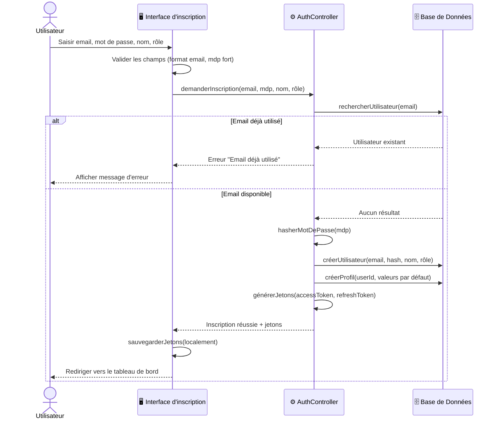

### 1.2 Connexion (UC2)

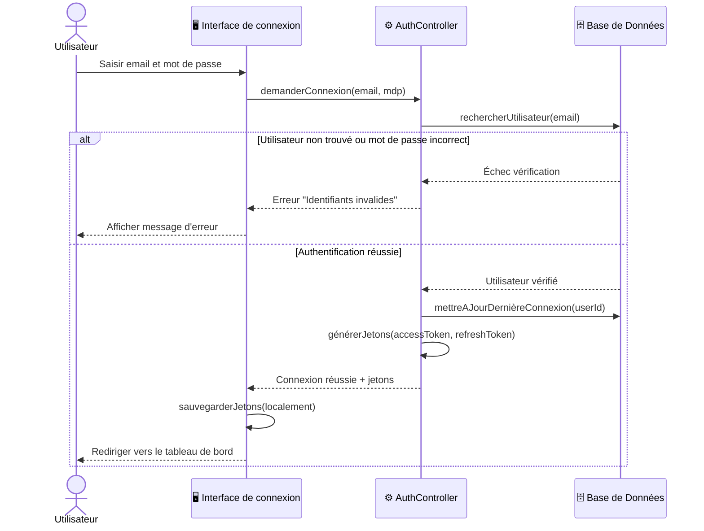

### 1.3 Gestion du Profil (UC3)

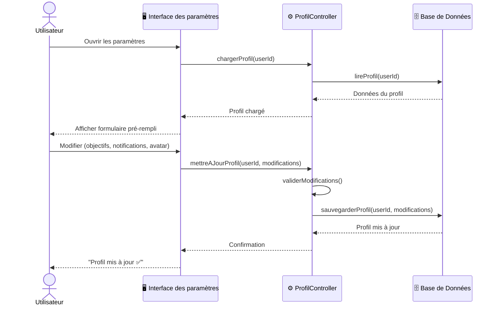

---

## 2. 👁️ Module Vision & Monitoring CV

### 2.1 Démarrer une Session de Monitoring (UC4)

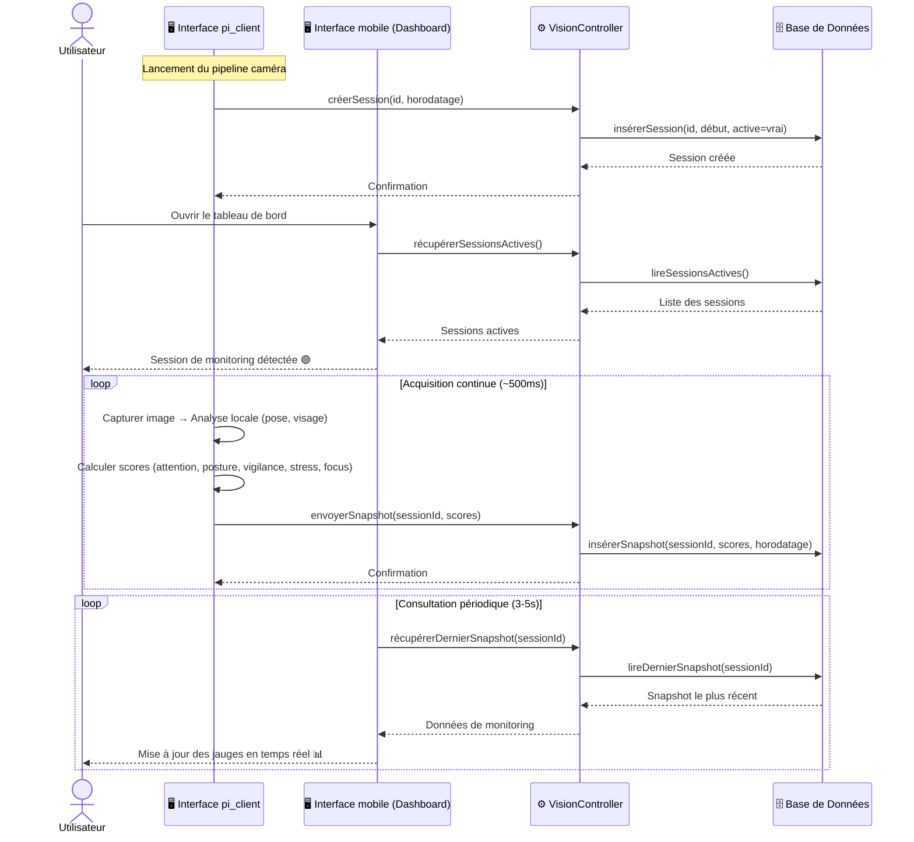

### 2.2 Événements et Finalisation (UC5, UC7)

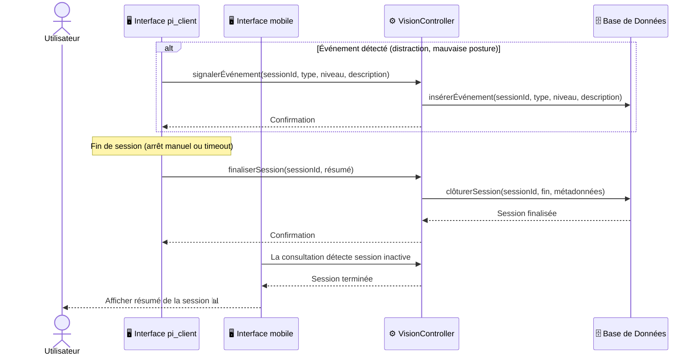

---

## 3. 📅 Module Planning Intelligent

### 3.1 Générer un Planning IA (UC9)

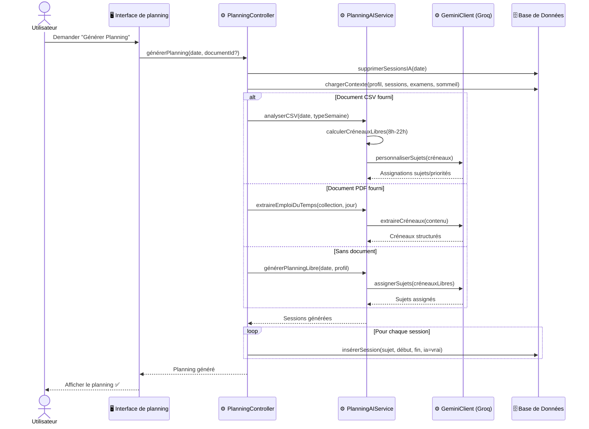

### 3.2 Modifier / Supprimer une Session (UC10, UC11)

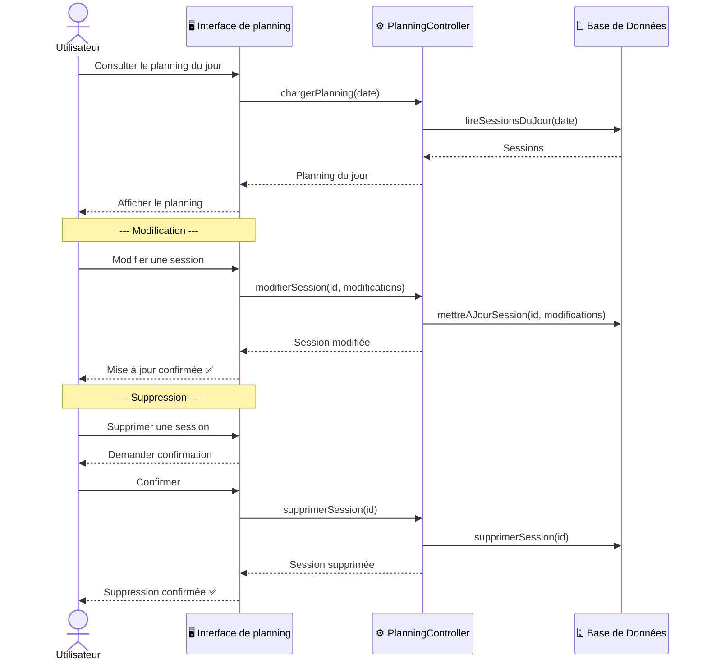

---

## 4. 💬 Module Chatbot RAG

### 4.1 Uploader un Document PDF (UC12)

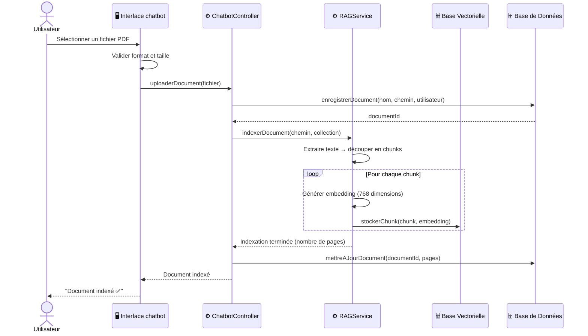

### 4.2 Poser une Question RAG (UC13)

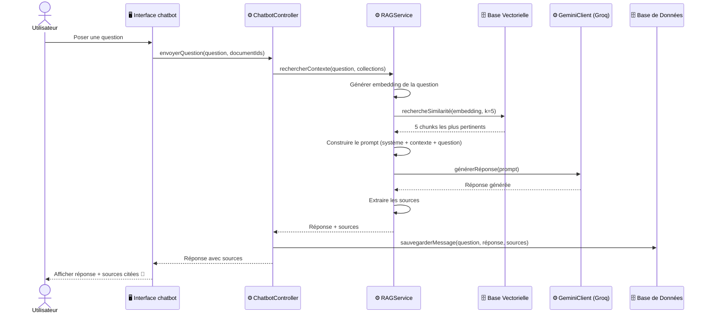

### 4.3 Générer un Quiz (UC14)

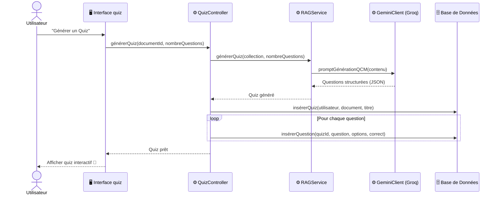

### 4.4 Créer et Réviser des Flashcards (UC15)

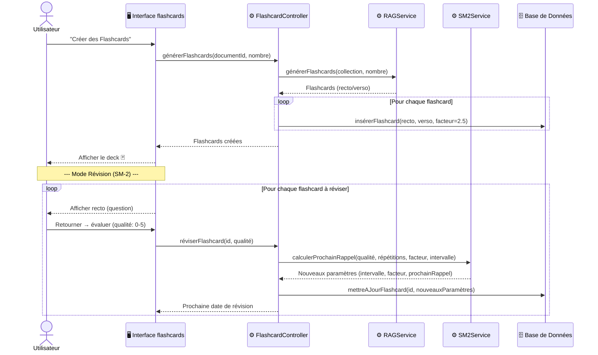

---

## 5. 🌙 Module Sommeil & Réveil

### 5.1 Enregistrer les Données de Sommeil (UC21)

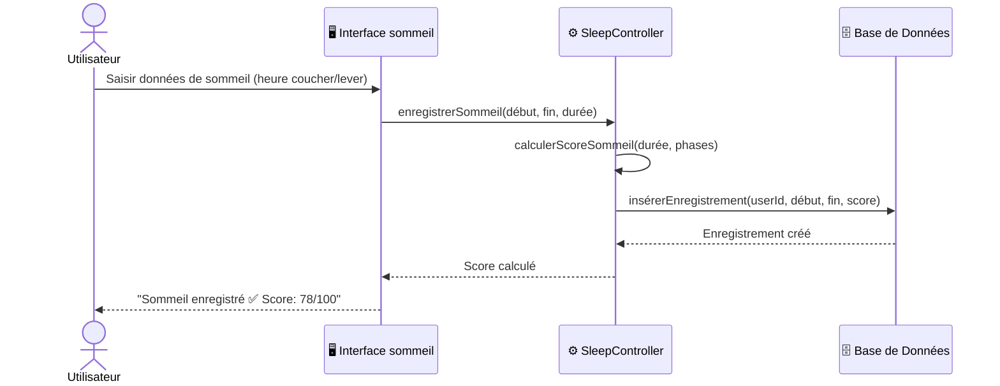

### 5.2 Consulter l'Historique Sommeil (UC22)

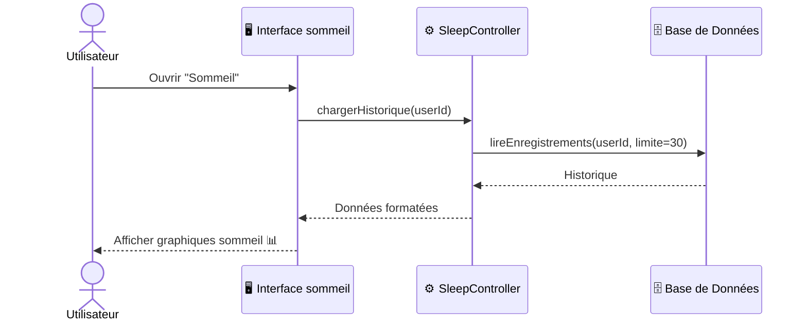

### 5.3 Adapter le Planning selon le Sommeil (UC24)

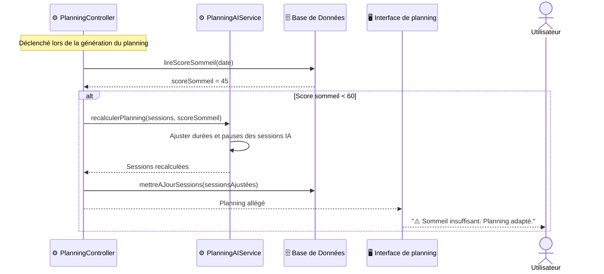

---

## 6. 📊 Module Dashboard & Statistiques

### 6.1 Consulter le Dashboard Global (UC27)

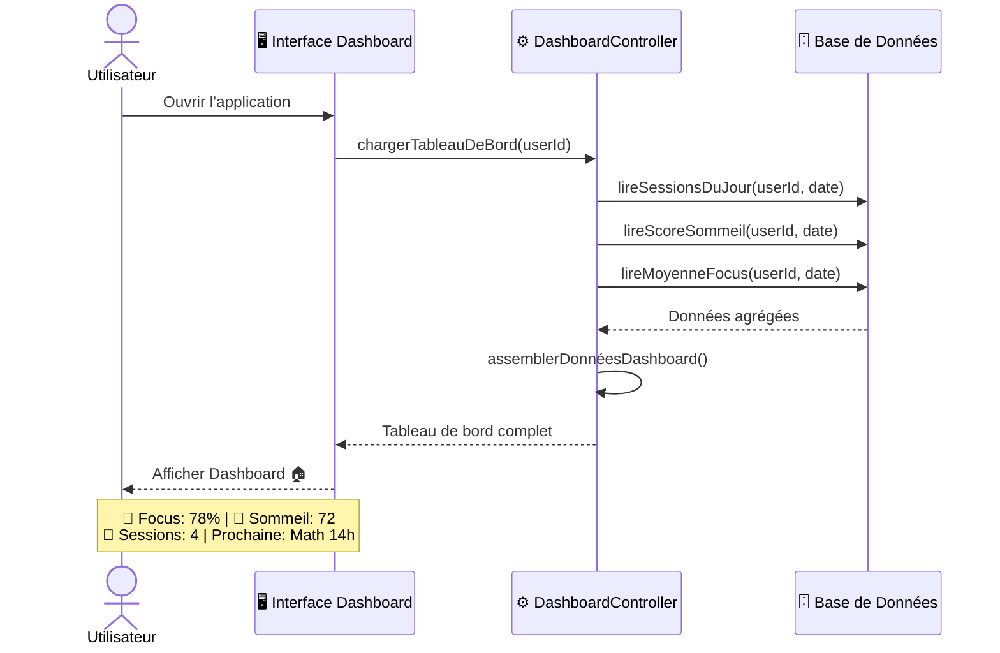

### 6.2 Consulter les Insights (UC28)

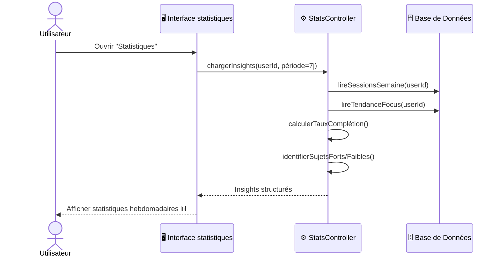

---

## 7. Résumé des Diagrammes de Séquence

| Module | Diagrammes | CU Couverts |
|--------|:----------:|:-----------:|
| 🔐 Authentification | 3 | UC1, UC2, UC3 |
| 👁️ Vision & Monitoring CV | 2 | UC4, UC5, UC7 |
| 📅 Planning Intelligent | 2 | UC9, UC10, UC11 |
| 💬 Chatbot RAG | 4 | UC12, UC13, UC14, UC15 |
| 🌙 Sommeil & Réveil | 3 | UC21, UC22, UC24 |
| 📊 Dashboard & Stats | 2 | UC27, UC28 |
| **Total** | **16** | **22 CU** |

---

## 8. Légende BCE

| Stéréotype | Symbole | Rôle | Exemples |
|:---:|:---:|--------|---------|
| `<<Boundary>>` | `🖥️` | Interface / Point d'entrée | Interface de connexion, Interface chatbot, Interface pi_client |
| `<<Control>>` | `⚙️` | Logique métier / Orchestration | AuthController, PlanningController, RAGService, SM2Service |
| `<<Entity>>` | `🗄️` | Données persistantes | Base de Données, Base Vectorielle |

---

**Validé par** : _________________________  
**Date de validation** : _________________________
