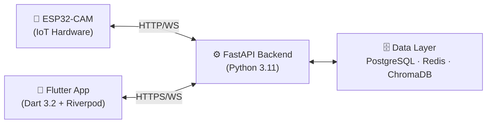

# 📋 Document de Conception Finale – Smart Focus & Life Assistant

**Version** : 1.0  
**Date** : 01 Mars 2026  
**Auteur** : Personne 2 – Application Flutter & IA/NLP  
**Projet** : Smart Focus & Life Assistant – PFE 2025/2026  

---

## 1. Résumé Exécutif

**Smart Focus & Life Assistant** est un système intelligent tout-en-un combinant :
- Un **boîtier IoT ESP32-CAM** (capture posture, fatigue, vitaux)
- Un **backend FastAPI** avec ML et IA (posture, RAG, planning)
- Une **application mobile Flutter** (dashboard, chatbot, planning adaptatif)

Le projet est développé en binôme :
- **Personne 1** → Hardware ESP32, ML vision (posture, fatigue)
- **Personne 2** → Application Flutter, Backend FastAPI, IA/RAG, Planning

---

## 2. Récapitulatif des Livrables de Conception

| # | Livrable | Fichier | Statut |
|---|----------|---------|--------|
| 1 | Plan de conception | `implementation_plan.md` | ✅ Fait |
| 2 | Architecture système | `Conception_Architecture_Systeme.md` | ✅ Fait |
| 3 | ERD PostgreSQL | `Conception_ERD_PostgreSQL.md` | ✅ Fait |
| 4 | Endpoints API | `Conception_Endpoints_API.md` | ✅ Fait |
| 5 | Wireframes Flutter | `Conception_Wireframes_Flutter.md` | ✅ Fait |
| 6 | Flux RAG Chatbot | `Conception_Flux_RAG_Chatbot.md` | ✅ Fait |
| 7 | **Ce document** | `Conception_Document_Final.md` | ✅ Fait |

---

## 3. Architecture Système (Synthèse)

Le système est organisé en **4 couches** :

**Flux principal** : ESP32 envoie les frames caméra → backend ML analyse (posture, fatigue) → score focus calculé → push WebSocket vers Flutter en temps réel.

---

## 4. Base de Données (Synthèse)

**24 tables PostgreSQL** organisées en 7 modules :

| Module | Tables Principales |
|--------|-------------------|
| Utilisateurs | `users`, `user_profiles`, `esp32_devices` |
| Focus | `focus_sessions`, `focus_scores`, `focus_alerts` |
| Posture | `posture_analyses`, `posture_alerts`, `posture_stats` |
| Planning | `plannings`, `planned_sessions` |
| Chatbot RAG | `documents`, `document_chunks`, `chat_conversations`, `chat_messages`, `quizzes`, `quiz_questions`, `flashcards` |
| Sommeil | `sleep_records`, `smart_alarms` |
| Statistiques | `daily_stats`, `weekly_reports` |

---

## 5. API REST (Synthèse)

**6 groupes d'endpoints** + WebSocket :

| Groupe | URL Préfixe | Endpoints Clés |
|--------|-------------|----------------|
| Auth | `/api/v1/auth` | register, login, refresh, me |
| Focus | `/api/v1/focus` | start, stop, frame, stats |
| Planning | `/api/v1/planning` | today, generate (IA), sessions |
| Chatbot | `/api/v1/chatbot` | ask, documents/upload, quiz, flashcards |
| Sommeil | `/api/v1/sleep` | log, stats, alarm |
| Device | `/api/v1/device` | register, status, command |
| WebSocket | `/ws/realtime` | push scores, alertes temps réel |

---

## 6. Pipeline RAG (Synthèse)

Le chatbot RAG fonctionne en 3 phases :

1. **Ingestion** : Upload PDF → parsing → chunking (500 tokens) → embeddings OpenAI → ChromaDB
2. **Requête** : Question → embedding → recherche sémantique (MMR, top-5) → contexte construit
3. **Génération** : Prompt (system + contexte + historique) → GPT-3.5-turbo → réponse + sources

**Quiz** : génération automatique QCM depuis les chunks du document.  
**Flashcards** : carte recto/verso avec algorithme de répétition espacée SM-2.

---

## 7. Application Flutter (Synthèse)

**7 écrans principaux** :

| Écran | Décrit dans | Fonctionnalités clés |
|-------|-------------|---------------------|
| Auth | Wireframes §1 | Login / Register |
| Dashboard | Wireframes §2 | Score focus, planning du jour, météo sommeil |
| Session Focus | Wireframes §3 | Timer, score temps réel, alertes, poses |
| Planning | Wireframes §4 | Calendrier, IA generate, CRUD sessions |
| Chatbot | Wireframes §5 | Chat RAG, upload docs, quiz, flashcards |
| Statistiques | Wireframes §6 | Graphiques (fl_chart), recommandations IA |
| Paramètres | Wireframes §7 | Profil, objectifs, config IoT |

**State Management** : Riverpod 2.4 (providers par fonctionnalité)  
**Navigation** : GoRouter avec MainShell (BottomNav)  
**API Calls** : Dio 5.3 + Interceptor JWT refresh automatique

---

## 8. Choix Techniques Justifiés

| Choix | Alternative | Justification |
|-------|-------------|---------------|
| FastAPI | Django REST | Performance async, OpenAPI auto-généré |
| PostgreSQL | MySQL | JSONB natif, meilleure performance queries complexes |
| ChromaDB | Pinecone | Open-source, local, pas de coût cloud |
| LangChain | LlamaIndex | Écosystème plus riche, RAG chains flexibles |
| GPT-3.5-turbo | GPT-4 | Coût x10 moins cher, suffisant pour QA pédagogique |
| Redis | Memcached | Support pub/sub pour WebSocket future |
| Riverpod | BLoC | API plus intuitive, provider-first, meilleur async |
| Dio | http | Interceptors JWT, FormData multipart, retry |

---

## 9. Plan de Développement – Personne 2

### Phase 1 – Fondations (Semaines 1-3)
- [x] Setup backend FastAPI + PostgreSQL
- [x] Modèles SQLAlchemy + migrations Alembic
- [x] Auth JWT (register, login, refresh)
- [x] Structure Flutter + Riverpod + GoRouter

### Phase 2 – Features Core (Semaines 4-7)
- [ ] Session focus + WebSocket temps réel
- [ ] Dashboard Flutter + charts
- [ ] Planning CRUD + génération IA basique

### Phase 3 – IA & Intégration (Semaines 8-11)
- [ ] Pipeline RAG complet (LangChain + ChromaDB)
- [ ] Quiz auto-générés + Flashcards SM-2
- [ ] Planning adaptatif (IA + données sommeil)
- [ ] Intégration résultats ML Personne 1

### Phase 4 – Finition (Semaines 12-14)
- [ ] Tests end-to-end
- [ ] Optimisation performance
- [ ] Documentation + démo

---

## 10. Risques Identifiés

| Risque | Prob. | Impact | Mitigation |
|--------|-------|--------|------------|
| Latence OpenAI > 3s | Moyenne | Élevé | Cache Redis, spinner UX |
| Désynchro WebSocket | Faible | Élevé | Reconnexion auto + polling fallback |
| ChromaDB mémoire | Faible | Moyen | Limite 100 docs/user |
| Intégration ML P1 | Moyenne | Élevé | Interface API contractualisée tôt |
| Coût tokens OpenAI | Moyenne | Moyen | Max tokens + modèle frugal par défaut |

---

## 11. Critères de Validation

| Critère | Condition de Succès |
|---------|---------------------|
| Score focus temps réel | Latence < 500ms (ESP32 → Flutter) |
| Chatbot RAG | Réponse pertinente sur 90% des Q pédagogiques |
| Planning IA | Génération < 3s |
| Upload document | PDF 50 pages indexé < 30s |
| Disponibilité | Système stable sur démo 15 minutes |
| UX | Interface intuitive sans aide externe |

---

*Document généré automatiquement – Phase de Conception – Smart Focus & Life Assistant*
