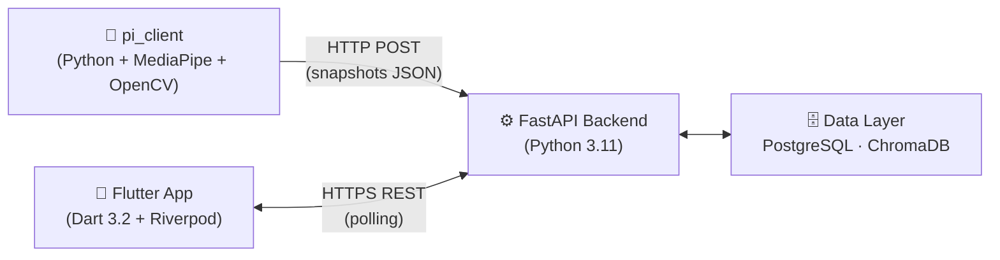

# 📋 Document de Conception Finale – Smart Focus & Life Assistant

**Version** : 2.0  
**Date** : 02 Mai 2026  
**Auteur** : Personne 2 – Application Flutter & IA/NLP  
**Projet** : Smart Focus & Life Assistant – PFE 2025/2026  

---

## 1. Résumé Exécutif

**Smart Focus & Life Assistant** est un système intelligent tout-en-un combinant :
- Un **pi_client Python** (analyse comportementale via caméra avec MediaPipe/OpenCV)
- Un **backend FastAPI** avec IA (RAG, Planning, Ingestion vision)
- Une **application mobile Flutter** (dashboard, chatbot, planning adaptatif)

Le projet est développé en binôme :
- **Personne 1** → Pipeline de vision par ordinateur (pi_client, MediaPipe, OpenCV)
- **Personne 2** → Application Flutter, Backend FastAPI, IA/RAG, Planning

---

## 2. Récapitulatif des Livrables de Conception

| # | Livrable | Fichier | Statut |
|---|----------|---------|--------|
| 1 | Architecture système | `Conception_Architecture_Systeme.md` | ✅ Mis à jour v2.0 |
| 2 | ERD PostgreSQL | `Conception_ERD_PostgreSQL.md` | ✅ Mis à jour v2.0 |
| 3 | Diagramme de classes | `Conception_DiagrammeClasses.md` | ✅ Mis à jour v3.0 |
| 4 | Endpoints API | `Conception_Endpoints_API.md` | ✅ Mis à jour v3.0 |
| 5 | Cas d'utilisation | `Conception_CasUtilisation.md` | ✅ v2.0 |
| 6 | Diagrammes de séquence | `Conception_DiagrammeSequence.md` | ✅ v1.0 |
| 7 | Wireframes Flutter | `Conception_Wireframes_Flutter.md` | ✅ v1.0 |
| 8 | Flux RAG Chatbot | `Conception_Flux_RAG_Chatbot.md` | ✅ v1.0 |
| 9 | **Ce document** | `Conception_Document_Final.md` | ✅ Mis à jour v2.0 |

---

## 3. Architecture Système (Synthèse)

Le système est organisé en **4 couches** :

```mermaid
graph LR
    PI["🔧 pi_client\n(Python + MediaPipe + OpenCV)"]
    BACK["⚙️ FastAPI Backend\n(Python 3.11)"]
    DATA["🗄️ Data Layer\nPostgreSQL · ChromaDB"]
    APP["📱 Flutter App\n(Dart 3.2 + Riverpod)"]

    PI -->|"HTTP POST\n(snapshots JSON)"| BACK
    BACK <--> DATA
    APP <-->|"HTTPS REST\n(polling)"| BACK
```

**Flux principal** : pi_client capture vidéo → MediaPipe/OpenCV analyse localement (posture, fatigue, attention, stress) → snapshots JSON envoyés au backend REST → Flutter poll périodiquement le dernier snapshot pour affichage temps réel.

---

## 4. Base de Données (Synthèse)

**16 tables PostgreSQL** organisées en 6 modules :

| Module | Tables Principales |
|--------|-------------------|
| Utilisateurs | `users`, `user_profiles` |
| Vision/CV | `work_sessions`, `snapshots`, `focus_events` |
| Planning | `study_sessions`, `exams`, `study_session_documents` |
| Chatbot RAG | `chat_documents`, `chat_messages`, `quizzes`, `quiz_questions`, `quiz_documents`, `flashcards` |
| Sommeil | `sleep_records`, `smart_alarms` |

---

## 5. API REST (Synthèse)

**7 groupes d'endpoints** :

| Groupe | URL Préfixe | Endpoints Clés |
|--------|-------------|----------------|
| Auth | `/api/v1/auth` | register, login, refresh, me, me/profile |
| Vision | `/api/v1/vision` + `/api/v1/sessions` | snapshots, events, sessions, latest, finalize |
| Planning | `/api/v1/planning` | today, generate, generate/week, recalculate/today, sessions, insights, exams |
| Chatbot | `/chatbot` | upload, chat, documents, history |
| Quiz | `/api/v1/quiz` | generate, generate-from-session, list, submit |
| Flashcards | `/api/v1/flashcards` | generate, generate-from-session, deck, due, review |
| Sommeil | `/api/v1/sleep` | log, stats, history, alarm |

---

## 6. Pipeline RAG (Synthèse)

Le chatbot RAG fonctionne en 3 phases :

1. **Ingestion** : Upload PDF → parsing PyMuPDF → chunking → embeddings HuggingFace (all-MiniLM-L6-v2, local) → ChromaDB
2. **Requête** : Question → embedding → recherche sémantique ChromaDB (top-k) → contexte construit
3. **Génération** : Prompt (system + contexte + question) → Groq llama-3.3-70b-versatile → réponse + sources

**Quiz** : génération automatique QCM depuis les chunks du document (multi-documents supporté).  
**Flashcards** : carte recto/verso avec algorithme de répétition espacée SM-2.

---

## 6.1 Pipeline Planning (Synthèse)

La génération planning suit une logique **hybride déterministe + IA** :

1. **Calcul déterministe** : collecte des blocs existants (sessions manuelles + cours extraits), calcul des créneaux libres (8h-22h, buffer 15min), fit des sessions selon le focus_goal du profil
2. **IA pour la personnalisation** : Groq assigne les sujets et priorités aux créneaux pré-calculés (les horaires ne sont jamais modifiés par l'IA)
3. **Extraction timetable** : PDF via RAG+Groq, CSV via parsing déterministe
4. **Fallback déterministe** : en cas d'échec IA, rotation round-robin des matières

Un endpoint dédié `POST /api/v1/planning/recalculate/today` recale uniquement les sessions IA de révision restantes du jour.

---

## 7. Application Flutter (Synthèse)

**9 features** avec écrans dédiés :

| Feature | Écrans | Fonctionnalités clés |
|---------|--------|---------------------|
| Auth | Welcome, Login, Register | Login / Register avec JWT refresh |
| Dashboard | HomePage, SessionActive | Score focus polling, planning du jour, session CV active |
| Planning | PlanningScreen | Calendrier, IA generate, CRUD sessions, exams |
| Chatbot | ChatbotScreen | Chat RAG, upload docs PDF/CSV |
| Quiz | Generate, Play, Result | Quiz QCM multi-docs, depuis session, scoring |
| Flashcards | Generate, Deck, Review | Cartes SM-2, deck par document/session, révision |
| Sleep | Dashboard, AlarmSettings, AlarmRing | Log sommeil, stats, alarme locale Flutter |
| Statistics | StatisticsScreen | Graphiques, tendances |
| Settings | SettingsScreen | Profil, objectifs, avatar |

**State Management** : Riverpod 2.4 (providers par fonctionnalité)  
**Navigation** : GoRouter (routes déclaratives)  
**API Calls** : Dio 5.3 + Interceptor JWT refresh automatique

---

## 8. Choix Techniques Justifiés

| Choix | Alternative | Justification |
|-------|-------------|---------------|
| FastAPI | Django REST | Performance async, OpenAPI auto-généré |
| PostgreSQL | MySQL | JSONB natif, meilleure performance queries complexes |
| ChromaDB | Pinecone | Open-source, local, pas de coût cloud |
| Groq llama-3.3-70b-versatile | Modèles Gemini/OpenAI | Gratuit, faible latence, très performant pour QA pédagogique |
| pi_client Python | ESP32-CAM embarqué | ML local plus puissant, plus facile à débugger, pipeline CV complet |
| HTTP Polling | WebSocket | Plus simple à implémenter, suffisant pour ~3-5s refresh |
| Riverpod | BLoC | API plus intuitive, provider-first, meilleur async |
| Dio | http | Interceptors JWT, FormData multipart, retry |
| GoRouter | Navigator 2.0 | Routing déclaratif, deep linking, type-safe |

---

## 9. Plan de Développement – Personne 2

### Phase 1 – Fondations (Semaines 1-3) ✅
- [x] Setup backend FastAPI + PostgreSQL
- [x] Modèles SQLAlchemy + migrations Alembic
- [x] Auth JWT (register, login, refresh)
- [x] Structure Flutter + Riverpod + GoRouter

### Phase 2 – Features Core (Semaines 4-7) ✅
- [x] Session focus (polling pi_client via Vision router)
- [x] Dashboard Flutter (home_page avec bottom navigation)
- [x] Planning CRUD + génération IA (pipeline hybride)

### Phase 3 – IA & Intégration (Semaines 8-11) ✅
- [x] Pipeline RAG complet (Groq + HuggingFace embeddings + ChromaDB)
- [x] Quiz auto-générés (multi-docs, depuis session)
- [x] Flashcards SM-2 (generate, deck, review)
- [x] Planning adaptatif (IA + données sommeil)
- [x] Intégration pi_client (vision router, snapshots, events)

### Phase 4 – Finition (Semaines 12-14) ⚠️ En cours
- [ ] Tests end-to-end
- [ ] Optimisation performance
- [x] Documentation + conception mise à jour
- [ ] Démo finale

---

## 10. Risques Identifiés

| Risque | Prob. | Impact | Mitigation |
|--------|-------|--------|------------|
| Latence API Groq > 3s | Faible | Élevé | Fallback déterministe, spinner UX |
| Perte de snapshots (réseau) | Faible | Moyen | Payload JSON complet, retry pi_client |
| ChromaDB mémoire | Faible | Moyen | Limite collections par user |
| Limites rate Groq API | Faible | Moyen | Max tokens + retry avec backoff |
| Polling trop fréquent | Faible | Moyen | Throttle à 3-5s, debounce Flutter |

---

## 11. Critères de Validation

| Critère | Condition de Succès |
|---------|---------------------|
| Score focus temps réel | Latence < 5s (pi_client → Flutter via polling) |
| Chatbot RAG | Réponse pertinente sur 90% des Q pédagogiques |
| Planning IA | Génération < 5s avec fallback déterministe fiable |
| Upload document | PDF 50 pages indexé < 30s |
| Disponibilité | Système stable sur démo 15 minutes |
| UX | Interface intuitive sans aide externe |

---

*Document mis à jour le 02 Mai 2026 – Phase de Conception – Smart Focus & Life Assistant*
