# 🗄️ Schéma Base de Données PostgreSQL (ERD) – Smart Focus & Life Assistant

**Version** : 1.0  
**Date** : 01 Mars 2026  
**Phase** : Conception  
**SGBD** : PostgreSQL 15+  

---

## 1. ERD Global (Mermaid)

```mermaid
erDiagram

    %% ── UTILISATEURS ──────────────────────────────────────
    users {
        SERIAL      id              PK
        VARCHAR255  email           UK  "NOT NULL"
        VARCHAR255  hashed_password     "NOT NULL"
        VARCHAR100  full_name           "NOT NULL"
        VARCHAR20   role                "DEFAULT student"
        TIMESTAMP   created_at          "DEFAULT now()"
        TIMESTAMP   last_login
        BOOLEAN     is_active           "DEFAULT true"
    }

    user_profiles {
        SERIAL      id              PK
        INT         user_id         FK  "NOT NULL"
        INT         daily_focus_goal    "DEFAULT 120 (min)"
        VARCHAR50   preferred_schedule  "morning|afternoon|evening"
        BOOLEAN     notif_enabled       "DEFAULT true"
        JSONB       notif_preferences
        TIMESTAMP   updated_at          "DEFAULT now()"
    }

    esp32_devices {
        SERIAL      id              PK
        INT         user_id         FK  "NOT NULL"
        VARCHAR50   device_id           "UNIQUE"
        VARCHAR20   firmware_version
        VARCHAR20   status              "online|offline|pairing"
        TIMESTAMP   last_seen
        INET        ip_address
    }

    %% ── SESSIONS FOCUS ───────────────────────────────────
    focus_sessions {
        SERIAL      id              PK
        INT         user_id         FK  "NOT NULL"
        TIMESTAMP   start_time          "NOT NULL"
        TIMESTAMP   end_time
        FLOAT       average_score       "0.0 – 100.0"
        VARCHAR20   status              "active|paused|completed"
        INT         total_alerts
        INT         micro_break_count
    }

    focus_scores {
        SERIAL      id              PK
        INT         session_id      FK  "NOT NULL"
        FLOAT       score               "composite 0–100"
        FLOAT       posture_score
        FLOAT       fatigue_score
        FLOAT       attention_score
        TIMESTAMP   recorded_at         "DEFAULT now()"
    }

    focus_alerts {
        SERIAL      id              PK
        INT         session_id      FK  "NOT NULL"
        VARCHAR50   alert_type          "fatigue|posture|distraction"
        TEXT        message
        TIMESTAMP   triggered_at        "DEFAULT now()"
        BOOLEAN     acknowledged        "DEFAULT false"
    }

    %% ── POSTURE ──────────────────────────────────────────
    posture_analyses {
        SERIAL      id              PK
        INT         session_id      FK  "NOT NULL"
        VARCHAR30   posture_status      "good|bad|unknown"
        FLOAT       confidence
        FLOAT       head_angle
        FLOAT       shoulder_angle
        FLOAT       spine_angle
        TIMESTAMP   recorded_at         "DEFAULT now()"
    }

    posture_alerts {
        SERIAL      id              PK
        INT         session_id      FK  "NOT NULL"
        VARCHAR50   alert_type
        VARCHAR50   body_part           "head|shoulder|spine"
        TEXT        recommendation
        TIMESTAMP   triggered_at        "DEFAULT now()"
    }

    posture_stats {
        SERIAL      id              PK
        INT         user_id         FK  "NOT NULL"
        DATE        stat_date           "NOT NULL"
        FLOAT       good_posture_pct
        INT         total_alerts
        INT         correction_count
    }

    %% ── PLANNING ─────────────────────────────────────────
    plannings {
        SERIAL      id              PK
        INT         user_id         FK  "NOT NULL"
        DATE        plan_date           "NOT NULL"
        VARCHAR30   generation_method   "ai|manual"
        TIMESTAMP   created_at          "DEFAULT now()"
    }

    planned_sessions {
        SERIAL      id              PK
        INT         planning_id     FK  "NOT NULL"
        VARCHAR100  subject
        TIMESTAMP   start_time          "NOT NULL"
        TIMESTAMP   end_time            "NOT NULL"
        VARCHAR20   priority            "high|medium|low"
        VARCHAR20   status              "pending|done|skipped"
        TEXT        notes
    }

    %% ── CHATBOT RAG ──────────────────────────────────────
    documents {
        SERIAL      id              PK
        INT         user_id         FK  "NOT NULL"
        VARCHAR255  filename            "NOT NULL"
        VARCHAR500  file_path           "NOT NULL"
        VARCHAR50   file_type           "pdf|pptx|docx|txt"
        BIGINT      file_size_bytes
        INT         num_chunks          "DEFAULT 0"
        TIMESTAMP   uploaded_at         "DEFAULT now()"
        BOOLEAN     is_indexed          "DEFAULT false"
    }

    document_chunks {
        SERIAL      id              PK
        INT         document_id     FK  "NOT NULL"
        TEXT        content             "NOT NULL"
        INT         chunk_index
        INT         token_count
        VARCHAR100  chroma_id           "ChromaDB vector ID"
    }

    chat_conversations {
        SERIAL      id              PK
        INT         user_id         FK  "NOT NULL"
        VARCHAR200  title
        TIMESTAMP   created_at          "DEFAULT now()"
        TIMESTAMP   last_message_at
    }

    chat_messages {
        SERIAL      id              PK
        INT         conversation_id FK  "NOT NULL"
        VARCHAR10   role                "user|assistant"
        TEXT        content             "NOT NULL"
        JSONB       sources             "array of chunk refs"
        TIMESTAMP   sent_at             "DEFAULT now()"
        INT         token_count
    }

    quizzes {
        SERIAL      id              PK
        INT         user_id         FK  "NOT NULL"
        INT         document_id     FK  "NOT NULL"
        VARCHAR200  title
        INT         total_questions
        FLOAT       last_score
        TIMESTAMP   created_at          "DEFAULT now()"
    }

    quiz_questions {
        SERIAL      id              PK
        INT         quiz_id         FK  "NOT NULL"
        TEXT        question            "NOT NULL"
        JSONB       options             "[a, b, c, d]"
        SMALLINT    correct_option      "0-3"
        TEXT        explanation
    }

    flashcards {
        SERIAL      id              PK
        INT         user_id         FK  "NOT NULL"
        INT         document_id     FK
        TEXT        front               "NOT NULL"
        TEXT        back                "NOT NULL"
        SMALLINT    difficulty_level    "1=easy 5=hard"
        TIMESTAMP   next_review
        INT         review_count        "DEFAULT 0"
        FLOAT       ease_factor         "DEFAULT 2.5 (SM-2)"
    }

    %% ── SOMMEIL ──────────────────────────────────────────
    sleep_records {
        SERIAL      id              PK
        INT         user_id         FK  "NOT NULL"
        TIMESTAMP   sleep_start         "NOT NULL"
        TIMESTAMP   sleep_end
        FLOAT       total_hours
        FLOAT       deep_sleep_hours
        FLOAT       light_sleep_hours
        SMALLINT    sleep_score         "0-100"
        JSONB       raw_sensor_data
    }

    smart_alarms {
        SERIAL      id              PK
        INT         user_id         FK  "NOT NULL"
        TIME        alarm_time          "NOT NULL"
        BOOLEAN     is_active           "DEFAULT true"
        VARCHAR30   wake_mode           "gradual|normal|silent"
        SMALLINT    light_intensity     "0-100"
        BOOLEAN     sound_enabled       "DEFAULT true"
    }

    %% ── STRESS & BIEN-ÊTRE ───────────────────────────────
    breathing_exercises {
        SERIAL      id              PK
        INT         user_id         FK  "NOT NULL"
        VARCHAR50   exercise_type       "478|box|coherence"
        INT         duration_seconds
        TIMESTAMP   performed_at        "DEFAULT now()"
        BOOLEAN     completed           "DEFAULT false"
    }

    micro_breaks {
        SERIAL      id              PK
        INT         session_id      FK  "NOT NULL"
        TEXT        reason
        VARCHAR100  suggested_activity
        INT         duration_seconds
        TIMESTAMP   suggested_at        "DEFAULT now()"
        BOOLEAN     taken               "DEFAULT false"
    }

    %% ── STATISTIQUES & DASHBOARD ─────────────────────────
    daily_stats {
        SERIAL      id              PK
        INT         user_id         FK  "NOT NULL"
        DATE        stat_date           "NOT NULL"
        FLOAT       focus_score_avg
        FLOAT       posture_score_avg
        SMALLINT    sleep_score
        INT         total_focus_minutes
        INT         sessions_completed
        INT         posture_alerts_count
        UNIQUE      user_id_stat_date    "(user_id, stat_date)"
    }

    weekly_reports {
        SERIAL      id              PK
        INT         user_id         FK  "NOT NULL"
        DATE        week_start          "NOT NULL"
        FLOAT       focus_trend
        FLOAT       posture_trend
        FLOAT       sleep_trend
        JSONB       recommendations
        TIMESTAMP   generated_at        "DEFAULT now()"
    }

    %% ── RELATIONS ────────────────────────────────────────

    users               ||--||  user_profiles       : "possède"
    users               ||--o{  esp32_devices        : "associe"
    users               ||--o{  focus_sessions       : "démarre"
    users               ||--o{  posture_stats        : "a"
    users               ||--o{  plannings            : "possède"
    users               ||--o{  documents            : "uploade"
    users               ||--o{  chat_conversations   : "crée"
    users               ||--o{  flashcards           : "révise"
    users               ||--o{  sleep_records        : "enregistre"
    users               ||--o|  smart_alarms         : "configure"
    users               ||--o{  breathing_exercises  : "effectue"
    users               ||--o{  daily_stats          : "a"
    users               ||--o{  weekly_reports       : "reçoit"
    users               ||--o{  quizzes              : "passe"

    focus_sessions      ||--o{  focus_scores         : "contient"
    focus_sessions      ||--o{  focus_alerts         : "génère"
    focus_sessions      ||--o{  posture_analyses     : "inclut"
    focus_sessions      ||--o{  posture_alerts       : "déclenche"
    focus_sessions      ||--o{  micro_breaks         : "propose"

    plannings           ||--o{  planned_sessions     : "contient"

    documents           ||--o{  document_chunks      : "découpé en"
    documents           ||--o{  quizzes              : "génère"
    documents           ||--o{  flashcards           : "produit"

    chat_conversations  ||--o{  chat_messages        : "contient"
    quizzes             ||--o{  quiz_questions       : "contient"
```



---

## 2. SQL de Création des Tables (PostgreSQL DDL)

```sql
-- ========================================================
-- Smart Focus & Life Assistant – PostgreSQL DDL
-- ========================================================

-- Extension pour UUID (optionnel)
CREATE EXTENSION IF NOT EXISTS "uuid-ossp";

-- ── UTILISATEURS ─────────────────────────────────────────

CREATE TABLE users (
    id               SERIAL PRIMARY KEY,
    email            VARCHAR(255) NOT NULL UNIQUE,
    hashed_password  VARCHAR(255) NOT NULL,
    full_name        VARCHAR(100) NOT NULL,
    role             VARCHAR(20)  NOT NULL DEFAULT 'student'
                         CHECK (role IN ('student', 'teacher', 'professional')),
    is_active        BOOLEAN      NOT NULL DEFAULT TRUE,
    created_at       TIMESTAMP    NOT NULL DEFAULT NOW(),
    last_login       TIMESTAMP
);

CREATE TABLE user_profiles (
    id                   SERIAL PRIMARY KEY,
    user_id              INT          NOT NULL UNIQUE REFERENCES users(id) ON DELETE CASCADE,
    daily_focus_goal     INT          NOT NULL DEFAULT 120,
    preferred_schedule   VARCHAR(50)  NOT NULL DEFAULT 'morning'
                             CHECK (preferred_schedule IN ('morning','afternoon','evening')),
    notif_enabled        BOOLEAN      NOT NULL DEFAULT TRUE,
    notif_preferences    JSONB,
    updated_at           TIMESTAMP    NOT NULL DEFAULT NOW()
);

CREATE TABLE esp32_devices (
    id               SERIAL PRIMARY KEY,
    user_id          INT          NOT NULL REFERENCES users(id) ON DELETE CASCADE,
    device_id        VARCHAR(50)  NOT NULL UNIQUE,
    firmware_version VARCHAR(20),
    status           VARCHAR(20)  NOT NULL DEFAULT 'offline'
                         CHECK (status IN ('online','offline','pairing')),
    last_seen        TIMESTAMP,
    ip_address       INET
);

-- ── FOCUS ────────────────────────────────────────────────

CREATE TABLE focus_sessions (
    id                 SERIAL PRIMARY KEY,
    user_id            INT         NOT NULL REFERENCES users(id) ON DELETE CASCADE,
    start_time         TIMESTAMP   NOT NULL DEFAULT NOW(),
    end_time           TIMESTAMP,
    average_score      FLOAT,
    status             VARCHAR(20) NOT NULL DEFAULT 'active'
                           CHECK (status IN ('active','paused','completed')),
    total_alerts       INT         NOT NULL DEFAULT 0,
    micro_break_count  INT         NOT NULL DEFAULT 0
);

CREATE TABLE focus_scores (
    id              SERIAL PRIMARY KEY,
    session_id      INT       NOT NULL REFERENCES focus_sessions(id) ON DELETE CASCADE,
    score           FLOAT     NOT NULL CHECK (score BETWEEN 0 AND 100),
    posture_score   FLOAT,
    fatigue_score   FLOAT,
    attention_score FLOAT,
    recorded_at     TIMESTAMP NOT NULL DEFAULT NOW()
);

CREATE TABLE focus_alerts (
    id           SERIAL PRIMARY KEY,
    session_id   INT         NOT NULL REFERENCES focus_sessions(id) ON DELETE CASCADE,
    alert_type   VARCHAR(50) NOT NULL
                     CHECK (alert_type IN ('fatigue','posture','distraction','break_needed')),
    message      TEXT,
    triggered_at TIMESTAMP   NOT NULL DEFAULT NOW(),
    acknowledged BOOLEAN     NOT NULL DEFAULT FALSE
);

-- ── POSTURE ──────────────────────────────────────────────

CREATE TABLE posture_analyses (
    id              SERIAL PRIMARY KEY,
    session_id      INT         NOT NULL REFERENCES focus_sessions(id) ON DELETE CASCADE,
    posture_status  VARCHAR(30) NOT NULL DEFAULT 'unknown'
                        CHECK (posture_status IN ('good','bad','unknown')),
    confidence      FLOAT,
    head_angle      FLOAT,
    shoulder_angle  FLOAT,
    spine_angle     FLOAT,
    recorded_at     TIMESTAMP   NOT NULL DEFAULT NOW()
);

CREATE TABLE posture_alerts (
    id            SERIAL PRIMARY KEY,
    session_id    INT         NOT NULL REFERENCES focus_sessions(id) ON DELETE CASCADE,
    alert_type    VARCHAR(50),
    body_part     VARCHAR(50) CHECK (body_part IN ('head','shoulder','spine','neck')),
    recommendation TEXT,
    triggered_at  TIMESTAMP   NOT NULL DEFAULT NOW()
);

CREATE TABLE posture_stats (
    id                  SERIAL PRIMARY KEY,
    user_id             INT    NOT NULL REFERENCES users(id) ON DELETE CASCADE,
    stat_date           DATE   NOT NULL,
    good_posture_pct    FLOAT,
    total_alerts        INT    NOT NULL DEFAULT 0,
    correction_count    INT    NOT NULL DEFAULT 0,
    UNIQUE (user_id, stat_date)
);

-- ── PLANNING ─────────────────────────────────────────────

CREATE TABLE plannings (
    id                  SERIAL PRIMARY KEY,
    user_id             INT         NOT NULL REFERENCES users(id) ON DELETE CASCADE,
    plan_date           DATE        NOT NULL,
    generation_method   VARCHAR(30) NOT NULL DEFAULT 'ai'
                            CHECK (generation_method IN ('ai','manual')),
    created_at          TIMESTAMP   NOT NULL DEFAULT NOW(),
    UNIQUE (user_id, plan_date)
);

CREATE TABLE planned_sessions (
    id          SERIAL PRIMARY KEY,
    planning_id INT         NOT NULL REFERENCES plannings(id) ON DELETE CASCADE,
    subject     VARCHAR(100),
    start_time  TIMESTAMP   NOT NULL,
    end_time    TIMESTAMP   NOT NULL,
    priority    VARCHAR(20) NOT NULL DEFAULT 'medium'
                    CHECK (priority IN ('high','medium','low')),
    status      VARCHAR(20) NOT NULL DEFAULT 'pending'
                    CHECK (status IN ('pending','done','skipped')),
    notes       TEXT,
    CHECK (end_time > start_time)
);

-- ── CHATBOT RAG ──────────────────────────────────────────

CREATE TABLE documents (
    id              SERIAL PRIMARY KEY,
    user_id         INT           NOT NULL REFERENCES users(id) ON DELETE CASCADE,
    filename        VARCHAR(255)  NOT NULL,
    file_path       VARCHAR(500)  NOT NULL,
    file_type       VARCHAR(50)   CHECK (file_type IN ('pdf','pptx','docx','txt')),
    file_size_bytes BIGINT,
    num_chunks      INT           NOT NULL DEFAULT 0,
    uploaded_at     TIMESTAMP     NOT NULL DEFAULT NOW(),
    is_indexed      BOOLEAN       NOT NULL DEFAULT FALSE
);

CREATE TABLE document_chunks (
    id           SERIAL PRIMARY KEY,
    document_id  INT    NOT NULL REFERENCES documents(id) ON DELETE CASCADE,
    content      TEXT   NOT NULL,
    chunk_index  INT    NOT NULL,
    token_count  INT,
    chroma_id    VARCHAR(100) UNIQUE
);

CREATE TABLE chat_conversations (
    id              SERIAL PRIMARY KEY,
    user_id         INT          NOT NULL REFERENCES users(id) ON DELETE CASCADE,
    title           VARCHAR(200),
    created_at      TIMESTAMP    NOT NULL DEFAULT NOW(),
    last_message_at TIMESTAMP
);

CREATE TABLE chat_messages (
    id               SERIAL PRIMARY KEY,
    conversation_id  INT        NOT NULL REFERENCES chat_conversations(id) ON DELETE CASCADE,
    role             VARCHAR(10) NOT NULL CHECK (role IN ('user','assistant')),
    content          TEXT        NOT NULL,
    sources          JSONB,
    sent_at          TIMESTAMP   NOT NULL DEFAULT NOW(),
    token_count      INT
);

CREATE TABLE quizzes (
    id              SERIAL PRIMARY KEY,
    user_id         INT         NOT NULL REFERENCES users(id) ON DELETE CASCADE,
    document_id     INT         NOT NULL REFERENCES documents(id) ON DELETE CASCADE,
    title           VARCHAR(200),
    total_questions INT         NOT NULL DEFAULT 0,
    last_score      FLOAT,
    created_at      TIMESTAMP   NOT NULL DEFAULT NOW()
);

CREATE TABLE quiz_questions (
    id             SERIAL PRIMARY KEY,
    quiz_id        INT        NOT NULL REFERENCES quizzes(id) ON DELETE CASCADE,
    question       TEXT       NOT NULL,
    options        JSONB      NOT NULL,
    correct_option SMALLINT   NOT NULL CHECK (correct_option BETWEEN 0 AND 3),
    explanation    TEXT
);

CREATE TABLE flashcards (
    id              SERIAL PRIMARY KEY,
    user_id         INT       NOT NULL REFERENCES users(id) ON DELETE CASCADE,
    document_id     INT       REFERENCES documents(id) ON DELETE SET NULL,
    front           TEXT      NOT NULL,
    back            TEXT      NOT NULL,
    difficulty_level SMALLINT NOT NULL DEFAULT 3 CHECK (difficulty_level BETWEEN 1 AND 5),
    next_review     TIMESTAMP NOT NULL DEFAULT NOW(),
    review_count    INT       NOT NULL DEFAULT 0,
    ease_factor     FLOAT     NOT NULL DEFAULT 2.5
);

-- ── SOMMEIL ──────────────────────────────────────────────

CREATE TABLE sleep_records (
    id               SERIAL PRIMARY KEY,
    user_id          INT       NOT NULL REFERENCES users(id) ON DELETE CASCADE,
    sleep_start      TIMESTAMP NOT NULL,
    sleep_end        TIMESTAMP,
    total_hours      FLOAT,
    deep_sleep_hours FLOAT,
    light_sleep_hours FLOAT,
    sleep_score      SMALLINT  CHECK (sleep_score BETWEEN 0 AND 100),
    raw_sensor_data  JSONB
);

CREATE TABLE smart_alarms (
    id              SERIAL PRIMARY KEY,
    user_id         INT        NOT NULL UNIQUE REFERENCES users(id) ON DELETE CASCADE,
    alarm_time      TIME       NOT NULL,
    is_active       BOOLEAN    NOT NULL DEFAULT TRUE,
    wake_mode       VARCHAR(30) NOT NULL DEFAULT 'gradual'
                        CHECK (wake_mode IN ('gradual','normal','silent')),
    light_intensity SMALLINT   NOT NULL DEFAULT 50 CHECK (light_intensity BETWEEN 0 AND 100),
    sound_enabled   BOOLEAN    NOT NULL DEFAULT TRUE
);

-- ── STRESS & BIEN-ÊTRE ───────────────────────────────────

CREATE TABLE breathing_exercises (
    id              SERIAL PRIMARY KEY,
    user_id         INT         NOT NULL REFERENCES users(id) ON DELETE CASCADE,
    exercise_type   VARCHAR(50) NOT NULL CHECK (exercise_type IN ('478','box','coherence','custom')),
    duration_seconds INT        NOT NULL,
    performed_at    TIMESTAMP   NOT NULL DEFAULT NOW(),
    completed       BOOLEAN     NOT NULL DEFAULT FALSE
);

CREATE TABLE micro_breaks (
    id                 SERIAL PRIMARY KEY,
    session_id         INT       NOT NULL REFERENCES focus_sessions(id) ON DELETE CASCADE,
    reason             TEXT,
    suggested_activity VARCHAR(100),
    duration_seconds   INT       NOT NULL DEFAULT 300,
    suggested_at       TIMESTAMP NOT NULL DEFAULT NOW(),
    taken              BOOLEAN   NOT NULL DEFAULT FALSE
);

-- ── STATISTIQUES ─────────────────────────────────────────

CREATE TABLE daily_stats (
    id                   SERIAL PRIMARY KEY,
    user_id              INT    NOT NULL REFERENCES users(id) ON DELETE CASCADE,
    stat_date            DATE   NOT NULL,
    focus_score_avg      FLOAT,
    posture_score_avg    FLOAT,
    sleep_score          SMALLINT,
    total_focus_minutes  INT    NOT NULL DEFAULT 0,
    sessions_completed   INT    NOT NULL DEFAULT 0,
    posture_alerts_count INT    NOT NULL DEFAULT 0,
    UNIQUE (user_id, stat_date)
);

CREATE TABLE weekly_reports (
    id              SERIAL PRIMARY KEY,
    user_id         INT       NOT NULL REFERENCES users(id) ON DELETE CASCADE,
    week_start      DATE      NOT NULL,
    focus_trend     FLOAT,
    posture_trend   FLOAT,
    sleep_trend     FLOAT,
    recommendations JSONB,
    generated_at    TIMESTAMP NOT NULL DEFAULT NOW(),
    UNIQUE (user_id, week_start)
);

-- ── INDEX PERFORMANCE ────────────────────────────────────

CREATE INDEX idx_focus_sessions_user ON focus_sessions(user_id);
CREATE INDEX idx_focus_scores_session ON focus_scores(session_id, recorded_at DESC);
CREATE INDEX idx_posture_analyses_session ON posture_analyses(session_id);
CREATE INDEX idx_documents_user ON documents(user_id);
CREATE INDEX idx_document_chunks_doc ON document_chunks(document_id);
CREATE INDEX idx_chat_messages_conv ON chat_messages(conversation_id, sent_at DESC);
CREATE INDEX idx_daily_stats_user_date ON daily_stats(user_id, stat_date DESC);
CREATE INDEX idx_sleep_records_user ON sleep_records(user_id, sleep_start DESC);
CREATE INDEX idx_flashcards_review ON flashcards(user_id, next_review ASC);
```

---

## 3. Résumé des Tables

| Table | # Champs | Description |
|-------|----------|-------------|
| `users` | 8 | Comptes utilisateurs |
| `user_profiles` | 7 | Préférences & objectifs |
| `esp32_devices` | 7 | Boîtiers IoT enregistrés |
| `focus_sessions` | 8 | Sessions de concentration |
| `focus_scores` | 7 | Scores composites (toutes les 500ms) |
| `focus_alerts` | 6 | Alertes distraction/fatigue |
| `posture_analyses` | 8 | Résultats analyse posture ML |
| `posture_alerts` | 6 | Alertes mauvaise posture |
| `posture_stats` | 6 | Stats agrégées posture/jour |
| `plannings` | 5 | Planning quotidien |
| `planned_sessions` | 8 | Sessions planifiées |
| `documents` | 9 | PDFs / cours uploadés |
| `document_chunks` | 6 | Fragments vectorisés |
| `chat_conversations` | 5 | Conversations chatbot |
| `chat_messages` | 7 | Messages individuels |
| `quizzes` | 7 | Quiz auto-générés |
| `quiz_questions` | 6 | Questions QCM |
| `flashcards` | 9 | Cartes révision (spaced repetition) |
| `sleep_records` | 9 | Données sommeil |
| `smart_alarms` | 7 | Configuration réveil intelligent |
| `breathing_exercises` | 7 | Exercices respiration |
| `micro_breaks` | 7 | Pauses suggérées |
| `daily_stats` | 9 | Tableau de bord journalier |
| `weekly_reports` | 8 | Rapports hebdomadaires |
