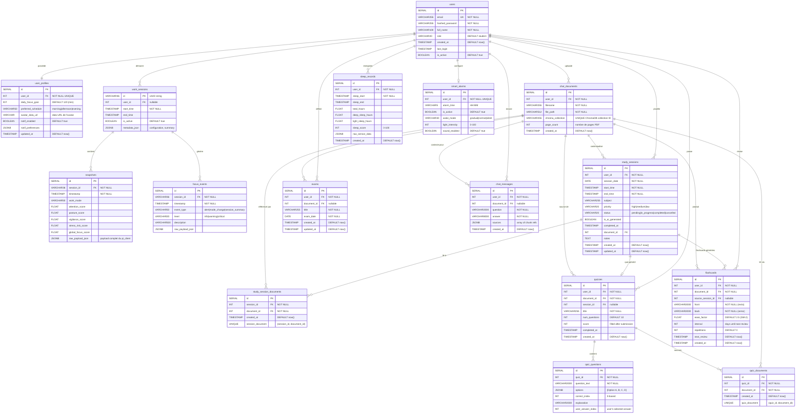

# 🗄️ Schéma Base de Données PostgreSQL (ERD) – Smart Focus & Life Assistant

**Version** : 2.0  
**Date** : 02 Mai 2026  
**Phase** : Conception (mise à jour post-implémentation)  
**SGBD** : PostgreSQL 15+  

---

## 1. ERD Global (Mermaid)


```mermaid
erDiagram

    %% ── UTILISATEURS ──────────────────────────────────────
    users {
        SERIAL      id              PK
        VARCHAR255  email           UK  "NOT NULL"
        VARCHAR255  hashed_password     "NOT NULL"
        VARCHAR100  full_name           "NOT NULL"
        VARCHAR20   role                "DEFAULT student"
        TIMESTAMP   created_at          "DEFAULT now()"
        TIMESTAMP   last_login
        BOOLEAN     is_active           "DEFAULT true"
    }

    user_profiles {
        SERIAL      id              PK
        INT         user_id         FK  "NOT NULL UNIQUE"
        INT         daily_focus_goal    "DEFAULT 120 (min)"
        VARCHAR50   preferred_schedule  "morning|afternoon|evening"
        VARCHAR     avatar_data_url     "data URL de l'avatar"
        BOOLEAN     notif_enabled       "DEFAULT true"
        JSONB       notif_preferences
        TIMESTAMP   updated_at          "DEFAULT now()"
    }

    %% ── VISION / MONITORING CV ──────────────────────────────
    work_sessions {
        VARCHAR36   id              PK  "UUID string"
        INT         user_id         FK  "nullable"
        TIMESTAMP   start_time          "NOT NULL"
        TIMESTAMP   end_time
        BOOLEAN     is_active           "DEFAULT true"
        JSONB       metadata_json       "configuration, summary"
    }

    snapshots {
        SERIAL      id              PK
        VARCHAR36   session_id      FK  "NOT NULL"
        TIMESTAMP   timestamp           "NOT NULL"
        VARCHAR50   work_mode
        FLOAT       attention_score
        FLOAT       posture_score
        FLOAT       vigilance_score
        FLOAT       stress_risk_score
        FLOAT       global_focus_score
        JSONB       raw_payload_json    "payload complet du pi_client"
    }

    focus_events {
        SERIAL      id              PK
        VARCHAR36   session_id      FK  "NOT NULL"
        TIMESTAMP   timestamp           "NOT NULL"
        VARCHAR50   event_type          "alert|mode_change|session_summary"
        VARCHAR20   level               "info|warning|critical"
        VARCHAR500  description
        JSONB       raw_payload_json
    }

    %% ── PLANNING ─────────────────────────────────────────
    study_sessions {
        SERIAL      id              PK
        INT         user_id         FK  "NOT NULL"
        DATE        session_date        "NOT NULL"
        TIMESTAMP   start_time          "NOT NULL"
        TIMESTAMP   end_time            "NOT NULL"
        VARCHAR255  subject
        VARCHAR20   priority            "high|medium|low"
        VARCHAR20   status              "pending|in_progress|completed|cancelled"
        BOOLEAN     is_ai_generated
        TIMESTAMP   completed_at
        INT         document_id     FK
        TEXT        notes
        TIMESTAMP   created_at          "DEFAULT now()"
        TIMESTAMP   updated_at          "DEFAULT now()"
    }

    exams {
        SERIAL      id              PK
        INT         user_id         FK  "NOT NULL"
        INT         document_id     FK  "nullable"
        VARCHAR255  title               "NOT NULL"
        DATE        exam_date           "NOT NULL"
        TIMESTAMP   created_at          "DEFAULT now()"
        TIMESTAMP   updated_at          "DEFAULT now()"
    }

    study_session_documents {
        SERIAL      id              PK
        INT         session_id      FK  "NOT NULL"
        INT         document_id     FK  "NOT NULL"
        TIMESTAMP   created_at          "DEFAULT now()"
        UNIQUE      session_document    "(session_id, document_id)"
    }

    %% ── CHATBOT RAG ──────────────────────────────────────
    chat_documents {
        SERIAL      id              PK
        INT         user_id         FK  "NOT NULL"
        VARCHAR255  filename            "NOT NULL"
        VARCHAR512  file_path           "NOT NULL"
        VARCHAR255  chroma_collection   "UNIQUE ChromaDB collection ID"
        INT         page_count          "nombre de pages PDF"
        TIMESTAMP   created_at          "DEFAULT now()"
    }

    chat_messages {
        SERIAL      id              PK
        INT         user_id         FK  "NOT NULL"
        INT         document_id     FK  "nullable"
        VARCHAR2000 question            "NOT NULL"
        VARCHAR8000 answer              "NOT NULL"
        JSONB       sources             "array of chunk refs"
        TIMESTAMP   created_at          "DEFAULT now()"
    }

    %% ── QUIZ ──────────────────────────────────────────────
    quizzes {
        SERIAL      id              PK
        INT         user_id         FK  "NOT NULL"
        INT         document_id     FK  "NOT NULL"
        INT         session_id      FK  "nullable"
        VARCHAR255  title               "NOT NULL"
        INT         num_questions       "DEFAULT 10"
        INT         score               "filled after submission"
        TIMESTAMP   completed_at
        TIMESTAMP   created_at          "DEFAULT now()"
    }

    quiz_questions {
        SERIAL      id              PK
        INT         quiz_id         FK  "NOT NULL"
        VARCHAR2000 question_text       "NOT NULL"
        JSONB       options             "[Option A, B, C, D]"
        INT         correct_index       "0-based"
        VARCHAR2000 explanation
        INT         user_answer_index   "user's selected answer"
    }

    quiz_documents {
        SERIAL      id              PK
        INT         quiz_id         FK  "NOT NULL"
        INT         document_id     FK  "NOT NULL"
        TIMESTAMP   created_at          "DEFAULT now()"
        UNIQUE      quiz_document       "(quiz_id, document_id)"
    }

    %% ── FLASHCARDS SM-2 ─────────────────────────────────
    flashcards {
        SERIAL      id              PK
        INT         user_id         FK  "NOT NULL"
        INT         document_id     FK  "NOT NULL"
        INT         source_session_id FK "nullable"
        VARCHAR2000 front               "NOT NULL (recto)"
        VARCHAR2000 back                "NOT NULL (verso)"
        FLOAT       ease_factor         "DEFAULT 2.5 (SM-2)"
        INT         interval            "days until next review"
        INT         repetitions         "DEFAULT 0"
        TIMESTAMP   next_review         "DEFAULT now()"
        TIMESTAMP   created_at          "DEFAULT now()"
    }

    %% ── SOMMEIL ──────────────────────────────────────────
    sleep_records {
        SERIAL      id              PK
        INT         user_id         FK  "NOT NULL"
        TIMESTAMP   sleep_start         "NOT NULL"
        TIMESTAMP   sleep_end
        FLOAT       total_hours
        FLOAT       deep_sleep_hours
        FLOAT       light_sleep_hours
        INT         sleep_score         "0-100"
        JSONB       raw_sensor_data
        TIMESTAMP   created_at          "DEFAULT now()"
    }

    smart_alarms {
        SERIAL      id              PK
        INT         user_id         FK  "NOT NULL UNIQUE"
        VARCHAR5    alarm_time          "HH:MM"
        BOOLEAN     is_active           "DEFAULT true"
        VARCHAR30   wake_mode           "gradual|normal|silent"
        INT         light_intensity     "0-100"
        BOOLEAN     sound_enabled       "DEFAULT true"
    }

    %% ── RELATIONS ────────────────────────────────────────

    users               ||--||  user_profiles           : "possède"
    users               ||--o{  work_sessions           : "démarre"
    users               ||--o{  study_sessions          : "planifie"
    users               ||--o{  exams                   : "définit"
    users               ||--o{  chat_documents          : "uploade"
    users               ||--o{  chat_messages           : "envoie"
    users               ||--o{  quizzes                 : "passe"
    users               ||--o{  flashcards              : "révise"
    users               ||--o{  sleep_records           : "enregistre"
    users               ||--o|  smart_alarms            : "configure"

    work_sessions       ||--o{  snapshots               : "contient"
    work_sessions       ||--o{  focus_events            : "génère"

    study_sessions      ||--o{  study_session_documents : "lié à"
    study_sessions      ||--o|  quizzes                 : "quiz généré"
    study_sessions      ||--o{  flashcards              : "flashcards générées"

    chat_documents      ||--o{  chat_messages           : "contexte pour"
    chat_documents      ||--o{  quizzes                 : "source de"
    chat_documents      ||--o{  flashcards              : "produit"
    chat_documents      ||--o{  study_sessions          : "contextualise"
    chat_documents      ||--o{  study_session_documents : "référencé par"
    chat_documents      ||--o{  quiz_documents          : "lié via"
    chat_documents      ||--o{  exams                   : "concerne"

    quizzes             ||--o{  quiz_questions          : "contient"
    quizzes             ||--o{  quiz_documents          : "sources"
```

---

## 2. SQL de Création des Tables (PostgreSQL DDL)

```sql
-- ========================================================
-- Smart Focus & Life Assistant – PostgreSQL DDL v2.0
-- Reflète l'implémentation réelle (Mai 2026)
-- ========================================================

-- ── UTILISATEURS ─────────────────────────────────────────

CREATE TABLE users (
    id               SERIAL PRIMARY KEY,
    email            VARCHAR(255) NOT NULL UNIQUE,
    hashed_password  VARCHAR(255) NOT NULL,
    full_name        VARCHAR(100) NOT NULL,
    role             VARCHAR(20)  NOT NULL DEFAULT 'student'
                         CHECK (role IN ('student', 'teacher', 'professional')),
    is_active        BOOLEAN      NOT NULL DEFAULT TRUE,
    created_at       TIMESTAMP    NOT NULL DEFAULT NOW(),
    last_login       TIMESTAMP
);

CREATE TABLE user_profiles (
    id                   SERIAL PRIMARY KEY,
    user_id              INT          NOT NULL UNIQUE REFERENCES users(id) ON DELETE CASCADE,
    daily_focus_goal     INT          NOT NULL DEFAULT 120,
    preferred_schedule   VARCHAR(50)  NOT NULL DEFAULT 'morning'
                             CHECK (preferred_schedule IN ('morning','afternoon','evening')),
    avatar_data_url      VARCHAR,
    notif_enabled        BOOLEAN      NOT NULL DEFAULT TRUE,
    notif_preferences    JSONB,
    updated_at           TIMESTAMP    NOT NULL DEFAULT NOW()
);

-- ── VISION / MONITORING CV ───────────────────────────────

CREATE TABLE work_sessions (
    id              VARCHAR(36)  PRIMARY KEY,
    user_id         INT          REFERENCES users(id) ON DELETE CASCADE,
    start_time      TIMESTAMP    NOT NULL DEFAULT NOW(),
    end_time        TIMESTAMP,
    is_active       BOOLEAN      NOT NULL DEFAULT TRUE,
    metadata_json   JSONB
);

CREATE TABLE snapshots (
    id                  SERIAL PRIMARY KEY,
    session_id          VARCHAR(36) NOT NULL REFERENCES work_sessions(id) ON DELETE CASCADE,
    timestamp           TIMESTAMP   NOT NULL DEFAULT NOW(),
    work_mode           VARCHAR(50),
    attention_score     FLOAT,
    posture_score       FLOAT,
    vigilance_score     FLOAT,
    stress_risk_score   FLOAT,
    global_focus_score  FLOAT,
    raw_payload_json    JSONB
);

CREATE TABLE focus_events (
    id               SERIAL PRIMARY KEY,
    session_id       VARCHAR(36) NOT NULL REFERENCES work_sessions(id) ON DELETE CASCADE,
    timestamp        TIMESTAMP   NOT NULL DEFAULT NOW(),
    event_type       VARCHAR(50),
    level            VARCHAR(20),
    description      VARCHAR(500),
    raw_payload_json JSONB
);

-- ── PLANNING ─────────────────────────────────────────────

CREATE TABLE study_sessions (
    id              SERIAL PRIMARY KEY,
    user_id         INT          NOT NULL REFERENCES users(id) ON DELETE CASCADE,
    date            DATE         NOT NULL,
    start           TIMESTAMP    NOT NULL,
    "end"           TIMESTAMP    NOT NULL,
    subject         VARCHAR(255) NOT NULL,
    priority        VARCHAR(20)  NOT NULL DEFAULT 'medium'
                        CHECK (priority IN ('high','medium','low')),
    status          VARCHAR(20)  NOT NULL DEFAULT 'pending'
                        CHECK (status IN ('pending','in_progress','completed','cancelled')),
    is_ai_generated BOOLEAN      NOT NULL DEFAULT FALSE,
    completed_at    TIMESTAMP,
    document_id     INT          REFERENCES chat_documents(id) ON DELETE SET NULL,
    notes           VARCHAR(2000),
    created_at      TIMESTAMP    NOT NULL DEFAULT NOW(),
    updated_at      TIMESTAMP    NOT NULL DEFAULT NOW()
);

CREATE TABLE exams (
    id          SERIAL PRIMARY KEY,
    user_id     INT          NOT NULL REFERENCES users(id) ON DELETE CASCADE,
    document_id INT          REFERENCES chat_documents(id) ON DELETE SET NULL,
    title       VARCHAR(255) NOT NULL,
    exam_date   DATE         NOT NULL,
    created_at  TIMESTAMP    NOT NULL DEFAULT NOW(),
    updated_at  TIMESTAMP    NOT NULL DEFAULT NOW()
);

CREATE TABLE study_session_documents (
    id          SERIAL PRIMARY KEY,
    session_id  INT NOT NULL REFERENCES study_sessions(id) ON DELETE CASCADE,
    document_id INT NOT NULL REFERENCES chat_documents(id) ON DELETE CASCADE,
    created_at  TIMESTAMP NOT NULL DEFAULT NOW(),
    UNIQUE (session_id, document_id)
);

-- ── CHATBOT RAG ──────────────────────────────────────────

CREATE TABLE chat_documents (
    id                SERIAL PRIMARY KEY,
    user_id           INT           NOT NULL REFERENCES users(id) ON DELETE CASCADE,
    filename          VARCHAR(255)  NOT NULL,
    file_path         VARCHAR(512)  NOT NULL,
    chroma_collection VARCHAR(255)  NOT NULL UNIQUE,
    page_count        INT,
    created_at        TIMESTAMP     NOT NULL DEFAULT NOW()
);

CREATE TABLE chat_messages (
    id          SERIAL PRIMARY KEY,
    user_id     INT           NOT NULL REFERENCES users(id) ON DELETE CASCADE,
    document_id INT           REFERENCES chat_documents(id) ON DELETE CASCADE,
    question    VARCHAR(2000) NOT NULL,
    answer      VARCHAR(8000) NOT NULL,
    sources     JSONB,
    created_at  TIMESTAMP     NOT NULL DEFAULT NOW()
);

-- ── QUIZ ─────────────────────────────────────────────────

CREATE TABLE quizzes (
    id            SERIAL PRIMARY KEY,
    user_id       INT         NOT NULL REFERENCES users(id) ON DELETE CASCADE,
    document_id   INT         NOT NULL REFERENCES chat_documents(id) ON DELETE CASCADE,
    session_id    INT         REFERENCES study_sessions(id) ON DELETE SET NULL,
    title         VARCHAR(255) NOT NULL,
    num_questions INT         NOT NULL DEFAULT 10,
    score         INT,
    completed_at  TIMESTAMP,
    created_at    TIMESTAMP   NOT NULL DEFAULT NOW()
);

CREATE TABLE quiz_questions (
    id                SERIAL PRIMARY KEY,
    quiz_id           INT           NOT NULL REFERENCES quizzes(id) ON DELETE CASCADE,
    question_text     VARCHAR(2000) NOT NULL,
    options           JSONB         NOT NULL,
    correct_index     INT           NOT NULL,
    explanation       VARCHAR(2000),
    user_answer_index INT
);

CREATE TABLE quiz_documents (
    id          SERIAL PRIMARY KEY,
    quiz_id     INT NOT NULL REFERENCES quizzes(id) ON DELETE CASCADE,
    document_id INT NOT NULL REFERENCES chat_documents(id) ON DELETE CASCADE,
    created_at  TIMESTAMP NOT NULL DEFAULT NOW(),
    UNIQUE (quiz_id, document_id)
);

-- ── FLASHCARDS SM-2 ──────────────────────────────────────

CREATE TABLE flashcards (
    id                SERIAL PRIMARY KEY,
    user_id           INT           NOT NULL REFERENCES users(id) ON DELETE CASCADE,
    document_id       INT           NOT NULL REFERENCES chat_documents(id) ON DELETE CASCADE,
    source_session_id INT           REFERENCES study_sessions(id) ON DELETE SET NULL,
    front             VARCHAR(2000) NOT NULL,
    back              VARCHAR(2000) NOT NULL,
    ease_factor       FLOAT         NOT NULL DEFAULT 2.5,
    interval          INT           NOT NULL DEFAULT 1,
    repetitions       INT           NOT NULL DEFAULT 0,
    next_review       TIMESTAMP     NOT NULL DEFAULT NOW(),
    created_at        TIMESTAMP     NOT NULL DEFAULT NOW()
);

-- ── SOMMEIL ──────────────────────────────────────────────

CREATE TABLE sleep_records (
    id                SERIAL PRIMARY KEY,
    user_id           INT       NOT NULL REFERENCES users(id) ON DELETE CASCADE,
    sleep_start       TIMESTAMP NOT NULL,
    sleep_end         TIMESTAMP,
    total_hours       FLOAT,
    deep_sleep_hours  FLOAT,
    light_sleep_hours FLOAT,
    sleep_score       INT       CHECK (sleep_score BETWEEN 0 AND 100),
    raw_sensor_data   JSONB,
    created_at        TIMESTAMP NOT NULL DEFAULT NOW()
);

CREATE TABLE smart_alarms (
    id              SERIAL PRIMARY KEY,
    user_id         INT        NOT NULL UNIQUE REFERENCES users(id) ON DELETE CASCADE,
    alarm_time      VARCHAR(5) NOT NULL,
    is_active       BOOLEAN    NOT NULL DEFAULT TRUE,
    wake_mode       VARCHAR(30) NOT NULL DEFAULT 'gradual'
                        CHECK (wake_mode IN ('gradual','normal','silent')),
    light_intensity INT        NOT NULL DEFAULT 50 CHECK (light_intensity BETWEEN 0 AND 100),
    sound_enabled   BOOLEAN    NOT NULL DEFAULT TRUE
);

-- ── INDEX PERFORMANCE ────────────────────────────────────

CREATE INDEX idx_work_sessions_user ON work_sessions(user_id);
CREATE INDEX idx_snapshots_session ON snapshots(session_id, timestamp DESC);
CREATE INDEX idx_focus_events_session ON focus_events(session_id, timestamp DESC);
CREATE INDEX idx_study_sessions_user_date ON study_sessions(user_id, date DESC);
CREATE INDEX idx_chat_documents_user ON chat_documents(user_id);
CREATE INDEX idx_chat_messages_user ON chat_messages(user_id, created_at DESC);
CREATE INDEX idx_flashcards_review ON flashcards(user_id, next_review ASC);
CREATE INDEX idx_sleep_records_user ON sleep_records(user_id, sleep_start DESC);
CREATE INDEX idx_exams_user_date ON exams(user_id, exam_date ASC);
```

---

## 3. Résumé des Tables

| Table | # Champs | Description |
|-------|----------|-------------|
| `users` | 8 | Comptes utilisateurs |
| `user_profiles` | 8 | Préférences, objectifs & avatar |
| `work_sessions` | 6 | Sessions de monitoring CV (pi_client) |
| `snapshots` | 10 | Scores comportementaux temps réel |
| `focus_events` | 7 | Événements discrets (alertes, transitions) |
| `study_sessions` | 14 | Sessions d'étude planifiées (IA ou manuel) |
| `exams` | 7 | Examens cibles pour intensifier la révision |
| `study_session_documents` | 4 | Liaison M-N session↔document |
| `chat_documents` | 7 | Documents PDF/CSV uploadés |
| `chat_messages` | 7 | Échanges Q&A du chatbot |
| `quizzes` | 9 | Quiz QCM auto-générés |
| `quiz_questions` | 7 | Questions QCM individuelles |
| `quiz_documents` | 4 | Liaison M-N quiz↔document |
| `flashcards` | 11 | Cartes de révision SM-2 |
| `sleep_records` | 10 | Données de sommeil |
| `smart_alarms` | 7 | Configuration réveil intelligent |
| **Total** | **16 tables** | |

---

## 4. Changements par rapport à la conception v1.0

| Élément | Conception v1.0 | Réalité v2.0 |
|---------|----------------|--------------|
| Tables focus | `focus_sessions`, `focus_scores`, `focus_alerts` | `work_sessions`, `snapshots`, `focus_events` |
| Tables posture | `posture_analyses`, `posture_alerts`, `posture_stats` | Intégré dans `snapshots` (posture_score) |
| Table IoT | `esp32_devices` | Supprimée (pas d'ESP32) |
| Table documents | `documents` (is_indexed, num_chunks) | `chat_documents` (chroma_collection, page_count) |
| Table chunks | `document_chunks` | Supprimée (géré par ChromaDB) |
| Table conversations | `chat_conversations` | Supprimée (messages liés directement au user) |
| Table messages | role/content avec conversation_id | question/answer avec document_id |
| Tables stress | `breathing_exercises`, `micro_breaks` | Non implémentées |
| Tables stats | `daily_stats`, `weekly_reports` | Non implémentées |
| Flashcards | `difficulty_level`, `review_count` | `source_session_id`, `interval`, `repetitions` |
| Quiz | sans session_id | + `session_id`, `num_questions`, `completed_at` |
| UserProfile | sans avatar | + `avatar_data_url` |
| Total tables | 23 prévues | 16 implémentées |

---

*Mis à jour le 02 Mai 2026 — Smart Focus & Life Assistant*
