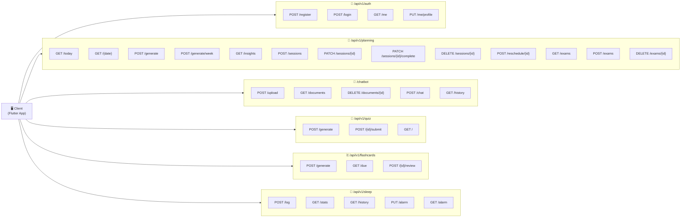
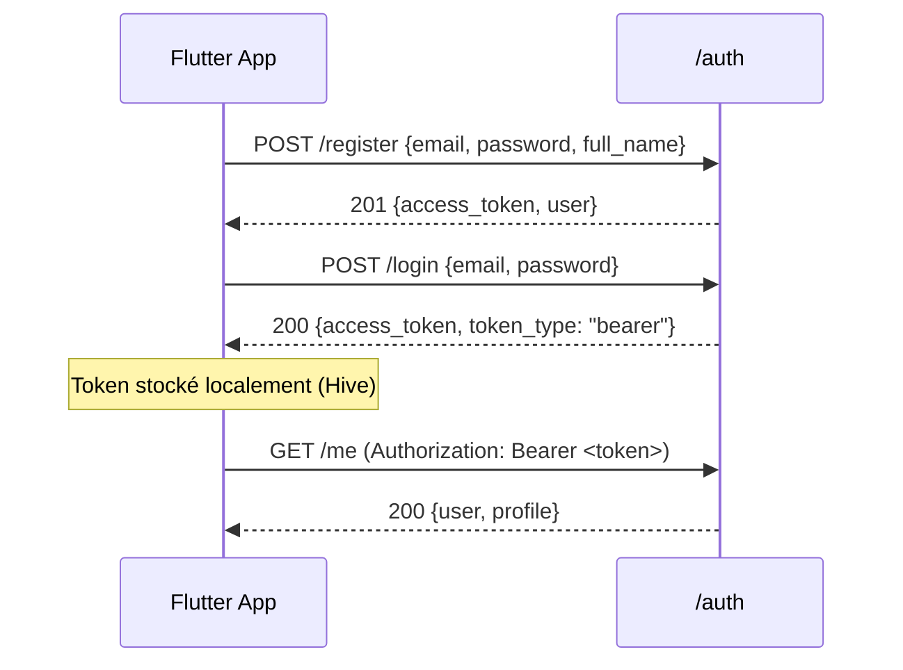
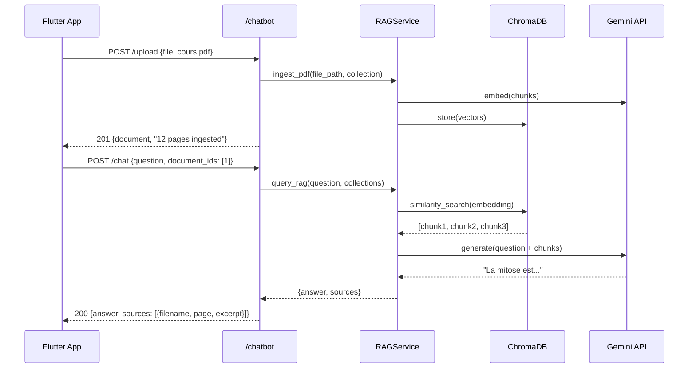
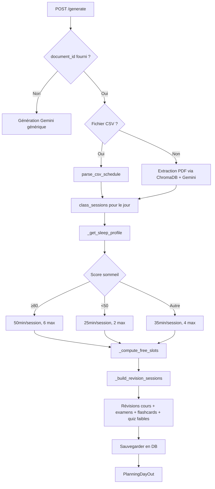

# 🌐 Endpoints API – Smart Focus & Life Assistant

**Version** : 2.0  
**Date** : 9 Avril 2026  
**Base URL** : `http://localhost:8000`  
**Framework** : FastAPI + OpenAPI (Swagger : `/docs`, ReDoc : `/redoc`)

> ⚠️ Les endpoints `/chatbot/*` n'ont pas de préfixe `/api/v1/`. Tous les autres utilisent `/api/v1/`.

---

## 1. Vue Globale des Endpoints Actifs



---

## 2. Détail par Module

### 🔐 Authentification (`/api/v1/auth`)

| Méthode | Endpoint | Auth? | Description | Body | Réponse |
|---------|----------|-------|-------------|------|---------|
| `POST` | `/register` | ❌ | Créer un compte | `{email, password, full_name}` | `{access_token, user}` |
| `POST` | `/login` | ❌ | Se connecter (form) | `{email, password}` | `{access_token, token_type}` |
| `GET` | `/me` | ✅ | Profil courant + préférences | — | `{user, profile}` |
| `PUT` | `/me/profile` | ✅ | Mettre à jour préférences | `{daily_focus_goal, preferred_schedule, notif_enabled}` | `{profile}` |



---

### 💬 Chatbot RAG (`/chatbot`)

> Note: Ce routeur n'a pas de préfixe `/api/v1/`.

| Méthode | Endpoint | Auth? | Description | Body | Réponse |
|---------|----------|-------|-------------|------|---------|
| `POST` | `/upload` | ✅ | Upload PDF ou CSV emploi du temps | `multipart/form-data` (file) | `{message, document}` |
| `GET` | `/documents` | ✅ | Lister les documents de l'utilisateur | — | `[DocumentInfo]` |
| `DELETE` | `/documents/{id}` | ✅ | Supprimer document (DB + disque + ChromaDB) | — | `{message, document_id}` |
| `POST` | `/chat` | ✅ | Poser une question (RAG ou général) | `{question, document_ids?: [int]}` | `{answer, sources[], message_id}` |
| `GET` | `/history` | ✅ | Historique des échanges du user | `?limit=20` | `[ChatMessageInfo]` |

**Modes de chat :**
- `document_ids` vide → mode général (IA directe, sans RAG)
- `document_ids` rempli → mode RAG (recherche dans ChromaDB + génération de réponse ancrée)

**Formats de fichier acceptés pour `/upload` :**
- `.pdf` → ingestion ChromaDB (chunking + embedding Gemini)
- `.csv` → validation schema (`week, day, start, end, subject`) pour emploi du temps



---

### 🧠 Quiz (`/api/v1/quiz`)

| Méthode | Endpoint | Auth? | Description | Body | Réponse |
|---------|----------|-------|-------------|------|---------|
| `POST` | `/generate` | ✅ | Générer un quiz depuis document(s) | `{document_id, num_questions?: int}` | `{quiz, questions[]}` |
| `POST` | `/{id}/submit` | ✅ | Soumettre les réponses | `{answers: [0, 2, 1, ...]}` | `{score, corrections[]}` |
| `GET` | `/` | ✅ | Lister mes quiz | — | `[Quiz]` |

**Structure d'une question QCM :**
```json
{
  "question_text": "Qu'est-ce que la mitose ?",
  "options": ["Division cellulaire", "Photosynthèse", "Respiration", "Fermentation"],
  "correct_index": 0,
  "explanation": "La mitose est le processus de division cellulaire..."
}
```

---

### 🃏 Flashcards SM-2 (`/api/v1/flashcards`)

| Méthode | Endpoint | Auth? | Description | Body | Réponse |
|---------|----------|-------|-------------|------|---------|
| `POST` | `/generate` | ✅ | Générer des flashcards depuis doc | `{document_id, count?: int}` | `[Flashcard]` |
| `GET` | `/due` | ✅ | Cartes dues aujourd'hui (SM-2) | — | `[Flashcard]` |
| `POST` | `/{id}/review` | ✅ | Soumettre une révision | `{ease: 0-5}` | `{next_review, interval, repetitions}` |

**Algorithme SM-2 :**
- `ease 0-1` → répétition immédiate (difficile)
- `ease 2` → lendemain
- `ease 3-5` → intervalle multiplié par `ease_factor` (2.5 par défaut)

---

### 📅 Planning Intelligent (`/api/v1/planning`)

| Méthode | Endpoint | Auth? | Description | Body |
|---------|----------|-------|-------------|------|
| `GET` | `/today` | ✅ | Planning du jour courant | — |
| `GET` | `/{date}` | ✅ | Planning d'une date (`YYYY-MM-DD`) | — |
| `POST` | `/generate` | ✅ | Générer planning IA pour 1 jour | voir ci-dessous |
| `POST` | `/generate/week` | ✅ | Générer planning IA pour 7 jours | voir ci-dessous |
| `GET` | `/insights` | ✅ | Stats et recommandations | `?period=week\|month` |
| `POST` | `/sessions` | ✅ | Créer session manuelle | `{subject, start, end, priority, document_id?}` |
| `PATCH` | `/sessions/{id}` | ✅ | Modifier une session | `{status?, notes?, subject?}` |
| `PATCH` | `/sessions/{id}/complete` | ✅ | Marquer comme terminée | — |
| `DELETE` | `/sessions/{id}` | ✅ | Supprimer une session | — |
| `POST` | `/reschedule/{id}` | ✅ | Replanifier session manquée/annulée | — |
| `GET` | `/exams` | ✅ | Lister les examens à venir | — |
| `POST` | `/exams` | ✅ | Créer un examen | `{title, exam_date, document_id?}` |
| `DELETE` | `/exams/{id}` | ✅ | Supprimer un examen | — |

**Body `/generate` et `/generate/week` :**
```json
{
  "date": "2026-04-09",
  "document_id": 3,
  "week_type": "A",
  "exam_ids": [1, 2],
  "preferences": {
    "subjects": ["Mathématiques", "Physique"]
  }
}
```

**Logique de génération (mode CSV) :**


**Body `/insights` — exemple de réponse :**
```json
{
  "period": "week",
  "total_study_minutes": 420,
  "completed_sessions": 8,
  "skipped_sessions": 2,
  "completion_rate": 0.8,
  "avg_sleep_score": 72.5,
  "sleep_study_correlation": "positive",
  "weakest_subject": "Chimie_Organique.pdf",
  "strongest_subject": "Mathématiques.pdf",
  "recommendation": "Votre taux de complétion est plus fort le matin. Essayez de réduire les sessions le soir."
}
```

---

### 🌙 Sommeil (`/api/v1/sleep`)

| Méthode | Endpoint | Auth? | Description | Body | Réponse |
|---------|----------|-------|-------------|------|---------|
| `POST` | `/log` | ✅ | Enregistrer une nuit | `{sleep_start, sleep_end, raw_data?}` | `{record, sleep_score}` |
| `GET` | `/stats` | ✅ | Statistiques de sommeil | `?period=week\|month` | `{avg_hours, score_avg, trend}` |
| `GET` | `/history` | ✅ | Historique des nuits | `?limit=30` | `[SleepRecord]` |
| `PUT` | `/alarm` | ✅ | Créer/maj config alarme | `{alarm_time, wake_mode, light_intensity, sound_enabled}` | `{alarm}` |
| `GET` | `/alarm` | ✅ | Lire la config alarme | — | `{alarm}` |

**Paramètres alarme :**
- `alarm_time` : format `"HH:MM"`
- `wake_mode` : `"gradual"` | `"normal"` | `"silent"`
- `light_intensity` : `0–100`

---

## 3. Authentification JWT

```
Authorization: Bearer <access_token>
```

- **Access token** : expire dans **30 minutes**
- Stockage Flutter : `Hive` (local storage sécurisé)
- Rôles : `student` | `teacher` | `professional`

---

## 4. Codes de Statut HTTP

| Code | Signification |
|------|---------------|
| `200` | Succès |
| `201` | Ressource créée |
| `204` | Suppression réussie (pas de contenu) |
| `400` | Requête invalide |
| `401` | Non authentifié (token manquant/expiré) |
| `403` | Accès refusé |
| `404` | Ressource introuvable |
| `409` | Conflit (ex: aucun créneau libre pour reschedule) |
| `422` | Erreur de validation (Pydantic ou logique métier) |
| `500` | Erreur interne serveur |

---

## 5. Endpoints Planifiés (Non Encore Implémentés)

| Module | Endpoint | Raison du report |
|--------|----------|-----------------|
| WebSocket | `WS /ws/realtime` | Frontend prêt, backend non finalisé |
| Device IoT | `/api/v1/device/*` | Bloqué en attente hardware Personne 1 |
| Focus Sessions | `/api/v1/focus/*` | Dépend de l'ESP32-CAM |
| Posture | `/api/v1/posture/*` | Dépend du ML Personne 1 |

---

*Mis à jour le 9 Avril 2026 — Smart Focus & Life Assistant*
