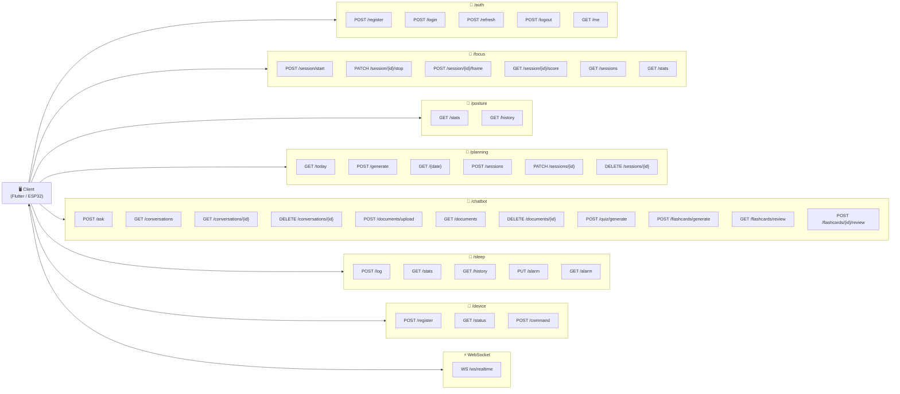
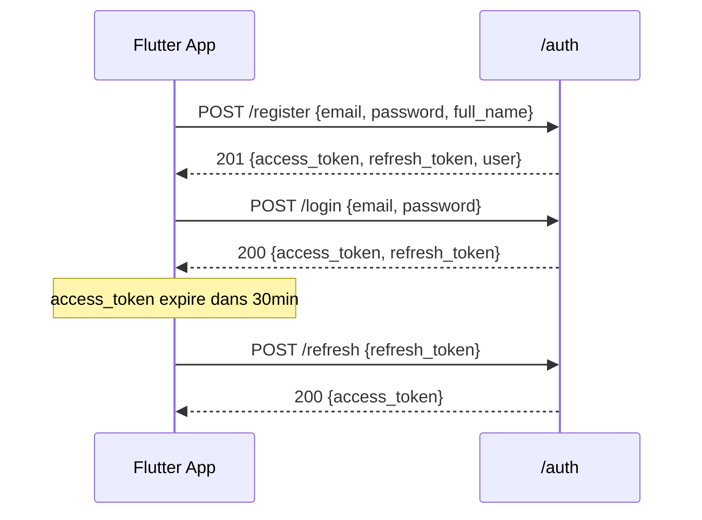
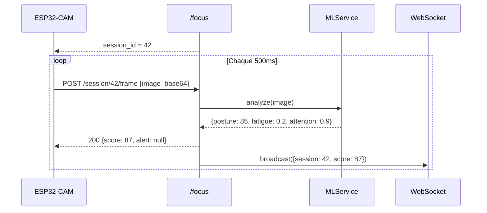
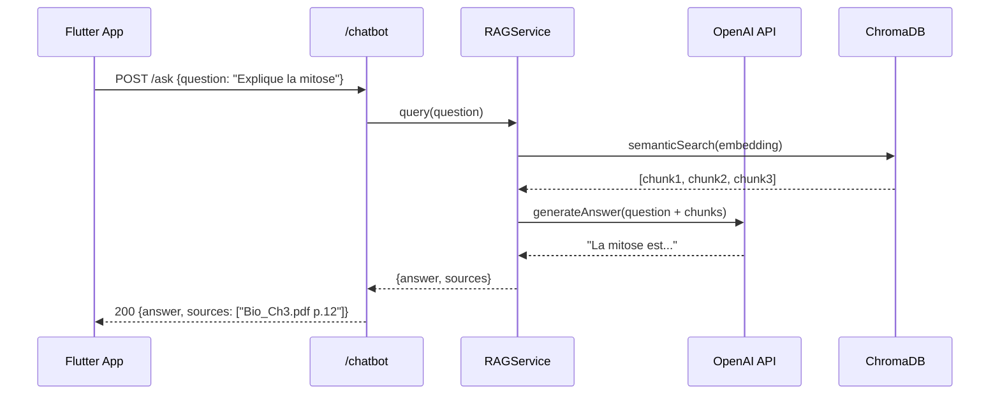

# 🌐 Diagramme des Endpoints API – Smart Focus & Life Assistant

**Version** : 1.0  
**Date** : 01 Mars 2026  
**Base URL** : `http://localhost:8000/api/v1`  
**Framework** : FastAPI + OpenAPI (Swagger auto-généré)

---

## 1. Vue Globale des Endpoints



---

## 2. Détail Complet par Groupe

### 🔐 Authentification (`/api/v1/auth`)

| Méthode | Endpoint | Auth? | Description | Body | Réponse |
|---------|----------|-------|-------------|------|---------|
| `POST` | `/register` | ❌ | Créer un compte | `{email, password, full_name}` | `{access_token, user}` |
| `POST` | `/login` | ❌ | Se connecter | `{email, password}` (form) | `{access_token, refresh_token}` |
| `POST` | `/refresh` | ❌ | Renouveler token | `{refresh_token}` | `{access_token}` |
| `POST` | `/logout` | ✅ | Déconnecter | — | `{message}` |
| `GET`  | `/me` | ✅ | Profil courant | — | `{user, profile}` |
| `PUT`  | `/me/profile` | ✅ | MAJ préférences | `{daily_goal, schedule, ...}` | `{profile}` |



---

### 🎯 Sessions Focus (`/api/v1/focus`)

| Méthode | Endpoint | Auth? | Description | Body | Réponse |
|---------|----------|-------|-------------|------|---------|
| `POST` | `/session/start` | ✅ | Démarrer session | `{device_id?}` | `{session_id, status}` |
| `PATCH` | `/session/{id}/stop` | ✅ | Arrêter session | — | `{session, avg_score}` |
| `PATCH` | `/session/{id}/pause` | ✅ | Mettre en pause | — | `{status}` |
| `PATCH` | `/session/{id}/resume` | ✅ | Reprendre | — | `{status}` |
| `POST` | `/session/{id}/frame` | ✅ | Envoyer frame ESP32 | `{image_base64, sensors?}` | `{score, alerts}` |
| `GET` | `/session/{id}/score` | ✅ | Score actuel | — | `{score, posture, fatigue}` |
| `GET` | `/sessions` | ✅ | Historique sessions | `?limit=20&skip=0` | `[sessions]` |
| `GET` | `/stats` | ✅ | Statistiques focus | `?period=week` | `{avg, trend, best}` |



---

### 🧍 Posture (`/api/v1/posture`)

| Méthode | Endpoint | Auth? | Description | Réponse |
|---------|----------|-------|-------------|---------|
| `GET` | `/stats` | ✅ | Stats posture du jour | `{good_pct, alerts, corrections}` |
| `GET` | `/history` | ✅ | Historique posture | `?period=week` → `[daily_stats]` |
| `GET` | `/alerts` | ✅ | Alertes récentes | `[{type, body_part, time}]` |

---

### 📅 Planning Intelligent (`/api/v1/planning`)

| Méthode | Endpoint | Auth? | Description | Body | Réponse |
|---------|----------|-------|-------------|------|---------|
| `GET` | `/today` | ✅ | Planning du jour | — | `{planning, sessions[]}` |
| `GET` | `/{date}` | ✅ | Planning d'une date | — | `{planning, sessions[]}` |
| `POST` | `/generate` | ✅ | Générer avec IA | `{date, preferences?}` | `{planning, sessions[]}` |
| `POST` | `/sessions` | ✅ | Ajouter une session | `{subject, start, end, priority}` | `{session}` |
| `PATCH` | `/sessions/{id}` | ✅ | Modifier session | `{status?, notes?}` | `{session}` |
| `DELETE` | `/sessions/{id}` | ✅ | Supprimer session | — | `204 No Content` |
| `PATCH` | `/sessions/{id}/complete` | ✅ | Marquer terminée | — | `{session}` |

---

### 💬 Chatbot RAG (`/api/v1/chatbot`)

| Méthode | Endpoint | Auth? | Description | Body | Réponse |
|---------|----------|-------|-------------|------|---------|
| `POST` | `/ask` | ✅ | Poser une question | `{question, conversation_id?, doc_ids?}` | `{answer, sources[], conversation_id}` |
| `GET` | `/conversations` | ✅ | Liste conversations | — | `[conversations]` |
| `GET` | `/conversations/{id}` | ✅ | Historique chat | — | `{conversation, messages[]}` |
| `DELETE` | `/conversations/{id}` | ✅ | Suppr. conversation | — | `204` |
| `POST` | `/documents/upload` | ✅ | Upload PDF/cours | `multipart/form-data` | `{document, chunks_count}` |
| `GET` | `/documents` | ✅ | Mes documents | — | `[documents]` |
| `DELETE` | `/documents/{id}` | ✅ | Suppr. document | — | `204` |
| `POST` | `/quiz/generate` | ✅ | Générer quiz | `{document_id, num_questions?}` | `{quiz, questions[]}` |
| `POST` | `/quiz/{id}/submit` | ✅ | Soumettre réponses | `{answers: [0,2,1,...]}` | `{score, corrections[]}` |
| `POST` | `/flashcards/generate` | ✅ | Générer flashcards | `{document_id, count?}` | `[flashcards]` |
| `GET` | `/flashcards/review` | ✅ | Cartes à réviser | — | `[flashcards due today]` |
| `POST` | `/flashcards/{id}/review` | ✅ | Soumettre révision | `{ease: 0-5}` | `{next_review, difficulty}` |



---

### 🌙 Sommeil (`/api/v1/sleep`)

| Méthode | Endpoint | Auth? | Description | Body | Réponse |
|---------|----------|-------|-------------|------|---------|
| `POST` | `/log` | ✅ | Enregistrer nuit | `{sleep_start, sleep_end, raw_data?}` | `{record, score}` |
| `GET` | `/stats` | ✅ | Stats sommeil | `?period=week` | `{avg_hours, score_avg, trend}` |
| `GET` | `/history` | ✅ | Historique nuits | `?limit=30` | `[sleep_records]` |
| `PUT` | `/alarm` | ✅ | Config réveil | `{alarm_time, wake_mode, light_intensity}` | `{alarm}` |
| `GET` | `/alarm` | ✅ | Config actuelle | — | `{alarm}` |

---

### 📡 Device IoT (`/api/v1/device`)

| Méthode | Endpoint | Auth? | Description | Body | Réponse |
|---------|----------|-------|-------------|------|---------|
| `POST` | `/register` | ✅ | Enregistrer ESP32 | `{device_id, firmware_version}` | `{device, api_key}` |
| `GET` | `/status` | ✅ | État du boîtier | — | `{status, last_seen, firmware}` |
| `POST` | `/command` | ✅ | Envoyer commande | `{led_color?, vibrate?, sound?}` | `{sent: true}` |

---

### ⚡ WebSocket Temps Réel (`/ws/realtime`)

```
WS /ws/realtime?token={access_token}
```

#### Messages serveur → client (push)

```json
// Score focus mis à jour
{"type": "focus_update", "data": {"score": 87, "posture": 85, "fatigue": 0.2}}

// Alerte déclenchée
{"type": "alert", "data": {"type": "posture", "message": "Redressez le dos", "severity": "warning"}}

// Session terminée
{"type": "session_end", "data": {"session_id": 42, "average_score": 78, "duration": 3600}}

// Suggestion micro-pause
{"type": "micro_break", "data": {"reason": "45min ininterrompues", "duration": 300}}
```

#### Messages client → serveur

```json
// Ping keepalive
{"type": "ping"}

// Acquitter une alerte
{"type": "ack_alert", "data": {"alert_id": 15}}
```

---

## 3. Codes de Statut HTTP

| Code | Signification |
|------|---------------|
| `200` | Succès |
| `201` | Créé avec succès |
| `204` | Supprimé (pas de contenu) |
| `400` | Données invalides |
| `401` | Non authentifié (token manquant/expiré) |
| `403` | Accès refusé (pas propriétaire) |
| `404` | Ressource introuvable |
| `422` | Erreur de validation Pydantic |
| `500` | Erreur interne serveur |

---

## 4. Authentification JWT

```
Authorization: Bearer <access_token>
```

- **Access token** : expire dans **30 minutes**
- **Refresh token** : expire dans **7 jours**
- Stockage Flutter : `flutter_secure_storage`
