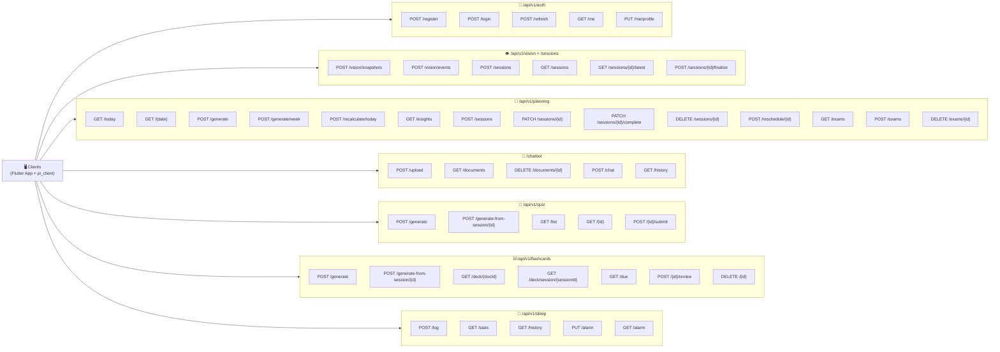
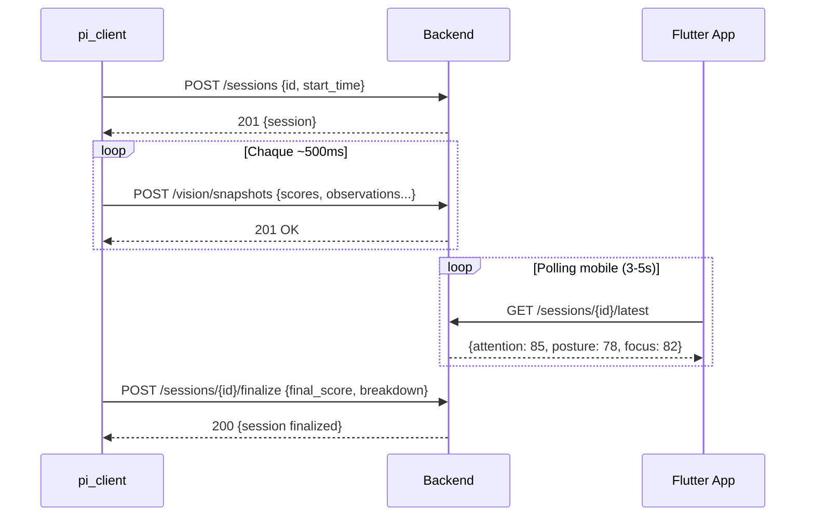
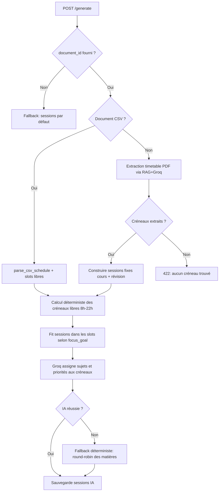

# 🌐 Endpoints API – Smart Focus & Life Assistant

**Version** : 3.0  
**Date** : 02 Mai 2026  
**Base URL** : `http://localhost:8000`  
**Framework** : FastAPI + OpenAPI (Swagger : `/docs`, ReDoc : `/redoc`)

> ⚠️ Les endpoints `/chatbot/*` n'ont pas de préfixe `/api/v1/`. Tous les autres utilisent `/api/v1/`.

---

## 1. Vue Globale des Endpoints Actifs


```mermaid
graph LR
    CLIENT["🖥 Clients\n(Flutter App + pi_client)"]

    subgraph AUTH_GRP["🔐 /api/v1/auth"]
        A1["POST /register"]
        A2["POST /login"]
        A3["POST /refresh"]
        A4["GET  /me"]
        A5["PUT  /me/profile"]
    end

    subgraph VISION_GRP["👁️ /api/v1/vision + /sessions"]
        V1["POST /vision/snapshots"]
        V2["POST /vision/events"]
        V3["POST /sessions"]
        V4["GET  /sessions"]
        V5["GET  /sessions/{id}/latest"]
        V6["POST /sessions/{id}/finalize"]
    end

    subgraph PLANNING_GRP["📅 /api/v1/planning"]
        PL1["GET  /today"]
        PL2["GET  /{date}"]
        PL3["POST /generate"]
        PL4["POST /generate/week"]
        PL5["POST /recalculate/today"]
        PL6["GET  /insights"]
        PL7["POST /sessions"]
        PL8["PATCH /sessions/{id}"]
        PL9["PATCH /sessions/{id}/complete"]
        PL10["DELETE /sessions/{id}"]
        PL11["POST /reschedule/{id}"]
        PL12["GET  /exams"]
        PL13["POST /exams"]
        PL14["DELETE /exams/{id}"]
    end

    subgraph CHATBOT_GRP["💬 /chatbot"]
        C1["POST /upload"]
        C2["GET  /documents"]
        C3["DELETE /documents/{id}"]
        C4["POST /chat"]
        C5["GET  /history"]
    end

    subgraph QUIZ_GRP["🧠 /api/v1/quiz"]
        Q1["POST /generate"]
        Q2["POST /generate-from-session/{id}"]
        Q3["GET  /list"]
        Q4["GET  /{id}"]
        Q5["POST /{id}/submit"]
    end

    subgraph FLASH_GRP["🃏 /api/v1/flashcards"]
        F1["POST /generate"]
        F2["POST /generate-from-session/{id}"]
        F3["GET  /deck/{docId}"]
        F4["GET  /deck/session/{sessionId}"]
        F5["GET  /due"]
        F6["POST /{id}/review"]
        F7["DELETE /{id}"]
    end

    subgraph SLEEP_GRP["🌙 /api/v1/sleep"]
        S1["POST /log"]
        S2["GET  /stats"]
        S3["GET  /history"]
        S4["PUT  /alarm"]
        S5["GET  /alarm"]
    end

    CLIENT --> AUTH_GRP
    CLIENT --> VISION_GRP
    CLIENT --> PLANNING_GRP
    CLIENT --> CHATBOT_GRP
    CLIENT --> QUIZ_GRP
    CLIENT --> FLASH_GRP
    CLIENT --> SLEEP_GRP
```

---

## 2. Détail par Module

### 🔐 Authentification (`/api/v1/auth`)

| Méthode | Endpoint | Auth? | Description | Body | Réponse |
|---------|----------|-------|-------------|------|---------|
| `POST` | `/register` | ❌ | Créer un compte | `{email, password, full_name}` | `{access_token, user}` |
| `POST` | `/login` | ❌ | Se connecter (form) | `{email, password}` | `{access_token, token_type}` |
| `POST` | `/refresh` | ❌ | Rafraîchir le token | `{refresh_token}` | `{access_token, refresh_token}` |
| `GET` | `/me` | ✅ | Profil courant + préférences | — | `{user, profile}` |
| `PUT` | `/me/profile` | ✅ | Mettre à jour préférences | `{daily_focus_goal, preferred_schedule, notif_enabled, avatar_data_url}` | `{profile}` |

---

### 👁️ Vision / Monitoring CV (`/api/v1/vision` + `/api/v1/sessions`)

> Ce module gère l'ingestion des données de monitoring comportemental envoyées par le `pi_client` et leur consultation depuis l'app mobile.

| Méthode | Endpoint | Auth? | Description | Body | Réponse |
|---------|----------|-------|-------------|------|---------|
| `POST` | `/vision/snapshots` | ❌ | Ingestion snapshot CV temps réel | `SnapshotCreate` (voir ci-dessous) | `{status, id}` |
| `POST` | `/vision/events` | ❌ | Ingestion événement discret CV | `EventCreate` | `{status, id}` |
| `POST` | `/sessions` | ⚡ | Créer/enregistrer une work session | `{id, start_time?, metadata_json?}` | `WorkSessionOut` |
| `GET` | `/sessions` | ✅ | Lister les work sessions du user | `?skip=0&limit=100&include_unassigned_active=false` | `[WorkSessionOut]` |
| `GET` | `/sessions/{id}/latest` | ✅ | Dernier snapshot d'une session | — | `SnapshotOut` |
| `POST` | `/sessions/{id}/finalize` | ⚡ | Finaliser une session (résumé final) | `SessionFinalizePayload` | `WorkSessionOut` |

> ⚡ = Auth optionnelle (le pi_client peut appeler sans auth, le mobile avec auth)

**Payload `SnapshotCreate` :**
```json
{
  "session_id": "uuid-string",
  "timestamp": "2026-05-02T14:30:00",
  "work_mode": "focused_work",
  "scores": {"attention": 85, "posture": 78, "vigilance": 90, "stress_risk": 12, "global_focus": 82},
  "presence": {"face_detected": true},
  "instant_observations": {...},
  "short_window_inference": {...},
  "consolidated_states": {...},
  "reliability": {...},
  "temporal_context": {...},
  "alert": {"level": "none"},
  "events": []
}
```

**Payload `SessionFinalizePayload` :**
```json
{
  "session_duration": 3600.5,
  "focus_time_ratio": 0.82,
  "distraction_time_ratio": 0.18,
  "posture_quality_score": 0.75,
  "fatigue_level": "moderate",
  "final_score": 78.5,
  "breakdown": {"attention_avg": 85, "posture_avg": 78}
}
```


```mermaid
sequenceDiagram
    participant PI as pi_client
    participant API as Backend
    participant APP as Flutter App

    PI->>API: POST /sessions {id, start_time}
    API-->>PI: 201 {session}

    loop Chaque ~500ms
        PI->>API: POST /vision/snapshots {scores, observations...}
        API-->>PI: 201 OK
    end

    loop Polling mobile (3-5s)
        APP->>API: GET /sessions/{id}/latest
        API-->>APP: {attention: 85, posture: 78, focus: 82}
    end

    PI->>API: POST /sessions/{id}/finalize {final_score, breakdown}
    API-->>PI: 200 {session finalized}
```

---

### 💬 Chatbot RAG (`/chatbot`)

> Note: Ce routeur n'a pas de préfixe `/api/v1/`.

| Méthode | Endpoint | Auth? | Description | Body | Réponse |
|---------|----------|-------|-------------|------|---------|
| `POST` | `/upload` | ✅ | Upload PDF ou CSV emploi du temps | `multipart/form-data` (file) | `{message, document}` |
| `GET` | `/documents` | ✅ | Lister les documents de l'utilisateur | — | `[DocumentInfo]` |
| `DELETE` | `/documents/{id}` | ✅ | Supprimer document (DB + disque + ChromaDB) | — | `{message, document_id}` |
| `POST` | `/chat` | ✅ | Poser une question (RAG ou général) | `{question, document_ids?: [int]}` | `{answer, sources[], message_id}` |
| `GET` | `/history` | ✅ | Historique des échanges du user | `?limit=20` | `[ChatMessageInfo]` |

**Modes de chat :**
- `document_ids` vide → mode général (IA directe, sans RAG)
- `document_ids` rempli → mode RAG (recherche dans ChromaDB + génération de réponse ancrée)

**Formats de fichier acceptés pour `/upload` :**
- `.pdf` → ingestion ChromaDB (chunking + embedding HuggingFace all-MiniLM-L6-v2)
- `.csv` → validation schema (`week, day, start, end, subject`) pour emploi du temps

> Note : les embeddings sont générés localement via HuggingFace (all-MiniLM-L6-v2), le LLM utilisé est Groq (llama-3.3-70b-versatile).

---

### 🧠 Quiz (`/api/v1/quiz`)

| Méthode | Endpoint | Auth? | Description | Body | Réponse |
|---------|----------|-------|-------------|------|---------|
| `POST` | `/generate` | ✅ | Générer quiz depuis document(s) | `{document_id?, document_ids?, num_questions?}` | `{quiz, questions[]}` |
| `POST` | `/generate-from-session/{session_id}` | ✅ | Générer quiz depuis session d'étude | `{num_questions?}` | `{quiz, questions[]}` |
| `GET` | `/list` | ✅ | Lister mes quiz | — | `[QuizOut]` |
| `GET` | `/{quiz_id}` | ✅ | Consulter un quiz (masque réponses si non soumis) | — | `QuizOut` |
| `POST` | `/{quiz_id}/submit` | ✅ | Soumettre les réponses | `{answers: [0, 2, 1, ...]}` | `{score, corrections[]}` |

---

### 🃏 Flashcards SM-2 (`/api/v1/flashcards`)

| Méthode | Endpoint | Auth? | Description | Body | Réponse |
|---------|----------|-------|-------------|------|---------|
| `POST` | `/generate` | ✅ | Générer flashcards depuis document(s) | `{document_id?, document_ids?, num_cards?}` | `[FlashcardOut]` |
| `POST` | `/generate-from-session/{session_id}` | ✅ | Générer flashcards depuis session | `{num_cards?}` | `[FlashcardOut]` |
| `GET` | `/deck/{document_id}` | ✅ | Cartes d'un document | — | `FlashcardDeckOut` |
| `GET` | `/deck/session/{session_id}` | ✅ | Cartes d'une session | — | `FlashcardDeckOut` |
| `GET` | `/due` | ✅ | Cartes dues aujourd'hui (SM-2) | — | `[FlashcardOut]` |
| `POST` | `/{card_id}/review` | ✅ | Soumettre une révision | `{quality: 0-5}` | `{next_review, interval, repetitions}` |
| `DELETE` | `/{card_id}` | ✅ | Supprimer une flashcard | — | `204` |

---

### 📅 Planning Intelligent (`/api/v1/planning`)

| Méthode | Endpoint | Auth? | Description | Body |
|---------|----------|-------|-------------|------|
| `GET` | `/today` | ✅ | Planning du jour courant | — |
| `GET` | `/{date}` | ✅ | Planning d'une date (`YYYY-MM-DD`) | — |
| `POST` | `/generate` | ✅ | Générer planning IA pour 1 jour | voir ci-dessous |
| `POST` | `/generate/week` | ✅ | Générer planning IA pour 7 jours | voir ci-dessous |
| `POST` | `/recalculate/today` | ✅ | Recaler révisions IA restantes du jour | — |
| `GET` | `/insights` | ✅ | Stats et recommandations | `?period=week\|month` |
| `POST` | `/sessions` | ✅ | Créer session manuelle | `{subject, start, end, priority, document_id?}` |
| `PATCH` | `/sessions/{id}` | ✅ | Modifier une session | `{status?, notes?, subject?}` |
| `PATCH` | `/sessions/{id}/complete` | ✅ | Marquer comme terminée | — |
| `DELETE` | `/sessions/{id}` | ✅ | Supprimer une session | — |
| `POST` | `/reschedule/{id}` | ✅ | Replanifier session manquée/annulée | — |
| `GET` | `/exams` | ✅ | Lister les examens à venir | — |
| `POST` | `/exams` | ✅ | Créer un examen | `{title, exam_date, document_id?}` |
| `DELETE` | `/exams/{id}` | ✅ | Supprimer un examen | — |

**Logique de génération (implémentation actuelle) :**

```mermaid
flowchart TD
    A[POST /generate] --> B{document_id fourni ?}
    B -- Non --> C[Fallback: sessions par défaut]
    B -- Oui --> D{Document CSV ?}
    D -- Oui --> E[parse_csv_schedule + slots libres]
    D -- Non --> F[Extraction timetable PDF via RAG+Groq]
    F --> G{Créneaux extraits ?}
    G -- Oui --> H[Construire sessions fixes cours + révision]
    G -- Non --> I[422: aucun créneau trouvé]

    E --> J[Calcul déterministe des créneaux libres 8h-22h]
    H --> J
    J --> K[Fit sessions dans les slots selon focus_goal]
    K --> L[Groq assigne sujets et priorités aux créneaux]
    L --> M{IA réussie ?}
    M -- Oui --> N[Sauvegarde sessions IA]
    M -- Non --> O[Fallback déterministe: round-robin des matières]
    O --> N
```

---

### 🌙 Sommeil (`/api/v1/sleep`)

| Méthode | Endpoint | Auth? | Description | Body | Réponse |
|---------|----------|-------|-------------|------|---------|
| `POST` | `/log` | ✅ | Enregistrer une nuit | `{sleep_start, sleep_end, raw_data?}` | `{record, sleep_score}` |
| `GET` | `/stats` | ✅ | Statistiques de sommeil | `?period=week\|month` | `{avg_hours, score_avg, trend}` |
| `GET` | `/history` | ✅ | Historique des nuits | `?limit=30` | `[SleepRecord]` |
| `PUT` | `/alarm` | ✅ | Créer/maj config alarme | `{alarm_time, wake_mode, light_intensity, sound_enabled}` | `{alarm}` |
| `GET` | `/alarm` | ✅ | Lire la config alarme | — | `{alarm}` |

---

## 3. Authentification JWT

```
Authorization: Bearer <access_token>
```

- **Access token** : expire dans **30 minutes**
- **Refresh token** : via `POST /auth/refresh`
- Stockage Flutter : `SharedPreferences` (local storage)
- Rôles : `student` | `teacher` | `professional`

---

## 4. Codes de Statut HTTP

| Code | Signification |
|------|---------------|
| `200` | Succès |
| `201` | Ressource créée |
| `204` | Suppression réussie (pas de contenu) |
| `400` | Requête invalide |
| `401` | Non authentifié (token manquant/expiré) |
| `403` | Accès refusé (session d'un autre user) |
| `404` | Ressource introuvable |
| `409` | Conflit (ex: aucun créneau libre pour reschedule) |
| `422` | Erreur de validation (Pydantic ou logique métier) |
| `500` | Erreur interne serveur |

---

*Mis à jour le 02 Mai 2026 — Smart Focus & Life Assistant*
