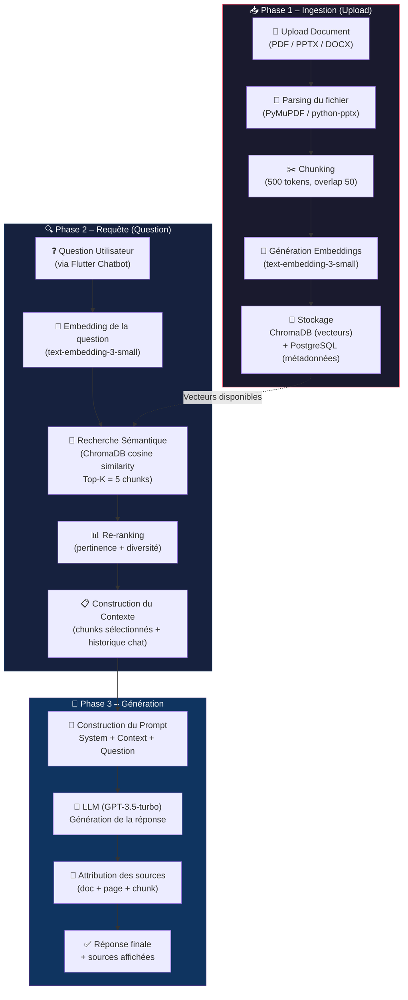
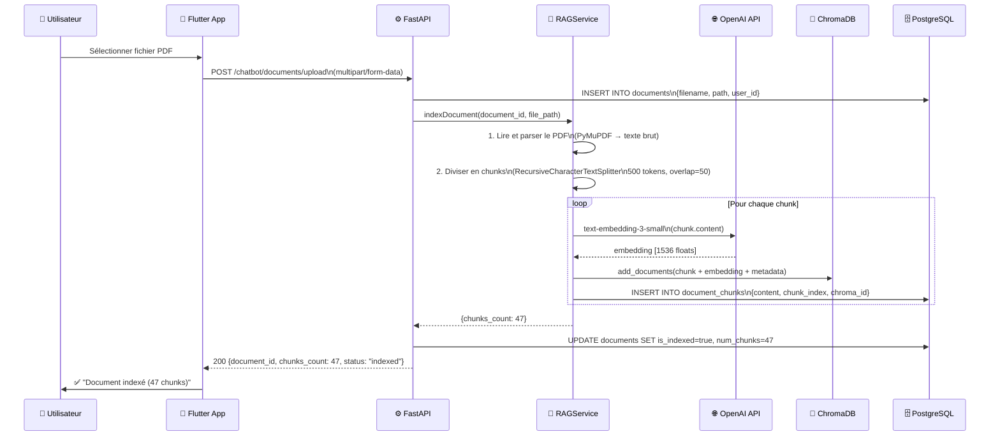
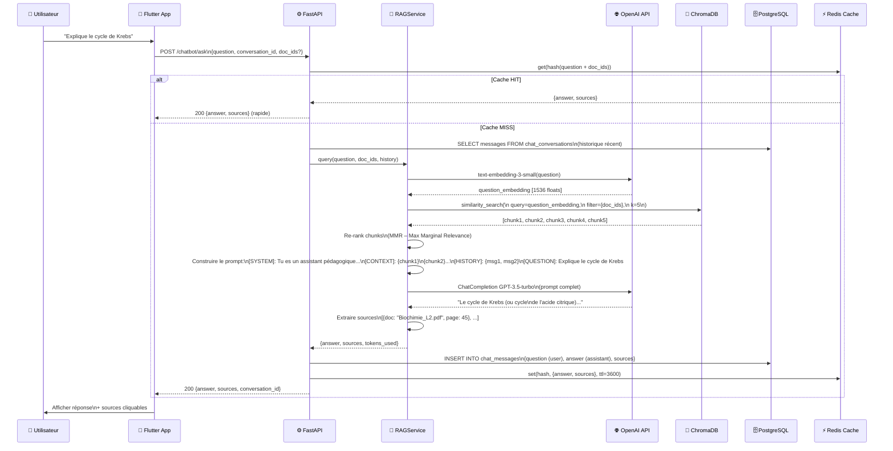
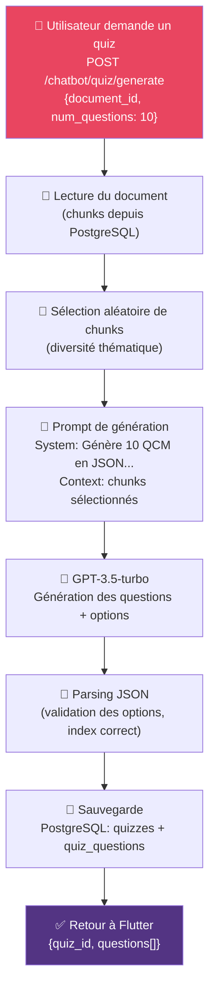
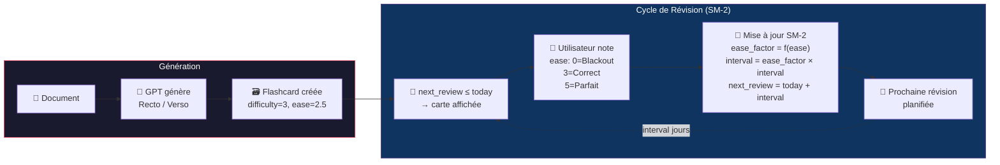
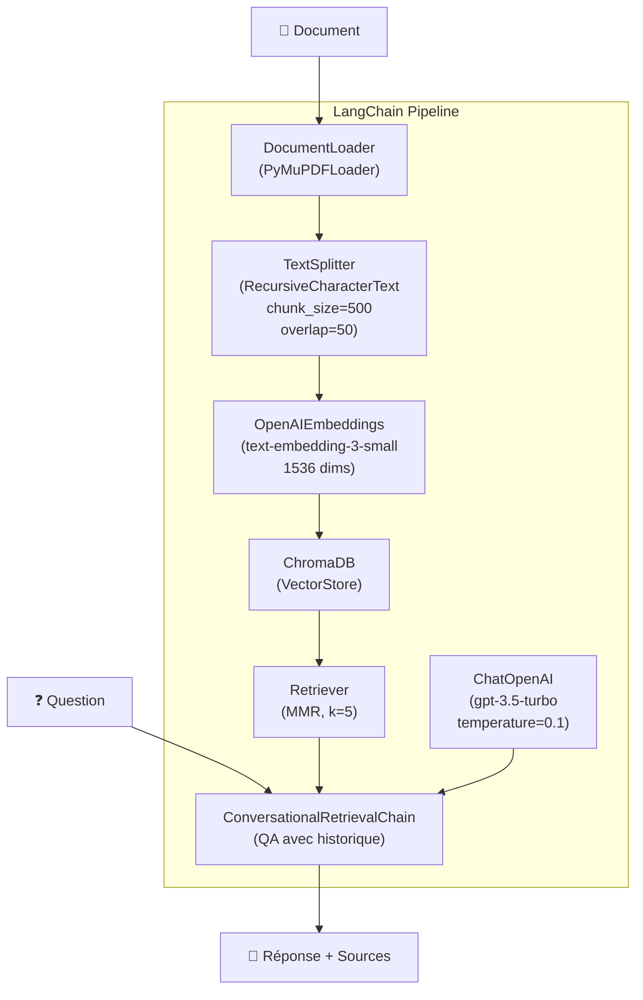
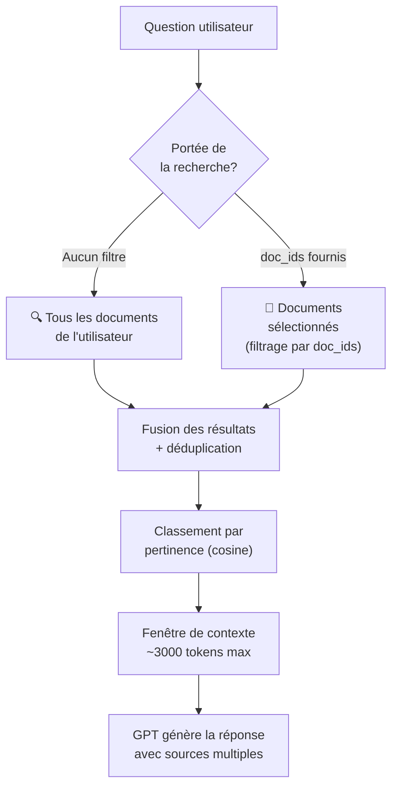

# 🤖 Diagramme de Flux RAG Chatbot – Smart Focus & Life Assistant

**Version** : 1.0  
**Date** : 01 Mars 2026  
**Phase** : Conception  
**Technologies** : LangChain · ChromaDB · OpenAI GPT-3.5/4 · FastAPI

---

## 1. Vue d'Ensemble du Pipeline RAG

---

## 2. Flux d'Ingestion (Upload Document)

---

## 3. Flux de Question-Réponse

---

## 4. Flux de Génération de Quiz

---

## 5. Flux Flashcards avec Spaced Repetition (SM-2)

---

## 6. Architecture LangChain

---

## 7. Gestion du Contexte Multi-Documents

---

## 8. Paramètres de Configuration RAG

| Paramètre | Valeur | Justification |
|-----------|--------|---------------|
| `chunk_size` | 500 tokens | Bon équilibre contexte/précision |
| `chunk_overlap` | 50 tokens | Préserve la cohérence entre chunks |
| `embedding_model` | `text-embedding-3-small` | Coût réduit, qualité suffisante |
| `llm_model` | `gpt-3.5-turbo` | Rapide + économique (fallback GPT-4) |
| `temperature` | `0.1` | Réponses factuelles et stables |
| `top_k_chunks` | `5` | Contexte riche sans overflow |
| `retrieval_strategy` | `MMR` | Diversité maximale des résultats |
| `max_context_tokens` | `3000` | Laisse de la place pour la réponse |
| `cache_ttl` | `3600s` | Cache Redis pour questions fréquentes |
| `conversation_history` | `5 messages` | Contexte conversationnel maintenu |
