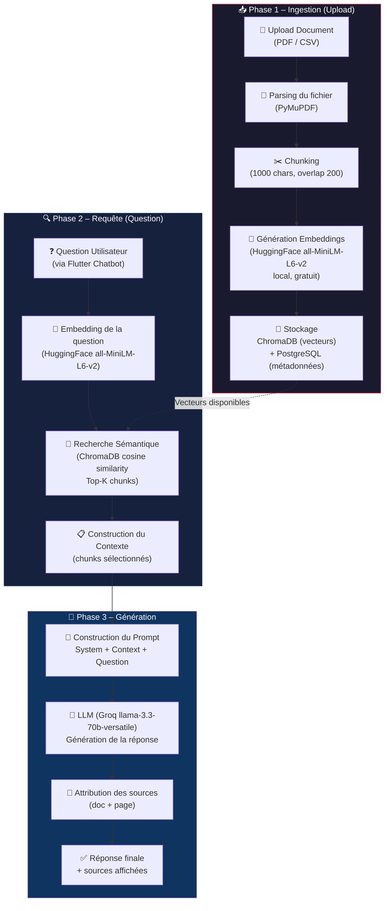
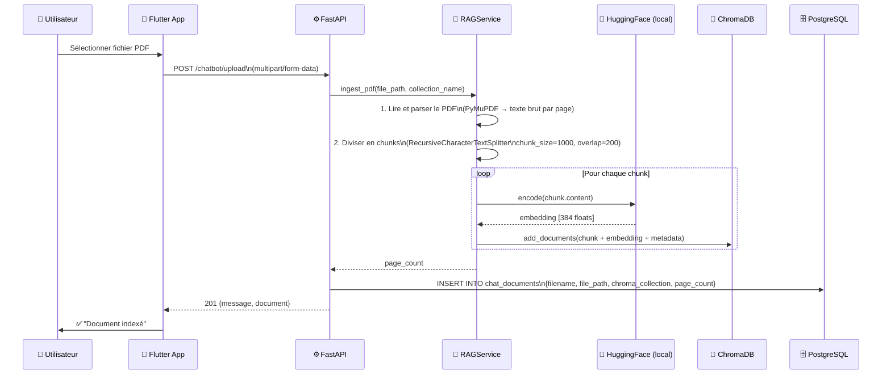
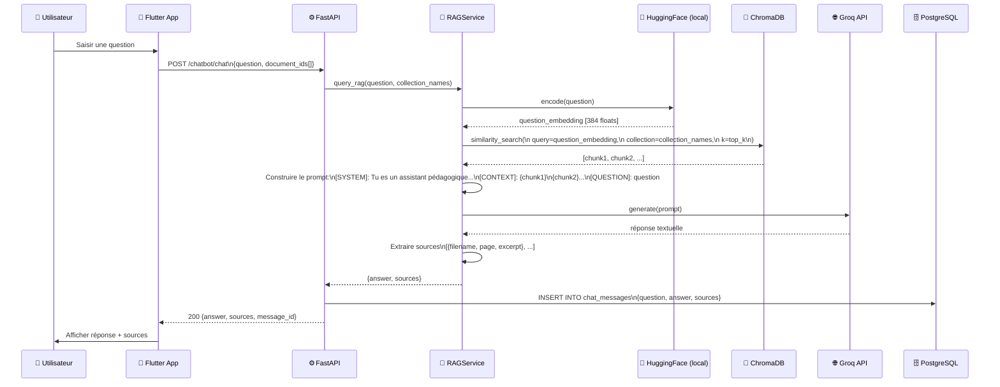
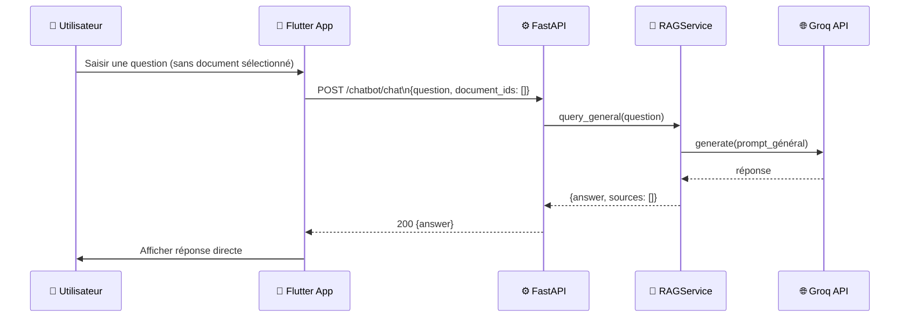
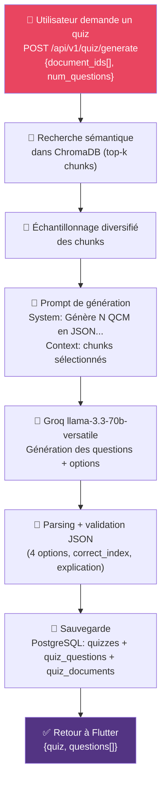
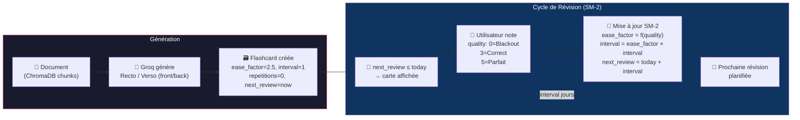
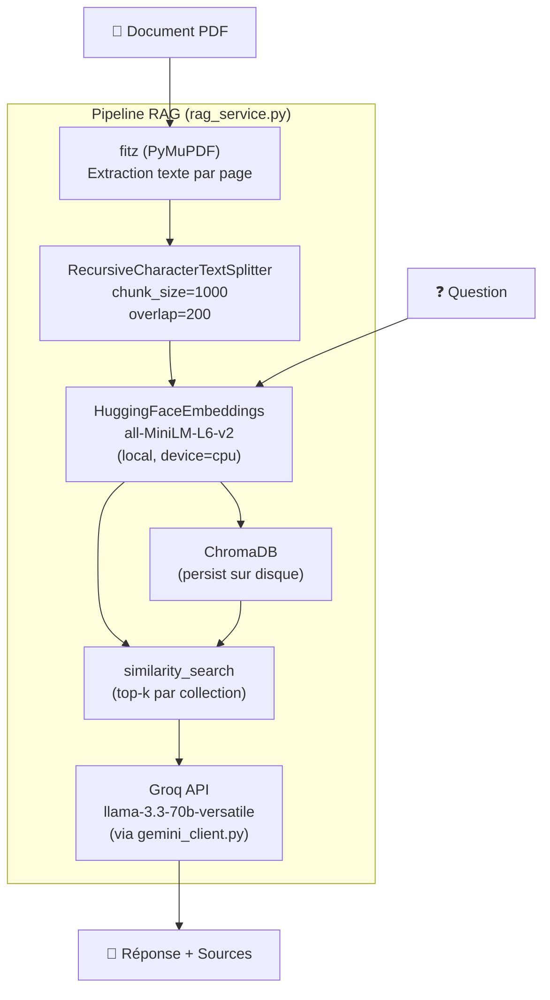

# 🤖 Diagramme de Flux RAG Chatbot – Smart Focus & Life Assistant

**Version** : 3.0  
**Date** : 06 Mai 2026  
**Phase** : Conception (mise à jour post-implémentation)  
**Technologies** : Groq llama-3.3-70b-versatile · HuggingFace all-MiniLM-L6-v2 · ChromaDB · FastAPI

---

## 1. Vue d'Ensemble du Pipeline RAG

```mermaid
flowchart TD
    subgraph INGEST["📥 Phase 1 – Ingestion (Upload)"]
        UP["📄 Upload Document\n(PDF / CSV)"]
        PARSE["📝 Parsing du fichier\n(PyMuPDF)"]
        CHUNK["✂️ Chunking\n(1000 chars, overlap 200)"]
        EMBED["🔢 Génération Embeddings\n(HuggingFace all-MiniLM-L6-v2\nlocal, gratuit)"]
        STORE["💾 Stockage\nChromaDB (vecteurs)\n+ PostgreSQL (métadonnées)"]

        UP --> PARSE --> CHUNK --> EMBED --> STORE
    end

    subgraph QUERY["🔍 Phase 2 – Requête (Question)"]
        QUESTION["❓ Question Utilisateur\n(via Flutter Chatbot)"]
        EMBED_Q["🔢 Embedding de la question\n(HuggingFace all-MiniLM-L6-v2)"]
        SEARCH["🔎 Recherche Sémantique\n(ChromaDB cosine similarity\nTop-K chunks)"]
        CONTEXT["📋 Construction du Contexte\n(chunks sélectionnés)"]

        QUESTION --> EMBED_Q --> SEARCH --> CONTEXT
    end

    subgraph GENERATE["💬 Phase 3 – Génération"]
        PROMPT["🧩 Construction du Prompt\nSystem + Context + Question"]
        LLM["🤖 LLM (Groq llama-3.3-70b-versatile)\nGénération de la réponse"]
        SOURCES["📎 Attribution des sources\n(doc + page)"]
        ANSWER["✅ Réponse finale\n+ sources affichées"]

        PROMPT --> LLM --> SOURCES --> ANSWER
    end

    STORE -.->|"Vecteurs disponibles"| SEARCH
    CONTEXT --> PROMPT

    style INGEST fill:#1a1a2e,stroke:#e94560,color:#fff
    style QUERY fill:#16213e,stroke:#0f3460,color:#fff
    style GENERATE fill:#0f3460,stroke:#533483,color:#fff
```

---

## 2. Flux d'Ingestion (Upload Document)

```mermaid
sequenceDiagram
    participant USER as 👤 Utilisateur
    participant APP as 📱 Flutter App
    participant API as ⚙️ FastAPI
    participant RAG as 🤖 RAGService
    participant HF as 🔢 HuggingFace (local)
    participant CHROMA as 💾 ChromaDB
    participant PG as 🗄️ PostgreSQL

    USER->>APP: Sélectionner fichier PDF
    APP->>API: POST /chatbot/upload\n(multipart/form-data)

    API->>RAG: ingest_pdf(file_path, collection_name)

    RAG->>RAG: 1. Lire et parser le PDF\n(PyMuPDF → texte brut par page)
    RAG->>RAG: 2. Diviser en chunks\n(RecursiveCharacterTextSplitter\nchunk_size=1000, overlap=200)

    loop Pour chaque chunk
        RAG->>HF: encode(chunk.content)
        HF-->>RAG: embedding [384 floats]
        RAG->>CHROMA: add_documents(chunk + embedding + metadata)
    end

    RAG-->>API: page_count
    API->>PG: INSERT INTO chat_documents\n{filename, file_path, chroma_collection, page_count}
    API-->>APP: 201 {message, document}
    APP->>USER: ✅ "Document indexé"
```

---

## 3. Flux de Question-Réponse (RAG)

```mermaid
sequenceDiagram
    participant USER as 👤 Utilisateur
    participant APP as 📱 Flutter App
    participant API as ⚙️ FastAPI
    participant RAG as 🤖 RAGService
    participant HF as 🔢 HuggingFace (local)
    participant CHROMA as 💾 ChromaDB
    participant GROQ as 🌐 Groq API
    participant PG as 🗄️ PostgreSQL

    USER->>APP: Saisir une question
    APP->>API: POST /chatbot/chat\n{question, document_ids[]}

    API->>RAG: query_rag(question, collection_names)

    RAG->>HF: encode(question)
    HF-->>RAG: question_embedding [384 floats]

    RAG->>CHROMA: similarity_search(\n  query=question_embedding,\n  collection=collection_names,\n  k=top_k\n)
    CHROMA-->>RAG: [chunk1, chunk2, ...]

    RAG->>RAG: Construire le prompt:\n[SYSTEM]: Tu es un assistant pédagogique...\n[CONTEXT]: {chunk1}\n{chunk2}...\n[QUESTION]: question

    RAG->>GROQ: generate(prompt)
    GROQ-->>RAG: réponse textuelle

    RAG->>RAG: Extraire sources\n[{filename, page, excerpt}, ...]
    RAG-->>API: {answer, sources}

    API->>PG: INSERT INTO chat_messages\n{question, answer, sources}
    API-->>APP: 200 {answer, sources, message_id}
    APP->>USER: Afficher réponse + sources
```

---

## 4. Flux de Question Générale (sans RAG)

```mermaid
sequenceDiagram
    participant USER as 👤 Utilisateur
    participant APP as 📱 Flutter App
    participant API as ⚙️ FastAPI
    participant RAG as 🤖 RAGService
    participant GROQ as 🌐 Groq API

    USER->>APP: Saisir une question (sans document sélectionné)
    APP->>API: POST /chatbot/chat\n{question, document_ids: []}

    API->>RAG: query_general(question)
    RAG->>GROQ: generate(prompt_général)
    GROQ-->>RAG: réponse

    RAG-->>API: {answer, sources: []}
    API-->>APP: 200 {answer}
    APP->>USER: Afficher réponse directe
```

---

## 5. Flux de Génération de Quiz

```mermaid
flowchart TD
    START["🎯 Utilisateur demande un quiz\nPOST /api/v1/quiz/generate\n{document_ids[], num_questions}"]

    FETCH["📖 Recherche sémantique\ndans ChromaDB (top-k chunks)"]
    SAMPLE["🎲 Échantillonnage diversifié\ndes chunks"]
    PROMPT_Q["🧩 Prompt de génération\nSystem: Génère N QCM en JSON...\nContext: chunks sélectionnés"]
    GEN["🤖 Groq llama-3.3-70b-versatile\nGénération des questions + options"]
    PARSE_Q["📝 Parsing + validation JSON\n(4 options, correct_index, explication)"]
    SAVE["💾 Sauvegarde\nPostgreSQL: quizzes + quiz_questions + quiz_documents"]
    RETURN["✅ Retour à Flutter\n{quiz, questions[]}"]

    START --> FETCH --> SAMPLE --> PROMPT_Q --> GEN --> PARSE_Q --> SAVE --> RETURN

    style START fill:#e94560,color:#fff
    style RETURN fill:#533483,color:#fff
```

---

## 6. Flux Flashcards avec Spaced Repetition (SM-2)

```mermaid
flowchart LR
    subgraph GENERATE_FC["Génération"]
        DOC["📄 Document\n(ChromaDB chunks)"]
        LLM_FC["🤖 Groq génère\nRecto / Verso (front/back)"]
        FC["🗃 Flashcard créée\nease_factor=2.5, interval=1\nrepetitions=0, next_review=now"]

        DOC --> LLM_FC --> FC
    end

    subgraph REVIEW_CYCLE["Cycle de Révision (SM-2)"]
        DUE["📅 next_review ≤ today\n→ carte affichée"]
        USER_RATE["👤 Utilisateur note\nquality: 0=Blackout\n3=Correct\n5=Parfait"]
        UPDATE["🔢 Mise à jour SM-2\nease_factor = f(quality)\ninterval = ease_factor × interval\nnext_review = today + interval"]
        NEXT["📅 Prochaine révision\nplanifiée"]

        DUE --> USER_RATE --> UPDATE --> NEXT
        NEXT -.->|"interval jours"| DUE
    end

    FC --> DUE
    style GENERATE_FC fill:#1a1a2e,stroke:#e94560,color:#fff
    style REVIEW_CYCLE fill:#0f3460,stroke:#533483,color:#fff
```

---

## 7. Architecture RAG Applicative

```mermaid
graph TB
    subgraph LC["Pipeline RAG (rag_service.py)"]
        LOADER["fitz (PyMuPDF)\nExtraction texte par page"]
        SPLITTER["RecursiveCharacterTextSplitter\nchunk_size=1000\noverlap=200"]
        EMBEDDINGS["HuggingFaceEmbeddings\nall-MiniLM-L6-v2\n(local, device=cpu)"]
        VECTORSTORE["ChromaDB\n(persist sur disque)"]
        RETRIEVER["similarity_search\n(top-k par collection)"]
        LLM_MODEL["Groq API\nllama-3.3-70b-versatile\n(via gemini_client.py)"]
    end

    INPUT_DOC["📄 Document PDF"] --> LOADER --> SPLITTER --> EMBEDDINGS --> VECTORSTORE
    INPUT_Q["❓ Question"] --> EMBEDDINGS
    EMBEDDINGS --> RETRIEVER
    RETRIEVER --> LLM_MODEL
    VECTORSTORE --> RETRIEVER
    LLM_MODEL --> OUTPUT["💬 Réponse + Sources"]
```

---

## 8. Paramètres de Configuration RAG

| Paramètre | Valeur | Source |
|-----------|--------|--------|
| `chunk_size` | 1000 caractères | `rag_service.py` |
| `chunk_overlap` | 200 caractères | `rag_service.py` |
| `embedding_model` | `all-MiniLM-L6-v2` (HuggingFace local) | `rag_service.py` |
| `llm_model` | `llama-3.3-70b-versatile` (Groq) | `config.py` (GROQ_MODEL) |
| `llm_provider` | `groq` | `.env` (AI_PROVIDER) |
| `top_k_chunks` | variable par collection | `rag_service.py` |
| `formats acceptés` | `.pdf` et `.csv` uniquement | `chatbot.py` |
| `taille max upload` | 20 MB | `config.py` (MAX_UPLOAD_MB) |
| `historique chat` | non implémenté (RAG simple) | `rag_service.py` |

---

## 9. Endpoints Chatbot RAG

| Méthode | Endpoint | Description |
|---------|----------|-------------|
| `POST` | `/chatbot/upload` | Upload PDF (indexé ChromaDB) ou CSV (validé) |
| `GET` | `/chatbot/documents` | Lister les documents de l'utilisateur |
| `DELETE` | `/chatbot/documents/{id}` | Supprimer document (disque + ChromaDB + DB) |
| `POST` | `/chatbot/chat` | Question RAG (avec doc_ids) ou générale (sans) |
| `GET` | `/chatbot/history` | Historique des échanges |

---

*Mis à jour le 06 Mai 2026 — Smart Focus & Life Assistant*
