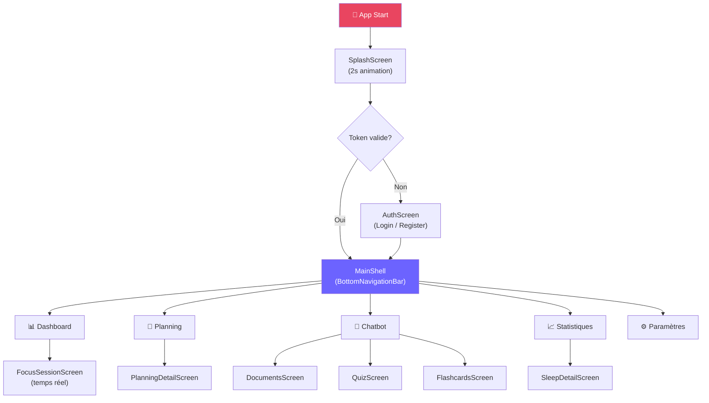

# 📱 Wireframes / Maquettes des Écrans Flutter – Smart Focus & Life Assistant

**Version** : 1.0  
**Date** : 01 Mars 2026  
**Phase** : Conception  
**Framework** : Flutter 3.16 · Dart 3.2 · Material Design 3  

---

## 0. Design System

```
Palette de Couleurs :
  • Primaire     : #6C63FF  (violet lumineux)
  • Secondaire   : #FF6584  (accent rose)
  • Surface      : #1A1A2E  (fond sombre)
  • Card         : #16213E  (cartes)
  • Texte        : #E8E8F0  (blanc cassé)
  • Succès       : #4CAF50
  • Alerte       : #FF9800
  • Danger       : #F44336

Typographie   : Inter (Google Fonts)
Border radius : 16px (cartes), 12px (boutons)
Ombres        : box-shadow 0 8px 32px rgba(0,0,0,0.3)
```

---

## 1. 🔐 Écran Authentification (Login / Register)

```
┌─────────────────────────────┐
│  ╔═══════════════════════╗  │
│  ║  🤖  Smart Focus      ║  │
│  ║  Life Assistant       ║  │
│  ╚═══════════════════════╝  │
│                             │
│  ┌─────────────────────┐    │
│  │  [ Login ]  [Register]   │  ← TabBar
│  └─────────────────────┘    │
│                             │
│  ┌─────────────────────┐    │
│  │  📧 Email           │    │  ← TextField
│  └─────────────────────┘    │
│                             │
│  ┌─────────────────────┐    │
│  │  🔒 Mot de passe   │    │  ← TextField (obscure)
│  └─────────────────────┘    │
│                             │
│  ╔═════════════════════╗    │
│  ║   SE CONNECTER  →  ║    │  ← ElevatedButton (violet)
│  ╚═════════════════════╝    │
│                             │
│  ─────── ou ───────         │
│                             │
│  [ 🔵 Continuer avec Google ]│
│                             │
│  Mot de passe oublié ?      │
└─────────────────────────────┘

Flux : Auth échoue → SnackBar rouge
       Auth réussit → NavigationShell (tabs)
```

---

## 2. 📊 Dashboard (Écran Principal)

```
┌─────────────────────────────┐
│  Bonjour, Karim 👋     🔔   │  ← AppBar (transparent)
│  Dimanche 01 Mars 2026      │
├─────────────────────────────┤
│                             │
│  ┌───────────────────────┐  │
│  │  🎯 Score du Jour     │  │  ← Card principale
│  │                       │  │
│  │   [====⬤=========]   │  │  ← CircularProgressIndicator
│  │       78 / 100        │  │
│  │   Focus   Posture     │  │
│  │   🟢 85%  🟡 72%      │  │
│  └───────────────────────┘  │
│                             │
│  ┌─────────┐ ┌─────────┐   │
│  │ 😴 Sommeil  │ 🧘 Pause  │   │  ← Row cards
│  │  7h30   │ │ 3 faites│   │
│  │ Score 82│ │  auj.   │   │
│  └─────────┘ └─────────┘   │
│                             │
│  ┌───────────────────────┐  │
│  │  📅 Planning Auj.     │  │
│  │  ✅ Mathématiques 9h  │  │
│  │  🔵 Physique     11h  │  │  ← Liste planning du jour
│  │  ⬜ Chimie       14h  │  │
│  └───────────────────────┘  │
│                             │
│  ┌───────────────────────┐  │
│  │  🎯 Démarrer Session  │  │  ← FAB étendu
│  └───────────────────────┘  │
│                             │
│  🏠   📅   💬   📊   ⚙️   │  ← BottomNavigationBar
└─────────────────────────────┘
```

---

## 3. 🎯 Session Focus Active (Temps Réel)

```
┌─────────────────────────────┐
│  ← Session Active      ⏸ ⏹ │  ← AppBar + actions
├─────────────────────────────┤
│                             │
│        ⏱ 00:42:17          │  ← Timer principal (grand)
│                             │
│  ┌───────────────────────┐  │
│  │                       │  │
│  │    SCORE FOCUS        │  │
│  │                       │  │
│  │      ●●●●●●●●○○      │  │  ← AnimatedProgressBar
│  │         87%           │  │
│  │    🤩 Excellent !     │  │  ← Badge contextuel
│  │                       │  │
│  └───────────────────────┘  │
│                             │
│  ┌────────┐ ┌────────┐      │
│  │Posture │ │Fatigue │      │  ← Mini-cards métriques
│  │  🟢 85 │ │ 🟢 Low │      │
│  └────────┘ └────────┘      │
│  ┌────────┐                 │
│  │Attention│                │
│  │  🟡 72 │                 │
│  └────────┘                 │
│                             │
│  ═══ Alertes Récentes ═══   │
│  ⚠️ 12:34 Posture corriger  │  ← ListView alertes
│  ⚠️ 12:21 30min sans pause  │
│                             │
│  [ 🧘 Prendre une pause ]   │  ← Bouton pause suggérée
│                             │
└─────────────────────────────┘
```

---

## 4. 📅 Planning Intelligent

```
┌─────────────────────────────┐
│  Mon Planning          + 🤖 │  ← AppBar + bouton IA
├─────────────────────────────┤
│                             │
│  ← Mars 2026  [ Mois ] →   │  ← DatePicker mini-calendar
│  L  M  M  J  V  S  D       │
│  23 24 25 26 27 28 [01]     │
│                             │
│  ── Aujourd'hui ──          │
│                             │
│  ┌───────────────────────┐  │
│  │ 09:00  📚 Mathématiques│  │  ← Session card (swipe to delete)
│  │ ████████░░  80min      │  │
│  │ [Haute priorité] ✅    │  │
│  └───────────────────────┘  │
│                             │
│  ┌───────────────────────┐  │
│  │ 11:00  ⚗️ Physique    │  │
│  │ ██████░░░░  60min      │  │
│  │ [Moyenne priorité] 🔵  │  │
│  └───────────────────────┘  │
│                             │
│  ┌───────────────────────┐  │
│  │ 14:00  🧬 Chimie      │  │
│  │ ████░░░░░░  45min      │  │
│  │ [Normale priorité] ⬜  │  │
│  └───────────────────────┘  │
│                             │
│  ┌─────────────────────┐    │
│  │ + Ajouter une session│    │  ← FAB
│  └─────────────────────┘    │
│                             │
│  ╔═══════════════════════╗  │
│  ║ 🤖 Générer avec IA →  ║  │  ← Bouton IA (violet gradient)
│  ╚═══════════════════════╝  │
│                             │
│  🏠   📅   💬   📊   ⚙️   │
└─────────────────────────────┘
```

---

## 5. 💬 Chatbot RAG

```
┌─────────────────────────────┐
│  Smart Chatbot 🤖      📚   │  ← AppBar + bouton docs
├─────────────────────────────┤
│                             │
│  ┌─────────────────────┐   │
│  │ Mes Documents (3)   │   │  ← Section docs (collapsible)
│  │ 📄 Biochimie_L2.pdf │   │
│  │ 📄 Physique_S3.pdf  │   │
│  │ + Uploader un cours  │   │
│  └─────────────────────┘   │
│                             │
│  ─────────────────────────  │
│                             │
│  ╭─────────────────────╮   │
│  │ Explique le cycle   │   │  ← Message utilisateur (droite)
│  │ de Krebs            │   │     (bulle violette)
│  ╰─────────────────────╯   │
│                          👤 │
│                             │
│  🤖                         │
│  ╭─────────────────────╮   │  ← Réponse IA (gauche, gris)
│  │ Le cycle de Krebs   │   │
│  │ est une série de    │   │
│  │ réactions chimiques │   │
│  │ qui...              │   │
│  │                     │   │
│  │ 📎 Sources :        │   │  ← Sources cliquables
│  │  • Biochimie p.45   │   │
│  │  • Biochimie p.47   │   │
│  ╰─────────────────────╯   │
│                             │
│  [Quiz] [Flashcards]        │  ← Actions rapides
│                             │
│  ┌────────────────────┐ ▶  │  ← TextField + Send
│  │ Pose ta question...│     │
│  └────────────────────┘     │
│                             │
│  🏠   📅   💬   📊   ⚙️   │
└─────────────────────────────┘
```

---

## 6. 📊 Statistiques & Rapports

```
┌─────────────────────────────┐
│  Statistiques          📅   │  ← AppBar + filtre période
│  [Semaine] [Mois] [Année]   │
├─────────────────────────────┤
│                             │
│  ── Score Général ────────  │
│  ┌───────────────────────┐  │
│  │   Focus     Posture   │  │
│  │    78%        72%     │  │
│  │   ↑+5%       ↓-3%    │  │  ← Tendance
│  └───────────────────────┘  │
│                             │
│  ── Graphique Focus ──────  │
│  ┌───────────────────────┐  │
│  │100│      /\           │  │
│  │ 80│  /\_/  \_  /\    │  │  ← LineChart (fl_chart)
│  │ 60│ /         \/  \  │  │
│  │   └──L─M─M─J─V─S─D──│  │
│  └───────────────────────┘  │
│                             │
│  ── Sommeil (7 jours) ──── │
│  ┌───────────────────────┐  │
│  │ 8h│   ██  ██  ██     │  │
│  │ 6h│██ ██  ██  ██  ██ │  │  ← BarChart
│  │   └─L──M──J──V──S────│  │
│  └───────────────────────┘  │
│                             │
│  ── Recommandations ──────  │
│  💡 Votre focus baisse      │  ← Carte conseil IA
│     le jeudi. Essayez       │
│     de courtes pauses.      │
│                             │
│  ── Rapport Hebdo ────────  │
│  [ Télécharger PDF ]        │
│                             │
│  🏠   📅   💬   📊   ⚙️   │
└─────────────────────────────┘
```

---

## 7. ⚙️ Paramètres

```
┌─────────────────────────────┐
│  Paramètres                 │
├─────────────────────────────┤
│                             │
│  ┌───────────────────────┐  │
│  │  👤 Profil            │  │  ← Section
│  │  Karim Beloufa        │  │
│  │  karim@student.dz     │  │
│  │                 [ > ] │  │
│  └───────────────────────┘  │
│                             │
│  Objectifs                  │
│  ┌───────────────────────┐  │
│  │  🎯 Focus quotidien   │  │
│  │  [──────⬤────]  90min │  │  ← Slider
│  └───────────────────────┘  │
│                             │
│  Boîtier IoT                │  
│  ┌───────────────────────┐  │
│  │  📡 ESP32-CAM         │  │
│  │  🟢 Connecté          │  │
│  │  FW v1.2.3            │  │
│  └───────────────────────┘  │
│                             │
│  Notifications              │
│  ┌───────────────────────┐  │
│  │  🔔 Alertes Focus     │  │
│  │                  [ON] │  │  ← Switch
│  │  😴 Rappel Sommeil    │  │
│  │                  [ON] │  │
│  └───────────────────────┘  │
│                             │
│  🌙 Thème Sombre  [ON]      │
│                             │
│  [ 🚪 Se déconnecter ]      │
│                             │
│  🏠   📅   💬   📊   ⚙️   │
└─────────────────────────────┘
```

---

## 8. Navigation & Structure de l'App



---

## 9. Composants UI Réutilisables

| Widget | Description | Usage |
|--------|-------------|-------|
| `ScoreCard` | Affiche un score circulaire animé | Dashboard, Session |
| `MetricCard` | Card mini pour une métrique | Focus, Sommeil |
| `PlanningSessionTile` | Tile swipeable pour une session | Planning |
| `ChatBubble` | Bulle message avec sources | Chatbot |
| `LineChartWidget` | Graphique de tendance (fl_chart) | Stats |
| `BarChartWidget` | Histogramme (fl_chart) | Stats Sommeil |
| `AlertBanner` | Bannière alerte coloriée | Session Focus |
| `DocumentChip` | Chip pour un document sélectionné | Chatbot |
| `LoadingOverlay` | Overlay chargement avec animation | Global |
| `EmptyStateWidget` | Illustration + message vide | Listes vides |

---

## 10. Responsive & Accessibilité

| Aspect | Implémentation |
|--------|---------------|
| **Taille police** | Min 14sp, Titres 20sp, `TextScaler` respecté |
| **Contrast ratio** | ≥ 4.5:1 (AA WCAG) sur fond sombre |
| **Touch targets** | Min 48×48px (Material Guidelines) |
| **Animations** | `prefers-reduced-motion` via `AnimationMode` |
| **Orientations** | Portrait prioritaire, Landscape supporté |
| **Dark mode** | Natif (seul thème = thème sombre) |
